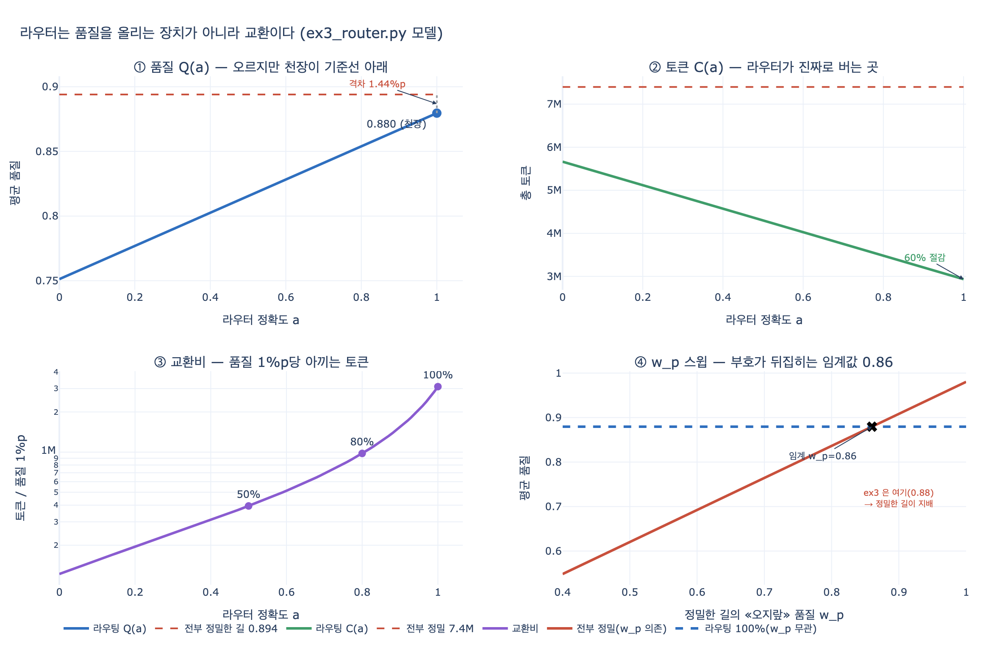

# 라우팅 정확도가 100%여도 품질이 오르지 않은 이유

> **질문** 라우팅 정확도가 100%여도 품질이 오르지 않은 이유는 무엇인가?
>
> **답** 정밀한 길이 굳이 필요 없는 입력에도 0.88을 내어 빠른 길의 0.86보다 높다. 이 설정에서는 정밀한 길이 언제나 품질로 이긴다.

---

## 1. 먼저 결론

라우터가 **한 건도 안 틀렸는데** 평균 품질이 0.894에서 0.880으로 **떨어졌습니다**.

이건 라우터의 버그가 아닙니다. 「정밀한 길」에 붙은 숫자 하나 때문입니다.
정밀한 길은 **굳이 안 써도 되는 입력에도 0.88**을 냅니다. 그런데 빠른 길이 *제대로 맞았을 때*의 품질이 0.86입니다.

```
0.88 (정밀한 길이 오지랖 부릴 때)  >  0.86 (빠른 길이 제 일을 할 때)
```

그러면 **어떤 입력을 가져와도 정밀한 길이 품질로 이깁니다.** 이걸 지배(dominance)라고 부릅니다.
라우터가 할 수 있는 최선은 「어떤 입력에서는 빠른 길이 더 낫다」를 찾아내는 건데, 그런 입력이 **애초에 존재하지 않습니다.** 정확도를 100%로 만들어도 품질로 얻을 게 없습니다.

## 2. 표 한 칸이 원인이다

`code/ex3_router.py` 상단의 상수입니다.

```python
# 길 이름     비용   이 길이 «맞을 때» 품질   «틀린 길로 왔을 때» 품질
ROUTES = {
    "빠른 길":   (1_200, 0.86, 0.42),
    "정밀한 길": (7_400, 0.93, 0.88),
}
MIX = {"빠른 길": 0.72, "정밀한 길": 0.28}   # 실제 입력의 분포
```

세 번째 숫자가 「틀린 길로 왔을 때 품질」입니다. 이 표를 입력 종류 × 선택한 길로 펼치면 이렇게 됩니다.

| 입력 종류 (분포) | 빠른 길로 보내면 | 정밀한 길로 보내면 | 승자 |
|---|---|---|---|
| 빠른 길로 충분 (72%) | 0.86 | **0.88** | 정밀한 길 |
| 정밀한 길이 필요 (28%) | 0.42 | 0.93 | 정밀한 길 |

**두 행 모두 정밀한 길이 이깁니다.** 정밀한 길은 약지배 전략(weakly dominant strategy)입니다.

「빠른 길이 필요한 입력」이라는 말을 오해하기 쉽습니다. 이건 **품질상 빠른 길이 더 나은 입력**이 아니라 **빠른 길로도 충분히 쓸 만한 입력**이라는 뜻입니다. 라벨은 「빠른 길이 정답」이지만, 그 정답은 *품질 기준의 정답이 아니라 비용 기준의 정답*입니다. 그런데 채점표는 품질로 매기니까 라벨을 맞출수록 채점표에서 밀립니다.

## 3. 숫자로 따라가 본다

정확도 100%면 틀린 길로 가는 입력이 없으니, 각 입력은 자기 라벨대로 갑니다.

```
품질 = 0.72 × 0.86  +  0.28 × 0.93
     = 0.6192       +  0.2604        = 0.8796
```

「전부 정밀한 길」은 72% 입력이 오지랖 품질 0.88을 받습니다.

```
품질 = 0.72 × 0.88  +  0.28 × 0.93
     = 0.6336       +  0.2604        = 0.8940
```

차이는 앞의 항 하나에서만 납니다. `0.72 × (0.88 − 0.86) = 0.0144`, 즉 **1.44%p**. 뒤의 항(0.2604)은 완전히 같습니다.

## 4. 그런데 정확도를 올리는 건 헛일이 아니다

여기서 흔히 생기는 두 번째 오해가 있습니다. 「품질이 안 오르니 라우터 정확도는 아무 의미가 없다」는 게 아닙니다.

정확도를 $a$로 두고 풀면 완전히 선형입니다.

```
Q(a) = 0.72 × [a·0.86 + (1−a)·0.88]  +  0.28 × [a·0.93 + (1−a)·0.42]
     = (0.6336 − 0.0144a)             +  (0.1176 + 0.1428a)
     = 0.7512 + 0.1284a
```

기울기가 **+0.1284**로 양수입니다. 정확도를 올리면 품질은 **오릅니다**.

| 정확도 $a$ | 품질 |
|---|---|
| 0% | 0.7512 |
| 50% | 0.8154 |
| 100% | 0.8796 |

문제는 **천장의 높이**입니다. $Q(1) = 0.8796$인데 기준선이 0.894입니다. 아무리 밀어붙여도 천장이 기준선 밑에서 멈춥니다.

두 항을 따로 보면 서로 반대로 움직입니다.

| $a$ | 72% 구간 기여 | 28% 구간 기여 |
|---|---|---|
| 0.0 | 0.6336 | 0.1176 |
| 0.5 | 0.6264 | 0.1890 |
| 1.0 | **0.6192 ↓** | 0.2604 ↑ |

28% 구간에서 벌어들이는 +0.1428이 72% 구간에서 잃는 −0.0144보다 크니까 합계는 오릅니다. 하지만 72% 구간의 손실은 **라우터를 잘 만들면 만들수록 커집니다.** 이 구조가 천장을 기준선 아래로 눌러 놓습니다.

## 5. 그럼 라우터는 무엇을 사는가 — 토큰이다

같은 계산을 비용으로 하면 방향이 반대입니다.

```
C(a) = 5,664,000 − 2,728,000a
```

| 정확도 | 총 토큰 | 평균 품질 | 절감 | 품질 손실 | 1%p당 절감 토큰 |
|---|---|---|---|---|---|
| 전부 정밀 | 7,400,000 | 0.894 | — | — | — |
| 100% | 2,936,000 | 0.880 | 60% | 1.44%p | 3,100,000 |
| 95% | 3,072,400 | 0.873 | 58% | 2.08%p | 2,078,578 |
| 90% | 3,208,800 | 0.867 | 57% | 2.72%p | 1,538,620 |
| 80% | 3,481,600 | 0.854 | 53% | 4.01%p | 977,645 |
| 70% | 3,754,400 | 0.841 | 49% | 5.29%p | 688,889 |
| 50% | 4,300,000 | 0.815 | 42% | 7.86%p | 394,402 |

마지막 칸이 **교환비(환율)** 입니다. 품질 1%p를 내주고 토큰 몇 개를 아끼는가.

- 100%: 1%p당 **310만** 토큰. 아주 좋은 환율입니다.
- 50%: 1%p당 **39만** 토큰. **8배 나빠집니다.**

정확도가 떨어질 때 절감액(60% → 42%)은 완만하게 줄어드는데 품질 손실(1.44 → 7.86%p)은 5배 넘게 커집니다. 그래서 환율이 급격히 무너집니다. 25장이 「정확도 50%까지 내려가면 이건 대개 손해다」라고 한 근거입니다.

## 6. 뒤집어 보기 — 언제 라우팅이 품질을 올리는 장치가 되나

정밀한 길의 「오지랖 품질」을 $w_p$라는 변수로 두고 두 방식을 비교해 봅니다.

```
전부 정밀    = 0.72·w_p  + 0.28·0.93     ← w_p 에 따라 움직인다
라우팅 100%  = 0.72·0.86 + 0.28·0.93     ← w_p 와 무관하다 (틀린 길로 갈 입력이 없으니까)
```

뒤 항이 똑같으니 앞 항만 남습니다. 조건이 아주 깔끔합니다.

$$
\text{라우팅}(a{=}1) > \text{전부 정밀} \iff w_p < 0.86 = r_{\text{fast}}
$$

**임계값이 정확히 빠른 길의 정답 품질 0.86입니다.**

| $w_p$ | 전부 정밀 | 라우팅 100% | 라우팅 우위 |
|---|---|---|---|
| 0.60 | 0.6924 | 0.8796 | 예 |
| 0.80 | 0.8364 | 0.8796 | 예 |
| 0.84 | 0.8652 | 0.8796 | 예 |
| **0.86** | **0.8796** | **0.8796** | 동점 (부호 반전점) |
| 0.88 (← ex3) | 0.8940 | 0.8796 | **아니오** |

ex3은 $w_p = 0.88$로 잡았습니다. 임계값보다 위입니다. 그래서 100% 정확도에서도 품질이 못 올랐습니다.

거꾸로 말하면 **정밀한 경로가 「안 맞는 입력에서 오히려 망치는」 성질이 있을 때만** 라우팅이 품질 개선 장치가 됩니다. 예를 들어 정밀한 경로가 긴 추론을 강제해서 단순 질문에 과도하게 답을 꾸며 낸다든가(overthinking), 도구를 불필요하게 호출해서 컨텍스트를 오염시킨다든가 하는 경우입니다. 그런 성질이 없으면 라우팅은 **오직 비용을 위한 장치**입니다.

## 7. 이게 왜 중요한가 — 25장의 주장

25.3절의 제목이 「라우터는 품질을 올리는 장치가 아니다」입니다. 이 예제가 그 근거입니다.

- 라우터를 넣는 것은 **교환**입니다. 품질을 조금 내주고 토큰을 크게 아낍니다.
- 이 교환이 남는 장사인지는 **도메인**이 정합니다. 품질 1.4%p가 사람 눈에 안 보이는 서비스면 남는 장사고, 그 1.4%p가 오답 14건(1,000건 중)이 되는 서비스면 아닙니다.
- 교환비를 계산하려면 정확도 $a$를 알아야 합니다. **정확도를 모르면 위 표의 어느 줄에 서 있는지 모릅니다.**

그래서 25장의 실무 결론이 이겁니다.

> 라우터를 넣을 때 제일 먼저 만들 것은 라우터가 아니라 **「라우팅이 맞았는지 채점하는 데이터셋」**이다. 100건이면 시작할 수 있다.

채점 데이터셋이 없으면 「라우터 넣었더니 좋아졌다」는 느낌만 남습니다. 실제로는 품질을 내주고 토큰을 산 것인데, 어느 쪽으로 얼마나 움직였는지 모르는 상태가 됩니다.

## 8. 자주 나오는 오해 정리

| 오해 | 사실 |
|---|---|
| 라우터가 완벽하면 품질도 오른다 | 지배 구조가 있으면 안 오른다. 오히려 내려간다 |
| 품질이 안 오르니 라우터 정확도는 무의미하다 | $Q(a)$의 기울기는 +0.1284로 양수다. 정확도는 중요하다. 다만 천장이 낮다 |
| 정밀한 길은 정밀한 입력에만 좋다 | 이 모델에선 *모든* 입력에서 품질 1등이다. 그게 원인이다 |
| 「빠른 길이 필요한 입력」은 빠른 길이 품질도 더 좋다는 뜻 | 아니다. 「빠른 길로도 충분하다」는 비용 관점의 라벨이다 |
| 라우터는 품질과 비용을 둘 다 개선한다 | 비용만 개선한다. 품질은 지불 수단이다 |

## 9. 함께 보면 좋은 것

- `code/ex1_topologies.py`의 `동적엣지()`: 위상 비교표에서 동적 엣지의 품질은 0.81로 순환(0.89)이나 트리(0.84)보다 낮습니다. 「쉬운 건 싸게, 어려운 건 비싸게」가 이 위상의 성격이라는 주석이 붙어 있습니다.
- 25장 한 장 요약: 「라우터는 품질을 올리는 장치가 아니라 교환입니다. 얼마를 내주고 얼마를 아끼는지 계산하려면 채점 데이터셋이 먼저 있어야 합니다.」
- Anthropic, [Building effective agents](https://www.anthropic.com/engineering/building-effective-agents) — routing 패턴의 1차 출처.

## 시각화



네 칸으로 봅니다.

1. **품질 $Q(a)$** — 정확도를 올리면 오르지만, $a=1$의 천장(0.880)이 기준선(0.894) **아래**에서 멈춥니다. 격차 1.44%p.
2. **토큰 $C(a)$** — 정확도가 오를수록 단조 감소. 100%에서 60% 절감. 라우터가 진짜로 버는 곳입니다.
3. **교환비** — 품질 1%p당 아끼는 토큰(로그 축). 100%에서 310만이 50%에서 39만으로 무너집니다.
4. **$w_p$ 스윕** — 라우팅 선(파란 점선)은 $w_p$와 무관하게 평평합니다. 정밀한 길의 오지랖 품질이 0.86 아래로 내려가야 두 선이 교차하고 라우팅이 품질로 이깁니다. ex3은 0.88이라 지배 쪽에 있습니다.
