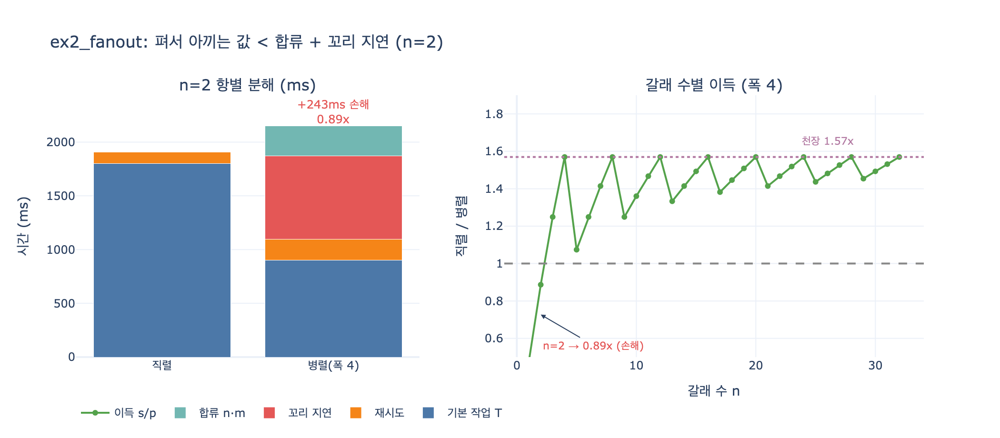

# `ex2_fanout.py`에서 갈래 2개일 때 병렬이 더 느린 이유

**답:** 펴서 아끼는 값보다 합류 비용과 꼬리 지연이 더 크기 때문이다. 0.89배로 오히려 손해다.

---

## 1. 문제 상황

`ex2_fanout.py`의 첫 표를 보면 갈래 수 2개에서만 «이득» 칸이 1보다 작다.

| 갈래 수 | 직렬(ms) | 병렬 4폭(ms) | 그중 합류 | 이득 |
|---:|---:|---:|---:|---:|
| **2** | **1,908** | **2,151** | **280** | **0.89x  ← 별 이득 없음** |
| 4 | 3,816 | 2,431 | 560 | 1.57x |
| 8 | 7,632 | 4,862 | 1,120 | 1.57x |
| 16 | 15,264 | 9,724 | 2,240 | 1.57x |
| 32 | 30,528 | 19,449 | 4,480 | 1.57x |
| 64 | 61,056 | 38,898 | 8,960 | 1.57x |

병렬로 폈는데 **243ms 더 느려졌다**. 직관과 반대다. 왜 그런지 항별로 뜯어보자.

---

## 2. 모델 상수와 수식

```python
TASK_MS = 900          # T   갈래 하나 처리 시간
MERGE_PER_BRANCH = 140 # m   합류할 때 «갈래당» 드는 시간 (정리·중복 제거)
FAIL = 0.06            # p_f 갈래 하나가 실패할 확률
RETRY_MS = TASK_MS     # R   실패하면 한 번 더
SLOW_P = 0.10          # p_s 갈래 하나가 «느린 놈»일 확률
SLOW_X = 3.5           # x   느린 놈은 이만큼 더 걸린다
```

직렬은 그냥 더한다. 갈래별로 독립적으로 실패 기댓값을 더한다.

$$
T_{\text{직렬}}(n) = n\,T + n\,p_f\,R
$$

병렬은 세 조각이다.

$$
T_{\text{병렬}}(n, w) = \left\lceil \frac{n}{w} \right\rceil \cdot \underbrace{\Big[\, T\big(1 + P_{\text{slow}}(w)(x-1)\big) + P_{\text{fail}}(w)\,R \,\Big]}_{\texttt{wave\_ms(w)}} \;+\; \underbrace{n \cdot m}_{\text{합류}}
$$

핵심은 `wave_ms()` 안의 **«하나라도»** 확률이다.

$$
P_{\text{slow}}(w) = 1 - (1 - p_s)^{w}, \qquad P_{\text{fail}}(w) = 1 - (1 - p_f)^{w}
$$

> ```python
> def wave_ms(width):
>     """한 물결은 «제일 느린 갈래»가 끝나야 끝난다."""
>     p_any_slow = 1 - (1 - SLOW_P) ** width
>     base = TASK_MS * (1 + p_any_slow * (SLOW_X - 1))
>     p_any_fail = 1 - (1 - FAIL) ** width
>     return base + p_any_fail * RETRY_MS
> ```

한 물결의 끝은 «평균 갈래»가 아니라 **제일 느린 갈래**가 정한다. 그래서 폭을 넓힐수록
그 안에 느린 놈이 섞일 확률이 올라가고, 물결 하나가 길어진다. 이게 **꼬리 지연(tail latency)** 이다.

---

## 3. n=2 에서 항별 분해

### 아끼는 값

갈래가 2개고 폭이 4면 물결 수는 $\lceil 2/4 \rceil = 1$. 직렬이면 900+900=1,800ms 를
차례로 쓰는데, 한 물결로 접히면서 **$T$ 하나(900ms)만 아낀다**. 이게 펴서 얻는 값의 전부다.

$$
\text{아끼는 값} = T\Big(n - \Big\lceil \tfrac{n}{w} \Big\rceil\Big) = 900 \times (2 - 1) = 900\ \text{ms}
$$

### 치르는 값 세 개

| 항 | 계산 | 값 |
|---|---|---:|
| ① 꼬리 지연 | $T \cdot P_{\text{slow}}(4)(x-1) = 900 \times 0.3439 \times 2.5$ | **773.8 ms** |
| ② 재시도 증가 | $P_{\text{fail}}(4)R - 2 p_f R = 197.3 - 108.0$ | **89.3 ms** |
| ③ 합류 | $n \cdot m = 2 \times 140$ | **280.0 ms** |
| | 합계 | **1,143.1 ms** |

$$
900 - 1{,}143.1 = -243.1\ \text{ms} \quad\Longrightarrow\quad \frac{1{,}908}{2{,}151.1} = 0.89\times
$$

**아끼는 900ms 를 사려고 1,143ms 를 냈다.** 그래서 손해다.

### 세 항의 성격이 다르다

| 항 | $n$ 에 대한 거동 | 펴서 줄어드나 |
|---|---|---|
| 기본 작업 | 물결 수 $\lceil n/w \rceil$ — **나누기** | 준다 (펴는 이득의 원천) |
| 꼬리 지연 | 폭 $w$ 가 커지면 커진다 — **폭에 붙는 세금** | 오히려 늘어난다 |
| 합류 | $n\,m$ — **정비례** | 전혀 안 준다 |

$n$ 이 작으면 «나누기» 쪽이 아낄 게 거의 없는데 «정비례»와 «세금»은 그대로 붙는다.
그래서 작은 $n$ 에서는 병렬이 무조건 진다.

---

## 4. 왜 큰 $n$ 에서도 1.57배에서 천장을 치는가

$n$ 이 커지면 이득이 생기지만 4폭인데도 4배가 안 나온다. $n \to \infty$ 극한을 보면 이유가 보인다.

$$
\lim_{n\to\infty}\frac{n(T + p_f R)}{\frac{n}{w}\,\texttt{wave\_ms}(w) + n m}
= \frac{T + p_f R}{\frac{\texttt{wave\_ms}(w)}{w} + m}
= \frac{954}{467.8 + 140} = 1.57
$$

분모의 $m=140$ 이 **나누기 밖에 남아 있다.** $w$ 를 무한히 키워도 $m$ 은 안 사라진다.
즉 **천장을 만든 건 폭이 아니라 합류다.** 예제 본문의 결론도 이것이다.

> 합류에서 전체를 다시 정렬하거나 중복 제거를 O(n²)로 하고 있으면 펴는 의미가 사라진다.

---

## 5. 어느 항을 지우면 살아나나 (반사실 실험)

$n=2$ 에서 항을 하나씩 지워 보면 누가 진짜 범인인지 나온다.

| 변형 | 병렬(ms) | 이득 |
|---|---:|---:|
| 원본 그대로 | 2,151 | 0.89x |
| 합류 0 (m=0) | 1,871 | 1.02x (겨우 본전) |
| **꼬리 지연 없음** | 1,377 | **1.39x** |
| 합류 0 + 꼬리 없음 | 1,097 | 1.74x |
| 폭을 `min(n,w)=2` 로 clamp | 1,712 | 1.11x |

$n=2$ 라는 특정 지점에서는 **꼬리 지연(773.8ms)이 합류(280ms)보다 크다.**
합류만 없애도 1.02x, 사실상 본전이다.

> **읽을 때 주의할 점 하나.** 원본 `parallel(2, 4)` 는 갈래가 2개인데도 `wave_ms(4)` 를 부른다.
> 실제로 붙은 갈래가 2개면 «폭 4의 꼬리 위험»을 물릴 이유가 없다.
> `min(n, w)` 로 맞추면 1,712ms / 1.11x 로 이득으로 돌아선다.
> 즉 0.89x 라는 숫자 자체는 이 모델링 선택이 다소 보수적으로 잡은 결과다.
> 그래도 **결론의 방향은 안 바뀐다** — 갈래 몇 개 펴는 건 남는 장사가 아니다.

---

## 6. 폭을 키우면? 평균은 좋아지고 최악은 나빠진다

같은 갈래 16개를 폭만 바꾸면 이렇다. 예제 본문에서 저자가 «내가 틀렸던 곳»이라고 한 표다.

| 동시 폭 | 물결 수 | 물결 하나(ms) | 총 시간(ms) |
|---:|---:|---:|---:|
| 1 | 16 | 1,179 | 21,104 |
| 2 | 8 | 1,432 | 13,698 |
| 4 | 4 | 1,871 | 9,724 |
| 8 | 2 | 2,533 | 7,306 |
| 16 | 1 | **3,299** | 5,539 |

- «폭 키우면 실패 확률 올라서 손해»는 **틀렸다.** 물결 수 줄어드는 효과가 훨씬 크다.
- 대신 «물결 하나» 칸이 1,179 → 3,299ms 로 **2.8배** 늘었다.
- 즉 폭의 값은 «총 시간»이 아니라 **«변동성»** 으로 치른다.
  평균은 좋아지는데 최악(p99)이 나빠진다. **사용자가 느끼는 건 대개 최악 쪽이다.**

---

## 7. 실무로 옮기면

1. **갈래가 몇 개 안 되면 그냥 직렬로 둔다.** 펼 이득이 합류비를 못 넘는다.
   병렬 코드는 디버깅 비용까지 붙으니 더 손해다.
2. **합류(fan-in) 코드를 가볍게 유지하는 게 폭을 키우는 것보다 크게 듣는다.**
   합류가 $O(n^2)$ 이면 천장이 1.57x 가 아니라 1x 아래로 내려간다.
3. **꼬리 지연에 타임아웃/헤징을 걸어라.** 폭을 늘리기 전에 「제일 느린 갈래」를
   자를 방법(부분 결과 허용, 재시도 헤징)이 있어야 폭의 값이 회수된다.
4. **p50 이 아니라 p99 로 재라.** 병렬화는 평균을 좋게 하고 최악을 나쁘게 하는 거래다.

---

## 시각화



왼쪽은 $n=2$ 에서 직렬과 병렬을 항별로 쌓은 것이다. 병렬 쪽 막대에서 파란 «기본 작업»은
절반으로 줄었지만(1,800 → 900), 그 위에 빨간 «꼬리 지연»과 청록 «합류»가 얹혀서 총합이 넘어간다.

오른쪽은 갈래 수별 이득 곡선이다. $n=2$ 만 1.0 아래고, 이후로는 1.57x 천장에 붙는다.
톱니 모양은 물결 수가 $\lceil n/4 \rceil$ 로 계단식이라서 생긴다 — 폭의 배수 지점($n=4,8,12\ldots$)에서
물결을 꽉 채워 가장 효율적이고, 바로 다음 갈래 하나가 새 물결을 열면서 효율이 뚝 떨어진다.
**«갈래 수를 폭의 배수로 맞춰라»** 는 실무 팁이 이 그림에 그대로 들어 있다.
