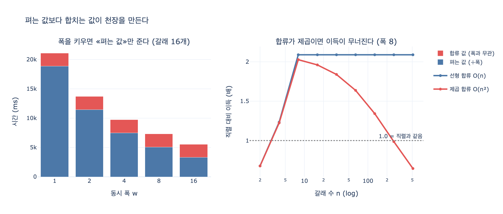

# 팬아웃 폭을 키우기 전에 무엇을 확인해야 하는가?

> **답**: 합류를 프로파일해야 한다. 펴는 값보다 합치는 값이 천장을 만들고, 갈래끼리 비교하는 연산이 있으면 그건 제곱이다.

출처: 25장 「여섯 가지 위상, 그리고 도구를 꽂는 구멍」 25.2절 *펴는 값보다 합치는 값이 비싸다* / `code/ex2_fanout.py`

---

## 1. 무엇에 대한 질문인가

**팬아웃-팬인**(fan-out/fan-in)은 25장이 정리한 여섯 위상 중 「이분·합류」다. 일을 여러 갈래로 **펴고**(fan-out), 갈래들의 결과를 하나로 **합친다**(fan-in). 문서 8편을 4개씩 나눠 읽고 보고서 한 장으로 합치는 식이다.

여기서 자연스럽게 나오는 유혹이 「**폭을 더 키우자**」다. 4폭에서 8폭, 16폭으로. 동시에 돌리는 갈래를 늘리면 빨라질 것 같으니까.

카드가 말하는 것은 그 유혹에 손대기 **전에** 해야 할 일이 따로 있다는 것이다.

---

## 2. 왜 폭이 아니라 합류인가 — 식으로

팬아웃-팬인의 총 시간은 두 항으로 나뉜다.

```
T(n, w) = ⌈n/w⌉ × t_wave(w)   +   M(n)
          └──────┬──────┘         └─┬─┘
          펴는 값 — 폭 w 로 나뉜다   합치는 값 — 폭과 무관
```

- `n` = 갈래 수
- `w` = 동시 폭
- `t_wave(w)` = 물결 하나의 시간 (제일 느린 갈래가 끝나야 끝난다 → 꼬리 지연)
- `M(n)` = 합류 비용. **`n` 의 함수이고 `w` 는 안 들어간다**

폭을 키우면 **앞의 항만** 줄어든다. 뒤의 항은 그대로 남는다. 그래서 폭을 무한히 키워도 이득에 천장이 생긴다.

```
        T_serial(n)        n × t
 lim   ───────────  =  ───────────
w→∞      T(n, w)          M(n)
```

이건 **암달의 법칙**(Amdahl's law)의 팬아웃 버전이다. `M(n)` 이 「병렬화할 수 없는 직렬 잔여분」 역할을 한다. 폭을 키우는 최적화는 병렬 부분만 건드리는 최적화라서, 직렬 잔여분이 지배적이면 애초에 헛일이다.

### 책의 숫자로

`ex2_fanout.py` 의 파라미터(갈래 하나 900ms, 합류 정리 갈래당 140ms, 폭 4)로 갈래 수를 늘려 보면:

| 갈래 | 직렬 | 병렬 4폭 | 그중 합류 | 이득 |
|---:|---:|---:|---:|---:|
| 2 | 1,908 | 2,151 | 280 | **0.89x** ← 병렬이 더 느림 |
| 4 | 3,816 | 2,431 | 560 | 1.57x |
| 8 | 7,632 | 4,862 | 1,120 | 1.57x |
| 16 | 15,264 | 9,724 | 2,240 | 1.57x |
| 64 | 61,056 | 38,898 | 8,960 | 1.57x |
| 128 | 122,112 | 77,795 | 17,920 | 1.57x |

두 가지가 보인다.

1. **갈래 2개짜리는 병렬이 오히려 느리다.** 합류와 꼬리 지연이 펴서 아낀 것보다 크다.
2. **폭이 4인데 이득이 4배가 아니라 1.57배에서 천장을 친다.** 갈래를 128까지 늘려도 안 오른다. 합류가 총 시간의 23%를 계속 먹고 있고, 그 23%는 폭을 키워도 **한 칸도 줄지 않는다.**

책의 문장이 이걸 정확히 짚는다.

> 첫 표에서 천장을 만든 게 합류였다. 폭이 아니라.

### 폭을 키우면 무엇이 줄고 무엇이 안 줄는가

갈래 16개를 고정하고 폭만 바꿔 보면:

| 폭 | 물결 수 | 물결 하나 | 펴는 값 | 합류 | 총 시간 |
|---:|---:|---:|---:|---:|---:|
| 1 | 16 | 1,179 | 18,864 | **2,240** | 21,104 |
| 2 | 8 | 1,432 | 11,458 | **2,240** | 13,698 |
| 4 | 4 | 1,871 | 7,484 | **2,240** | 9,724 |
| 8 | 2 | 2,533 | 5,066 | **2,240** | 7,306 |
| 16 | 1 | 3,299 | 3,299 | **2,240** | 5,539 |

합류 열이 상수다. 16폭에서는 총 5,539ms 중 2,240ms(**40%**)가 합류다. 펴는 값을 3,299ms까지 짜냈는데 합류가 그보다도 큰 덩어리로 남았다. 이 상태에서 폭을 32, 64로 더 키우는 건 이미 의미가 거의 없다. 다음에 손댈 곳은 폭이 아니라 합류 코드다.

(덤으로: 「물결 하나」 열이 폭에 따라 길어지는 것도 봐 두자. 폭을 키우면 총 시간은 줄지만 **최악이 나빠진다.** 제일 느린 갈래가 끝나야 물결이 끝나므로 — 꼬리 지연. 카드 밖의 얘기지만 25장이 바로 이어서 말하는 대가다.)

---

## 3. 「갈래끼리 비교하는 연산이 있으면 그건 제곱이다」

카드의 두 번째 절이 실무에서 더 위험한 쪽이다.

합류 코드가 갈래 결과를 **각각 한 번씩만** 훑으면 `M(n) = Θ(n)` 이다. 위 표가 그 경우다. 그런데 합류가 **갈래끼리 비교**를 하면:

```
M(n) = c × C(n, 2) = c × n(n-1)/2 = Θ(n²)
```

그러면 천장이 이렇게 바뀐다.

```
   n × t          n × t        2t
─────────  =  ───────────  =  ────
   M(n)          c·n²/2        c·n
```

**갈래를 늘릴수록 천장이 내려간다.** 이득이 정체하는 게 아니라 **감소한다.** 어느 지점부터는 병렬이 직렬보다 느려진다.

### 실무에서 이 모양으로 나타나는 코드

- 갈래 결과끼리 **쌍별 중복 제거** — `for a in results: for b in results:`, 또는 `if not any(x == o for o in out)`
- 갈래 간 **모순 검증 / 교차 확인** — 「A가 말한 것과 B가 말한 것이 안 맞나」
- 갈래마다 **임베딩 유사도 행렬** 계산
- 전체를 **다시 정렬**한 뒤 무거운 비교 함수로 인접 항목 비교
- 합류 프롬프트에 **모든 갈래 결과를 서로 대조하라**고 시키는 것 (토큰도 제곱으로 붙는다)

책이 그대로 자기 경험이라고 적어 놓은 부분이다.

> 합류에서 전체를 다시 정렬하거나 중복 제거를 O(n²)로 하고 있으면 펴는 의미가 사라진다. 실제로 제가 그랬다.

### 왜 이게 늦게 발각되는가

`expy.py` 에서 쌍별 비교 비용(쌍당 4ms)을 붙여 폭 8로 재 보면:

| 갈래 | 직렬 | 선형 합류 | 이득 | 제곱 합류 | 이득 | 그중 쌍별 비교 |
|---:|---:|---:|---:|---:|---:|---:|
| 4 | 3,816 | 3,093 | 1.23x | 3,117 | 1.22x | 1% |
| 8 | 7,632 | 3,653 | 2.09x | 3,765 | 2.03x | 3% |
| 32 | 30,528 | 14,611 | 2.09x | 16,595 | 1.84x | 12% |
| 128 | 122,112 | 58,445 | 2.09x | 90,957 | 1.34x | 36% |
| 256 | 244,224 | 116,891 | 2.09x | 247,451 | **0.99x** | 53% |

4갈래에서 쌍별 비교는 총 시간의 **1%** 다. 안 보인다. 「잘 되네, 폭을 늘리자」 하는 시점에는 아무 문제가 없다. 그런데 256갈래에서 **병렬이 직렬보다 느려진다.**

이게 「**폭을 키우기 전에** 프로파일하라」인 이유다. 폭을 키운 **뒤에** 프로파일하면 이미 문제가 터진 상태에서 원인을 찾게 되고, 그때는 「병렬화가 원래 이 정도인가 보다」로 잘못 결론 내리기 쉽다.

---

## 4. 어떻게 프로파일하는가

### 4-1. 합류 비중을 잰다

펴는 구간과 합류 구간을 **따로** 타이밍한다. 하나의 `elapsed` 로만 재면 아무것도 못 본다.

```python
t0 = perf_counter()
results = await gather_branches(tasks)     # 펴는 구간
t1 = perf_counter()
final = merge(results)                     # 합류 구간
t2 = perf_counter()
log(spread_ms=(t1-t0)*1000, merge_ms=(t2-t1)*1000)
```

합류가 총 시간의 20%를 넘으면 폭을 늘려 얻을 수 있는 이득이 이미 크게 깎여 있다.

### 4-2. 복잡도를 잰다 — 더블링 테스트

합류 함수만 떼어 내서 `n` 을 두 배씩 올리며 시간을 재고, 연속한 두 측정의 **비율**을 본다.

| 더블링비 | 복잡도 | 판정 |
|---:|---|---|
| ≈ 1 | O(1) | 안심 |
| ≈ 2 | O(n) | 선형. 상수를 줄일 수 있는지만 본다 |
| ≈ 2.2 ~ 3 | O(n log n) | 대개 괜찮다 |
| **≈ 4** | **O(n²)** | **폭 키우기 전에 여기를 고친다** |

`expy.py` 4단계가 이걸 실제로 돌린다. 같은 중복 제거를 `set` 으로 한 것과 `any()` 루프로 한 것:

```
[선형 (set)]        n=8000  → 0.512ms   더블링비 1.99
[쌍별 (any 루프)]   n=8000  → 730.6ms   더블링비 3.98
```

**같은 일을 한다.** 다른 건 자료구조뿐인데 1,400배 차이다. 폭을 4에서 16으로 키우는 것(위 표에서 9,724 → 5,539ms, 1.76배)보다 이 한 줄 고치는 게 훨씬 크게 듣는다.

### 4-3. 갈래끼리 비교하는 코드를 눈으로 찾는다

프로파일러보다 먼저 되는 게 이거다. 합류 함수 안에서:

- 이중 루프 (`for ... for ...`)
- 리스트 컴프리헨션 안의 `in` / `any()` / `.index()` — 리스트 상대로면 그 자체가 O(n)
- 정렬 + 무거운 비교 함수
- 「모든 쌍」, 「서로」, 「교차」 같은 단어가 붙은 함수명

대응은 대개 **해시/인덱스로 선형화**하는 것이다. `list` 멤버십 → `set`, 쌍별 매칭 → 키 기준 `dict` 그룹핑, 유사도 전수 계산 → 근사 최근접(ANN) 인덱스.

---

## 5. 요약 — 폭을 키우기 전 순서

| # | 할 일 | 나쁜 신호 |
|---|---|---|
| 1 | 펴는 구간과 합류 구간을 **따로** 재서 합류 비중을 확인 | 합류가 총 시간의 20% 이상 |
| 2 | 합류 함수를 **더블링 테스트**로 복잡도 확인 | 더블링비가 4에 붙는다 → O(n²) |
| 3 | 합류 코드에서 **갈래끼리 비교**하는 부분 찾기 | 이중 루프, 쌍별 검증, 전수 유사도 |
| 4 | 있으면 해시/인덱스로 **선형화** | — |
| 5 | 그 다음에 폭을 키운다 | 이때 최악(꼬리 지연)이 나빠지는 걸 감수 |

한 문장으로: **합류가 천장이면 폭은 벽이 아니다.** 벽을 밀기 전에 천장을 재라.

---

## 참고

- [fan-out/fan-in — Azure Durable Functions](https://learn.microsoft.com/en-us/azure/azure-functions/durable/durable-functions-cloud-backup)
- [The Tail at Scale — Google Research](https://research.google/pubs/the-tail-at-scale/) (폭을 키울 때 최악이 나빠지는 이유)
- [Building Effective Agents — Anthropic](https://www.anthropic.com/engineering/building-effective-agents) (오케스트레이터-워커, 병렬화)

## 시각화



왼쪽: 갈래 16개를 고정하고 폭만 키운다. 파란 「펴는 값」은 폭으로 나뉘어 줄어들지만 빨간 「합류 값」은 상수다. 16폭에서는 빨간 덩어리가 파란 덩어리보다 크다 — 여기서 폭을 더 키워도 얻을 게 없다.

오른쪽: 폭 8로 고정하고 갈래 수를 늘린다. 선형 합류(파란선)는 2.09배에서 **천장**을 치고 평평해진다. 제곱 합류(빨간선)는 천장을 치는 게 아니라 **내려가서** 1.0(직렬과 같음) 아래로 떨어진다. 왼쪽 끝(n=2)에서 두 선 모두 1.0 아래인 것도 눈여겨볼 것 — 갈래가 너무 적으면 합류 비용 때문에 병렬이 손해다.
