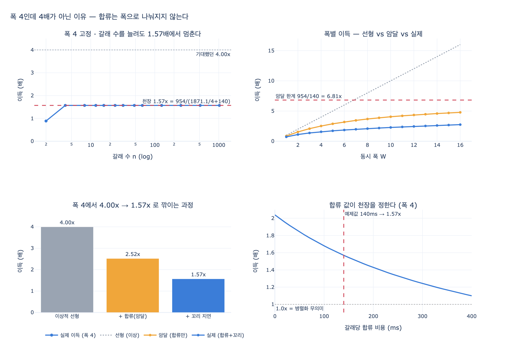

# 폭 4로 병렬화해도 이득이 4배가 되지 않는 이유

> **Q.** 폭 4로 병렬화해도 이득이 4배가 되지 않는 이유는 무엇인가?
>
> **A.** 펴는 값은 폭으로 나눠지지만 합류 값은 갈래 수에 비례해 줄지 않는다. 이득이 1.57배에서 천장을 친다.

---

## 1. 한 줄 정리

병렬화가 나누는 것은 **펴는 값(fan-out)뿐**이다. 합류 값(fan-in)은 갈래 하나하나를 다 만져야 하므로 폭을 아무리 키워도 `갈래 수 × 갈래당 합류 비용` 그대로 남는다. 즉 합류는 **암달의 법칙에서 말하는 직렬 부분**이고, 직렬 부분이 남아 있는 한 이득에는 천장이 생긴다. 25장 `ex2_fanout.py`의 설정에서 그 천장이 **1.57배**다.

---

## 2. 예제의 비용 모델 (`code/ex2_fanout.py`)

```python
TASK_MS = 900          # 갈래 하나 처리 시간
MERGE_PER_BRANCH = 140 # 합류할 때 갈래당 드는 시간 (정리·중복 제거)
FAIL = 0.06            # 갈래 하나가 실패할 확률
RETRY_MS = TASK_MS     # 실패하면 한 번 더
SLOW_P = 0.10          # 갈래 하나가 «느린 놈»일 확률
SLOW_X = 3.5           # 느린 놈은 이만큼 더 걸린다
```

### 직렬

```
serial(n) = n·TASK_MS + n·FAIL·RETRY_MS
          = n·(900 + 0.06·900) = n · 954
```

갈래당 954ms. 여기에는 합류 비용이 **없다**. 차례대로 처리하니 따로 합칠 일이 없다는 가정이다.

### 병렬 (폭 $W$)

```
waves      = ceil(n / W)
wave_ms(W) = TASK_MS·(1 + p_slow(W)·(SLOW_X-1)) + p_fail(W)·RETRY_MS
             p_slow(W) = 1 - (1-0.10)^W    # 이 물결에 «느린 놈»이 하나라도 있을 확률
             p_fail(W) = 1 - (1-0.06)^W    # 이 물결에 실패가 하나라도 있을 확률
parallel(n,W) = waves·wave_ms(W)  +  n·MERGE_PER_BRANCH
                └── 폭으로 나눠지는 부분 ──┘  └── 안 나눠지는 부분 ──┘
```

여기 두 항의 성질 차이가 문제의 전부다.

| 항 | 형태 | 폭 $W$를 키우면 |
|---|---|---|
| 펴는 값 | `ceil(n/W) · wave_ms(W)` | 물결 수가 $1/W$로 줄어든다 → **줄어든다** |
| 합류 값 | `n · 140` | $W$가 아예 등장하지 않는다 → **그대로** |

---

## 3. 왜 정확히 1.57배인가 — 대수로 유도

$n$이 $W$의 배수여서 `ceil(n/W) = n/W` 인 경우, 이득은 다음과 같이 $n$이 통째로 약분된다.

$$
\text{gain}(W) \;=\; \frac{\text{serial}(n)}{\text{parallel}(n,W)}
\;=\; \frac{954\,n}{\dfrac{n}{W}\,\text{wave\_ms}(W) + 140\,n}
\;=\; \frac{954}{\dfrac{\text{wave\_ms}(W)}{W} + 140}
$$

$n$이 사라진다. 그래서 갈래를 8개로, 32개로, 1024개로 늘려도 **이득은 정확히 같은 값에 머문다.** 점근선이 아니라 딱 붙어 있는 값이다.

$W = 4$를 넣으면:

- $p_{slow}(4) = 1 - 0.9^4 = 0.3439$
- $p_{fail}(4) = 1 - 0.94^4 = 0.21925$
- $\text{wave\_ms}(4) = 900(1 + 0.3439 \times 2.5) + 0.21925 \times 900 = 1673.78 + 197.33 = 1871.10$
- 갈래당 병렬 시간 $= 1871.10 / 4 = 467.78$

$$
\text{gain}(4) = \frac{954}{467.78 + 140} = \frac{954}{607.78} = \mathbf{1.5697}
$$

실행 결과가 이것과 일치한다.

```
   갈래 수    직렬(ms)   병렬 4폭(ms)      그중 합류      이득
------------------------------------------------------------
      2       1,908           2,151         280     0.89x  ← 별 이득 없음
      4       3,816           2,431         560     1.57x
      8       7,632           4,862       1,120     1.57x
     16      15,264           9,724       2,240     1.57x
     32      30,528          19,449       4,480     1.57x
     64      61,056          38,898       8,960     1.57x
```

(갈래 2개짜리가 0.89배로 **손해**인 것은 별개 효과다. `ceil(2/4)=1` 물결이라 폭 4의 꼬리 지연 값을 다 치르면서 갈래는 2개뿐이고, 거기에 합류 값 280ms가 더 붙는다.)

---

## 4. 암달의 법칙 형태로 보기

암달의 법칙은 이렇게 말한다. 전체 일 가운데 비율 $s$가 직렬이면 코어를 무한히 늘려도 속도 향상은

$$
S(W) = \frac{1}{s + \dfrac{1-s}{W}}, \qquad \lim_{W \to \infty} S(W) = \frac{1}{s}
$$

를 넘지 못한다. **여기서 직렬 부분($s$)에 해당하는 것이 합류다.**

갈래 하나당 회계를 해 보면 병렬화 대상은 954ms, 병렬화 안 되는 합류가 140ms다.

$$
s = \frac{140}{954 + 140} = \frac{140}{1094} = 0.128
$$

$$
S(4) = \frac{1}{0.128 + 0.872/4} = 2.89, \qquad S(\infty) = \frac{1}{0.128} = 7.81
$$

예제는 직렬 기준선에 합류를 포함하지 않으므로($\text{serial} = 954n$) 책의 배수는 여기에 $1094/954$로 환산된 값이다. 즉 예제 기준의 이론 천장은

$$
\text{gain}(\infty) = \frac{954}{140} = 6.81\text{배}
$$

**두 종류의 천장을 구분하는 게 중요하다.**

| 천장 | 값 | 무엇이 만드는가 |
|---|---|---|
| 폭을 4로 고정하고 갈래 수 $n \to \infty$ | **1.57배** | 합류(직렬 부분) + 폭 4의 꼬리 지연 |
| 폭 $W \to \infty$까지 키움 | 6.81배 (합류만 고려한 암달 한계) | 합류 값 140ms 자체 |

카드가 말하는 1.57배는 첫째 줄이다. **폭이 4인데 4배가 아닌** 이유를 3단으로 쪼개면 이렇다.

| 단계 | 이득 | 잃은 것 |
|---|---|---|
| 이상적 선형 병렬 (합류 0, 꼬리 없음) | 4.00배 | — |
| 합류 140ms/갈래를 더함 (= 암달) | 2.52배 | −37% (직렬 부분 때문) |
| 꼬리 지연까지 반영 (`wave_ms`) | 1.57배 | −38% (물결이 최악 갈래를 기다림) |

중간 단계 2.52배는 $954/(954/4 + 140)$이다. **4배 → 2.52배가 순수하게 암달의 몫**이고, 2.52배 → 1.57배는 「물결 하나는 제일 느린 갈래가 끝나야 끝난다」는 꼬리 지연의 몫이다.

---

## 5. 그래서 어디를 고쳐야 하나

`gain(W) = 954 / (wave_ms(W)/W + 140)`에서 분모의 두 항 크기를 보라. 폭 4에서 **467.78 대 140**, 즉 합류가 이미 전체의 23%다. 여기서

- **폭을 8로 두 배 키우면** → 앞 항만 316.6으로 줄어 이득 2.09배. 두 배 늘렸는데 이득은 1.33배만 늘었다.
- **합류 값을 140 → 70으로 반으로 줄이면** → 이득 $954/(467.78+70) = 1.77$배. 폭은 그대로다.
- **합류 값을 0으로 만들면** → 2.04배.

폭을 키우는 일은 인스턴스·쿼터·동시성 한도 같은 실제 자원을 사는 일이고, 합류 코드를 가볍게 하는 일은 대개 코드를 고치는 일이다. 원문이 「합류 코드를 «가볍게» 유지하는 게 폭을 키우는 것보다 크게 듣는다」고 쓴 이유가 이 산수다.

그리고 최악의 경우 — **갈래끼리 비교하는 합류**는 $O(n^2)$이다. 전체 재정렬, 쌍쌍 중복 제거, 갈래 간 교차 검증 같은 것이 여기 해당한다. 그러면 합류 항이 `n·140`이 아니라 `n²·c`가 되어 $n$이 약분되지 않고, 이득은 천장에 머무는 게 아니라 **$n$이 커질수록 1 아래로 내려간다**. 펴는 의미가 아예 사라진다.

## 6. 실무 체크리스트

1. 폭을 올리기 전에 **합류를 프로파일**한다. 전체 벽시계에서 합류가 몇 %인지 먼저 잰다. 그 비율이 곧 암달의 $s$이고, 이론 천장 $1/s$를 바로 준다.
2. 합류가 20%를 넘으면 폭 확장은 값어치가 급격히 떨어진다. 합류 최적화가 먼저다.
3. 합류에 갈래 간 비교($O(n^2)$)가 있는지 본다. 있으면 그건 천장이 아니라 **절벽**이다.
4. 폭을 키우면 총 시간은 계속 줄지만 **물결 하나가 길어진다**(꼬리 지연). 평균은 좋아지고 최악(p99)은 나빠진다. 사용자가 느끼는 건 대개 최악 쪽이다.
5. 병렬화는 **시간을 사는 것이지 돈을 아끼는 게 아니다.** 두 표 모두 토큰은 직렬과 동일하다.

---

## 참고

- 원문: 25.2 「펴는 값보다 합치는 값이 비싸다」, 예제 `code/ex2_fanout.py`
- 암달의 법칙(Amdahl's law) — 병렬화 가능 비율이 정하는 속도 향상 상한
- 꼬리 지연: [The Tail at Scale](https://research.google/pubs/the-tail-at-scale/)
- 팬아웃/팬인: [Azure Durable Functions — fan-out/fan-in](https://learn.microsoft.com/en-us/azure/azure-functions/durable/durable-functions-cloud-backup)

## 시각화


