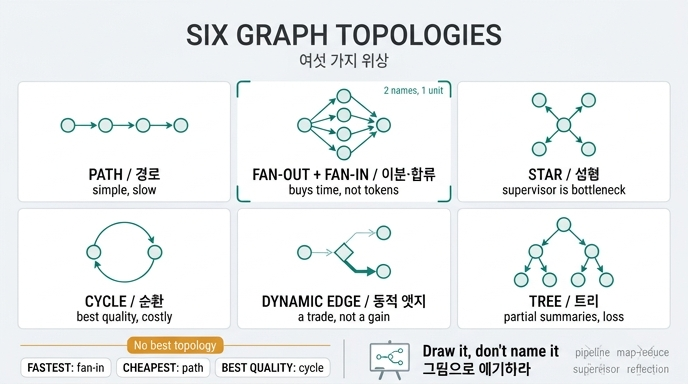

# 25장이 말하는 그래프 위상의 종류

## 정답 한 줄

**경로, 이분, 합류, 성형, 순환, 동적 엣지, 트리.** 복잡해 보이는 구조는 전부 이들의 조합이며, **이름은 사람마다 다르니 그림으로 얘기해야** 한다.

## 왜 「여섯 가지」인데 이름이 일곱인가

장 제목은 「여섯 가지 위상」이고 요약문도 「위상은 여섯 가지뿐입니다」로 시작하는데, 나열된 이름은 일곱 개다. 오타가 아니다. **이분(fan-out)과 합류(fan-in)는 거의 항상 짝으로 쓰이므로 실행 단위로는 하나**로 센다. 예제 코드 `ex1_topologies.py`의 함수 이름이 그 증거다.

```python
def 이분합류():
    """팬아웃-팬인. 문서를 나눠 읽고 합친다."""
```

표 출력도 `이분·합류` 한 줄이고, 헤더는 "같은 작업을 **여섯** 위상으로"다. 즉

| 세는 방식 | 개수 | 목록 |
|---|---|---|
| 이름(요소)으로 셀 때 | 7 | 경로, 이분, 합류, 성형, 순환, 동적 엣지, 트리 |
| 실행 단위로 셀 때 | 6 | 경로, **이분·합류**, 성형, 순환, 동적 엣지, 트리 |

카드의 답은 7개 이름을 그대로 나열한 쪽이다. 「이분과 합류를 하나로 묶으면 여섯」이라는 단서까지 함께 기억해 두면 제목과 답이 어긋나 보이는 문제가 사라진다.

## 여섯(일곱) 위상을 그림으로

### 1. 경로 (Path / Pipeline)

```
A → B → C → D
```

한 줄로 죽 이어진다. 분기도 합류도 없다. 가장 단순하고 가장 오래 산다. 대가는 시간이다 — 8편을 읽으려면 8번을 차례로 읽는다.

### 2. 이분 (Fan-out) + 3. 합류 (Fan-in)

```
        ┌→ W1 ─┐
A ─────>├→ W2 ─┤──> Merge → 보고서
        ├→ W3 ─┤
        └→ W4 ─┘
```

- **이분**: 하나의 노드가 여러 갈래로 펴진다. LangGraph의 `Send` API가 이 모양을 만든다.
- **합류**: 펴진 갈래를 다시 하나로 모은다.

이 짝이 사는 것은 **시간**이지 **돈**이 아니다. 8편을 4폭으로 나눠 읽으면 물결이 2개가 되어 지연은 9,000ms → 3,600ms로 줄지만, 토큰은 22,400개로 **똑같다**. 나눠 읽는다고 읽는 양이 줄지 않으니까.

### 4. 성형 (Star / Orchestrator-Workers)

```
       W1
        ↑
 W4 ← [S] → W2      S = 감독자(오케스트레이터)
        ↓
       W3
```

감독자가 가운데 있고 매 라운드마다 다음 일을 정한다. 판단이 붙어 품질이 오르지만(0.71 → 0.78) 감독자가 병목이고, 라운드마다 라우팅 토큰이 추가된다. Anthropic의 orchestrator-workers 패턴이 이것이다.

### 5. 순환 (Cycle / Evaluator-Optimizer)

```
A → 생성 → 검증 ──통과──> 끝
      ↑        │
      └─ 반려 ─┘
```

검토가 통과할 때까지 돈다. **품질이 유일하게 크게 오르는 위상**이다(0.71 → 0.89). 대신 토큰이 제일 많이 든다(32,100). 「토큰당 품질」로 보면 오히려 하위권이라, 품질을 **돈으로 산 것**이지 공짜로 얻은 게 아니다.

### 6. 동적 엣지 (Dynamic edge / Routing)

```
        ┌─(쉬움)→ 빠른 길 ─┐
입력 → [R]                 ├→ 출력
        └─(어려움)→ 정밀한 길 ┘
```

라우터가 입력을 보고 갈 길을 **실행 시점에** 고른다. 엣지가 정적으로 박혀 있지 않다는 뜻이다. 주의: 이것은 품질을 올리는 장치가 아니라 **교환**이다. 예제 3에서 라우팅 정확도 100%에서도 품질은 0.894 → 0.880으로 내려가고, 대신 토큰은 60% 절약된다.

### 7. 트리 (Tree / Hierarchical delegation)

```
            [Root]
           ↙      ↘
       [M1]        [M2]        M = 중간 관리자
      ↙   ↘       ↙   ↘
    W    W      W     W
```

중간 관리자가 부분 보고서를 만들고, 루트가 그걸 합친다. 부분 요약이 남아 컨텍스트가 절약되지만, 요약 단계마다 **중간 손실**이 생긴다. 토큰은 29,600으로 만만치 않다.

## 「전부 이들의 조합」이라는 말의 뜻

실무의 그래프가 복잡해 보이는 건 새로운 위상이 있어서가 아니라 이 조각들이 겹쳐 있어서다.

| 실무에서 부르는 이름 | 분해하면 |
|---|---|
| Map-Reduce | 이분 + 합류 |
| Supervisor multi-agent | 성형 + 순환 |
| Deep research agent | 동적 엣지 + 이분·합류 + 순환 |
| Plan-and-Execute | 경로 + 성형 |
| Hierarchical team | 트리 + (각 층에서) 이분·합류 |

그래서 새 아키텍처 그림을 보면 「무슨 패턴이지?」가 아니라 **「이분이 몇 번, 합류가 몇 번, 순환이 있나?」**로 읽으면 된다.

## 「이름은 사람마다 다르니 그림으로 얘기하세요」

같은 모양에 붙은 이름이 진영마다 다르다. 키워드 표에 붙은 출처들도 서로 다른 어휘를 쓴다.

| 이 책의 이름 | 다른 곳에서 쓰는 말 |
|---|---|
| 경로 | pipeline, chain, sequential, prompt chaining |
| 이분·합류 | fan-out/fan-in, map-reduce, scatter-gather, parallelization, `Send` |
| 성형 | orchestrator-workers, supervisor, coordinator, hub-and-spoke |
| 순환 | evaluator-optimizer, generator-critic, reflection, self-refine, ReAct loop |
| 동적 엣지 | routing, dispatcher, conditional edge, classifier |
| 트리 | hierarchical delegation, sub-supervisor, nested teams |

이름이 여섯 개인데 별칭이 서른 개다. 회의에서 「우리 오케스트레이터로 갑시다」라고 말하면 상대는 성형을, 나는 트리를 떠올린다. **화이트보드에 노드와 화살표를 그리는 것이 어휘 합의보다 빠르다.** 이 카드가 「그림으로 얘기해야 한다」로 끝나는 이유다.

## 같은 작업을 여섯 위상으로 — 실측표

`python3 content/ch25/code/ex1_topologies.py` 실행 결과 (문서 8편 → 보고서 1장, 동시 폭 4).

| 위상 | 지연(ms) | 토큰 | 품질 | 토큰당 품질 | 성격 |
|---|---:|---:|---:|---:|---|
| 경로 | 9,000 | 22,400 | 0.71 | 0.317 | 단순. 느리다. |
| 이분·합류 | **3,600** | 22,400 | 0.71 | 0.317 | 빠르다. 토큰은 같다. |
| 성형 | 4,500 | 23,600 | 0.78 | 0.331 | 판단이 붙는다. 감독자가 병목. |
| 순환 | 9,300 | 32,100 | **0.89** | 0.277 | 품질이 오른다. 값이 비싸다. |
| 동적 엣지 | 3,900 | 22,800 | 0.81 | **0.355** | 쉬운 건 싸게, 어려운 건 비싸게. |
| 트리 | 4,800 | 29,600 | 0.84 | 0.284 | 부분 요약이 남는다. 중간 손실도. |
| **최저 토큰** | | **22,400** | | | 경로 (이분·합류와 동률) |

제일 빠른 것(이분·합류), 제일 싼 것(경로), 품질 1등(순환)이 **모두 다르다**. 그래서 「좋은 위상」은 없다. 무엇을 포기할지가 다를 뿐이다.

## 고르는 순서

제약을 먼저 정하고, 제약이 없으면 제일 단순한 것을 쓴다.

```
1. 품질 하한이 있나?      → 있으면 순환을 넣는다
2. 지연 상한이 있나?      → 있으면 이분·합류로 편다
3. 입력 종류가 갈리나?    → 갈리면 동적 엣지
4. 다 아니면 경로.        → 제일 단순한 게 제일 오래 산다
```

## 함께 기억할 것 (이 장의 나머지 절)

- **합류가 천장을 만든다**: 폭을 4로 키워도 이득은 4배가 아니라 1.57배에서 멈춘다. 펴는 값은 ÷폭인데 합류 값은 갈래 수에 비례해 줄지 않기 때문이다. 갈래 2개짜리는 병렬이 오히려 0.89배로 **더 느리다**.
- **폭을 키우는 값은 변동성으로 치른다**: 총 시간은 계속 줄지만 물결 하나가 길어진다(16폭이면 3,299ms, 1폭의 2.8배). 꼬리 지연 때문이다. 평균은 좋아지고 최악은 나빠지는데, 사용자가 느끼는 건 대개 최악 쪽이다.
- **라우터를 넣기 전에 채점 데이터셋부터**: 정확도를 모르면 교환을 계산할 수 없다. 100건이면 시작할 수 있다.
- **도구는 그래프 밖으로 나가는 엣지**: MCP는 그 엣지 목록을 실행 시점에 받아 오는 방식이다. 대가는 컴파일 시점에 아무것도 모른다는 것 — 시작할 때 목록을 검증하라.
- **도구 설명이 곧 엣지 선택 함수**: ① 무엇을 주는지 ② 어떤 말로 묻는지(사용자 어휘) ③ **언제 안 쓰는지**. 셋째가 제일 자주 빠지고 제일 크게 든다.

## 자주 하는 실수

- 「여섯 가지」에 맞추려고 이름 하나를 빼먹는다 → 답은 일곱 이름, 이분·합류를 묶으면 여섯.
- **성형과 트리를 섞는다** → 성형은 감독자가 **하나**, 트리는 감독자가 **여러 층**.
- **동적 엣지와 이분을 섞는다** → 이분은 갈래를 **전부** 실행, 동적 엣지는 **하나만** 골라서 실행.
- 「병렬로 하면 싸진다」고 말한다 → 시간을 사는 것이지 토큰은 그대로다.

## 인포그래픽


