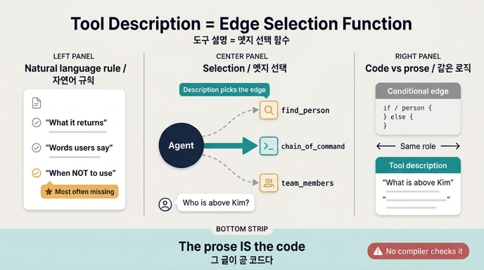

# 도구 설명 = 엣지 선택 함수

## 질문

도구 설명(tool description)을 그래프 용어로 표현하면 무엇인가?

## 답

**엣지 선택 함수**다. 엣지를 고르는 규칙을 자연어로 적어 두는 셈이라, 그 글이 곧 코드다.

## 왜 「엣지 선택 함수」인가

25장의 논리는 두 단계로 이어집니다.

1. **25.4 — 도구는 그래프 밖으로 나가는 엣지다.** 노드에서 다른 노드로 가는 엣지가 그래프 내부의 이동이라면, 도구 호출은 그래프 밖(DB, API, 파일시스템, MCP 서버)으로 뻗는 엣지입니다. MCP는 그 「엣지 목록」을 컴파일 시점이 아니라 실행 시점에 서버에서 받아 오는 방식이고요.
2. **25.5 — 그렇다면 그 여러 엣지 중 하나를 고르는 주체는 무엇인가?** 코드에 `if` 문으로 박아 둔 라우팅 함수가 아닙니다. 모델이 도구 목록의 **설명 문장**을 읽고 고릅니다. 즉 설명이 곧 분기 조건이고, 그래프 용어로는 **엣지 선택 함수(edge selection function)** 입니다.

일반적인 조건부 엣지(conditional edge)와 대비하면 이렇습니다.

| | 조건부 엣지 (동적 엣지) | 도구 설명 |
|---|---|---|
| 선택 규칙이 사는 곳 | 파이썬 함수 본문 | 자연어 문장 |
| 고치는 방법 | 코드 수정 → 배포 | 문장 수정 |
| 타입 검사 | 컴파일러/린터가 잡아 줌 | 없음. 런타임에 틀림 |
| 테스트 | 단위 테스트 | 질의 데이터셋으로 채점 |

핵심은 「자연어이지만 코드다」입니다. 설명이 실행 경로를 결정하므로, 그 문장은 주석이 아니라 **로직**입니다. 그러니 코드처럼 리뷰하고, 코드처럼 테스트하고, 코드처럼 버전 관리해야 합니다.

## 예제 5가 증명하는 것

`code/ex5_tool_selection.py`는 모델 없이, 「질문 단어와 설명 단어의 겹침 개수」만으로 도구를 고르는 아주 멍청한 선택기를 씁니다. 도구 구현은 한 줄도 안 바꾸고 **설명만** 바꿉니다.

나쁜 설명(`BAD`):

```python
BAD = {
    "find_person":      "사람 조회",
    "chain_of_command": "체인 조회",
    "team_members":     "팀 조회",
}
```

좋은 설명(`GOOD`) 일부:

```python
"chain_of_command":
    "한 사람의 «위로 올라가는» 보고 체계를 뿌리까지 준다. "
    "상사, 상사의 상사, 보고 라인, 결재선을 물으면 이것이다. "
    "아래 부하 목록에는 쓰지 않는다.",
```

같은 8개 질의에 대해 정확도가 크게 오릅니다. **코드는 한 줄도 안 고쳤습니다.** 선택 함수의 본문이 코드가 아니라 설명 문장에 있었다는 증거입니다.

## 좋은 설명에 들어가는 세 가지

예제가 정리한 체크리스트입니다.

1. **무엇을 「주는지」** — 반환값을 말한다. (「이름, 소속 팀, 상사 아이디를 준다」)
2. **어떤 「말」로 물었을 때 이것인지** — 사용자 어휘를 넣는다. (「상사, 보고 라인, 결재선을 물으면 이것이다」)
3. **언제 「안」 쓰는지** — 경계를 긋는다. (「여러 명을 찾을 때는 쓰지 않는다」, 「아래 부하 목록에는 쓰지 않는다」)

3번이 **제일 자주 빠지고 제일 크게 듣습니다.** 도구가 늘어날수록 비슷한 도구가 생기고, 그때 경계를 그어 둔 쪽이 이깁니다. 선택 함수 관점에서 보면 당연합니다. 조건부 엣지를 쓸 때 `if` 만 쓰고 `else` 를 안 쓰면 안 되는 것과 같아요.

## 남은 실패 하나: 어휘 불일치

좋은 설명으로도 「박민수 **상급자** 알려줘」는 틀립니다. 설명에는 「상사」가 있는데 사용자는 「상급자」라고 했기 때문에 단어가 겹치지 않습니다.

- 우리는 사내 용어로 쓰고, 사용자는 자기 말로 묻는다.
- 대응은 **동의어를 설명에 넣는 것**이다. 상사·상급자·윗사람·결재선.
- 촌스러워 보여도 이게 듣는다. 실제 질문 로그에서 뽑아 넣으면 더 좋다.

이 선택기는 단어 겹침을 세는 게 전부라 실제 모델보다 훨씬 멍청합니다. 하지만 「설명이 나쁘면 못 고른다」는 성질은 모델도 똑같습니다.

## 실무로 옮기면

- 도구 설명 문장을 **코드 리뷰 대상**에 넣으세요. 문장 한 줄이 라우팅 로직입니다.
- 도구 선택 정확도를 재는 **질의 데이터셋**을 만드세요(라우터 얘기와 같은 논리 — 채점 데이터셋이 먼저입니다. 100건이면 시작할 수 있습니다).
- 도구가 늘어날 때마다 「비슷한 도구와의 경계」를 각 설명에 추가하세요.
- MCP처럼 설명이 외부(서버)에서 오는 경우, 남이 쓴 문장이 내 그래프의 분기 조건이 됩니다. 시작할 때 목록과 스키마를 검증하세요.

## 한 줄 정리

> 2장의 말로 하면 「Description 이 호출을 결정」하고, 그래프의 말로 하면 도구 설명이 곧 「엣지 선택 함수」다. 엣지를 고르는 규칙을 자연어로 적어 두는 셈이라, 그 글이 곧 코드다.

## 참고

- 예제: `content/ch25/code/ex5_tool_selection.py`
- [MCP tool schema](https://modelcontextprotocol.io/specification/2025-06-18/server/tools)
- [Model Context Protocol](https://modelcontextprotocol.io/specification/2025-06-18)

## 인포그래픽


