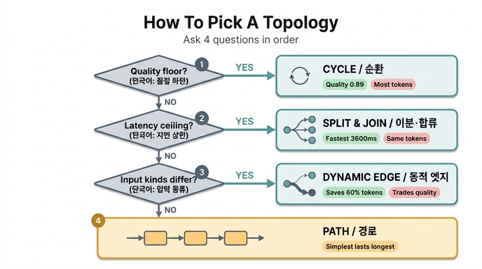

# 위상을 고르는 네 단계 순서

**질문:** 위상을 고르는 네 단계 순서는 무엇인가?

**답:** 품질 하한이 있으면 순환, 지연 상한이 있으면 이분·합류, 입력 종류가 갈리면 동적 엣지, 다 아니면 경로다.

---

## 한눈에 보기

| 순서 | 물어볼 것 | 그렇다면 | 왜 |
|---|---|---|---|
| 1 | **품질 하한**이 있나? | **순환** (생성-검증 루프) | 품질을 유의미하게 올리는 건 순환뿐 |
| 2 | **지연 상한**이 있나? | **이분·합류** (팬아웃-팬인) | 시간을 사는 유일한 수단 |
| 3 | **입력 종류가 갈리나?** | **동적 엣지** (라우터) | 쉬운 건 싸게, 어려운 건 비싸게 |
| 4 | 다 아니면 | **경로** (파이프라인) | 제일 단순한 게 제일 오래 산다 |

이 순서는 25.1절 예제(`code/ex1_topologies.py`)의 마지막 출력에 그대로 적혀 있습니다.

```
고르는 순서는 이렇다.
  1. 품질 하한이 있나 → 있으면 순환을 넣는다
  2. 지연 상한이 있나 → 있으면 이분·합류로 편다
  3. 입력 종류가 갈리나 → 갈리면 동적 엣지
  4. 다 아니면 경로. 제일 단순한 게 제일 오래 산다.
```

## 왜 이 순서인가 — 이것은 「제약 → 위상」 매핑이다

핵심 전제는 25.1절의 결론입니다. **「좋은 위상」은 없습니다.** 제일 빠른 것, 제일 싼 것, 품질 1등이 전부 다른 위상이에요. 그래서 위상은 「무엇이 제일 좋은가」로 고르는 게 아니라 **「내가 못 어기는 제약이 무엇인가」로 고릅니다.**

네 단계는 위상 카탈로그가 아니라 **제약 검사 순서**입니다. 각 단계는 「이 제약이 있으면 이 위상 하나만이 그 제약을 풀어 준다」는 대응이고, 아무 제약도 없으면 기본값(경로)으로 떨어집니다. 위에서부터 순서대로 걸리는 것을 넣고, 아무것도 안 걸리면 아무것도 안 넣는 구조예요.

### 1단계 — 품질 하한 → 순환

예제 1의 여섯 위상 중 **품질을 크게 올리는 것은 순환뿐**입니다(0.71 → 0.89). 나머지는 0.71~0.84 사이에 몰려 있습니다. 「정확도 X% 밑으로는 못 내려간다」는 조건이 있으면, 병렬화나 라우팅으로는 못 만들어 줍니다. 검토가 통과할 때까지 다시 쓰는 루프를 넣어야 해요.

대가는 명확합니다. 토큰이 제일 많이 듭니다(32,100 — 경로의 1.43배). 「토큰당 품질」 칸으로 보면 순환이 오히려 **꼴찌**입니다. 품질을 **돈으로 산 것**이지 공짜로 얻은 게 아닙니다. 그래서 품질 하한이라는 *제약이 실제로 있을 때만* 넣습니다.

### 2단계 — 지연 상한 → 이분·합류

지연을 줄이는 수단은 병렬화입니다. 문서 8편을 차례로 읽으면 8번(9,000ms), 폭 4로 나눠 읽으면 2 물결(3,600ms)입니다.

주의할 점 두 가지가 있어요.

- **토큰은 그대로입니다.** 경로와 이분·합류의 토큰이 똑같이 22,400입니다. 나눠 읽는다고 읽는 양이 줄지 않으니까요. **병렬은 시간을 사는 것이지 돈을 아끼는 게 아닙니다.**
- **천장은 합류가 만듭니다.** 예제 2에서 폭 4인데 이득은 1.57배에서 멈춥니다. 펴는 값은 나누기(÷폭)인데 합류 값은 갈래 수에 비례해서 안 줄기 때문이에요. 폭을 키우기 전에 합류를 프로파일하세요. 갈래끼리 비교하는 연산이 있으면 그건 제곱입니다.
- 그리고 폭을 키우면 총 시간은 줄지만 **물결 하나가 길어집니다**(꼬리 지연). 평균은 좋아지고 최악은 나빠져요. 사용자가 느끼는 건 대개 최악 쪽입니다.

### 3단계 — 입력 종류가 갈린다 → 동적 엣지

입력이 「쉬운 것」과 「어려운 것」으로 갈릴 때만 라우터가 값을 합니다. 쉬운 건 싸게, 어려운 건 비싸게 보내는 거예요.

여기서 순서가 중요한 이유가 드러납니다. **라우터는 품질을 올리는 장치가 아닙니다.** 예제 3에서 라우팅 정확도 100%에서도 평균 품질이 0.894 → 0.880으로 *내려갑니다*. 대신 토큰을 60% 아낍니다. 즉 라우터는 **품질을 조금 내주고 토큰을 크게 아끼는 교환**입니다. 그래서 1단계(품질 하한)보다 뒤에 옵니다 — 품질 하한이 걸려 있다면 라우터는 오히려 하한을 깎는 방향이니까요.

교환이 남는 장사인지는 도메인이 정합니다. 그리고 계산하려면 **라우터보다 먼저 「라우팅이 맞았는지 채점하는 데이터셋」**이 있어야 합니다(100건이면 시작할 수 있습니다). 정확도를 모르면 「라우터 넣었더니 좋아졌다」는 느낌만 남습니다.

### 4단계 — 다 아니면 경로

제약이 하나도 안 걸리면 파이프라인입니다. 제일 단순하고, 제일 싸고(22,400 토큰), 제일 오래 삽니다. 25.1절이 말하는 기본값이 이것이에요. **제약이 없으면 제일 단순한 경로를 쓰세요.**

## 예제 1의 숫자 (문서 8편 → 보고서 1장)

| 위상 | 지연(ms) | 토큰 | 품질 | 토큰당 품질 | 성격 |
|---|---:|---:|---:|---:|---|
| 경로 | 9,000 | 22,400 | 0.71 | 0.317 | 단순. 느리다. |
| 이분·합류 | **3,600** | 22,400 | 0.71 | 0.317 | 빠르다. 토큰은 같다. |
| 성형 | 4,500 | 23,600 | 0.78 | 0.331 | 판단이 붙는다. 감독자가 병목. |
| 순환 | 9,300 | **32,100** | **0.89** | 0.277 | 품질이 오른다. 값이 비싸다. |
| 동적 엣지 | 3,900 | 22,800 | 0.81 | **0.355** | 쉬운 건 싸게, 어려운 건 비싸게. |
| 트리 | 4,800 | 29,600 | 0.84 | 0.284 | 부분 요약이 남는다. 중간 손실도. |

제일 빠른 것은 **이분·합류**, 제일 싼 것은 **경로**, 품질 1등은 **순환**입니다. 전부 다릅니다 — 이게 「좋은 위상은 없다」의 실증입니다.

## 자주 하는 실수

- **네 단계를 위상 여섯 개의 목록으로 착각하기.** 네 단계에는 **성형(감독자-작업자)과 트리(계층적 위임)가 안 나옵니다.** 이 순서는 여섯 위상을 다 나열하는 목차가 아니라, 제약이 있을 때 꺼내 쓰는 세 장의 카드와 기본값 한 장이에요.
- **순서를 뒤집기.** 「먼저 라우터를 넣어 최적화하고 나중에 품질을 올린다」는 순서는 예제 3 때문에 위험합니다. 라우터는 품질을 깎는 교환이라서, 품질 하한이 있으면 1단계가 먼저입니다.
- **병렬로 돈을 아끼려 하기.** 2단계는 지연 상한에 대한 답이고 비용에 대한 답이 아닙니다.
- **누적이 아니라 배타로 읽기.** 실제 시스템은 조합입니다(예: 라우팅 후 팬아웃, 각 갈래 안에 검증 루프). 네 단계는 「어느 하나만 골라라」가 아니라 「걸리는 제약마다 해당 구조를 넣어라」입니다.

## 함께 보면 좋은 것

- 여섯 위상: 경로, 이분, 합류, 성형, 순환, 동적 엣지, 트리 — 복잡해 보이는 구조는 전부 이 조합. 이름은 사람마다 다르니 **그림으로** 얘기하세요.
- [Building effective agents](https://www.anthropic.com/engineering/building-effective-agents) — 라우팅, 오케스트레이터-워커, 평가자-최적화
- [The Tail at Scale](https://research.google/pubs/the-tail-at-scale/) — 2단계의 꼬리 지연

## 인포그래픽


