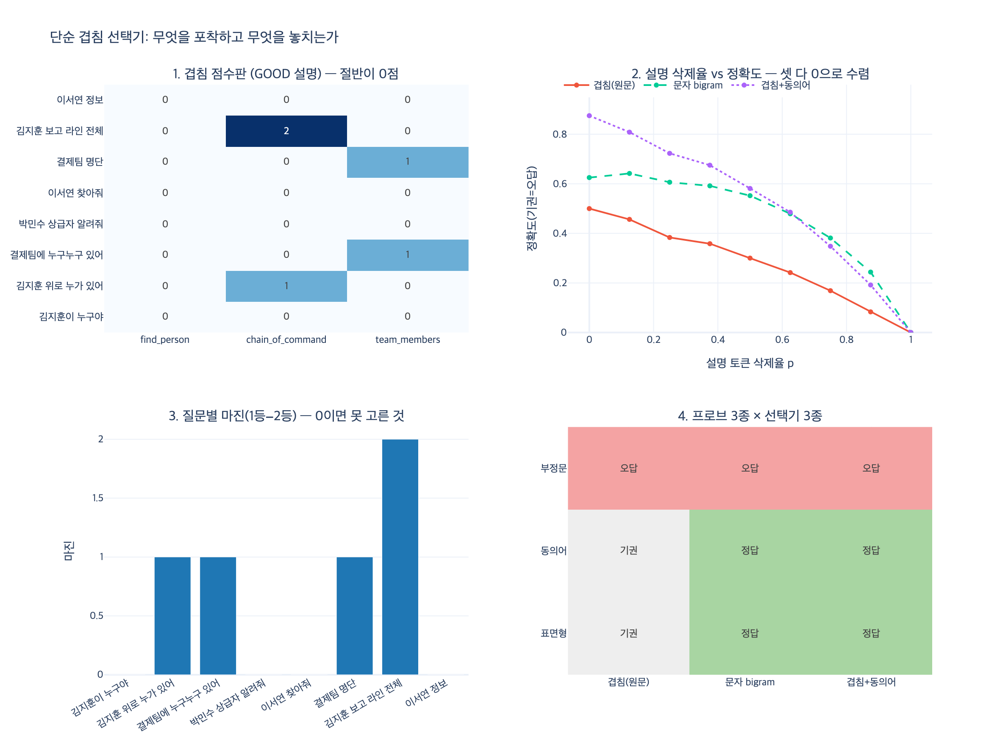

# 예제의 단순 선택기가 모델을 대신할 수 있는 이유

**질문**: 예제의 단순 선택기가 모델을 대신할 수 있는 이유는 무엇인가?

**답**: 단어 겹침만 세는 멍청한 선택기지만, '설명이 나쁘면 못 고른다'는 성질은 모델도 같다.

---

## 1. 예제가 무엇을 했나

25장 예제 5(`code/ex5_tool_selection.py`)는 「도구 설명이 곧 엣지 선택 함수다」(25.5절)를
증명하려는 예제입니다. 하는 일은 이것뿐입니다.

- 도구 세 개(`find_person`, `chain_of_command`, `team_members`)와 질문 8개를 준비한다
- 설명 세트를 `BAD`(「사람 조회」, 「체인 조회」, 「팀 조회」)와 `GOOD`(언제 쓰나 / 언제 안 쓰나가 적힌 것)으로 나눈다
- **코드는 한 줄도 안 고치고 설명만 바꿔서** 도구 선택 정확도를 잰다

여기서 도구를 고르는 「선택기」가 이렇게 생겼습니다.

```python
def tokenize(s):
    return set(re.findall(r"[가-힣A-Za-z]+", s))

def choose(query, descriptions):
    q = tokenize(query)
    best, score = None, -1
    for name, desc in descriptions.items():
        overlap = len(q & tokenize(desc))   # 겹치는 단어 개수, 그게 전부
        if overlap > score:
            best, score = name, overlap
    return best
```

모델도, 임베딩도, 외부 의존성도 없습니다. 질문 토큰과 설명 토큰의 **교집합 크기**가
가장 큰 도구를 고릅니다. 예제 원문도 이 사실을 숨기지 않습니다.

> 여기 쓴 선택기는 단어가 겹치는 걸 세는 게 전부다. 모델보다 훨씬 멍청하다.
> 그런데 «설명이 나쁘면 못 고른다»는 성질은 모델도 같다.

## 2. 그런데도 대리(proxy)가 되는 이유

세 종류의 선택기를 같은 틀로 쓰면 왜 대리가 되는지가 바로 보입니다.

$$\hat{t}(q) = \arg\max_{t \in T} s\bigl(q,\, d_t\bigr)$$

| 선택기 | 유사도 함수 $s$ |
|---|---|
| 예제의 선택기 | $\lvert \mathrm{tok}(q) \cap \mathrm{tok}(d_t) \rvert$ |
| 임베딩 선택기 | $\cos\bigl(E(q),\, E(d_t)\bigr)$ |
| LLM 선택기 | $\log P\bigl(t \mid q,\, d_1 \ldots d_n\bigr)$ |

바뀌는 것은 $s$ 뿐이고, **오른쪽 인자에 $d_t$(도구 설명 문자열) 밖에 없다는 구조는 셋이 같습니다.**
도구의 실제 동작, 내부 구현, 런타임 결과는 어느 선택기에도 입력되지 않습니다.
모델이 도구를 고르는 시점에 갖고 있는 정보는 이름과 설명, 그리고 스키마의 필드명뿐입니다.

그래서 **설명의 정보량이 0이 되면 $s$ 가 무엇이든 정확도가 무너집니다.**
`expy.py`의 4단계 실험이 이 지점을 잡습니다. 설명 토큰을 확률 $p$ 로 지워 가며
세 종류의 표면 선택기(겹침 / 문자 bigram / 겹침+동의어) 정확도를 재면,
절대 높이는 0.50 / 0.62 / 0.88 로 다르지만 곡선의 **기울기 방향이 같고 $p=1$ 에서 정확히 0으로 만납니다.**

선택기를 더 좋은 것으로 바꿔서 옮길 수 있는 것은 「높이」이고,
설명을 고쳐서 옮기는 것은 「어느 높이에 있을 수 있는가의 천장」입니다.
설명 품질을 재는 실험에서는 싸고 결정론적인 선택기가 대리로 충분한 이유가 이것입니다.

## 3. 「대신할 수 있다」의 정확한 범위

예제의 선택기가 대신하는 것은 **모델의 성능이 아니라 설명 품질에 대한 민감도**입니다.
이 구분을 놓치면 예제를 잘못 읽습니다.

| 항목 | 대리로 쓸 수 있는가 |
|---|---|
| 설명을 고쳤을 때 좋아지는 **방향** | 쓸 수 있다 |
| 좋아지는 **크기**(몇 %p) | 쓸 수 없다. 실제 모델로 재야 한다 |
| 도구가 많아졌을 때의 절대 정확도 | 쓸 수 없다 |
| 「언제 안 쓰는지」 문장의 효과 | **부호가 반대로 나온다** (아래 참고) |

`expy.py`의 3단계 프로브가 마지막 줄을 보여 줍니다.
`chain_of_command` 설명의 마지막 문장은 「아래 부하 목록에는 쓰지 않는다」인데,
「부하 목록 알려줘」라는 질문을 넣으면 세 종류의 표면 선택기가 **전부 `chain_of_command` 를 고릅니다.**
금지 문장의 단어가 오히려 그 도구를 끌어당깁니다.

표면 점수에 「쓰지 않는다」는 감점이 아니라 가점입니다. 부호를 읽을 수 있는 것은 문맥을 읽는 선택기뿐입니다.
즉 **「언제 안 쓰는지」를 쓰는 것은 표면 선택기에 대한 최적화가 아니라 모델에 대한 최적화**입니다.
그런데도 예제가 성립하는 이유는 2절의 공유 성질(설명이 유일한 신호)이 그보다 상위의 성질이기 때문입니다.

## 4. 예제 선택기의 «고유한» 약점

`expy.py`가 점수판을 그대로 찍어 보면 예제의 7/8 정확도가 생각보다 덜 대단합니다.

- 8개 질문 중 **4개는 세 도구 모두 0점**입니다.
- 원문 `choose()` 는 `score = -1` 로 시작해 `overlap > score` 로 비교하므로, 전부 0점이면 **딕셔너리 첫 키**(`find_person`)가 이깁니다.
- 마침 그 4개 중 3개의 정답이 `find_person` 이라 「우연히」 맞았습니다. 동점을 기권으로 바꾸면 정확도는 **4/8**로 떨어집니다.

겹침 점수가 놓치는 것은 세 가지입니다.

1. **표면형(조사·활용)** — `김지훈이` ≠ `김지훈`, `사람의` ≠ `사람`. 조사가 붙으면 집합 교집합에서 빠집니다. 문자 $n$-gram 자카드로 완화됩니다.
   $$s_{\text{bigram}}(q, d) = \frac{\lvert B(q) \cap B(d) \rvert}{\lvert B(q) \cup B(d) \rvert}$$
2. **동의어** — 「상급자」 vs 「상사」. 문자도 안 겹치니 $n$-gram도 못 잡습니다. 임베딩이 공짜로 하는 일을 손으로 적으면 동의어 사전이 됩니다. 예제 원문이 「동의어를 설명에 넣어라(상사·상급자·윗사람·결재선)」라고 말하는 이유입니다.
3. **단어 특이성(IDF)** — 동의어를 넣어 「상급자 → 상사」를 고쳐도, `상사` 라는 단어는 `find_person` 설명에도 있어서 두 도구가 **동점**이 됩니다. 겹침 점수에는 「이 단어가 어느 도구에서 더 특징적인가」라는 개념이 없습니다. 임베딩·LLM은 이 부분을 자연히 흡수합니다.

이 셋은 임베딩/LLM 선택기가 대체로 넘어가는 것들입니다. 반대로 2절의 공유 성질과
3절의 부정문 문제는 선택기를 바꿔도 남습니다(부정문은 LLM만 읽습니다).

## 5. 그래서 좋은 설명에 들어가야 하는 셋

예제 원문의 결론이 여기로 이어집니다. 선택기가 겹침이든 모델이든, 설명에 이 셋이 있어야 합니다.

1. 무엇을 **주는지** (반환값을 말한다)
2. 어떤 **말**로 물었을 때 이것인지 (사용자 어휘 — 동의어 포함 — 를 넣는다)
3. 언제 **안** 쓰는지 (경계를 긋는다)

3번이 제일 자주 빠지고 제일 크게 듣습니다. 도구가 늘어나면 「비슷한 도구」가 생기고,
그때는 경계를 그어 둔 쪽이 이깁니다. 그리고 3번은 표면 겹침 점수로는 검증할 수 없으니
실제 모델로 재야 하는 항목입니다.

## 6. 한 줄로

예제의 선택기는 판단력이 아니라 **「설명 문장에 사용자 어휘와 경계가 들어 있는가」를 재는 리트머스지**입니다.
모델은 훨씬 좋은 리트머스지지만, 종이가 없으면(설명이 없으면) 둘 다 아무 색도 내지 못합니다.
그 공유된 실패 지점 하나 때문에 멍청한 선택기가 설명 품질 실험의 대리가 됩니다.

## 시각화



- **1번** — GOOD 설명으로도 8개 질문 중 4개가 전 도구 0점. 「골랐다」가 아니라 「못 골랐다」.
- **2번** — 설명 토큰 삭제율 $p$ 를 올리면 세 선택기의 절대 높이는 다르지만 전부 같은 방향으로 무너져 $p=1$ 에서 0에 만난다. 이것이 모델과 공유하는 성질.
- **3번** — 질문별 1등−2등 점수 마진. 절반이 0이라 사실상 동점 처리(막대 없음)다.
- **4번** — 프로브 3종. 표면형·동의어는 선택기를 바꾸면 넘어가지만, 부정문(「쓰지 않는다」)은 세 표면 선택기가 전부 금지된 도구를 고른다.
