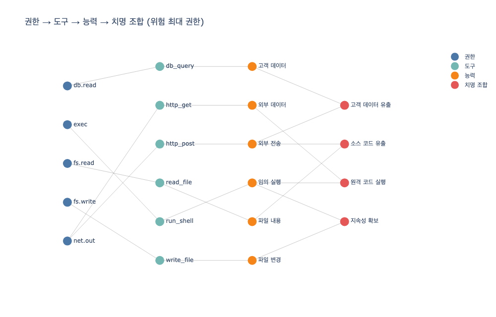

# `ex1_permission_graph.py`가 정의하는 치명 조합 네 가지

## 질문

`ex1_permission_graph.py`가 정의하는 치명 조합 네 가지는 무엇인가?

## 답

1. **고객 데이터 + 외부 전송 → 고객 데이터 유출** (등급: 심각)
2. **파일 내용 + 외부 전송 → 소스 코드 유출** (등급: 심각)
3. **임의 실행 + 외부 데이터 → 원격 코드 실행** (등급: 치명)
4. **파일 변경 + 임의 실행 → 지속성 확보** (등급: 치명)

코드에서는 `COMBOS` 리스트로 정의된다.

```python
COMBOS = [
    ({"고객 데이터", "외부 전송"}, "고객 데이터 유출", "심각"),
    ({"파일 내용", "외부 전송"},   "소스 코드 유출", "심각"),
    ({"임의 실행", "외부 데이터"}, "원격 코드 실행", "치명"),
    ({"파일 변경", "임의 실행"},   "지속성 확보",   "치명"),
]
```

## 배경 설명

### 권한은 «목록»이 아니라 «경로»다

이 예제의 핵심 주장은 "권한은 목록이 아니라 도달 가능한 경로"라는 것이다. 도구 하나하나는 대개 무해하다. 문제는 무해한 권한 여러 개가 «이어붙었을» 때 생긴다.

예제는 세 단계로 이 경로를 모델링한다.

- **도구(TOOLS)**: 각 도구는 «필요한 권한」과 그 도구가 «만들어 내는 능력」을 가진다. 예를 들어 `db_query`는 `db.read` 권한을 필요로 하고 «고객 데이터」 능력을 만든다. `http_post`는 `net.out` 권한으로 «외부 전송」 능력을 만든다.
- **권한(GRANTED)**: 에이전트에게 준 권한 집합. 예제 기본값은 `{"fs.read", "net.out", "db.read"}` — 목록만 보면 "읽기 + 네트워크 + DB 조회"라서 무해해 보인다.
- **능력의 합집합**: 쓸 수 있는 도구들이 만들어 내는 능력을 모두 합친 것.

### 치명 조합이 «능력의 조합»으로 정의되는 이유

`COMBOS`의 각 항목은 도구가 아니라 «능력의 집합」으로 정의된다. 그래서 서로 다른 도구가 같은 능력을 만들어도 조합이 성립한다. 예컨대 «외부 전송」 능력은 `http_post`(네트워크)로도 `send_mail`(메일)로도 만들 수 있다 — 나가는 문이 하나만이 아니라는 뜻이다.

기본 권한 `{fs.read, net.out, db.read}`만으로도 이미 두 개의 위험 경로가 열린다.

- `db_query`(고객 데이터) + `http_post`(외부 전송) → **고객 데이터 유출**
- `read_file`(파일 내용) + `http_post`(외부 전송) → **소스 코드 유출**

각 도구는 안전한데 «이어붙이면» 유출 경로가 된다. 권한을 목록으로만 관리하면 이 이어붙임이 보이지 않는다.

### 권한 하나를 빼면 위험 경로가 사라진다

`net.out` 하나를 빼면 도구는 4개에서 2개로 «조금」 줄지만, 위험 경로는 2개에서 0개로 «전부」 사라진다. `net.out`이 «외부 전송」과 «외부 데이터」를 동시에 여는 «나가는 문」이기 때문이다.

한 장 요약에 따르면 이런 «나가는 문」은 대개 셋이다.

- **나가는 네트워크**(`net.out`)
- **임의 실행**(`exec`)
- **쓰기**(`fs.write`)

가드레일을 설계할 때는 도구를 하나씩 재는 것보다 «어느 권한이 문인가」를 찾는 편이 훨씬 크게 듣는다.

### 최소 권한의 진짜 의미

이 장은 최소 권한을 "자기 일에 필요한 것만"이 아니라 **"어떤 하나도 치명 조합을 갖지 않게"**로 다시 정의한다. 언젠가 뚫린다고 가정하고 폭발 반경(blast radius)을 재라는 뜻이다. 네 가지 치명 조합이 모두 도달 가능해지려면 세 개의 나가는 문(`net.out`, `exec`, `fs.write`)이 함께 있어야 하는데, 그런 권한 배치는 최소 권한 원칙 위반이다.

## 시각화



위 그래프는 «위험 최대」 권한(`fs.read, fs.write, exec, net.out, db.read`)에서 «권한 → 도구 → 능력 → 치명 조합」으로 이어지는 도달 경로를 계층으로 그린 것이다. 빨강 노드(치명 조합) 각각이 두 개의 능력(주황)에서 이어져 들어오는 모습으로, 위험이 단일 도구가 아니라 능력의 «조합」에서 생김을 확인할 수 있다.
