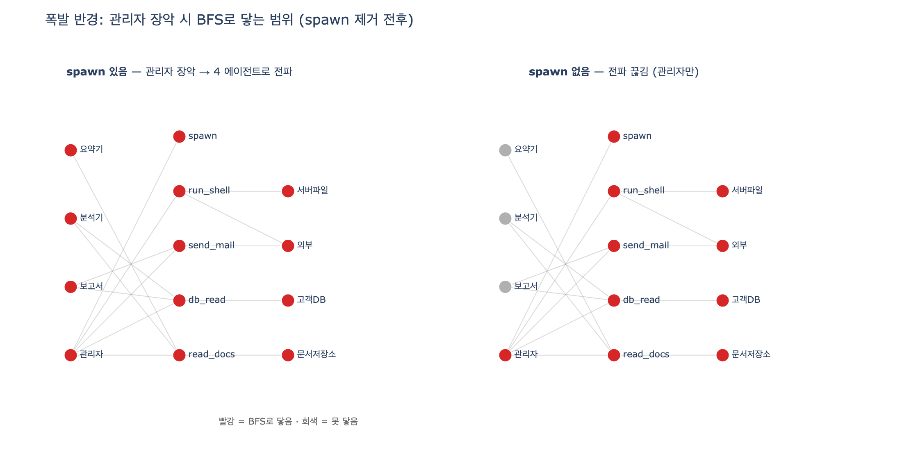

# `ex4_blast_radius.py`의 폭발 반경 계산

## 질문

`ex4_blast_radius.py`에서 폭발 반경은 어떻게 계산하는가?

## 한 줄 답

장악된 에이전트에서 시작해 **쓸 수 있는 도구가 닿는 자원**을 모으고, **spawn 권한이 있으면 다른 에이전트로 갈아타며 BFS로 확장**한다.

---

## 폭발 반경(blast radius)이란

"폭발 반경"은 SRE 용어로, **하나가 뚫렸을 때 그 피해가 번지는 범위**를 뜻한다. 26장의 관점은 이렇다.

> 언젠가 뚫린다고 가정하고 폭발 반경을 재라. 최소 권한은 「자기 일에 필요한 것만」이 아니라 「어떤 하나도 치명 조합을 갖지 않게」다.

즉 "이 에이전트는 안전한가"가 아니라 **"이 에이전트가 장악되면 어디까지 번지는가"**를 계산하는 것이 핵심이다.

## 그래프 모델 — 3계층

예제는 세 층으로 된 방향 그래프를 놓는다.

```
에이전트  ──(쓸 수 있는 도구)──▶  도구  ──(닿는)──▶  자원
```

| 층 | 코드 변수 | 내용 |
|---|---|---|
| 에이전트 → 도구 | `AGENTS` | `요약기→[read_docs]`, `분석기→[read_docs, db_read]`, `보고서→[db_read, send_mail]`, `관리자→[read_docs, db_read, send_mail, run_shell, spawn]` |
| 도구 → 자원 | `TOOLS` | `read_docs→[문서저장소]`, `db_read→[고객DB]`, `send_mail→[외부]`, `run_shell→[서버파일, 외부]`, `spawn→[]` |
| 자원 가치 | `VALUE` | `문서저장소:1, 고객DB:5, 외부:4, 서버파일:5` |

특별한 도구가 하나 있다. **`spawn`** 은 닿는 자원이 없지만(`[]`), 대신 **다른 에이전트를 만들어(=갈아타) 그 에이전트의 권한을 이어받게** 한다. `SPAWNABLE` 리스트가 spawn으로 도달 가능한 에이전트 목록이다.

## BFS로 반경 계산하기

핵심 함수는 `radius(start, allow_spawn=True)`이다.

```python
def radius(start, allow_spawn=True):
    seen_agents, resources = set(), set()
    q = deque([start])
    while q:
        a = q.popleft()
        if a in seen_agents:
            continue
        seen_agents.add(a)
        for t in AGENTS[a]:
            resources |= set(TOOLS[t])          # ① 도구가 닿는 자원을 모은다
            if t == "spawn" and allow_spawn:     # ② spawn이면 다른 에이전트를 큐에 넣는다
                q.extend(SPAWNABLE)
    return seen_agents, resources
```

BFS(너비 우선 탐색)의 표준 골격이다.

1. **시작 노드**: 장악됐다고 가정한 에이전트를 큐에 넣는다.
2. **큐에서 하나 꺼내** 이미 방문했으면 건너뛴다(`seen_agents`가 방문 집합이자 무한 루프 방지).
3. **그 에이전트가 쓸 수 있는 도구를 순회**하며, 도구가 닿는 자원을 `resources` 집합에 합친다(`|=`).
4. 도구가 `spawn`이고 `allow_spawn`이 참이면, `SPAWNABLE`의 모든 에이전트를 **큐에 추가**한다 → 다음 라운드에서 그 에이전트들의 도구·자원까지 빨려 들어온다.
5. 큐가 빌 때까지 반복. 최종적으로 **닿은 에이전트 집합**과 **닿은 자원 집합**을 돌려준다.

**피해 점수**는 닿은 자원들의 `VALUE`를 합해서 낸다: `score = sum(VALUE[r] for r in res)`.

## 계산 결과 읽기

첫 표(spawn 있음):

| 장악된 에이전트 | 닿는 에이전트 | 닿는 자원 | 피해 점수 |
|---|---|---|---|
| 요약기 | 1 | 문서저장소 | 1 |
| 분석기 | 1 | 고객DB, 문서저장소 | 6 |
| 보고서 | 1 | 고객DB, 외부 | 9 |
| 관리자 | 4 | 고객DB, 문서저장소, 서버파일, 외부 | 15 |

- **요약기**: 점수 1. 뚫려도 문서저장소까지만. 이것이 "목표 모양"이다.
- **관리자**: 점수 15에 닿는 에이전트 4개. spawn을 가졌기 때문에 BFS가 다른 세 에이전트로 전파되어 반경이 최대가 된다.

## spawn을 빼면 — "전파"가 사라진다

`AGENTS["관리자"].remove("spawn")` 후 다시 계산하면 자원 점수 표는 거의 그대로다(관리자만 spawn을 가졌으므로 다른 에이전트엔 원래 영향 없음). 그러나 **관리자가 닿는 에이전트가 4 → 1**로 줄어든다. `radius`에서 `q.extend(SPAWNABLE)`가 실행되지 않아 BFS가 다른 에이전트로 번지지 못하기 때문이다. 즉 spawn 제거는 **자원 반경이 아니라 "전파(횡적 이동, lateral movement)"를 끊는다.**

## 진짜 교훈

- spawn을 빼도 관리자 자신의 자원 점수(15)는 그대로다. **진짜 대응은 spawn 제거가 아니라 "관리자를 쪼개는 것"**이다.
- 한 에이전트가 read + db + shell + mail을 다 쥐면, 그 하나가 뚫릴 때 전부 나간다.
- 최소 권한은 "각 에이전트가 자기 일에 필요한 것만"이 아니라 **"어떤 하나도 치명 조합을 갖지 않게"**다.
- 에이전트를 나누는 이유는 성능만이 아니라 **폭발 반경을 줄이기 위함**이다.

## 시각화

`expy.png`는 에이전트-도구-자원 그래프에서 "관리자" 장악 시 BFS로 번지는 반경을 spawn 제거 전후로 나란히 보여 준다.


