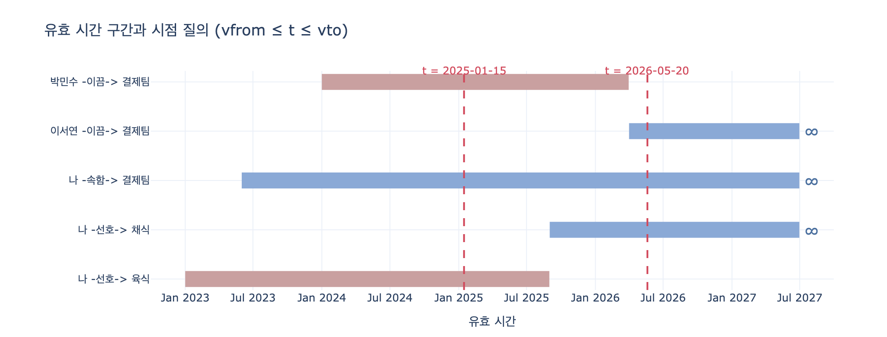

# 시점 질의는 어떤 조건으로 표현되는가?

## 답

```cypher
MATCH (a:N)-[e:R]->(b:N)
WHERE e.vfrom <= $t AND e.vto >= $t
RETURN a.name, e.kind, b.name
```

조건 자체는 부등식 두 개다. **`e.vfrom <= t AND e.vto >= t`**.
그리고 아직 끝나지 않은 사실의 `vto` 는 `NULL` 이 아니라 **`9999-12-31`** 로 채운다.

---

## 왜 시각이 필요한가

「박민수가 결제팀을 이끈다」는 영원한 사실이 아니다. 2024년에는 참이고 2026년에는 거짓이다.
에이전트의 기억을 시간 칸 없이 쌓으면 이런 일이 생긴다.

```
  나 -선호-> 육식
  나 -선호-> 채식        ← 모순
  나 -속함-> 결제팀
  박민수 -이끔-> 결제팀
  이서연 -이끔-> 결제팀   ← 모순
```

그래프가 틀린 게 아니다. **질의가 시간 칸을 안 봤을 뿐**이다.
그래서 관계(엣지)마다 **유효 시간(valid time)** 구간 `[vfrom, vto]` 를 붙인다.
15장의 이시간(bitemporal) 모델을 기억에 그대로 적용한 것이고, `recorded`(기록 시각)를
따로 두면 「언제 알았나」와 「언제 참이었나」를 분리할 수 있다.

시점 `t` 를 넣으면 답이 갈린다.

| 질의 시점 | 결과 |
|---|---|
| `2025-01-15` | 나-선호→육식, 나-속함→결제팀, **박민수**-이끔→결제팀 |
| `2026-05-20` | 나-선호→채식, 나-속함→결제팀, **이서연**-이끔→결제팀 |

같은 그래프인데 답이 다르다. **그게 맞는 것이다.**

---

## 조건을 뜯어보기

### 1. 왜 `<=` 와 `>=` 인가 (닫힌 구간)

`vfrom <= t <= vto` 는 **양끝을 포함하는 닫힌 구간**이다.
`vto` 에 적힌 날짜는 「그날까지 참」이라는 뜻이다.
그래서 새 사실을 넣으며 옛 사실을 닫을 때, `vto` 를 새 사실의 `vfrom` **하루 전**으로 적어야
구간이 겹치지 않는다. 예제의 `2026-03-31` / `2026-04-01` 짝이 정확히 그 모양이다.

### 2. 왜 `9999-12-31` 인가 (sentinel)

「지금도 참인 사실」의 끝은 아직 모른다. 자연스러운 표현은 `NULL` 이지만,
SQL/Cypher 의 3값 논리에서

```
NULL >= '2026-05-20'   ->   NULL   ->   WHERE 가 버림
```

이 되어 **지금 참인 사실이 통째로 사라진다**. 실제로 실험해 보면 결과가 빈 리스트다.

```
sentinel 사용 : [('나','선호','채식'), ('나','속함','결제팀'), ('이서연','이끔','결제팀')]
NULL 방치     : []
```

`NULL` 을 그대로 쓰려면 조건을 이렇게 늘려야 한다.

```cypher
WHERE e.vfrom <= $t AND (e.vto IS NULL OR e.vto >= $t)
```

분기가 붙고, 조건이 길어지고, 인덱스도 잘 안 탄다.
대신 **먼 미래의 상수(sentinel, 파수꾼 값)** 로 열린 구간을 미리 닫아 두면
분기 없이 부등식 하나로 끝난다. `9999-12-31` 은 「사실상 무한대」로 쓰는 관습적 값이다.

### 3. 왜 문자열 날짜로 부등식이 되는가

예제의 `vfrom`/`vto` 는 `STRING` 칼럼이다. 그래도 맞는 이유는
**ISO-8601(`YYYY-MM-DD`)이 사전순 비교 = 시간순 비교**이기 때문이다.
자리수가 고정이고 큰 단위가 앞에 오므로 `'2024-01-01' < '2026-03-31'` 이 그대로 성립한다.
`9999-12-31` 이 「가장 큰 문자열 날짜」로 동작하는 것도 같은 이유다.

---

## 삭제가 아니라 「닫기」

핵심 원칙은 한 줄이다.

> 오래된 것을 **지우는** 게 아니라 **끝나는 시각을 적는다.**

지우면 과거를 못 묻는다. 「2025년 3월에 팀장이 누구였지」는 정당한 질문이다.
그래서 새 사실이 들어오면 옛 사실의 `vto` 만 채우고, 옛 행은 그대로 남긴다.

```cypher
// 새 팀장이 들어올 때, 열려 있던 옛 사실을 닫는다
MATCH (a:N)-[e:R {kind:'이끔'}]->(b:N {name:'결제팀'})
WHERE e.vto = '9999-12-31'
SET e.vto = $day_before
```

닫을 대상을 고르려면 **단일 값(single-valued) 관계 목록**이 필요하다.
「이끔」이나 「선호(주식 취향)」처럼 동시에 하나만 참일 수 있는 관계를 코드에 적어 둔다.
반대로 「속함」처럼 여러 개가 동시에 참일 수 있는 관계는 닫지 않는다.
이 목록 하나면 되고, 그 이상의 장치는 필요 없다.

닫기가 제대로 동작했는지는 **과거 시점 질의로 확인**한다.
새 팀장이 들어온 뒤에도 `t = 2026-06-15` 로 물으면 이전 팀장이 그대로 나와야 한다.

---

## 에이전트 기억에서 왜 중요한가

사용자가 "팀장님께 보고서 보내 줘"라고 하면 `t = today` 의 팀장에게 보내야 한다.
그런데 2024년 대화 기록을 **요약해서** 컨텍스트에 넣으면 박민수가 팀장으로 남아 있다.
**요약은 시간 칸을 갖고 다니지 않기 때문**이다(24장).

그리고 모순된 기억을 함께 받은 모델은 「최근 것」이 아니라 **「자주 나온 것」** 을 고른다.
박민수가 2년간 팀장이었고 이서연이 두 달이면, 박민수가 이긴다.
시점 질의는 애초에 모순을 컨텍스트에 넣지 않게 만든다 — 그게 이 조건의 값어치다.

| 항목 | 값 |
|---|---|
| 시점 질의 조건 | `e.vfrom <= t AND e.vto >= t` |
| 열린 사실의 `vto` | `9999-12-31` (sentinel, `NULL` 아님) |
| 사실이 끝날 때 | 삭제가 아니라 `vto` 를 채워 **닫는다** |
| 닫는 시점 | 새 사실 `vfrom` 의 **하루 전** |
| 닫을 대상 | 단일 값 관계 목록(`이끔`, `선호` …)의 열린 사실 |
| 날짜 형식 | ISO-8601 문자열 (사전순 = 시간순) |

관련 출처: [valid time (ISO/IEC 9075-2, SQL:2011 temporal)](https://www.iso.org/standard/76583.html),
[temporal knowledge graph](https://arxiv.org/abs/2501.13956)

## 시각화



가로축이 시간, 막대 하나가 사실 하나의 `[vfrom, vto]` 구간이다.
파란 막대는 `vto = 9999-12-31` 인 열린 사실(∞ 표시), 붉은 막대는 이미 닫힌 사실이다.
빨간 세로 점선이 질의 시점 `t` 이고, **점선이 가로지르는 막대들이 곧 질의 결과**다.
`t = 2025-01-15` 에서는 박민수 막대를, `t = 2026-05-20` 에서는 이서연 막대를 지나간다.
