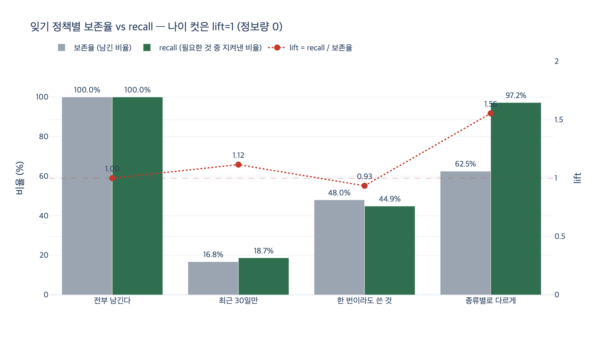

# 「최근 30일만」 정책의 결과는 무엇인가?

> **답**: 83%를 버리면서 필요한 것의 81%도 같이 버린다. 나이는 중요도와 별 관계가 없기 때문이다.

---

## 1. 어디서 나온 숫자인가

27.5절 「무엇을 잊을 것인가」의 예제 `ex5_forgetting.py`가 만든 표다.
기억 400개(`N = 400`)를 지어 놓고, 각 기억에 네 칸을 붙인다.

| 칸 | 뜻 |
|---|---|
| `age` | 며칠 된 기억인가. 0~180일 사이 균등 난수 |
| `used` | 지금까지 몇 번 참조됐나 |
| `kind` | 일회성 / 선호 / 관계 / 제약 |
| `needed` | **나중에 실제로 필요해지는가** |

여기서 `needed`가 어떻게 정해지는지가 이 예제의 전부다.

```python
need_p = {"일회성": 0.03, "선호": 0.55, "관계": 0.62, "제약": 0.88}[kind]
out.append({"id": i, "age": age, "used": used, "kind": kind,
            "needed": rng.random() < need_p})
```

**필요 여부는 `kind`로만 결정된다. `age`는 쳐다보지도 않는다.**
이게 시뮬레이션의 인위적 설정처럼 보이지만, 실제 대화 기억이 딱 이렇다.
「이 API는 부르면 안 된다」는 제약은 3개월 전에 들었다고 해서 덜 중요해지지 않는다.

## 2. 세 정책과 실제 수치

```python
def keep_recent(m, days=30):        # 정책 A
    return [x for x in m if x["age"] <= days]

def keep_used(m, k=1):              # 정책 B
    return [x for x in m if x["used"] >= k]

def keep_typed(m, days=30):         # 정책 C
    keep_days = {"일회성": 7, "선호": 365, "관계": 365, "제약": 3650}
    return [x for x in m if x["age"] <= keep_days[x["kind"]] or x["used"] >= 2]
```

시드 17로 돌린 결과. 기억 400개 중 나중에 필요해지는 것은 **107개**다.

| 정책 | 남긴 수 | 보존율 | 지켜낸 필요분 | **recall** | 버린 비율 | **필요한 것을 버린 비율** |
|---|---|---|---|---|---|---|
| 전부 남긴다 | 400 | 100% | 107 | 100% | 0% | 0% |
| **최근 30일만** | **67** | **16.8%** | **20** | **18.7%** | **83.2%** | **81.3%** |
| 한 번이라도 쓴 것 | 192 | 48.0% | 48 | 44.9% | 52.0% | 55.1% |
| 종류별로 다르게 | 250 | 62.5% | 104 | **97.2%** | 37.5% | **2.8%** |

카드의 답 「83%를 버리면서 필요한 것의 81%도 같이 버린다」가 이 줄이다.
83.2% 버렸는데 필요한 것도 81.3% 잃었다. **두 숫자가 거의 같다는 게 핵심이다.**

## 3. 왜 두 숫자가 같아지는가 — 확률로

정책을 「기억을 남길지 정하는 사건 $K$」로 보면, 우리가 재는 두 수는 이렇다.

$$\text{보존율} = P(K), \qquad \text{recall} = P(K \mid \text{needed})$$

베이즈로 뒤집으면 둘의 비율은

$$\text{lift} \;=\; \frac{\text{recall}}{\text{보존율}} \;=\; \frac{P(K \mid \text{needed})}{P(K)} \;=\; \frac{P(\text{needed} \mid K)}{P(\text{needed})}$$

이 lift가 정책이 가진 **정보량**이다. lift가 1이면, 남긴 무리 안의 필요분 비율이 전체와 똑같다는 뜻이다.
즉 정책이 중요도에 대해 아무것도 모른 채 무작위로 뽑은 것과 구별되지 않는다.

### 「최근 30일만」의 경우

컷 조건은 $K = \{\text{age} \le 30\}$이고, 설계상 $\text{age} \perp \text{needed}$다. 따라서

$$P(K \mid \text{needed}) = P(K) \;\Longrightarrow\; \text{lift} = 1 \;\Longrightarrow\; \text{recall} = \text{보존율}$$

이론 보존율은

$$P(\text{age} \le 30) = \frac{31}{181} \approx 17.1\%$$

**83%를 버리는 순간, 필요한 것도 정확히 83%를 버리도록 확률이 이미 정해져 있다.**
실측 16.8% / 18.7%는 표본 400개짜리에서 이 17.1% 주변으로 흔들린 값이다.
시드를 200개 돌려 평균을 내면 lift는 **1.020**, 정확히 1이다.

> 나이 컷은 「고르는 일」을 전혀 하지 않는다. 그냥 균등 표본 추출이다.

## 4. 나이로 자르면 종류를 안 가린다

같은 시드에서 정책 A(최근 30일)와 정책 C(종류별)가 종류별로 무엇을 죽였는지 비교하면.

| 종류 | 전체 | 필요 | A가 남김 | A가 지킨 필요 | **A recall** | C가 남김 | C가 지킨 필요 | **C recall** |
|---|---|---|---|---|---|---|---|---|
| 일회성 | 226 | 5 | 38 | 2 | 40% | 76 | 2 | 40% |
| 선호 | 71 | 36 | 7 | 5 | 14% | 71 | 36 | **100%** |
| 관계 | 71 | 39 | 16 | 8 | 21% | 71 | 39 | **100%** |
| 제약 | 32 | 27 | 6 | 5 | 19% | 32 | 27 | **100%** |

나이 컷은 종류를 안 보므로, **제일 비싼 제약도 똑같이 학살한다.**
제약 32개 중 26개가 나이 때문에 사라졌고, 필요했던 제약 27개 중 22개를 잃었다.

반면 종류별 정책은 선호·관계·제약을 **하나도 안 버린다**.
정작 버리는 건 일회성 226개 중 150개이고, 그러면서 잃는 필요한 것은 3개뿐이다.

> 덜 버려서 이긴 게 아니다. **버릴 것을 골라서** 이겼다.
> 「종류별로 다르게」는 「한 번이라도 쓴 것」보다 더 많이 남기는데(62.5% vs 48.0%) recall은 두 배가 넘는다.

## 5. 덤 — 「한 번이라도 쓴 것」도 사실은 정보량 0이다

책 본문은 「낫지만 여전히 55%를 잃는다」고 쓴다. 왜 「나은데도」 절반 넘게 잃는가.

`ex5`에서 `used`도 `kind`·`needed`와 **독립으로** 뽑히기 때문이다.

```python
used = rng.choices([0, 1, 2, 5, 20], [50, 25, 15, 8, 2])[0]   # kind, needed 와 무관
```

그래서 이 정책의 lift도 200시드 평균 **0.998**, 역시 1이다.
「최근 30일만」보다 나아 보였던 건 고르기를 잘해서가 아니라 **그냥 덜 버려서**다
(48% 남김 vs 17% 남김). 정보량은 둘 다 0이고, 남긴 양만 달랐다.

이게 본문의 아픈 지적으로 이어진다.

> 「이 API는 부르면 안 된다」는 40번 대화 동안 한 번도 안 쓰이다가 41번째에 결정적으로 필요하다.

참조 횟수는 **과거에 쓰였는가**를 재지, **앞으로 필요한가**를 재지 않는다.
아직 한 번도 안 쓰인 제약이 제일 비싼데, 이 정책은 그걸 정확히 겨냥해 버린다.

## 6. 그래서 무엇을 해야 하나

lift가 1인 정책은 이름만 정책이지 랜덤 샘플링이다.
lift를 1 위로 올리려면 컷 기준이 **결과와 상관있는 축** 위에 놓여야 한다.
이 예제에서 그 축은 `kind`다.

| 종류 | 수명 | 근거 |
|---|---|---|
| 일회성 | 7일 | 「어제 그 파일 경로」는 일주일이면 쓸모없다 |
| 선호 · 관계 | 1년 | 사람은 잘 안 바뀐다 |
| 제약 | 사실상 영구 (3650일) | 지우면 사고가 난다 |

값은 **넣을 때 한 번 더 판단해야 한다**는 것이다.
다행히 그 판단은 규칙으로 상당 부분 된다.

- 「~하지 마」, 「~는 안 됩니다」, 「절대」 → **제약**
- 「좋아합니다」, 「싫어합니다」, 「선호」 → **선호**
- 「팀장」, 「소속」, 「담당」 → **관계**
- 나머지 → **일회성**

그리고 27.3절과 이어서 보면 완성된다. 잊기는 **지우는 것**이 아니라
유효 시각(`vto`)을 닫는 것이다. 오래된 사실을 지우면 「2025년 3월에 팀장이 누구였지」를 못 묻는다.
종류별 수명은 「무엇을 컨텍스트에 올릴 후보에서 뺄 것인가」의 기준이지,
「무엇을 물리적으로 삭제할 것인가」의 기준이 아니다.

## 7. 한 줄 정리

| 정책 | 보존율 | recall | lift | 뜻 |
|---|---|---|---|---|
| 최근 30일만 | 16.8% | 18.7% | 1.12 (평균 1.02) | **83% 버리면 필요한 것도 81% 버린다** |
| 한 번이라도 쓴 것 | 48.0% | 44.9% | 0.93 (평균 1.00) | 역시 정보량 0. 덜 버려서 덜 잃었을 뿐 |
| 종류별로 다르게 | 62.5% | **97.2%** | 1.56 | 더 많이 남기고 훨씬 더 잘 지킨다 |

**나이는 중요도의 대리 변수가 아니다.**
정렬 기준을 결과와 무관한 축에 놓으면, 아무리 정교하게 자르더라도 그건 그냥 랜덤 샘플링이다.
하나의 정책으로 다 다루면 어느 쪽이든 틀린다.

## 시각화

`expy.py`를 실행하면 세 정책의 보존율과 recall, 그리고 lift를 함께 그린다.
막대 두 개의 높이 차이가 곧 정책의 정보량이다.
「최근 30일만」과 「한 번이라도 쓴 것」은 두 막대가 붙어 있고(lift ≈ 1),
「종류별로 다르게」만 초록 막대가 회색 막대 위로 크게 솟는다.


