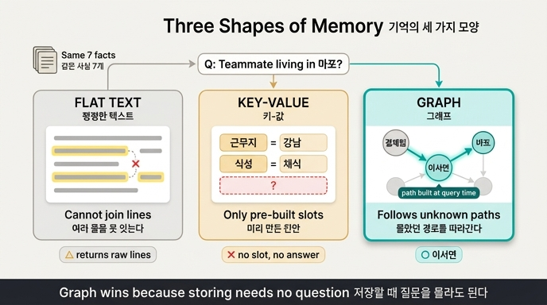

# 기억의 세 가지 모양은 각각 어떤 질문에 답할 수 있는가?

> **답**: 평평한 텍스트는 여러 줄을 못 잇고, 키-값은 미리 만든 칸에만 답하고, 그래프는 저장할 때 몰랐던 경로를 따라간다.

## 이 질문의 핵심

27.1절의 제목이 곧 답입니다. **「모양이 답할 수 있는 질문을 정한다」.**

에이전트에게 기억을 준다는 것은 「무엇을 저장할까」의 문제처럼 보이지만, 실제로는 **「어떤 모양으로 둘까」**의 문제입니다. 저장하는 내용이 완전히 같아도, 담는 모양에 따라 **답할 수 있는 질문의 종류가 달라지기** 때문입니다.

`ex1_memory_shapes.py`는 이걸 실험으로 보여줍니다. 똑같은 사실 7개를 세 가지 모양으로 저장하고, 세 종류 질문을 던집니다.

## 저장한 사실 7개

사용자가 지난 두 달 동안 대화에서 흘린 말들입니다.

```
1. 저는 서울 강남에서 일합니다
2. 회사는 결제팀이고 팀장은 박민수입니다
3. 박민수 팀장은 매운 음식을 못 먹습니다
4. 지난주에 팀 회식을 마포에서 했습니다
5. 저는 회식 때 채식만 합니다
6. 이서연 님이 새로 팀에 왔습니다
7. 이서연 님은 마포에 삽니다
```

## 세 가지 모양

### 모양 1 — 평평한 텍스트 (flat)

사실을 그냥 줄줄이 이어 붙여 두고, 질문에 나온 낱말로 찾습니다. (실제 시스템은 임베딩 유사도를 쓰지만, 예제에서는 무엇이 걸리고 무엇이 안 걸리는지 눈으로 보려고 낱말 매칭으로 단순화했습니다.)

```python
def flat_search(q):
    """모양 1 — 그냥 다 이어 붙인 텍스트에서 말로 찾기."""
    return [f for f in FACTS if any(t in f for t in TERMS.get(q, []))]
```

**할 수 있는 것**: 관련된 원문 줄을 건져 옵니다. 저장이 제일 싸고, 어떤 사실이든 그냥 넣으면 됩니다.

**못 하는 것**: **여러 줄을 못 잇습니다.** 검색기는 줄 단위로 점수를 매길 뿐, 「줄 2와 줄 7을 결합하면 답이 나온다」는 판단을 하지 않습니다. 결합은 전부 모델에게 떠넘겨집니다.

### 모양 2 — 키-값 (key-value)

미리 정한 칸(슬롯)에 값을 채워 둡니다. 프로필 저장소, 사용자 설정 테이블이 이 모양입니다.

```python
def keyed_search(q):
    """모양 2 — 키-값. 미리 정한 칸만 답할 수 있다."""
    kv = {"일하": ("근무지", "강남"), "식성": ("식성", "채식")}
    for key, (name, val) in kv.items():
        if key in q:
            return [f"{name}={val}"]
    return []
```

**할 수 있는 것**: 칸에 들어 있는 질문은 **정확하게, 한 줄로** 답합니다. 원문 다섯 줄을 던져 주는 게 아니라 `근무지=강남`을 줍니다.

**못 하는 것**: **미리 만든 칸 바깥은 아예 답이 없습니다.** 「마포에 사는 팀원」이라는 칸을 안 만들어 뒀으면 끝입니다. 그리고 그런 칸을 미리 다 만들어 둘 수는 없습니다. **질문은 무한하기 때문입니다.**

### 모양 3 — 그래프 (graph)

같은 사실을 노드와 엣지로 옮깁니다.

```python
NODES = [("나", "Person"), ("박민수", "Person"), ("이서연", "Person"),
         ("결제팀", "Team"), ("강남", "Place"), ("마포", "Place"),
         ("매운맛", "Pref"), ("채식", "Pref")]
EDGES = [("나", "결제팀", "속함"), ("박민수", "결제팀", "이끔"),
         ("이서연", "결제팀", "속함"), ("나", "강남", "일함"),
         ("이서연", "마포", "삶"), ("박민수", "매운맛", "못먹음"),
         ("나", "채식", "선호")]
```

**할 수 있는 것**: **이어진 것을 따라갑니다.** 저장할 때는 없던 경로를 질문이 들어온 뒤에 만들어 냅니다.

**못 하는 것**: 모호한 것을 못 담습니다(요약본 27.1). 그래서 「사용자가 말한 것은 그래프로, 내가 추론한 것은 원문으로」 두라는 지침이 따라붙습니다. 또 유사도 질문(「회식 장소 관련해서 뭐가 있었지」)에는 따라갈 엣지가 없어 그래프가 답할 수가 없습니다 — 그건 벡터의 일입니다(27.2).

## 세 질문을 던진 결과

| 질문 | 평평한 텍스트 | 키-값 | 그래프 |
|---|---|---|---|
| 내가 어디서 일하지? | △ 원문 몇 줄 | ○ `근무지=강남` | ○ `강남` |
| 회식 장소 정할 때 피할 것은? | △ 원문 줄 (「회식」 포함) | ✗ 칸 없음 | ○ `매운맛, 채식` |
| **우리 팀에서 마포에 사는 사람은?** | **△ 원문 5줄** | **✗ 칸 없음** | **○ `이서연`** |

**세 번째 질문이 갈림길입니다.**

### 평평한 텍스트가 지는 이유

`「팀」`과 `「마포」`가 둘 다 흔한 말이라 일곱 줄 중 다섯 줄이 걸립니다. 답이 그 안에 있긴 한데, **어느 줄을 어떻게 이을지는 모델이 해야 합니다.** 「팀에 속한 사람」(줄 6)과 「마포에 산다」(줄 7)를 이으려면 두 줄을 동시에 봐야 합니다.

일곱 줄일 때는 다섯 줄 다 줘도 됩니다. **그런데 7,000줄이면 못 줍니다.** 그때 상위 다섯 줄에 그 둘이 **같이** 들어올 보장이 없습니다. 각각은 상위권일 수 있어도, 「둘이 함께여야 답이 된다」는 걸 검색기는 모릅니다.

### 키-값이 지는 이유

「마포에 사는 팀원」이라는 칸을 안 만들어 뒀습니다. 그래서 답이 **없습니다.** 여기서 나오는 반론 — 「그럼 칸을 더 만들면 되지」 — 이 곧 이 모양의 한계입니다. 사람 × 장소 × 관계의 모든 조합에 칸을 미리 파 둘 수는 없습니다.

### 그래프가 이기는 이유

```cypher
MATCH (t:N {name:'결제팀'})<-[:R]-(p:N)-[e:R]->(pl:N {name:'마포'})
WHERE e.kind='삶' RETURN p.name
```

**팀 → 팀원 → 사는 곳**을 따라가면 됩니다. 두 조건(「팀에 속함」 AND 「마포에 삶」)을 **구조로** 동시에 만족시킵니다.

그리고 결정적으로, **이 경로는 저장할 때 몰랐던 것입니다.** 엣지 `(이서연, 결제팀, 속함)`과 `(이서연, 마포, 삶)`을 넣을 때 아무도 「마포 사는 팀원」을 묻겠다고 생각하지 않았습니다. 경로는 **질문이 들어온 뒤에** 만들어집니다.

## 한 문장으로

> **그래프를 기억으로 쓰는 이유는, 저장할 때 「질문을 몰라도 되기」 때문입니다.**

세 모양을 이 한 축으로 줄 세우면 이렇게 됩니다.

| 모양 | 질문을 언제 알아야 하나 | 대가 |
|---|---|---|
| 평평한 텍스트 | 몰라도 됨 (다 넣으니까) | 이을 책임이 전부 모델에게 |
| 키-값 | **저장할 때 알아야 함** (칸을 파야 하니까) | 칸 밖은 답 없음 |
| 그래프 | 몰라도 됨 (경로가 질의 시점에 생김) | 모호한 것 못 담음, 세우는 비용 |

## 자주 헷갈리는 지점

**「그럼 처음부터 그래프로 가면 되나?」** — 아닙니다. 27.4절이 명시적으로 반대합니다. 사실 1,000개쯤부터 그래프가 값을 합니다. 그 전에는 평평한 목록이 싸고, 옮기는 데는 이틀이면 됩니다. 그 이틀을 처음에 쓰면 대개 낭비입니다.

**「평평한 텍스트가 아예 못 찾는다는 뜻인가?」** — 아닙니다. 예제 출력에서 flat은 `△ 원문 5줄`입니다. **찾긴 찾습니다.** 못 하는 건 「잇는」 것이고, 그 실패는 사실 수가 늘어날 때만 드러납니다.

**「키-값이 제일 나쁜가?」** — 아닙니다. 칸 안의 질문에는 셋 중 가장 깨끗하게(`근무지=강남` 한 줄) 답합니다. 문제는 커버리지지 정확도가 아닙니다.

## 인포그래픽


