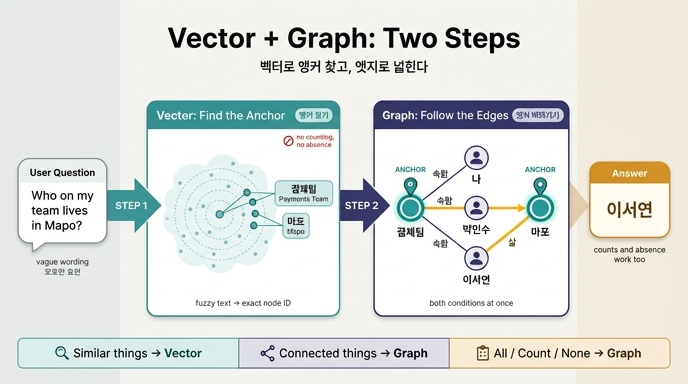

# 실무에서 벡터와 그래프를 결합하는 두 단계

**질문** — 실무에서 벡터와 그래프를 결합하는 두 단계는 무엇인가?

**답** — 질문에서 사람 이름이나 개념을 **벡터로 찾아 노드를 잡고**, 거기서 **엣지를 따라간다**.

---

## 한 줄로

> 벡터로 **시작점(앵커 노드)** 을 찾고, 그래프로 **넓힌다**.

27.2절(`ex2_graph_vs_vector.py`)의 마지막 문장이 그대로 이 카드의 답입니다.

```
실무에서는 대개 «벡터로 시작점을 찾고 그래프로 넓힌다».
질문에서 사람 이름이나 개념을 벡터로 찾아 노드를 잡고,
거기서 엣지를 따라간다. 두 단계다.
```

## 왜 두 단계인가 — 각자 못 하는 일이 있기 때문

이 결론은 "둘 중 하나를 고르라"의 반대편에서 나옵니다. 27.2절은 같은 기억에 세 종류 질문을 던져서, 어느 쪽도 혼자서는 안 된다는 것을 보입니다.

| 질문 종류 | 예 | 이기는 쪽 | 이유 |
|---|---|---|---|
| 비슷한 것 찾기 | "회식 장소 관련해서 뭐가 있었지" | **벡터** | 따라갈 엣지가 없다. 유사도 문제지 경로 문제가 아니다 |
| 이어진 것 (여러 홉) | "우리 팀에서 마포에 사는 사람" | **그래프** | 두 조건을 *동시에* 만족하는 것을 구조로 찾는다 |
| 전부 / 세기 / 없음 | "결제팀 사람이 몇 명이지" | **그래프** | 상위 k개를 주는 물건에는 «전부»가 없다 |

### 벡터가 못 하는 것

- **조건 결합을 못 한다.** "우리 팀에서 마포에 사는 사람"에 벡터는 1등으로 「이서연 님은 마포에 산다」를 줬지만, 2등이 「나는 강남에서 일한다」였습니다. 조건 두 개 중 하나만 맞춘 겁니다. 마포 사는 사람이 열 명이고 그중 우리 팀이 한 명이면 벡터는 못 고릅니다.
- **「전부」가 없다.** 팀원 셋 중 둘만 상위 3에 들어왔습니다. k를 늘리면 나오겠지만, *k를 얼마로 해야 다 나오나*를 미리 알 방법이 없습니다.
- **「없음」을 확인 못 한다.** 유사도가 낮아도 어쨌든 무언가는 돌려주니까, "마포에 사는 팀원이 없다"를 벡터로는 확정할 수 없습니다.

### 그래프가 못 하는 것

- **자연어의 애매한 표현을 못 받는다.** "회식 장소 관련해서 뭐가 있었지"에는 따라갈 엣지가 없습니다.
- **입구를 못 찾는다.** Cypher는 `MATCH (t:N {name:'결제팀'})`처럼 **노드 이름을 이미 알고 있어야** 시작합니다. 사용자가 "결제팀"이라고 정확히 안 쓰고 "우리 팀", "페이 조직"이라고 쓰면 그래프 혼자서는 어디서 출발할지 모릅니다.

**바로 이 빈틈이 두 단계를 만듭니다.** 그래프는 출발점을 못 찾고, 벡터는 출발점 다음을 못 갑니다.

## 두 단계를 구체적으로

### 1단계 — 벡터로 앵커 노드 잡기

질문 문자열을 임베딩해서, 노드 이름·별칭·설명 텍스트의 임베딩과 유사도 비교를 합니다. 상위 몇 개를 **앵커(시작점) 노드**로 채택합니다.

- "우리 팀에서 마포에 사는 사람" → 앵커: `결제팀`, `마포`
- 여기서 벡터가 하는 일은 **오직 표기 흔들림 흡수**입니다. "페이팀", "결제 조직", "payments" 모두 `결제팀` 노드로 붙입니다. 이게 27장 키워드 표의 **개체 해상도(entity resolution)** 가 하는 일입니다.
- 정확도가 100%일 필요는 없습니다. 후보 3~5개를 잡고 2단계에서 걸러도 됩니다.

### 2단계 — 그래프로 엣지 따라가기

앵커에서 출발해 Cypher로 순회합니다. 이 단계가 조건 결합·개수 세기·부재 확인을 담당합니다.

```cypher
MATCH (t:N {name:'결제팀'})<-[:R]-(p:N)-[e:R {kind:'삶'}]->(l:N {name:'마포'})
RETURN p.name
```

- 두 앵커(`결제팀`, `마포`)를 **하나의 패턴 안에서 동시에** 묶었습니다. 벡터가 못 하던 일입니다.
- 결과가 0행이면 그게 곧 "없다"는 답입니다. 벡터에는 없는 능력입니다.
- `count(p)`로 바꾸면 "전부 몇 명"이 정확히 나옵니다.

### 흐름 요약

```
질문 텍스트
   │
   ├─[1단계] 임베딩 → 유사도 → 앵커 노드 확정   (벡터: 애매한 말 → 정확한 ID)
   │                                              「우리 팀」→ 결제팀
   ▼
앵커 노드
   │
   ├─[2단계] 앵커에서 1~2홉 순회               (그래프: 정확한 ID → 이어진 사실)
   │                                              결제팀 ← 속함 ─ p ─ 삶 → 마포
   ▼
컨텍스트에 넣을 사실 10개쯤
```

## 이게 왜 「가장 싼 방법」인가

27.4절(`ex4_memory_cost.py`)과 이어집니다. 전부 컨텍스트에 넣으면 비용이 사실 수에 비례해 오릅니다(5,000개 = 하루 91,080원). 그래프는 **질문에 걸린 것만** 넣으니 10개쯤에서 고정입니다.

여기서 "걸린 것"을 고르는 장치가 바로 이 2단계 파이프라인입니다. 1단계가 없으면 순회를 시작할 수 없고, 2단계가 없으면 조건이 두 개 이상인 질문에서 엉뚱한 상위 k를 넣게 됩니다.

## 흔한 오해

- **"벡터를 그래프로 대체한다"가 아니다.** 27.2절 결론은 명시적으로 "하나를 고르라가 아니다"입니다.
- **"벡터로 답까지 찾는다"가 아니다.** 벡터는 **입구까지만** 합니다. 답은 엣지가 만듭니다.
- **"순서가 반대여도 된다"가 아니다.** 그래프 먼저 돌리려면 노드 이름을 이미 알아야 하니, 자연어 질문에서는 벡터가 먼저일 수밖에 없습니다.
- **한 번에 끝나야 하는 것도 아니다.** 실무에서는 2단계에서 얻은 이웃 노드로 다시 1단계를 도는 반복 구조도 씁니다. 다만 **골격은 「앵커 → 순회」 두 단계**입니다.

## 관련 개념 (27장 키워드 표)

| 키워드 | 상태 | 출처 |
|---|---|---|
| 하이브리드 검색 | 사실상 표준 | [Neo4j vector indexes](https://neo4j.com/docs/cypher-manual/current/indexes/semantic-indexes/vector-indexes/) |
| 개체 해상도 | 사실상 표준 | [OWL2 Individual Equality](https://www.w3.org/TR/owl2-syntax/#Individual_Equality) |
| 장기 기억 | 사실상 표준 | [LangGraph long-term memory](https://docs.langchain.com/oss/python/langgraph/memory) |

이 두 단계를 하나로 묶어 부르는 업계 용어가 **하이브리드 검색(hybrid retrieval)** 입니다. Neo4j 같은 그래프 DB가 벡터 인덱스를 내장하는 이유가 정확히 이것입니다 — 1단계와 2단계를 한 엔진 안에서 돌리려고.

## 관련 파일

- 원문: `/Users/swcho/projects/swcho/book-graph-engineering/fm/ch27 27장 - 에이전트에게 기억을 주는 가장 싼 방법/.fm/assets/ch27 27장 - 에이전트에게 기억을 주는 가장 싼 방법.md`
- 해당 예제: `content/ch27/code/ex2_graph_vs_vector.py`

## 인포그래픽


