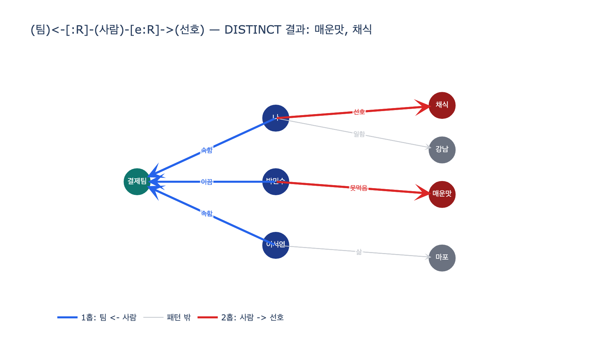

# `ex1`의 그래프 질의는 어떻게 팀원의 선호를 모으는가?

**답**: `(팀)<-[:R]-(사람)-[e:R]->(선호)` 2홉 패턴으로 팀에 속한 사람들의 `Pref` 노드를 `DISTINCT`로 모은다.

---

## 1. 어떤 질문에 답하려는 것인가

27장 `ex1_memory_shapes.py`는 같은 대화 기억을 **세 가지 모양**(평평한 텍스트 / 키-값 / 그래프)으로 저장해 두고 세 종류 질문을 던진다. 그중 두 번째 질문이 이 카드의 무대다.

> 「회식 장소를 정할 때 피해야 할 것은?」

이 질문에 답하려면 사실 하나로는 부족하다. *결제팀에 누가 있는지*(사실 A)와 *그 사람들이 무엇을 못 먹거나 선호하는지*(사실 B)를 **이어야** 한다. 저장된 사실들은 이렇다.

| 노드 | kind |
|---|---|
| 나, 박민수, 이서연 | `Person` |
| 결제팀 | `Team` |
| 강남, 마포 | `Place` |
| 매운맛, 채식 | `Pref` |

| 간선 | kind |
|---|---|
| 나 → 결제팀 | 속함 |
| 박민수 → 결제팀 | 이끔 |
| 이서연 → 결제팀 | 속함 |
| 나 → 강남 | 일함 |
| 이서연 → 마포 | 삶 |
| 박민수 → 매운맛 | 못먹음 |
| 나 → 채식 | 선호 |

「팀원 전체의 회피 항목」이라는 사실은 **어디에도 저장돼 있지 않다**. 질의가 그때그때 조립한다.

## 2. 질의 원문

```cypher
MATCH (t:N {name:'결제팀'})<-[:R]-(p:N)-[e:R]->(pref:N)
WHERE pref.kind='Pref'
RETURN DISTINCT pref.name
```

`ex1`의 `graph_search()` 안, `"피해야" in q` 분기에서 실행된다.

## 3. 조각별로 뜯어보기

### (1) 시작점 고정 — `(t:N {name:'결제팀'})`

패턴 순회의 **앵커**다. 결제팀 노드 하나에서 출발해 바깥으로 퍼진다. 그래프 질의는 전체 스캔이 아니라 「한 점에서 이어진 것을 따라가기」이므로, 시작점을 고정하는 것이 첫 단계다.

### (2) 1홉 — `<-[:R]-(p:N)` (화살표가 **왼쪽**)

간선은 *사람 → 팀* 방향으로 저장돼 있다(`나 -[속함]-> 결제팀`). 그래서 팀을 기준으로 보면 화살표가 **들어오는** 방향이라 `<-`를 쓴다. 방향을 `->`로 잘못 쓰면 결제팀에서 나가는 간선이 하나도 없으므로 결과가 **빈 집합**이 된다.

이 홉이 잡는 것: `나`, `박민수`, `이서연` (3명)

> **간선 kind를 안 걸었다는 점**에 주목. `속함`이든 `이끔`이든 상관없이 팀에 붙어 있으면 다 팀원으로 본다. 팀장 박민수를 놓치지 않으려면 이게 맞다.

### (3) 2홉 — `-[e:R]->(pref:N)` (화살표가 **오른쪽**)

방금 잡은 사람 `p`에서 **나가는** 간선을 전부 따라간다. 여기서도 간선 kind를 걸지 않는다. 그래서 `선호`(채식)와 `못먹음`(매운맛)이 **둘 다** 걸린다. 질문이 「피해야 할 것」이므로 「못 먹는 것」과 「이것만 먹는 것」 모두 회피 후보이기 때문이다.

### (4) 필터 — `WHERE pref.kind='Pref'`

2홉을 따라가면 `강남`(Place), `마포`(Place), `결제팀`(Team)까지 딸려 온다. `ex1`은 **노드 테이블을 `N` 하나, 관계 테이블을 `R` 하나만** 두고 종류는 `kind` **속성**으로 구분하는 설계라서, 라벨 대신 속성 필터로 `Pref`만 남긴다.

> 만약 `Person`, `Pref`, `Place`를 각각 별도 노드 테이블로 뒀다면 이 `WHERE`는 `(pref:Pref)` 라벨 매칭으로 대체됐을 것이다. 「단일 테이블 + kind 속성」은 스키마를 미리 못 정하는 대화 기억에 어울리는 선택이고(27.4 「스키마를 위에서 설계하지 말고 아래서 자라게」), 그 대가로 이런 속성 필터가 붙는다.

### (5) 중복 제거 — `RETURN DISTINCT pref.name`

그래프 질의는 **행이 아니라 경로 단위**로 결과를 낸다. 서로 다른 사람이 같은 `Pref` 노드를 가리키면 같은 이름이 여러 번 나온다.

예제 데이터로는 우연히 겹치는 사람이 없어 차이가 안 보이지만, 「이서연도 채식」과 「나도 매운맛 못 먹음」을 추가하면 바로 드러난다.

```
DISTINCT 없이: ['매운맛', '매운맛', '채식', '채식']   ← 경로 4개
DISTINCT 있이: ['매운맛', '채식']                    ← 집합 2개
```

「회식 때 피할 것」은 **집합**이지 세는 대상이 아니므로 `DISTINCT`로 접는다. 반대로 「몇 명이 이 선호를 갖는가」를 알고 싶으면 `DISTINCT`를 빼고 `count()`를 붙이면 된다. 같은 2홉 패턴이 다른 질문에도 재사용된다.

## 4. 실행 결과

```
원본 질의 결과: ['매운맛', '채식']

  결제팀 <- 나     -[선호]->   채식
  결제팀 <- 박민수 -[못먹음]-> 매운맛
  (이서연은 Pref 간선이 없어 걸리지 않음)
```

`ex1`의 기대값(`QUESTIONS`)이 `["매운맛", "채식"]`이므로 그래프만 이 질문에 `○`를 받는다.

## 5. 다른 두 모양은 왜 못 하나

| 모양 | 결과 | 이유 |
|---|---|---|
| 평평한 텍스트 | `△` 「회식」이 든 원문 2줄 | 「박민수 팀장은 매운 음식을 못 먹습니다」에는 **「회식」이라는 낱말이 없다**. 사람과 선호를 잇는 구조가 없어 낱말 겹침에만 의존한다. |
| 키-값 | `✗` 칸 없음 | 「팀원 전체의 회피 항목」이라는 칸을 미리 안 만들었다. 그리고 그런 칸을 전부 미리 만들어 둘 수는 없다. **질문은 무한하다.** |
| 그래프 | `○` 매운맛, 채식 | 팀 → 팀원 → 선호를 **따라가면** 된다. 이 경로는 저장할 때 존재하지 않았고, 질문이 들어온 뒤에 만들어졌다. |

## 6. 한 줄 요점

이 2홉 질의가 보여주는 것은 27장의 핵심 문장 그대로다.

> **그래프를 기억으로 쓰는 이유는 저장할 때 질문을 몰라도 되기 때문이다.**

「팀원의 선호를 모아라」는 요구는 사실을 적을 때 아무도 예상하지 않았다. 사람↔팀, 사람↔선호라는 **원자적 관계**만 정직하게 적어 두면, 그 둘을 잇는 경로는 질문 시점에 조립된다. 홉을 하나 더 늘리면(3홉) 「팀장이 이끄는 다른 팀의 선호」 같은 질문도 같은 데이터로 답할 수 있다.

## 시각화

파란 굵은 선이 1홉(팀 ← 사람), 빨간 굵은 선이 2홉(사람 → 선호), 회색이 패턴에 안 걸리는 간선이다. 회색 간선(`일함`, `삶`)은 `WHERE pref.kind='Pref'`에서 떨어진다.


