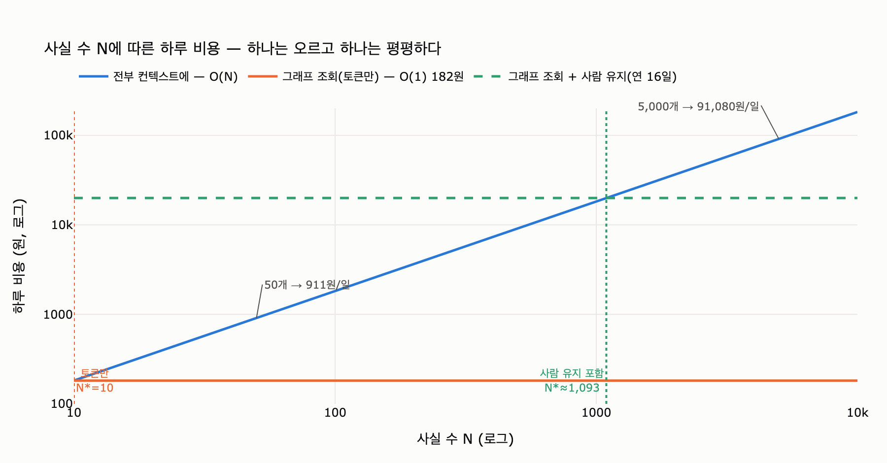

# 두 방식의 비용은 사실 수에 따라 어떻게 달라지는가

> **답**: 전부 컨텍스트에 넣으면 사실 수에 비례해 오르고, 그래프 조회는 몇 개가 있어도 걸리는 것이 10개쯤이라 오르지 않는다.

## 한 줄로 줄이면

$N$이 **한쪽 식에만 들어간다.** 그게 전부다.

$$C_\text{all}(N) = N \cdot t \cdot T \cdot p \cdot r \qquad\qquad C_\text{graph}(N) = k \cdot t \cdot T \cdot p \cdot r$$

| 기호 | 뜻 | 값 (`ex4_memory_cost.py` 기준) |
|---|---|---|
| $N$ | 쌓인 사실 수 | 50 ~ 5,000 |
| $t$ | 사실 하나의 토큰 수 | 22 tok |
| $T$ | 하루 대화 턴 수 | 200 turn |
| $p$ | 입력 토큰 단가 | \$3 / 1M tok |
| $r$ | 환율 | 1,380원 |
| $k$ | 그래프 조회가 실제로 걸어 오는 사실 수 | **10개 (고정)** |

「전부 컨텍스트에」는 **매 턴마다 사실 전부를** 프롬프트에 다시 붙인다. 그러니 $N$에 정비례한다 — $O(N)$.
「그래프 조회」는 질문이 들어온 뒤에 경로를 따라가서 **걸린 것만** 붙인다. 그래프에 5,000개가 있든 50,000개가 있든 한 질문에 걸려 오는 건 대개 열 개 안팎이다. 그래서 $N$이 식에서 아예 사라진다 — $O(1)$.

## 숫자로 보면

사실 하나를 하루 동안 컨텍스트에 상주시키는 값은

$$u = t \cdot T \cdot p \cdot r = 22 \times 200 \times \frac{3}{10^6} \times 1{,}380 = 18.216\ \text{원/일}$$

여기에 $N$을 곱하면 책의 표가 그대로 나온다.

| 사실 수 | 전부 넣기 (하루 토큰) | 전부 넣기 (하루 비용) | 그래프 조회 (하루 비용) | 배율 |
|---:|---:|---:|---:|---:|
| 50 | 220,000 | **911원** | 182원 | 5x |
| 200 | 880,000 | 3,643원 | 182원 | 20x |
| 1,000 | 4,400,000 | 18,216원 | 182원 | 100x |
| 5,000 | 22,000,000 | **91,080원** | 182원 | 500x |

사실을 50개 → 5,000개로 **100배** 늘리면 「전부 넣기」도 정확히 **100배** 오른다 (911 → 91,080). 「그래프 조회」는 **182원 그대로**다. 열 개만 걸어 오니까.

월로 환산하면 감이 더 온다. 5,000개짜리를 전부 넣으면 한 달 **273만 원**, 그래프로 조회하면 **5,465원**이다.

## 조회 「시간」도 안 오른다

비용뿐 아니라 지연도 평평하다. 책의 예제는 사실을 50 → 5,000개(100배)로 늘려도 조회가 **2~7ms 사이에서 논다**고 적는다. 게다가 규칙 없이 오르내려서 **5,000개짜리가 50개짜리보다 빠르게 나오기도 한다.**

이건 버그가 아니라 요점이다. 이 규모에서는 사실 수의 영향보다 **측정 잡음이 지배**한다는 뜻이고, 곧 조회 시간이 사실 수와 **무관**하다는 뜻이다. 색인이 일하고 있다.

## 그런데 손익 분기점은 「10개」가 아니다

$C_\text{all}(N) = C_\text{graph}$를 풀어 보면

$$N \cdot t \cdot T \cdot p \cdot r = k \cdot t \cdot T \cdot p \cdot r \quad\Longrightarrow\quad N^{*} = k = 10$$

**단가도, 턴 수도, 환율도 전부 약분되어 사라진다.** 남는 건 $k$ 하나다. 즉 토큰 값만 보면 사실이 열 개만 넘어도 그래프가 이론상 싸다. (책이 「사실 20개부터 그래프가 싸다」고 말하는 건 *2배는 싸야 갈아탈 값을 한다*는 여유를 둔 $N = 2k$다.)

그런데 실무 기준은 **1,000개**다. 왜 100배 차이가 나는가. 위 식에 **그래프를 세우고 유지하는 사람 값**이 빠져 있기 때문이다. 그걸 하루치 상수 $H$로 넣으면

$$N \cdot u = k \cdot u + H \quad\Longrightarrow\quad N^{*} = k + \frac{H}{u}$$

$u$가 「사실 하나의 하루 값」이므로 $H/u$는 **「사람 값이 사실 몇 개어치인가」**다. 개발자 하루 40만 원, 세팅 이틀(책: *옮기는 데 이틀이면 된다*)을 1년에 나눠 물고 유지 시간을 얹으면 이렇게 밀린다.

| 연간 유지 (사람일) | 하루 사람값 $H$ | $H/u$ (사실 몇 개어치) | 분기점 $N^{*}$ |
|---:|---:|---:|---:|
| 0 (세팅만) | 2,192원 | 120 | 130 |
| 6 | 8,767원 | 481 | 491 |
| **16** | **19,726원** | **1,083** | **1,093** |
| 48 | 54,795원 | 3,008 | 3,018 |

**유지 비용이 0이어도 분기점은 이미 10 → 130으로 밀린다.** 현실의 그래프는 스키마가 자라고, 개체 해상도가 어긋나고, 유효 시각(`vto`)을 닫아 줘야 하므로 손이 간다. **연 16일(월 1.3일)쯤 잡으면 분기점이 약 1,093개** — 책이 기준으로 쓰는 「사실 1,000개」가 정확히 이 대역이다.

정리하면 분기점이 두 개다.

| | 분기점 | 뜻 |
|---|---|---|
| 토큰만 | $N^{*} = k = 10$ | 이론상 여기서 이미 그래프가 싸다 |
| 토큰 + 사람 | $N^{*} = k + H/u \approx 1{,}000$ | 실무에서 실제로 갈아타는 지점 |

## 그래서 실무 결론

- **사실이 적으면 그냥 다 넣어라.** 50개면 하루 911원이다. 그걸 아끼려고 하루 19,726원짜리 사람 시간을 쓰는 건 손해다. 그래프를 세울 이유가 없다.
- **5,000개면 하루 91,080원, 한 달 273만 원이다.** 이때 그래프가 값을 한다.
- **처음부터 그래프로 가지 마라.** 평평한 목록으로 시작하고, 하루 비용이 눈에 띄면 그때 옮긴다. 옮기는 데 이틀이면 되고, **그 이틀을 처음에 쓰면 대개 낭비가 된다.** (아직 스키마가 뭔지도 모르는 상태에서 세운 그래프는 다시 세우게 된다 — 27.4절 「스키마는 위에서 설계하지 말고 아래서 자라게 하라」와 같은 얘기다.)

## 헷갈리기 쉬운 곳

- **「그래프가 항상 싸다」가 아니다.** 그래프는 상수 비용이 낮은 게 아니라 **기울기가 0**인 것이다. 사실이 적을 땐 낮은 상수의 평평한 목록이 이긴다.
- **$k$가 진짜 상수여야 성립한다.** 질의가 팬아웃해서 수백 개를 걸어 오면 $C_\text{graph}$도 같이 오른다. 상위 $k$개로 자르는 규율이 이 $O(1)$을 지탱한다.
- **「전부/세기/없음」 질문은 비용 얘기 이전의 문제다.** 벡터로 상위 $k$개를 주는 물건에는 「전부」가 없다(27.2절). 비용이 같아도 그래프가 필요한 질문이 따로 있다.

## 시각화

로그-로그 축에서 보면 형태가 분명하다. 「전부 넣기」는 기울기 1의 직선(비례), 「그래프 조회」는 완전한 수평선(상수)이다. 두 선이 토큰만 볼 때는 $N = 10$에서 만나고, 사람 유지 비용을 얹은 초록 점선은 위로 올라가서 만나는 지점이 $N \approx 1{,}093$으로 오른쪽으로 밀린다.
