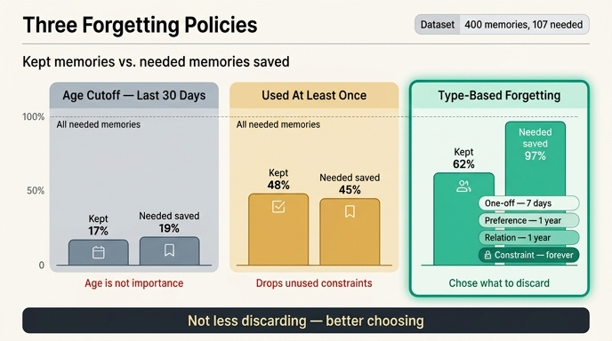

# '종류별로 다르게' 정책의 성과는 무엇인가?

**답**: 62%를 남기고 필요한 것의 97%를 지킨다. 덜 버려서 이긴 게 아니라 버릴 것을 골라서 이겼다.

---

## 1. 실험 설정 — `ex5_forgetting.py`

27장 5절(「무엇을 잊을 것인가」)의 예제는 같은 기억 더미에 세 가지 망각 정책을 적용하고, **「나중에 실제로 필요해진 기억」이 몇 개나 살아남는가**를 센다.

기억 400개를 만들 때 두 축이 붙는다.

| 축 | 값 |
|---|---|
| 나이(`age`) | 0~180일 균등 |
| 참조 횟수(`used`) | 0/1/2/5/20 (가중치 50:25:15:8:2) |
| 종류(`kind`) | 일회성 55%, 선호 20%, 관계 18%, 제약 7% |
| 나중에 필요해질 확률(`needed`) | 일회성 0.03, 선호 0.55, 관계 0.62, **제약 0.88** |

핵심은 마지막 줄이다. **「나중에 필요해질 확률」은 나이나 참조 횟수가 아니라 종류에 붙어 있다.** 이 설계가 곧 이 절의 주장이다.

세 정책의 구현은 이렇다.

```python
def keep_recent(m, days=30):
    return [x for x in m if x["age"] <= days]

def keep_used(m, k=1):
    return [x for x in m if x["used"] >= k]

def keep_typed(m, days=30):
    # 종류별로 다르게 잊는다
    keep_days = {"일회성": 7, "선호": 365, "관계": 365, "제약": 3650}
    return [x for x in m if x["age"] <= keep_days[x["kind"]] or x["used"] >= 2]
```

## 2. 세 정책의 성적표

실행 결과 (기억 400개, 그중 나중에 필요해지는 것 107개):

| 정책 | 남긴 수 | 남긴 비율 | 지켜낸 필요 기억 | **보존율** |
|---|---:|---:|---:|---:|
| 전부 남긴다 | 400 | 100% | 107 | 100% |
| 최근 30일만 | 67 | 17% | 20 | 19% |
| 한 번이라도 쓴 것 | 192 | 48% | 48 | 45% |
| **종류별로 다르게** | **250** | **62%** | **104** | **97%** |

### 「최근 30일만」 — 83%를 버리면서 필요한 것의 81%도 같이 버린다

나이는 중요도와 거의 상관이 없다. 그래서 남긴 비율(17%)과 보존율(19%)이 거의 같다. **아무 정보도 쓰지 않고 무작위로 자른 것과 다를 바 없다**는 뜻이다.

### 「한 번이라도 쓴 것」 — 낫지만 여전히 55%를 잃는다

참조 횟수는 신호이긴 하다. 하지만 이 정책은 **「아직 한 번도 안 쓴 제약」**을 버린다. 그게 제일 아픈 종류다.

> 「이 API는 부르면 안 된다」는 40번 대화 동안 한 번도 안 쓰이다가 41번째에 결정적으로 필요하다.

한 번도 안 쓰였다는 사실이 그 기억이 무가치하다는 증거가 아니다. **아직 그 상황이 안 왔을 뿐**이다.

### 「종류별로 다르게」 — 62% 남기고 97% 지킨다

「한 번이라도 쓴 것」(48% 남김)보다 **더 많이 남기는데 보존율은 두 배가 넘는다**(45% → 97%). 그러니 이 승리는 「덜 버려서」 얻은 게 아니다. 덜 버리는 걸로 이겼다면 보존율이 48%→62% 만큼만, 즉 비례해서 올랐어야 한다. 실제로는 두 배 넘게 뛰었다.

**버릴 것을 골라서 이긴 것이다.**

## 3. 왜 이기는가 — 종류별 내역

| 종류 | 전체 | 남김 | 필요한 것 | 그중 남김 |
|---|---:|---:|---:|---:|
| 일회성 | 226 | 76 | 5 | 2 |
| 선호 | 71 | 71 | 36 | 36 |
| 관계 | 71 | 71 | 39 | 39 |
| 제약 | 32 | 32 | 27 | 27 |

읽는 법은 이렇다.

- **일회성 226개 중 150개를 버렸다.** 정책이 실제로 일하는 곳이 여기다. 그런데 그러면서 잃은 「필요한 것」은 3개뿐이다(5개 중 2개 생존).
- **선호·관계·제약은 하나도 안 버렸다.** 보존 기간이 365일/3650일이라 180일짜리 데이터에서는 전부 살아남는다.

즉 이 정책은 **버리는 행위를 「거의 안 필요한 종류」 한 곳에 집중**시킨다. 삭제량의 거의 전부가 손실이 가장 싼 곳에서 나온다. 그게 62% 남기고 97% 지키는 산수의 정체다.

## 4. 종류마다 낡는 속도가 다르다

`keep_days`의 숫자는 임의가 아니라 각 종류의 반감기다.

| 종류 | 보존 | 근거 |
|---|---|---|
| 일회성 | 7일 | 「어제 그 파일 경로」는 일주일이면 쓸모없다 |
| 선호·관계 | 365일 | 사람은 잘 안 바뀐다 |
| 제약 | 3650일 (사실상 영구) | 지우면 사고가 난다 |

여기에 `or x["used"] >= 2` 라는 구제 조항이 붙는다. **두 번 이상 쓰인 일회성 기억은 나이와 무관하게 살린다.** 종류 판정이 틀렸을 때를 위한 안전망이다.

## 5. 이 방식의 값(cost)

공짜가 아니다. 이 표를 만들려면 **기억에 「종류」를 붙여야 한다.** 넣을 때 한 번 더 판단해야 한다는 뜻이고, 그게 이 방식이 요구하는 비용이다.

다행히 그 판단은 상당 부분 규칙으로 된다.

| 패턴 | 종류 |
|---|---|
| 「~하지 마」, 「~는 안 됩니다」, 「절대」 | 제약 |
| 「좋아합니다」, 「싫어합니다」, 「선호」 | 선호 |
| 「팀장」, 「소속」, 「담당」 | 관계 |
| 나머지 | 일회성 |

## 6. 한 줄로

> **무엇을 잊을지는 나이가 아니라 종류로 정한다.** 하나의 정책으로 다 다루면 어느 쪽이든 틀린다. 너무 많이 버리거나(최근 30일만), 버려야 할 것을 못 버린다.

관련 키워드: 망각 곡선 / decay policy ([arXiv:2310.08560](https://arxiv.org/abs/2310.08560))

## 인포그래픽


