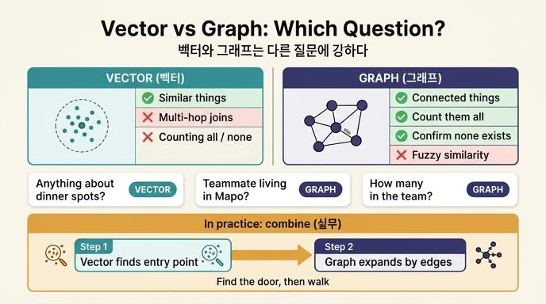

# 벡터와 그래프는 각각 어떤 질문에 강한가?

> **답**: 비슷한 것은 벡터, 이어진 것과 '전부'와 '없음'은 그래프다. 실무에서는 벡터로 시작점을 찾고 그래프로 넓힌다.

## 한 줄로

이 문제는 "무엇이 더 좋은 검색인가"가 아니라 **"질문의 종류가 무엇인가"** 입니다. 벡터는 *유사도* 문제를 풀고, 그래프는 *구조* 문제를 풉니다. 질문의 종류가 다르면 답할 수 있는 도구도 다릅니다.

## 세 종류의 질문 (27.2절 / `ex2_graph_vs_vector.py`)

같은 기억에 세 종류의 질문을 던져 보면 갈리는 지점이 보입니다.

| 질문 종류 | 예시 | 승자 | 이유 |
|---|---|---|---|
| 비슷한 것 찾기 | "회식 장소 관련해서 뭐가 있었지" | **벡터** | 따라갈 엣지가 없다. 유사도 문제지 경로 문제가 아니다 |
| 여러 홉 잇기 | "우리 팀에서 마포에 사는 사람" | **그래프** | 두 조건을 *동시에* 만족하는 것을 구조로 찾는다 |
| 전부 / 세기 / 없음 | "결제팀 사람이 몇 명이지" | **그래프** | 상위 k개를 주는 물건에는 '전부'가 없다 |

### 1. 비슷한 것 → 벡터

"회식 장소 관련"에는 **따라갈 엣지가 없습니다.** 그래프가 진 게 아니라 애초에 답할 수가 없습니다. 순회할 경로가 정의되지 않은 질문이기 때문입니다. 이런 질문은 오직 유사도로만 접근할 수 있습니다.

### 2. 이어진 것 → 그래프

여기가 가장 헷갈리는 지점입니다. 예제에서 "우리 팀에서 마포에 사는 사람"에 대해 벡터도 1등으로 「이서연 님은 마포에 산다」를 올렸습니다. 벡터가 이긴 것처럼 보입니다.

**아닙니다.** 벡터가 준 건 "마포에 사는 사람"이지 "우리 팀에서"가 아닙니다. 2등이 「나는 강남에서 일한다」인 게 그 증거입니다. 조건 두 개 중 하나만 맞춘 겁니다.

- 여기서는 마포에 사는 사람이 **한 명뿐이라** 우연히 답이 맞았습니다.
- 마포 사는 사람이 열 명이고 그중 우리 팀이 한 명이면 벡터는 못 고릅니다.

> 그래프는 «두 조건을 동시에 만족하는 것»을 구조로 찾는다.
> 벡터는 «두 조건과 비슷한 것»을 찾는다. 그게 다른 일이다.

### 3. '전부'와 '없음' → 그래프만

**전부 세기**: "결제팀 사람이 몇 명이지"에서 벡터 상위 3에 팀원 셋이 다 안 나왔습니다. 이서연과 박민수는 나왔는데 「나」가 안 나오고 3등이 엉뚱한 줄입니다. k를 늘리면 나오겠지만, **"k를 얼마로 해야 다 나오나"를 미리 알 방법이 없습니다.** 그게 벡터의 성질입니다. 상위 k개를 주는 물건에는 '전부'가 없습니다.

**없음 확인**: "마포에 사는 팀원이 없다"를 벡터로는 확인할 수 없습니다. **유사도가 낮은 것도 어쨌든 무언가는 돌려주기 때문입니다.** 벡터 검색은 빈 결과를 신뢰할 수 있게 주지 못합니다. 반면 그래프는 `MATCH`가 0행을 반환하면 그게 곧 "없음"의 증명입니다.

그래프는 `count(p)`로 정확히 셀 수 있고, 패턴이 안 걸리면 정확히 없다고 말할 수 있습니다.

## 실무의 답: 고르지 말고 이어 붙인다

> 그래서 결론은 «하나를 고르라»가 아니다.

```
비슷한 것            → 벡터
이어진 것            → 그래프
전부 / 세기 / 없음 확인 → 그래프
```

실무에서는 대개 **"벡터로 시작점을 찾고 그래프로 넓힙니다"**. 두 단계입니다.

```
질문
 │
 ├─[1단계] 벡터: 질문 속 사람 이름·개념을 임베딩으로 찾아 노드를 잡는다
 │            → 진입점(anchor node) 확보
 │
 └─[2단계] 그래프: 그 노드에서 엣지를 따라간다
              → 여러 홉 잇기, 전부 세기, 없음 확인
```

벡터가 **문을 찾고**, 그래프가 **안에서 걸어 다니는** 구조입니다. 이 조합이 27장 키워드 표의 **하이브리드 검색(hybrid retrieval)** 이고, Neo4j 같은 그래프 DB가 벡터 인덱스를 함께 제공하는 이유이기도 합니다.

## 왜 이게 에이전트 기억에서 중요한가

27장의 전체 논지는 "기억의 모양이 답할 수 있는 질문을 정한다"입니다. 벡터만으로 기억을 만들면 에이전트는 다음을 영원히 못 합니다.

- "내 제약 조건이 전부 뭐지" — **전부**를 못 준다
- "이 API를 쓰지 말라는 지시가 있었나" — **없음**을 확인 못 한다
- "우리 팀에서 X 조건인 사람" — **여러 조건의 교집합**을 구조로 못 찾는다

특히 '없음'을 확인 못 한다는 점이 위험합니다. 에이전트는 "관련 기억 없음"과 "비슷하지도 않은 아무 기억"을 구별하지 못한 채 행동하게 됩니다.

## 외우는 방식

세 단어로 잘라 두면 됩니다.

- **비슷** → 벡터
- **이어짐 / 전부 / 없음** → 그래프
- **순서** → 벡터로 시작점, 그래프로 넓히기

## 참고

- 원문 절: 27.2 「벡터와 그래프는 다른 질문에 강하다」
- 예제 코드: `content/ch27/code/ex2_graph_vs_vector.py`
- 하이브리드 검색 [사실상 표준]: https://neo4j.com/docs/cypher-manual/current/indexes/semantic-indexes/vector-indexes/

## 인포그래픽


