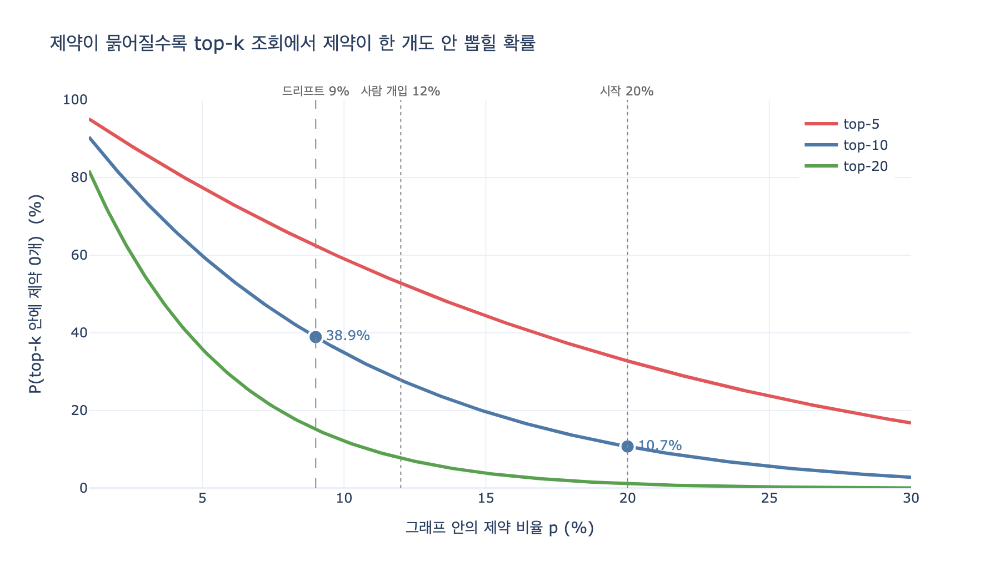

# 그래프 드리프트에서 제약은 어떻게 사라지는가?

> **Q.** 그래프 드리프트에서 제약은 어떻게 사라지는가?
>
> **A.** '지워져서'가 아니라 '묽어져서' 사라진다. 조회에서 상위 k개를 뽑으면 제약이 안 뽑히기 시작한다.

출처: 28장 「에이전트가 스스로 그래프를 넓히다」 28.4절 *아무도 시키지 않은 방향으로 자란다* / `code/ex4_drift.py`

---

## 1. 한 줄 요지

**삭제 이벤트는 한 번도 일어나지 않는다.** 제약 노드의 *개수*는 오히려 늘어난다.
사라지는 것은 **비율**이고, 조회가 상위 $k$개만 보기 때문에 결과에서 빠지는 것이다.

| | 시작 | 100세대 후 |
|---|---|---|
| 제약 **개수** | 20개 | **197개 (늘었다)** |
| 제약 **비율** | 20% | **9%** |
| top-10 안의 제약 기대 개수 | 2.0개 | **0.9개** |
| top-10에 제약이 0개일 확률 | 10.7% | **38.9%** |

삭제 로그를 아무리 뒤져도 범인이 안 나오는 종류의 소실입니다.
그래서 감시 지표가 없으면 **영영 못 봅니다.**

---

## 2. 왜 묽어지는가 — 자기 참조 쓰기 루프

에이전트가 그래프에 쓰기 시작하면 루프가 생깁니다.

```
그래프에서 사실을 읽는다 → 그것에 이끌려 새 사실을 쓴다 → 그래프가 커진다 → 다시 읽는다
```

이 루프가 왜 편향을 만드는지가 핵심입니다. 「무엇을 읽으면 무엇을 쓰는가」의 확률표(`EMIT`)를 보면:

| 읽은 종류 ＼ 쓰는 종류 | 관계 | 선호 | 제약 | 사건 |
|---|---|---|---|---|
| **관계** | **0.62** | 0.18 | **0.05** | 0.15 |
| **선호** | 0.20 | 0.55 | 0.10 | 0.15 |
| **제약** | 0.25 | 0.20 | **0.35** | 0.20 |
| **사건** | 0.40 | 0.20 | **0.05** | 0.35 |

시작 분포는 관계 40% / 선호 30% / 제약 20% / 사건 10%.
100세대(세대당 20개 쓰기) 돌리면 이렇게 됩니다.

| | 관계 | 선호 | 제약 | 사건 |
|---|---|---|---|---|
| 시작 | 40% | 30% | 20% | 10% |
| **사람 개입 0%** | 42% | 30% | **9%** | 19% |
| **사람 개입 20%** | 42% | 29% | **12%** | 17% |

### 여기서 놓치기 쉬운 두 가지

**(1) 지배하는 것은 자기 재생산율만이 아니다.**
제약의 자기 재생산율은 0.35, 사건도 0.35로 같습니다. 그런데 제약은 반토막 났고 사건은 두 배가 됐습니다.
차이는 「**남이 나를 낳아 주는 비율**」입니다. 가장 흔한 종류인 관계를 읽었을 때
사건을 쓸 확률은 15%, 제약은 5% — 세 배 차이입니다.
그리고 관계가 제일 많으니 그 세 배가 매 세대 복리로 벌어집니다.

> 살아남는 비율을 정하는 건 **자기 재생산율 × 전체 분포의 곱**입니다.
> 제일 흔한 종류가 무엇을 낳느냐가 지배합니다.

**(2) 관계는 거의 안 변했다.**
40% → 42%. 「관계가 폭증한다」가 아니라 「제약이 빠지고 사건이 그 자리를 채운다」가
실제로 일어나는 일입니다. 직관과 다른 부분이라 지표 없이는 예측이 안 됩니다.

이게 자기 학습 편향(self-training bias)이 지식 그래프에서 나타나는 형태입니다.
아무도 "관계를 늘려라"라고 지시하지 않았는데, **구조가 그렇게 생겨서** 저절로 그 방향으로 갑니다.

---

## 3. 왜 그게 「사라짐」이 되는가 — top-k 조회의 절벽

비율 9%면 제약이 아직 197개나 있습니다. 그런데 왜 없는 것처럼 되나요?

**조회는 전부를 보지 않기 때문입니다.** 27장의 그래프 메모리도, 일반적인 RAG도
관련 있는 상위 $k$개(보통 $k = 5 \sim 20$)만 뽑아서 컨텍스트에 넣습니다.

전체 사실 $N$개 중 제약이 $K = pN$개일 때, 상위 $k$개를 뽑으면
그 안에 든 제약 개수 $X$는 **초기하분포**를 따릅니다
(질의가 특별히 제약을 편애하지 않는다는, 즉 순위가 종류에 중립이라는 가정).

$$X \sim \mathrm{Hypergeom}(N, K, k), \qquad
P(X = 0) = \frac{\binom{N-K}{k}}{\binom{N}{k}} \;\approx\; (1-p)^{k}$$

$N \gg k$이면 이항 근사 $(1-p)^k$가 소수점 0.1%p 이내로 맞습니다.

### $k = 10$일 때

| 제약 비율 $p$ | 기대 개수 $kp$ | $P(\text{제약 0개})$ | 시작 대비 |
|---|---|---|---|
| 20% (시작) | 2.00개 | **10.7%** | 1.00배 |
| 12% (사람이 20% 거들어도) | 1.20개 | **27.9%** | 2.59배 |
| 10% (경보선) | 1.00개 | 34.8% | 3.26배 |
| 9% (에이전트만) | 0.90개 | **38.9%** | **3.63배** |

**비율은 20%→9%로 대략 절반 떨어졌는데, 조회 실패는 3.6배가 됐습니다.**
$(1-p)^k$가 지수라서 비율 하락보다 훨씬 가파르게 무너집니다.

$p = 0.09$에서는 기대 개수가 **0.9개** — 평균적으로 한 개도 못 건지는 지점입니다.
사용자 입장에서는 "예전엔 제약을 지키더니 요즘은 안 지킨다"로 보입니다.
그리고 원인을 찾으려 그래프를 열면 제약은 **멀쩡히 197개 들어 있습니다.**

---

## 4. 대응이 왜 「개별 사실」이 아니라 「비율」인가

### 사람이 개입해도 방향은 안 바뀐다

쓰기의 **20%를 사람이 직접 넣어도** 제약은 9%가 아니라 12%에서 멈출 뿐입니다.
감속은 되는데 방향은 그대로입니다. 12%에서도 조회 놓침 확률은 27.9%, 여전히 시작의 2.6배입니다.

5분의 1을 사람이 담당하는 것도 이미 비현실적인 부담인데,
그것으로 안 되니 「가끔 사람이 확인한다」로는 절대 못 막습니다.

### $k$를 키우면?

놓침 확률을 $\varepsilon$ 이하로 만드는 최소 $k$는

$$k^{*} = \left\lceil \frac{\ln \varepsilon}{\ln (1-p)} \right\rceil$$

| 제약 비율 | $\varepsilon = 10\%$ | $\varepsilon = 5\%$ | $\varepsilon = 1\%$ |
|---|---|---|---|
| 20% | 11 | 14 | 21 |
| 12% | 19 | 24 | 37 |
| 9% | 25 | 32 | 49 |
| 5% | 45 | 59 | 90 |

20%일 때 top-11이면 되던 것이 9%가 되면 top-25가 필요합니다.
그런데 $k$는 컨텍스트 예산(24장)에 직접 부딪힙니다. 검색기를 그대로 두면 제약은 조용히 밀려납니다.

### 실제 대응 — 종류별 비율 상한/하한

개별 사실 하나하나를 검토하는 게 아니라 **분포 자체를 제약 조건으로** 겁니다.

```
- 관계가 전체의 55%를 넘으면 → 관계 쓰기를 멈춘다   (상한)
- 제약이 10% 아래로 내려가면 → 경보를 울린다        (하한)
```

- 비율은 **매일 재면 됩니다. 쿼리 한 줄**입니다(종류별 `count` / 전체 `count`).
- 이 지표가 없으면 묽어지는 것을 **영영 못 봅니다.** 그게 이 문제의 진짜 위험입니다.
- 27장에서 봤듯 제약은 잃으면 제일 아픈 종류입니다.
  「알레르기가 있다」, 「이 계정은 접근 금지」 같은 것이 조회에서 빠지는 겁니다.

---

## 5. 함께 외우면 좋은 대비

| | 27장까지의 그래프 | 28장의 자기 확장 그래프 |
|---|---|---|
| 사실이 사라지는 방식 | 삭제 / 철회 (이벤트가 남음) | **희석** (이벤트가 없음) |
| 탐지 방법 | 감사 로그, 출처 추적 | **종류별 비율 모니터링** |
| 개입 대상 | 개별 사실 | **분포(비율)** |
| 사람 개입의 효과 | 직접적 | 감속만, 방향은 못 바꿈 |

한 문장으로: **제약은 지워져서가 아니라 묽어져서 사라지고, 그 소실이 실제로 발생하는 곳은 저장소가 아니라 top-k 조회다.**

---

## 시각화



가로축은 그래프 안의 제약 비율 $p$, 세로축은 top-$k$ 조회에 제약이 **한 개도 안 들어올 확률**입니다.
파란 선(top-10) 위의 두 점이 드리프트 전(20%, 10.7%)과 후(9%, 38.9%)입니다.
$p$가 작아질수록 곡선이 가팔라지므로, 같은 비율 하락이라도 **낮은 구간에서 훨씬 더 아프다**는 점을 볼 수 있습니다.

재현: 같은 폴더의 `expy.py` (jupyter percent 스크립트, `python3 expy.py`로도 실행 가능).
필요 패키지는 `plotly`, `numpy`, `scipy`, `kaleido`입니다.
