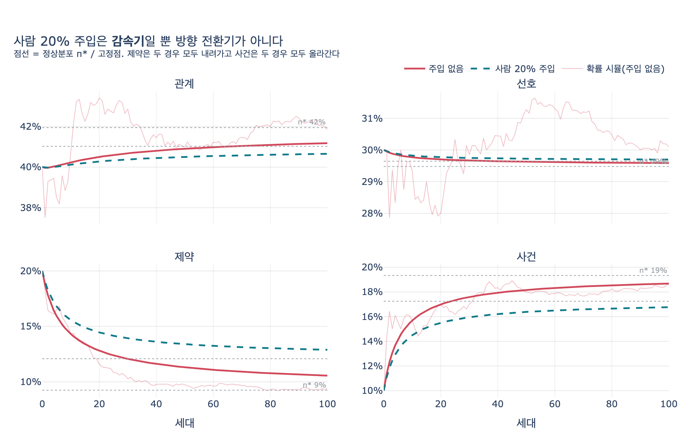

# 사람이 20%를 직접 넣으면 드리프트를 막을 수 있는가?

> **답**: 막지 못한다. 감속은 되지만 방향은 그대로다. 개별 사실이 아니라 **비율**에 개입해야 한다.

---

## 1. 무슨 상황인가

28.4절 「아무도 시키지 않은 방향으로 자란다」의 이야기다.

에이전트가 그래프에 쓰기 시작하면, 다음 턴에는 **자기가 쓴 것을 다시 읽는다**. 읽은 것에 이끌려 또 쓴다. 이 루프가 100세대 돌면 그래프의 **종류 구성비**가 아무도 지시하지 않은 방향으로 이동한다.

`ex4_drift.py` 는 사실을 네 종류로 나눈다.

| 종류 | 시작 비율 |
|---|---|
| 관계 | 40% |
| 선호 | 30% |
| 제약 | 20% |
| 사건 | 10% |

그리고 "어떤 종류를 읽으면 어떤 종류를 쓰는가"를 전이확률로 준다.

| 읽은 것 ↓ / 쓴 것 → | 관계 | 선호 | 제약 | 사건 |
|---|---|---|---|---|
| **관계** | 0.62 | 0.18 | 0.05 | 0.15 |
| **선호** | 0.20 | 0.55 | 0.10 | 0.15 |
| **제약** | 0.25 | 0.20 | 0.35 | 0.20 |
| **사건** | 0.40 | 0.20 | 0.05 | 0.35 |

100세대를 돌린 결과가 이렇다.

- 제약: 20% → **9%** (반토막)
- 사건: 10% → **19%** (두 배)
- 관계: 40% → 42% (거의 그대로)

**제약이 줄어드는 방향**이라는 게 무섭다. 27장에서 봤듯 제약은 잃으면 제일 아픈 종류다. 그런데 여기서는 누가 지워서 사라지는 게 아니라 **비율이 묽어져서** 사라진다. 조회할 때 상위 k개를 뽑으면 제약이 안 뽑히기 시작한다. 그래프에는 그대로 있는데 실질적으로는 없는 것이 된다.

---

## 2. 그래서 사람이 20%를 직접 넣어 보면

가장 자연스러운 대응이 이것이다. "가끔 사람이 확인하고 직접 넣으면 되지 않나."

`ex4_drift.py` 의 `human_share=0.2` 가 바로 그 실험이다. 매 세대 새로 들어가는 20개 중 **평균 4개**를 사람이 **원래 분포(관계 40 / 선호 30 / 제약 20 / 사건 10)** 대로 직접 넣는다. 이 정도면 상당한 수동 개입이다. 에이전트가 쓰는 다섯 개마다 하나를 사람이 손으로 채우는 셈이니까.

결과:

| | 제약 (시작 20%) | 사건 (시작 10%) |
|---|---|---|
| 사람 개입 0% | 9% | 19% |
| 사람 개입 20% | **12%** | **17%** |

제약이 9%가 아니라 12%에서 멈춘다. **분명히 나아졌다.** 그런데 여전히 20%가 아니라 12%다. **여전히 내려간다.** 사건은 여전히 올라간다.

> 감속은 되는데 방향은 그대로다. 「가끔 사람이 확인한다」로는 못 막는다.
> 5분의 1을 사람이 넣어도 이 정도다. 개입을 절반으로 올리는 건 현실적이지 않다.
> — `ex4_drift.py`

---

## 3. 왜 막지 못하는가 — 마르코프 체인으로 보기

이게 단순한 경험칙이 아니라 **구조적으로 그럴 수밖에 없다**는 걸 수식으로 확인할 수 있다.

### 3.1 루프는 마르코프 체인이다

에이전트는 그래프에서 **하나를 읽고**(읽힐 확률은 현재 분포 $\pi_t$ 에 비례), 읽은 종류 $i$ 가 종류 $j$ 를 낳을 확률 $P_{ij}$ 에 따라 **하나를 쓴다**. 그러면 새로 쓰이는 사실의 분포는 정확히

$$\pi_{t+1} = \pi_t P$$

이다. 즉 자기 출력을 다시 먹는 루프는 **전이행렬 $P$ 위의 마르코프 체인**이고, 종착점은 $P$ 의 좌고유벡터(정상분포)다.

$$\pi^\ast P = \pi^\ast, \qquad \sum_k \pi^\ast_k = 1$$

수치로 풀면 $\pi^\ast \approx (\text{관계}\ 41.9\%,\ \text{선호}\ 29.5\%,\ \text{제약}\ 9.2\%,\ \text{사건}\ 19.3\%)$ 다. 시뮬레이션의 100세대 결과가 이 값에 붙어 가고 있었던 것이다.

**핵심**: 드리프트가 향하는 곳은 시작 분포와 무관하다. **$P$ 의 구조만이** 그것을 정한다.

### 3.2 사람 주입은 아핀 축약사상일 뿐이다

사람이 비율 $h$ 만큼을 원래 분포 $s$ 로 직접 넣으면 생성 분포는

$$q_t = (1-h)\,\pi_t P + h\,s$$

가 된다. 이건 여전히 **아핀 축약사상**이라 고정점이 정확히 하나 있고, 그 고정점은

$$\pi^\ast_h \left( I - (1-h)P \right) = h\,s
\quad\Longleftrightarrow\quad
\pi^\ast_h = h\,s\left( I - (1-h)P \right)^{-1}$$

이다. 여기서 두 가지가 동시에 따라온다.

1. **$h < 1$ 인 한 $\pi^\ast_h \neq s$**. 즉 주입은 고정점을 $s$ **쪽으로 당기기만 하고** $s$ 에 **도달시키지 못한다**. 방향의 부호는 그대로다.
2. **수렴 속도를 지배하는 스펙트럼 반경이 $|\lambda_2|$ 에서 $(1-h)|\lambda_2|$ 로 줄어든다**. 즉 같은 곳을 향해 **더 느리게** 간다.

2번이 바로 "감속"의 정체다. 사람 개입이 사 주는 건 **시간**이지 **방향**이 아니다.

### 3.3 숫자로 확인

`expy.py` 가 두 고정점을 직접 계산해 비교한다.

| | 시작 | $\pi^\ast$ (주입 0%) | $\pi^\ast$ (주입 20%) | 부호 |
|---|---|---|---|---|
| 관계 | 40.0% | 41.9% | 41.0% | ↑ |
| 선호 | 30.0% | 29.5% | 29.6% | ↓ |
| 제약 | 20.0% | **9.2%** | **12.1%** | ↓ |
| 사건 | 10.0% | **19.3%** | **17.2%** | ↑ |

- **드리프트 벡터의 부호가 네 성분 모두 일치**한다.
- 두 드리프트 벡터 $d_0 = \pi^\ast_0 - s$ 와 $d_{0.2} = \pi^\ast_{0.2} - s$ 의 **코사인 유사도 = 0.9988**. 거의 정확히 같은 방향이다.
- 달라진 건 크기뿐. 제약 축에서 $|d_{0.2}| / |d_0| \approx 0.74$ — 손실의 **74%가 그대로 남는다**.

### 3.4 개입을 더 올리면?

$h$ 를 키워도 좀처럼 안 돌아온다.

| 사람 개입 $h$ | 제약 고정점 | 원래 손실 중 남는 비율 |
|---|---|---|
| 0% | 9.2% | 100% |
| 10% | 10.7% | 86.3% |
| 20% | 12.1% | 73.6% |
| 30% | 13.3% | 61.9% |
| 50% | 15.6% | 41.1% |
| **80%** | **18.4%** | **14.8%** |

사람이 **5분의 4를 직접 쓰는** 상황(사실상 자동 확장 포기)에서도 제약은 20%로 안 돌아온다. 그리고 그때도 방향은 여전히 아래다.

이게 "개별 사실에 개입하는 것으로는 못 푼다"의 정확한 의미다. 개별 사실을 넣는 건 $\pi$ 라는 **레벨(수위)** 을 손으로 퍼 올리는 일이고, 드리프트를 만드는 건 $P$ 라는 **흐름의 구조**다. 퍼 올리는 속도를 올려도 물이 흘러가는 방향은 안 바뀐다.

---

## 4. 드리프트 방향은 애초에 왜 그렇게 정해졌나

`ex4_drift.py` 의 해설이 이 부분을 잘 짚는다. 흔한 오해는 "자기 재생산율이 높은 종류가 살아남는다"인데, 그것만으로는 설명이 안 된다.

```
관계 → 관계 62%    제약 → 제약 35%    사건 → 사건 35%
```

제약과 사건은 자기 재생산율이 **똑같이 35%** 다. 그런데 제약은 반토막 나고 사건은 두 배가 됐다.

차이는 **"남이 나를 낳아 주는" 비율**이다.

```
관계를 읽으면 사건을 쓸 확률 15%
관계를 읽으면 제약을 쓸 확률  5%     ← 3배 차이
```

그리고 관계가 제일 흔하다. 그 3배 차이가 계속 벌어진다.

> 살아남는 종류를 정하는 건 「자기 재생산율」만이 아니라 「전체 분포와의 곱」이다.
> 제일 흔한 종류가 무엇을 낳느냐가 지배한다.

이게 정확히 $\pi P$ 라는 **행렬 곱**이 하는 일이다. 고유벡터가 답인 이유이기도 하다.

---

## 5. 그러면 무엇을 해야 하나 — 비율에 개입한다

방향을 바꾸려면 $P$ 를 건드려야 한다. 즉 **개별 사실이 아니라 종류별 비율에 상한/하한을 거는 것**이다. 28장이 제시한 대응이 그것이다.

- 관계가 전체의 **55%를 넘으면 관계 쓰기를 멈춘다**
- 제약이 **10% 아래로 내려가면 경보를 울린다**

`expy.py` 에서 "제약이 하한 15% 아래로 가면 그 세대 쓰기의 제약 비율을 15%로 강제하고 나머지를 비례 축소"하는 비율 개입을 돌려 봤다.

| 정책 | 100세대 제약 비율 | 개입량 |
|---|---|---|
| 사람 20% 주입 | 12.9% | **20%** (세대당 4개를 사람이 작성) |
| 비율 개입 (제약 하한 15%) | **15.0%** | **3.8%** (확률질량 재배치) |

세대당 평균 **3.8%** 의 확률질량만 재배치했는데, 사람이 20%를 손으로 쓴 것보다 제약을 더 잘 지켰다. 우연이 아니라 구조적이다.

- **개별 사실 주입**: $\pi$ 에 상수를 더한다 → 고정점을 선분 위에서 조금 옮길 뿐
- **비율 개입**: $P$ 를 바꾼다 → **정상분포 자체를 옮긴다**

그리고 비율 개입은 값도 싸다. 종류별 비율을 재는 건 **쿼리 한 줄**이고, 매일 한 번 돌리면 된다. 사람 20% 개입은 매 세대 사람 손이 들어가야 하는데도 결과가 더 나쁘다.

> 그리고 이 지표가 없으면 「묽어지는」 것을 영영 못 본다.
> — `ex4_drift.py`

---

## 6. 한 줄 정리

| 질문 | 답 |
|---|---|
| 사람 20% 주입으로 드리프트를 막는가? | **못 막는다** |
| 그럼 아무 효과 없나? | 있다. 제약 9% → 12%, 수렴은 $(1-h)$ 배 느려진다 → **감속** |
| 왜 방향은 안 바뀌나? | 방향은 $P$ 의 좌고유벡터가 정한다. 주입은 $\pi$ 를 옮길 뿐 $P$ 를 안 건드린다 |
| 개입을 80%까지 올리면? | 제약 18.4%. 여전히 20% 미만, 여전히 방향은 아래 |
| 무엇을 해야 하나? | **종류별 비율 상한/하한**. 관계 > 55% → 쓰기 중단, 제약 < 10% → 경보 |

**개별 사실을 아무리 잘 넣어도 비율의 흐름은 못 이긴다. 개입은 비율 레벨에서 해야 한다.**

---

## 참고

- 소스: `content/ch28/code/ex4_drift.py` (28장 예제 4, 시드 3 고정)
- 키워드: [self-training bias](https://arxiv.org/abs/2305.17493) [실험], [schema drift](https://www.w3.org/TR/shacl/) [사실상 표준]
- 시드를 바꾸면 숫자가 몇 %p 움직이지만 "제약이 줄고 사건이 는다"는 **방향은 바뀌지 않는다** — 방향이 고유벡터로 결정돼 있기 때문이다.

## 시각화


