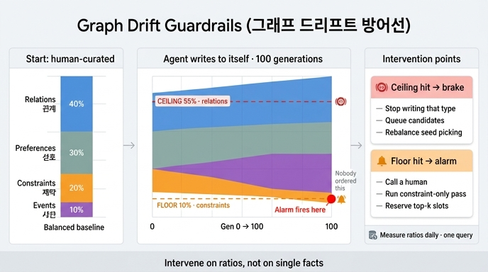

# 그래프 드리프트에 대응하는 구체적 방법

> **Q.** 그래프 드리프트에 대응하는 구체적 방법은 무엇인가?
>
> **A.** 종류별 비율 상한을 둔다. 관계가 55%를 넘으면 관계 쓰기를 멈추고, 제약이 10% 아래로 내려가면 경보를 울린다.

---

## 1. 무엇에 대응하는 것인가

28장 예제 4(`ex4_drift.py`)는 에이전트가 **자기가 쓴 그래프를 다시 읽고 또 쓰는** 루프를 100세대 돌립니다. 시작 분포는 이랬습니다.

| 종류 | 시작 | 100세대 후 (사람 개입 0%) | 100세대 후 (사람 개입 20%) |
|---|---|---|---|
| 관계 | 40% | 42% | 41% 부근 |
| 선호 | 30% | 30% 부근 | 30% 부근 |
| **제약** | **20%** | **9%** | **12%** |
| 사건 | 10% | 19% | 17% 부근 |

아무도 "관계를 늘려라", "제약을 줄여라"라고 지시하지 않았습니다. 그런데 **제약이 반토막** 났습니다. 이게 그래프 드리프트입니다.

### 왜 이렇게 되나

에이전트는 그래프에서 읽은 것에 **이끌려** 씁니다. 예제의 전이 행렬(`EMIT`)이 원인입니다.

```python
EMIT = {
    "관계": {"관계": 0.62, "선호": 0.18, "제약": 0.05, "사건": 0.15},
    "선호": {"관계": 0.20, "선호": 0.55, "제약": 0.10, "사건": 0.15},
    "제약": {"관계": 0.25, "선호": 0.20, "제약": 0.35, "사건": 0.20},
    "사건": {"관계": 0.40, "선호": 0.20, "제약": 0.05, "사건": 0.35},
}
```

- 자기 재생산율만 보면 제약 35%, 사건 35%로 **같습니다**. 그런데 결과는 정반대(9% vs 19%)로 갈렸습니다.
- 차이는 **"남이 나를 낳아 주는 비율"** 입니다. 제일 흔한 종류인 관계를 읽었을 때 사건을 쓸 확률은 15%, 제약을 쓸 확률은 5%. 세 배 차이입니다.
- 그리고 관계가 제일 많으니 그 세 배가 매 세대 계속 벌어집니다.

정리하면 살아남는 종류를 정하는 건 자기 재생산율만이 아니라 **자기 재생산율 × 전체 분포의 곱**입니다. 제일 흔한 종류가 무엇을 낳느냐가 지배합니다.

### 왜 이게 특히 위험한가

1. **지워져서 사라지는 게 아니라 묽어져서 사라집니다.** 제약 엣지를 하나도 삭제하지 않았는데도, 조회할 때 상위 k개를 뽑으면 제약이 안 뽑히기 시작합니다. 절대 개수는 늘었는데 랭킹에서 밀려납니다. 삭제 로그를 아무리 봐도 원인이 안 잡힙니다.
2. **제약은 잃으면 제일 아픈 종류입니다.** 27장에서 봤듯 "무엇을 하면 안 되는가"가 빠진 기억은 위험합니다.
3. **사람 개입으로는 못 막습니다.** 사람이 20%를 넣어도 제약은 9% 대신 12%에서 멈출 뿐입니다. **감속은 되는데 방향은 그대로**입니다. 개입 비율을 절반까지 올리는 건 현실적이지 않습니다.

여기서 핵심 통찰이 나옵니다. **개별 사실이 아니라 *비율*에 개입해야 한다**는 것.

---

## 2. 대응: 종류별 비율 상한/하한

두 개의 임계값을 둡니다. **둘은 하는 일이 다릅니다.**

| | 상한 (ceiling) | 하한 (floor) |
|---|---|---|
| 예 | 관계 ≥ 55% | 제약 < 10% |
| 성격 | **브레이크** — 쓰기를 실제로 막음 | **경보** — 사람/보정 작업을 부름 |
| 목적 | 지배종이 더 벌어지는 걸 예방 | 묽어진 것을 탐지 |
| 걸린 뒤 | 자동 조치 (해당 종류 쓰기 중단) | 자동 조치 불가 — 없는 사실은 만들어 낼 수 없음 |

예제 4의 시뮬레이션에서 실제로 걸리는 건 **하한뿐**입니다(관계는 42%로 55%에 못 미침, 제약은 9%로 10% 아래). 상한은 "안 걸렸으니 쓸모없다"가 아니라 **더 험한 전이 행렬에서 폭주를 막는 안전판**입니다. 상한만 두면 이번 케이스를 통째로 놓치고, 하한만 두면 폭주형 드리프트에 브레이크가 없습니다. 둘 다 필요합니다.

### 임계값을 어떻게 정하나

55%, 10%는 마법의 숫자가 아니라 **기준 분포에서 유도한 값**입니다.

- 시작(사람이 만든) 분포: 관계 40%, 선호 30%, 제약 20%, 사건 10%
- 관계 상한 55% = 기준선 40%의 약 1.4배 → "여기까지는 자연스러운 변동, 넘으면 구조적 편향"
- 제약 하한 10% = 기준선 20%의 절반 → "절반으로 줄면 조회 상위 k에서 밀려나기 시작"

권장 절차:
1. **기준선을 먼저 고정한다.** 사람이 큐레이션한 시드 그래프, 또는 도메인 전문가가 "이 정도 비율이 맞다"고 합의한 값.
2. 각 종류에 대해 `상한 = 기준선 × 1.3~1.5`, `하한 = 기준선 × 0.5` 정도로 시작한다.
3. 하한은 **조회 품질에서 역산**하면 더 낫습니다. 상위 k=20 조회에서 제약이 평균 2개는 나와야 한다면, 제약 비율이 몇 % 아래로 가면 그게 깨지는지 재서 그 값을 하한으로 삼습니다.
4. 종류가 많으면 전부 걸지 말고 **잃으면 제일 아픈 것(제약)에만 하한**, **폭주 가능성 있는 것(관계, 사건)에만 상한**을 겁니다.

---

## 3. 비율을 어떻게 재나 — 쿼리 한 줄

책의 표현대로 "비율은 매일 재면 된다. 쿼리 한 줄이다".

### (a) 누적 비율

Kuzu/Cypher 계열이면 종류별 개수만 뽑고 나눕니다.

```cypher
MATCH ()-[e:R]->()
RETURN e.kind AS kind, count(*) AS n
ORDER BY n DESC;
```

한 쿼리 안에서 비율까지 내고 싶으면:

```cypher
MATCH ()-[e:R]->()
WITH e.kind AS kind, count(*) AS n
WITH collect({kind: kind, n: n}) AS rows, sum(n) AS total
UNWIND rows AS r
RETURN r.kind AS kind, r.n AS n, r.n * 1.0 / total AS ratio
ORDER BY ratio DESC;
```

### (b) 최근 창(window) 비율 — 이쪽이 훨씬 중요

누적 비율은 **관성이 큽니다.** 엣지가 100만 개 쌓인 그래프에서 오늘 들어온 1,000개가 전부 관계여도 누적 비율은 0.1%p도 안 움직입니다. 드리프트를 알아챌 때쯤이면 이미 늦습니다. 그래서 **신규 쓰기만의 비율**을 같이 잽니다.

```cypher
MATCH ()-[e:R]->()
WHERE e.created_at >= date() - interval('7 days')
WITH e.kind AS kind, count(*) AS n
WITH collect({kind: kind, n: n}) AS rows, sum(n) AS total
UNWIND rows AS r
RETURN r.kind AS kind, r.n * 1.0 / total AS recent_ratio
ORDER BY recent_ratio DESC;
```

- **누적 비율**은 "그래프가 지금 어떤 모양인가" — 조회 품질에 직결. 하한 경보의 기준.
- **최근 창 비율**은 "어느 방향으로 흐르고 있는가" — 선행 지표. 상한 브레이크의 기준으로 쓰면 훨씬 빨리 잡힙니다.
- 실무에서는 둘 다 매일 스냅샷으로 남기고 시계열로 그립니다. **시계열이 없으면 "묽어지는" 것을 영영 못 봅니다.**

### (c) 쓰기 경로에서의 실시간 확인

매 쓰기마다 `count(*)`를 돌리면 비쌉니다. 종류별 카운터를 별도 테이블/캐시(Redis 등)에 두고 쓰기 때 증분하며, 정합성은 위 쿼리로 하루 한 번 재동기화합니다.

---

## 4. 어디에 끼워 넣나 — 다섯 번째 관문

28.2절의 관문 넷(확신도 → 정규화 → 스키마 → 단일 값 충돌, 그리고 중복)은 전부 **트리플 하나만 보고 판단**합니다. 비율 상한은 성격이 다릅니다. **후보 하나가 아니라 그래프 전체 상태를 보는 관문**이라서, 관문 넷 뒤에 별도로 세웁니다.

```python
# 관문 넷을 통과한 뒤에 붙는 5번째 관문 (개념 코드)
CEILING = {"관계": 0.55, "사건": 0.30}
FLOOR   = {"제약": 0.10}
HYST    = 0.02          # 히스테리시스 — 플래핑 방지

def distribution_gate(kind, counts, blocked):
    total = sum(counts.values())
    ratio = counts[kind] / total
    cap = CEILING.get(kind)
    if cap is None:
        return True
    if kind in blocked:
        # 이미 막힌 종류는 cap - HYST 아래로 내려와야 다시 열린다
        if ratio < cap - HYST:
            blocked.discard(kind)
            return True
        return False
    if ratio >= cap:
        blocked.add(kind)
        return False
    return True
```

두 가지가 요점입니다.

1. **순서**: 확신도·정규화·스키마·단일 값 검사를 다 통과한 "진짜 쓸 만한 후보"에 대해서만 분포를 봅니다. 앞에서 걸릴 쓰레기까지 카운트에 넣으면 비율이 오염됩니다.
2. **히스테리시스**: 55%에서 딱 잘라 막았다 풀었다 하면 경계에서 플래핑합니다. 막는 건 55%, 다시 여는 건 53%로 벌려 둡니다.

---

## 5. 걸렸을 때 무엇을 하나

### 상한에 걸렸을 때 (관계 ≥ 55%)

- **해당 종류만 막습니다.** 루프 전체를 멈추는 게 아닙니다. 관계 쓰기만 닫고 선호·제약·사건 쓰기는 계속 돌아갑니다. 그래야 비율이 저절로 회복됩니다.
- **막힌 후보는 버리지 말고 대기열에 쌓습니다.** 상한에 걸린 관계 트리플 중에는 맞는 사실도 있습니다. 28.5절의 "쓰기 전 대기열"과 같은 장치입니다. 나중에 비율이 회복되거나 사람이 검토한 뒤 반영합니다.
- **씨앗 선택을 바꿉니다.** 이게 근본 처방입니다. 드리프트의 원인은 "관계를 읽어서 관계를 쓴다"는 되먹임이므로, 확장 씨앗을 뽑을 때 종류별 균등 샘플링을 하거나 지배종 노드의 가중치를 낮춥니다. 쓰기를 막는 건 증상 치료, 씨앗 편향 교정이 원인 치료입니다.
- **알림을 남깁니다.** "N일 연속 상한 근처"는 임계값 자체를 재검토하라는 신호입니다.

### 하한 경보가 울렸을 때 (제약 < 10%)

하한은 자동으로 고칠 수가 없습니다. **없는 제약을 만들어 낼 수는 없으니까요.** 그래서 조치가 상한과 완전히 다릅니다.

- **사람 호출.** 온콜/담당자에게 "제약 비율이 9%로 떨어졌다"를 보냅니다. 개별 사실 리뷰가 아니라 **분포 리뷰** 요청입니다.
- **제약 전용 추출 패스를 돌립니다.** 평소 범용 확장 대신, "이 도메인에서 하면 안 되는 것 / 필수 조건"만 뽑는 프롬프트로 별도 배치를 돌립니다. 능동적으로 부족한 종류를 채우는 겁니다.
- **조회 쪽에 슬롯을 예약합니다.** 즉효 처방. 상위 k=20을 뽑을 때 제약 종류에 최소 3칸을 강제 배정하면, 비율이 회복되기 전에도 "묽어져서 안 뽑히는" 증상은 막힙니다. 분포 문제와 랭킹 문제를 분리하는 겁니다.
- **거꾸로 지배종 쓰기를 조입니다.** 제약 비율을 올리는 방법에는 분자를 키우는 것 말고 분모를 줄이는 것도 있습니다. 상한을 임시로 55% → 45%로 내려서 관계 유입을 조입니다.

---

## 6. 왜 이 방법이 통하는가 / 한계

**통하는 이유**: 드리프트는 개별 트리플의 참/거짓 문제가 아니라 **집계 수준의 구조 문제**입니다. 그래서 관문 넷(트리플 단위 검증)으로는 절대 안 잡힙니다 — 드리프트를 만든 사실들은 전부 개별적으로는 "맞는 사실"입니다. 집계 수준의 문제에는 집계 수준의 제어기를 붙여야 합니다. 비율 상한/하한이 바로 그 제어기입니다.

**한계**:
- 상한은 맞는 사실도 막습니다. 대기열이 필수인 이유입니다.
- 임계값은 도메인마다 다릅니다. 55%/10%를 그대로 베끼지 말고 자기 기준 분포에서 유도하세요.
- 비율만 지키고 **품질**은 안 봅니다. 제약을 10%로 맞추려고 쓰레기 제약을 채워 넣으면 지표만 초록불이 됩니다(굿하트의 법칙). 확신도 관문과 반드시 같이 씁니다.
- 종류 분류 자체가 틀리면 지표 전체가 무의미합니다. `kind` 정규화(28.2절의 `CANON`)가 앞에 있어야 합니다.

**그리고 가장 중요한 것**: 이 지표를 **매일 재서 시계열로 남기지 않으면**, 묽어지는 것을 영영 못 봅니다. 삭제는 로그에 남지만 희석은 아무 데도 안 남습니다.

---

## 한 줄 정리

드리프트는 개별 사실이 아니라 분포의 문제이므로, 종류별 비율에 **상한(관계 55% → 쓰기 중단)** 과 **하한(제약 10% → 경보)** 을 걸고, 누적·최근 창 비율을 매일 쿼리로 재서 시계열로 감시한다.

## 인포그래픽


