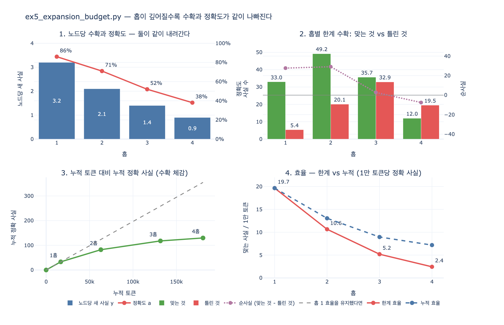

# `ex5_expansion_budget.py` 에서 홉별 수확과 정확도는 어떻게 변하는가

> **답**: 1홉은 노드당 **3.2건**에 정확도 **86%**, 4홉은 **0.9건**에 **38%**다. 깊어질수록 **둘 다** 나빠진다.

---

## 1. 표 자체

`ex5_expansion_budget.py` 는 딱 한 줄에 도메인 측정치를 박아 놓는다.

```python
# 노드 한 개를 넓힐 때: 새 사실 몇 개, 그중 맞는 비율, 드는 값
YIELD_BY_HOP = {1: (3.2, 0.86), 2: (2.1, 0.71), 3: (1.4, 0.52), 4: (0.9, 0.38)}
COST_PER_EXPAND = 1_400          # 토큰
SEED_NODES = 12
```

| 홉 | 노드당 새 사실 $y_h$ | 맞을 확률 $a_h$ | 확장 계수 $y_h a_h$ | 경로 신뢰도 $\prod a$ |
|---:|---:|---:|---:|---:|
| 1 | 3.2 | 86% | 2.752 | 86.0% |
| 2 | 2.1 | 71% | 1.491 | 61.1% |
| 3 | 1.4 | 52% | 0.728 | 31.8% |
| 4 | 0.9 | 38% | 0.342 | 12.1% |

수확은 홉당 약 $\times 0.68$, 정확도는 약 $\times 0.83$ 로 떨어진다. 1홉 대비 4홉은 수확이 **0.28배**, 정확도가 **0.44배**다.

핵심은 **둘이 곱해진다**는 것이다. 노드 하나를 넓혀 얻는 «쓸 수 있는» 사실은 $y_h a_h$ 인데, 이 값이 $2.75 \to 1.49 \to 0.73 \to 0.34$ 로 간다. **1홉의 8분의 1**이다. 그런데 노드 하나 넓히는 값(1,400 토큰)은 홉과 무관하게 일정하다. 값은 그대로인데 건지는 게 8분의 1이라는 뜻이다.

책 본문의 표현 그대로다.

> 깊은 홉은 값은 그대로 드는데 수확이 적고 정확도도 낮기 때문이다.

---

## 2. 왜 «같이» 나빠지는가

수확이 주는 것과 정확도가 주는 것은 사실 다른 원인이 아니다. 셋이 겹쳐서 같은 방향으로 민다.

### (1) 프론티어 확장 — 멀어질수록 넓힐 거리가 없다

넓히기는 시드 노드에서 바깥으로 퍼진다. 시드는 «질문에 관련 있다»고 판단해서 고른 노드다. 1홉 이웃은 그 관련성을 대부분 물려받는다. 그런데 2홉, 3홉으로 나가면 «질문과 관련 있는 노드의 이웃의 이웃»이 된다. 이쯤 되면 대부분 질문과 상관없는 일반적인 노드다.

일반적인 노드는 넓힐 «거리»가 없다. 추출기가 봐도 새로 뽑을 게 없거나, 뽑아도 질문 맥락에 안 맞는 사실이 나온다. 그래서 $y_h$ 가 3.2에서 0.9로 준다.

동시에, 맥락이 옅어지면 추출기의 판단 근거도 옅어진다. 「박민수가 결제팀을 이끈다」는 시드 근처에서는 문서에 직접 적혀 있지만, 3홉 밖의 「결제팀이 쓰는 라이브러리의 관리자」쯤 되면 추론이 섞이기 시작한다. 그래서 $a_h$ 도 같이 준다. **수확이 줄어드는 이유와 정확도가 떨어지는 이유가 같은 원인**이라는 게 요점이다. 둘은 독립 변수가 아니다.

### (2) 중복 재방문 — 새 사실로 안 세어지는 것들

홉이 깊어질수록 프론티어가 커지고, 커진 프론티어는 서로 겹친다. A의 3홉 이웃과 B의 3홉 이웃은 상당 부분 같은 노드다. 그래프가 작을수록(또는 허브가 있을수록) 더 심하다.

이미 방문한 영역을 다시 넓히면 토큰은 똑같이 나가는데 **새** 사실은 안 나온다. `ex5` 의 $y_h$ 는 이 중복까지 흡수한 순수확 값이다. 즉 3홉의 1.4건은 「1.4건밖에 못 뽑았다」가 아니라 「뽑긴 뽑았는데 새로운 건 1.4건이었다」에 가깝다.

여기에 28.1절의 문제가 얹힌다. 중복이라고 다 걸러지는 것도 아니다. 이름이 다르면(「박민수」/「민수」/「PM」) 중복으로 안 잡히고 새 노드가 되어 버린다. 그러면 «새 사실»로 세어지지만 그래프는 오히려 나빠진다.

### (3) 신뢰도 곱의 감쇠 — 홉 정확도는 «조건부» 값이다

이게 제일 중요한 부분이다.

28.3절의 원칙: **추론 결과의 신뢰도는 근거 중 가장 약한 것보다 강할 수 없다.** 홉 $h$ 의 사실은 홉 $h-1$ 의 사실을 근거로 삼는다. 근거가 틀렸으면 결론도 틀렸다.

`ex5` 의 $a_h$ 는 「앞 홉이 맞았다는 조건 아래」의 조건부 정확도다. 코드가 그렇게 짜여 있다.

```python
frontier = int(r)          # 맞는 것만 다음 홉의 씨앗이 된다
```

`r` 은 이번 홉에서 «맞는» 사실의 수다. 틀린 것은 다음 홉의 씨앗에서 **완전히** 제외된다. 즉 이 모형은 홉과 홉 사이에 완벽한 검증 관문이 있다고 가정한다.

관문이 없거나 새면 실제 정확도는 곱이 된다.

$$A_h = \prod_{i=1}^{h} a_i = 0.86 \times 0.71 \times 0.52 \times 0.38 = 0.121$$

**4홉 사실을 걸러 내지 않고 그대로 쓰면 정확도는 38%가 아니라 12%다.** 표에 적힌 38% 조차 낙관치라는 뜻이다. 그리고 이게 왜 그런지는 간단하다. 「A가 맞고 → A로부터 B를 뽑았고 B가 맞고 → B로부터 C를 뽑았고 C가 맞다」가 전부 성립해야 C를 쓸 수 있는데, 각 단계마다 확률이 곱해지니까.

---

## 3. 그래서 숫자가 이렇게 나온다

씨앗 12개에서 시작해 홉 단위로 분해하면 이렇다. (`expy.py` 가 원본 `expand()` 를 그대로 따라간 결과)

| 홉 | 프론티어 | 새 사실 | 맞는 것 | 틀린 것 | 토큰 | 한계 효율 | 순사실 |
|---:|---:|---:|---:|---:|---:|---:|---:|
| 1 | 12 | 38.4 | 33.0 | 5.4 | 16,800 | 19.66 | +27.6 |
| 2 | 33 | 69.3 | 49.2 | 20.1 | 46,200 | 10.65 | +29.1 |
| 3 | 49 | 68.6 | 35.7 | 32.9 | 68,600 | 5.20 | +2.7 |
| 4 | 35 | 31.5 | 12.0 | 19.5 | 49,000 | 2.44 | **−7.6** |

*한계 효율 = 그 홉에서 얻은 맞는 사실 / (그 홉이 쓴 토큰 / 10,000)*

여기서 헷갈리기 쉬운 게 하나 있다. **총** 새 사실은 홉 2~3에서 최대(69.3, 68.6)다. 노드당 수확은 계속 줄어드는데 총량은 늘었다. 프론티어가 $12 \to 33 \to 49$ 로 커져서다.

그런데 그 프론티어를 넓히는 값도 같이 커진다. 홉 3 하나가 68,600 토큰으로 전체 180,600의 **38%** 다. 그 값을 치르고 얻은 게 맞는 사실 35.7건 + **틀린 사실 32.9건**이다.

그리고 홉 3에서 확장 계수가 $g_3 = 0.728 < 1$ 로 내려간다. 이 지점부터 프론티어는 스스로 줄어든다($49 \to 35$). 확장이 자기 연료를 못 대는 구간에 들어간 것이다.

---

## 4. 손익이 뒤집히는 지점은 하나가 아니다

무엇을 손익으로 재느냐에 따라 «멈춰야 할 홉»이 달라진다.

| 기준 | 뒤집히는 홉 | 값 |
|---|---|---|
| 한계 토큰 효율이 지금까지의 평균 아래로 | **홉 2** | $10.65 < 19.66$ |
| 확장 계수 $g_h < 1$ (프론티어가 스스로 축소) | **홉 3** | $g_3 = 0.728$ |
| 순사실 (맞는 것 − 틀린 것) $< 0$ | **홉 4** | $-7.6$ |

홉 2는 **비싸지기 시작**하는 곳이고, 홉 4는 **해로워지는** 곳이다. 그 사이가 애매한 구간이다.

틀린 사실 1건의 대가를 맞는 사실 1건 가치의 $k$ 배로 놓으면 ($V_h = R_h - k W_h$):

| $k$ | 홉 1 | 홉 2 | 홉 3 | 홉 4 | 멈출 홉 |
|---:|---:|---:|---:|---:|---:|
| 0.5 | 30.3 | 39.2 | 19.2 | 2.2 | 4 |
| 1 | 27.6 | 29.1 | 2.7 | −7.6 | 3 |
| 2 | 22.3 | 9.0 | −30.2 | −27.1 | 2 |
| 3 | 16.9 | −11.1 | −63.1 | −46.6 | 1 |

틀린 사실이 맞는 사실만큼만 비싸도 4홉은 손해다. 두 배면 3홉부터, 세 배면 2홉도 못 간다.

**«검토 대기열에 넣는다»는 사실상 $k$ 를 낮추는 조치다.** 그래프에 바로 쓰면 오답이 정답을 지우고 다운스트림 조회를 오염시켜 $k$ 가 크지만, 대기열에 쌓아 두면 대가가 «사람이 훑어보는 시간»으로 줄어든다.

---

## 5. 정책 표와 예산 버그

원본이 비교하는 네 정책의 결과다.

| 정책 | 도는 홉 | 새 사실 | 맞는 것 | 틀린 것 | 토큰 | 맞는 것/1만 토큰 |
|---|---:|---:|---:|---:|---:|---:|
| 끝까지 (4홉) | 4 | 208 | 130 | 78 | 180,600 | 7.2 |
| 2홉까지 | 2 | 108 | 82 | 25 | 63,000 | **13.1** |
| 토큰 예산 60,000 | 2 | 108 | 82 | 25 | **63,000** | 13.1 |
| 틀린 것 30개 넘으면 중단 | 3 | 176 | 118 | 58 | 131,600 | 9.0 |

읽는 법 세 가지.

1. **끝까지가 새 사실을 제일 많이 얻고 틀린 것도 제일 많다.** 208건 중 78건(37.5%)이 오답이다.
2. **효율은 얕을수록 좋다.** 하지만 «효율이 높다»가 «좋다»는 아니다. 2홉에서 멈추면 3~4홉에서만 나오는 사실을 영영 못 얻는데, 그런 사실이 대개 사람이 몰랐던 것이라 값어치가 크다.
3. **«토큰 예산 60,000»이 63,000을 썼다.** 예산을 넘겼다. 홉을 *시작하기 전*에만 검사하고 중간에는 안 봐서다. 2홉 시작 시점 누적이 16,800이라 통과했고, 그 홉 하나가 46,200을 더 썼다. 예산을 «단위 작업 앞»에서만 보면 단위 작업 하나가 예산 전체보다 클 때 못 막는다. 고치려면 홉 안에서 노드 단위로 검사하거나, 홉의 예상 값을 미리 재야 한다.

「틀린 것 30개 넘으면 중단」은 홉 수가 아니라 **품질**로 멈추는 정책이라 발상이 좋지만, 30개를 «넘고 나서» 안다. 틀린 사실 30개가 이미 들어간 뒤다. 그래서 **쓰기 전 대기열**과 같이 써야 한다. 일단 대기열에 쌓고, 중단 조건에 걸리면 대기열을 통째로 버린다.

---

## 6. 결론 — 책이 권하는 운용

- **평소에는 2홉.** 싸고 정확하다.
- **주기적으로(주 1회) 4홉까지 넓히되 «사람 검토 대기»로 넣는다.**

깊은 홉의 결과를 그래프에 바로 안 쓰는 게 요점이다. 정확도 38%짜리를 바로 쓰면 28.1절 `ex1_write_loop.py` 의 상황(10턴 만에 망가진 그래프)이 된다.

그리고 `ex5` 의 수확률과 정확도는 저자 도메인에서 잰 값을 단순화한 것이다. **여러분 도메인에서는 홉별 정확도를 직접 재서 넣어야 한다.** 재는 방법 자체는 어렵지 않다 — 홉별로 표본을 뽑아 사람이 맞다/틀리다를 매기면 된다. 이 표가 없으면 «어디까지 넓힐 것인가»는 답할 수 없는 질문이 된다.

---

## 시각화


