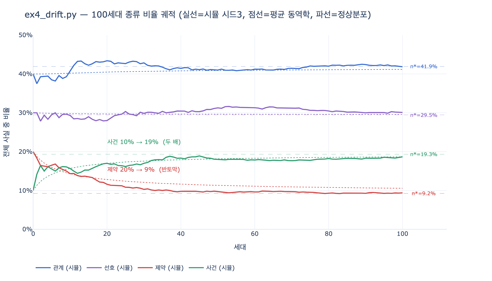

# `ex4_drift.py` 100세대 시뮬레이션 결과

**질문:** `ex4_drift.py`의 100세대 시뮬레이션 결과는 무엇인가?

**답:** 제약이 20%에서 9%로 반토막 나고 사건이 10%에서 19%로 두 배가 되었다.
관계는 40%에서 42%로 거의 변하지 않았다.

---

## 1. 한눈에 보는 결과표

시작 분포는 관계 40%, 선호 30%, 제약 20%, 사건 10%. 시드는 3으로 고정.
사람 개입 0%(에이전트만 쓰는 경우) 기준이다.

| 세대 | 관계 | 선호 | 제약 | 사건 |
|---:|---:|---:|---:|---:|
| 0 | 40% | 30% | 20% | 10% |
| 1 | 38% | 30% | 18% | 14% |
| 10 | 41% | 29% | 14% | 16% |
| 50 | 41% | 31% | 10% | 18% |
| **100** | **42%** | **30%** | **9%** | **19%** |

움직인 것은 사실상 **제약과 사건 둘뿐**이다.

- 제약 20% → 9%: **반토막**
- 사건 10% → 19%: **두 배**
- 관계 40% → 42%: 거의 그대로 (2%p)
- 선호 30% → 30%: 제자리

책 본문의 표현 그대로다.

> «제약»이 20%에서 9%로 반토막 났다. 그리고 «사건»이 10%에서 19%로 두 배가 됐다.
> «관계»는 40%에서 42%로 거의 안 변했다. **제가 예상한 것과 다르다.**

저자가 "예상과 다르다"고 적은 지점이 이 카드의 핵심이다.
직관적으로는 "관계가 관계를 62%로 낳으니 관계가 폭증하겠지"라고 예상하게 되는데,
관계는 이미 40%로 흔했기 때문에 더 올라갈 여지가 없었다.
정작 튄 것은 아무도 안 보던 **사건**이고, 무너진 것은 **제약**이다.

## 2. 시뮬레이션이 하는 일

```python
KINDS = ["관계", "선호", "제약", "사건"]
START = {"관계": 40, "선호": 30, "제약": 20, "사건": 10}
GEN = 100        # 100세대
PER_GEN = 20     # 세대마다 새 사실 20개
```

한 세대에서 20번 반복되는 동작은 두 줄이다.

```python
seed = rng.choices(KINDS, [counts[x] for x in KINDS])[0]   # 현재 개수에 비례해 하나를 «읽고»
k = rng.choices(KINDS, [emit[x] for x in KINDS])[0]        # 읽은 것에 이끌려 하나를 «쓴다»
```

여기서 놓치면 안 되는 두 가지.

1. **읽기가 현재 분포에 비례한다.** 흔한 종류가 더 자주 씨앗이 된다.
   그래서 흔한 종류가 무엇을 낳느냐가 전체를 지배한다.
2. **기존 사실이 절대 삭제되지 않는다.** `new = dict(counts)`로 시작해 더하기만 한다.
   제약은 **지워져서** 사라지는 게 아니라 새 사실에 눌려 **묽어져서** 사라진다.
   100세대 뒤 총 사실 수는 100 + 20×100 = **2,100개**이고, 시작 100개는 4.8%밖에 안 된다.

## 3. 원인 (1) — 전이행렬의 행 합이 아니라 **열 합**

`EMIT`은 행-확률행렬 $P$다. 행이 "읽은 종류", 열이 "쓴 종류".

$$
P=\begin{array}{c|cccc}
 & \text{관계} & \text{선호} & \text{제약} & \text{사건}\\\hline
\text{관계} & 0.62 & 0.18 & 0.05 & 0.15\\
\text{선호} & 0.20 & 0.55 & 0.10 & 0.15\\
\text{제약} & 0.25 & 0.20 & 0.35 & 0.20\\
\text{사건} & 0.40 & 0.20 & 0.05 & 0.35
\end{array}
$$

**행 합은 전부 1이다.** 읽으면 반드시 하나를 쓰기 때문에 그렇게 만들어진 것이고,
따라서 행 합에는 아무 정보가 없다. 정보는 **열 합**에 있다.

$$\mathrm{in}(k)=\sum_j P_{jk}$$

| 종류 | 자기 재생산 $P_{kk}$ | 열 합 $\mathrm{in}(k)$ | 결과 |
|---|---:|---:|---|
| 관계 | 0.62 | **1.47** | 40% → 42% |
| 선호 | 0.55 | 1.13 | 30% → 30% |
| 제약 | 0.35 | **0.55** | 20% → 9% |
| 사건 | 0.35 | 0.85 | 10% → 19% |

**제약과 사건은 자기 재생산율이 0.35로 똑같은데 정반대로 갈렸다.**
갈라 놓은 것이 열 합이다. 제약 0.55는 꼴찌이고, 사건 0.85의 65% 수준이다.

특히 결정적인 한 칸.

```
관계 → 사건   0.15
관계 → 제약   0.05      ← 3배 차이
```

관계는 40%로 제일 흔하니 매 세대 씨앗의 40%가 관계다.
그 40%가 사건은 15%, 제약은 5%로 낳는다. 이 3배가 100세대 동안 복리로 벌어진 결과가
"제약 반토막, 사건 두 배"다.

> 살아남는 종류를 정하는 건 «자기 재생산율»만이 아니라 «전체 분포와의 곱»이다.
> 제일 흔한 종류가 무엇을 낳느냐가 지배한다.

## 4. 원인 (2) — 정상분포. 이 숫자들은 우연이 아니다

새로 쓰이는 사실의 기대 분포는 순수한 마르코프 갱신을 따른다.

$$\pi_{t+1}=\pi_t P$$

그래프 **전체** 비율은 과거가 남아 있으므로 아래처럼 섞인다
($m = 20$, $N_0 = 100$).

$$\pi_{t+1}=\frac{N_t\,\pi_t+m\,\pi_t P}{N_t+m}$$

종착지는 $P$의 고유값 1에 대응하는 좌고유벡터, 즉 정상분포다.

$$\pi^{*}P=\pi^{*},\qquad \sum_k \pi^{*}_k=1$$

계산해 보면

| | 관계 | 선호 | 제약 | 사건 |
|---|---:|---:|---:|---:|
| 정상분포 $\pi^*$ | 41.9% | 29.5% | **9.2%** | **19.3%** |
| 100세대 시뮬 결과 | 42% | 30% | 9% | 19% |

**소수점까지 겹친다.** 답안의 세 숫자(9%, 19%, 42%)는 난수가 만들어낸 표본이 아니라
$P$가 처음부터 정해 둔 종착지다. 책이 "시드를 바꾸면 숫자가 몇 %p 움직이는데
방향은 바뀌지 않는다"고 말할 수 있는 이유가 이것이다.

참고로 "열 합 / 4"(= 관계 36.8%, 선호 28.2%, 제약 13.8%, 사건 21.2%)는 정상분포와 다르다.
열 합 나누기 종류 수가 정상분포와 같아지는 건 $P$가 이중확률행렬일 때뿐이다.
열 합은 **방향의 감**만 준다.

## 5. 원인 (3) — 수렴 속도. 왜 100세대나 걸리나

$P$의 고유값은 $1,\ 0.385,\ 0.282,\ 0.203$. 제2고유값 $|\lambda_2| = 0.385$이므로

$$\|\nu_t-\pi^{*}\|\sim|\lambda_2|^{t},\qquad
t_{1/2}=\frac{\ln 2}{-\ln|\lambda_2|}\approx 0.73\ \text{세대}$$

즉 **지금 쓰이는 사실의 분포는 5세대 만에 이미 정상분포에 붙는다.**
그런데 그래프 전체 비율은 훨씬 느리다. 과거가 지워지지 않아
아직 안 기운 초기 사실의 지분이 $N_0/N_t = \mathcal{O}(1/t)$로만 얇아지기 때문이다.

| 세대 | 신규 쓰기 분포 오차 | 누적 비율 오차 |
|---:|---:|---:|
| 5 | 0.00103 | 0.14118 |
| 10 | 0.00001 | 0.10715 |
| 20 | ~0 | 0.07564 |
| 50 | ~0 | 0.04417 |
| 100 | ~0 | 0.02843 |

(정상분포 기준 L1 거리)

세대를 20에서 100으로 5배 더 돌려도 누적 오차는 2.7배밖에 안 준다.
**기하 감쇠가 아니라 다항 감쇠**다.

이게 실무에서 드리프트가 안 보이는 이유다.
루프는 이미 첫 주에 기울어 끝났는데, 전체 비율이 그 사실을 드러내는 데 100세대가 걸린다.
어느 날 조회 결과에서 제약이 안 뽑히기 시작할 때는 이미 늦었다.

## 6. 그래서 무엇을 하나

책의 처방은 개별 사실 검수가 아니라 **비율에 개입**하는 것이다.

- 관계가 전체의 55%를 넘으면 관계 쓰기를 멈춘다
- 제약이 10% 아래로 내려가면 경보를 울린다
- 비율은 매일 재면 된다. 쿼리 한 줄이다

제약이 특히 위험한 이유는 27장에서 나왔다. **잃으면 제일 아픈 종류**인데,
여기서는 지워져서가 아니라 비율이 묽어져서 사라진다.
조회할 때 상위 $k$개를 뽑는 방식이면 제약이 조용히 컷오프 아래로 밀려난다.

(참고: 사람 개입 20%를 넣으면 제약이 9%가 아니라 12%에서 멈춘다.
감속만 되고 방향은 그대로다. 이 변형 실험은 별도 카드에서 다룬다.)

## 7. 자주 헷갈리는 지점

- **"관계가 62%로 자기를 낳으니 관계가 폭증했겠지"** → 아니다. 42%로 거의 안 변했다.
  이미 정상분포 근처(41.9%)에서 시작했기 때문이다.
- **"제약이 줄어든 건 자기 재생산율 0.35가 낮아서"** → 반만 맞다.
  사건도 0.35인데 두 배가 됐다. 진짜 원인은 열 합(0.55 대 0.85)이다.
- **"누가 제약을 지웠나"** → 아무도 안 지웠다. 제약의 절대 개수는 계속 늘었다.
  비율만 반토막 났다. 이것이 "묽어져서 사라진다"의 뜻이다.
- **"시드 3이라 나온 숫자 아닌가"** → 아니다. 정상분포 계산값과 일치한다.
  시드를 바꾸면 몇 %p 흔들릴 뿐이다.

## 시각화



실선은 시드 3 몬테카를로, 점선은 난수를 걷어낸 평균 동역학, 파선은 정상분포 $\pi^*$다.
빨간 선(제약)이 20%에서 내려와 9.2% 파선에 붙고,
초록 선(사건)이 10%에서 올라와 19.3% 파선에 붙는다.
파란 선(관계)과 보라 선(선호)은 처음부터 자기 파선 위에 있어서 움직일 이유가 없었다.
