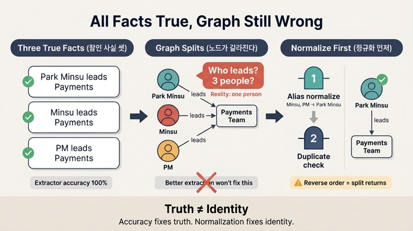

# 맞는 사실만 넣어도 그래프가 틀릴 수 있는 이유

> **Q.** 맞는 사실만 넣어도 그래프가 틀릴 수 있는 이유는 무엇인가?
>
> **A.** 이름이 다르면 노드가 갈라진다. 추출 정확도를 올리는 것으로는 고쳐지지 않는다.

## 한 줄 요약

트리플 하나하나는 **참(true)** 인데, 같은 대상을 가리키는 **이름이 여러 개**라서 그래프 위에서는 서로 다른 노드가 된다. 사실의 진위가 아니라 **동일성(identity)** 의 문제이므로, 추출기의 정확도(precision/recall)를 아무리 올려도 사라지지 않는다.

## 왜 이런 일이 생기나

그래프 DB에서 노드의 정체성은 보통 **문자열 키**로 정해진다. 28장 예제 1의 스키마가 그대로 보여준다.

```python
c.execute("CREATE NODE TABLE N(name STRING, PRIMARY KEY(name))")
```

`name`이 기본 키다. 즉 **문자열이 다르면 다른 존재**다. 그래서 아래 세 트리플은 모두 "맞는 사실"인데도,

| 턴 | 트리플 | 맞는 사실인가 |
|---|---|---|
| 1 | 박민수 -이끔-> 결제팀 | ✅ True |
| 3 | 민수 -이끔-> 결제팀 | ✅ True |
| 9 | PM -이끔-> 결제팀 | ✅ True |

그래프에는 `박민수`, `민수`, `PM` **세 개의 노드**가 생긴다. 실제로는 한 사람이다.

「결제팀을 이끄는 사람이 누구인가」를 물으면 세 명이 나온다. 이 장의 도입부 문장 — *"그래프를 열어 보니 「박민수」가 세 명이었습니다"* — 가 바로 이 상황이다.

## 이게 왜 고약한가: 「반쯤 맞는」 상태

책이 강조하는 지점은 여기다.

- **트리플 단위로 보면** 셋 다 맞다. 박민수도 결제팀을 이끌고, 민수도 이끌고, PM도 이끈다. 전부 참이다.
- **그래프 단위로 보면** 틀렸다. 「결제팀 리더는 몇 명인가」에 대한 답이 3이 되어버린다.

> "명백히 틀린 게 아니라 «반쯤 맞는» 상태라서 조회 결과만 보고는 문제가 있는지 알 수가 없다."

명백한 오류라면 눈에 띄어 걸러진다. 그런데 이 분열은 조회 결과가 그럴듯해 보이기 때문에 **탐지되지 않은 채 누적**된다. 게다가 파편이 늘어나면 관계도 흩어진다. `박민수`에 달린 사실, `민수`에 달린 사실, `PM`에 달린 사실이 각각 따로 쌓여서 어느 노드를 조회해도 그 사람에 대한 전체 그림이 나오지 않는다.

## 왜 추출 정확도로는 못 고치나

추출기(extractor)가 하는 일은 **문장 → 트리플** 변환이다. 정확도를 올린다는 것은 "문장이 말하지 않은 것을 뽑지 않기", "문장이 말한 것을 놓치지 않기"를 잘한다는 뜻이다.

그런데 문서에 실제로 이렇게 쓰여 있다고 해보자.

- 인사 공지: "박민수 님이 결제팀을 맡습니다"
- 채팅 로그: "민수가 결제팀 리드예요"
- 회의록: "PM이 결제팀 이끕니다"

추출기는 **세 문장 모두를 100% 정확하게** 읽었다. 뽑아낸 트리플에 오류가 하나도 없다. 정확도 1.0이다. 그런데도 노드는 셋으로 갈라진다.

즉 이 문제는 **추출 단계 밖**에 있다. 필요한 것은 "이 문자열들이 같은 실체를 가리키는가"를 판단하는 별도의 단계 — 27장에서 다룬 **개체 해상도(entity resolution)** 이고, 28장에서는 이것이 쓰기 관문의 **2번 정규화 관문**으로 들어온다.

정리하면,

| 문제 | 담당 | 고치는 방법 |
|---|---|---|
| 없는 사실을 뽑음 / 방향이 뒤집힘 | 추출 정확도, 확신도·스키마 관문 | 추출기 개선, 검증 |
| 같은 실체가 다른 이름으로 갈라짐 | **개체 해상도 / 정규화** | 별칭 사전, 정규화 관문 |

두 번째 칸은 첫 번째 칸을 아무리 잘해도 비어 있는 채로 남는다.

## 어떻게 고치나: 정규화 관문

예제 2가 해법을 보여준다. 별칭 표를 두고, **쓰기 전에 이름을 표준형으로 바꾼다.**

```python
ALIAS = {"민수": "박민수", "PM": "박민수"}
CANON = {"관리": "이끔", "리드": "이끔", "소속": "속함"}
```

정규화 관문은 다른 관문들과 성격이 다르다.

> "이름 정규화는 «막는» 관문이 아니라 «고치는» 관문이다."

확신도·스키마·단일값 관문은 후보를 **기각**하지만, 정규화는 후보를 **수정해서 통과**시킨다. 그래서 `민수 -이끔-> 결제팀`은 버려지지 않고 `박민수 -이끔-> 결제팀`으로 바뀌어 들어간다.

### 순서가 중요하다: 정규화 → 중복 검사

책이 못 박는 포인트다.

> "정규화를 먼저 하고 중복을 나중에 봐야 한다. 거꾸로 하면 «민수»와 «박민수»가 다른 것으로 보여서 중복이 안 걸린다."

- **정규화 먼저**: `민수` → `박민수` → 이미 있는 `박민수 -이끔-> 결제팀`과 같음 → 중복으로 차단 ✅
- **중복 먼저**: `민수 -이끔-> 결제팀`은 문자열이 다르니 중복 아님 → 통과 → 노드 분열 ❌

관계 이름도 마찬가지다. `박민수 -관리-> 결제팀`은 `CANON`을 거쳐 `박민수 -이끔-> 결제팀`이 되고, 그제서야 중복으로 잡힌다. 정규화가 없으면 「같은 뜻, 다른 관계 이름」도 별개 엣지로 쌓인다.

## 확장: 왜 읽기 전용 그래프에서는 안 생겼나

사람이 손으로 넣는 그래프에서는 이 문제가 훨씬 덜하다. 사람은 넣기 전에 "이거 이미 있는 그 사람이지" 하고 머릿속에서 정규화를 한다. 에이전트가 쓰기 시작하면 그 암묵적 단계가 사라진다.

> "읽기 전용 그래프에서는 이런 일이 안 생긴다. 사람이 넣은 것만 있으니까. 쓰기를 열면 «품질 관리»가 곧 시스템의 일부가 된다."

그리고 예제 1의 결말이 보여주듯, 검증 없는 쓰기 루프는 10턴이면 무너진다. 엣지 10개 중 3개가 틀렸고(30%), 노드는 갈라졌다. 「조회는 있는 것을 전부 준다」— **넣을 때 안 거른 것은 꺼낼 때도 안 걸러진다.**

## 한 줄로 외울 것

**진위(truth)와 동일성(identity)은 다른 축이다.** 추출 정확도는 진위 축만 다룬다. 동일성 축은 정규화/개체 해상도가 담당하며, 반드시 중복 검사보다 **먼저** 돌아야 한다.

## 관련 출처

- [Knowledge graph completion](https://arxiv.org/abs/2002.00388) [실험]
- [SHACL validation](https://www.w3.org/TR/shacl/) [표준] — 스키마 관문의 표준 형태
- 27장 「에이전트에게 기억을 주는 가장 싼 방법」 — 개체 해상도

## 인포그래픽


