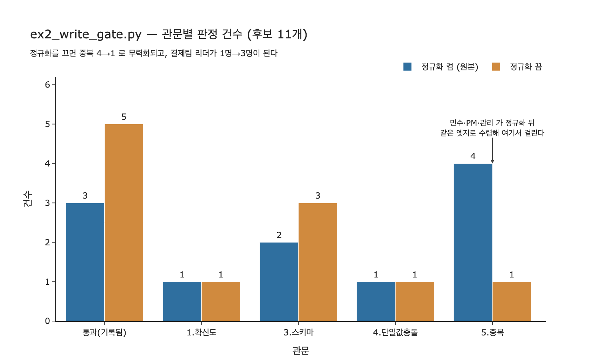

# 정규화가 있으면 중복 관문이 어떻게 작동하는가

## 질문과 답

**질문**: `ex2_write_gate.py`에서 정규화가 있으면 중복 관문이 어떻게 작동하는가?

**답**: 민수·PM이 정규화 뒤 「박민수」가 되므로 이미 있는 엣지와 중복으로 걸린다. 정규화가 없으면 노드가 셋이 된다.

---

## 1. 관문 다섯 단계와 그 순서

`ex2_write_gate.py`의 `gate()`는 후보 트리플 하나를 받아 위에서 아래로 흘려보냅니다. 번호가 곧 순서입니다.

| 순서 | 관문 | 하는 일 | 걸리면 |
|---|---|---|---|
| 1 | 확신도 | `conf < MIN_CONF(0.65)`이면 버림 | `1.확신도` |
| 2 | **정규화** | `ALIAS`로 주어를, `CANON`으로 관계 이름을 **바꿔치기** | (막지 않음, 고침) |
| 3 | 스키마 | `(k, ts, to)`가 `ALLOWED`에 있나 | `3.스키마` |
| 4 | 단일 값 | `SINGLE`(=`이끔`) 관계에 이미 다른 목적어가 있나 | `4.단일값충돌` |
| 5 | 중복 | 같은 `(s, k, o)` 엣지가 이미 있나 | `5.중복` |

여기서 핵심은 **2번이 3·4·5번보다 먼저 실행된다**는 점입니다. 정규화는 「막는」 관문이 아니라 「고치는」 관문이라, 자기 자신은 아무것도 떨어뜨리지 않습니다. 대신 뒤에 오는 세 관문이 보게 되는 **문자열 자체를 바꿔 놓습니다**.

```python
# 2) 이름 정규화 — 여기서 «막지는» 않고 «고친다»
s = ALIAS.get(s, s)      # ALIAS = {"민수": "박민수", "PM": "박민수"}
k = CANON.get(k, k)      # CANON = {"관리": "이끔", "리드": "이끔", "소속": "속함"}
```

그리고 5번 중복 검사는 이렇게 **정규화된 이름으로** DB를 조회합니다.

```python
r = c.execute("MATCH (a:N {name:$s})-[e:R {kind:$k}]->(b:N {name:$o}) RETURN 1",
              {"s": s, "k": k, "o": o})
if r.has_next():
    return False, "5.중복"
```

즉 중복 관문은 「같은 글자인가」가 아니라 「**정규화 후 같은 것을 가리키는가**」를 묻게 됩니다. 이 문장 하나가 질문의 전부입니다.

---

## 2. 후보 11개를 한 줄씩 따라가기 (정규화 켬 = 원본 코드)

`CANDIDATES` 11개를 순서대로 흘리면 이렇게 갈립니다. 굵게 표시한 것이 질문의 주인공입니다.

| # | 후보 | 확신 | 판정 | 왜 |
|---|---|---|---|---|
| 1 | 박민수 -이끔-> 결제팀 | 0.94 | 통과 (첫 기록) | 그래프가 비어 있어 전부 통과 |
| 2 | 이서연 -속함-> 결제팀 | 0.91 | 통과 | `("속함","Person","Team")` 허용 |
| 3 | **민수 -이끔-> 결제팀** | 0.88 | **막힘 — 5.중복** | 2번에서 `민수 → 박민수`. #1과 완전히 같은 엣지가 됨 |
| 4 | 이서연 -속함-> 정산팀 | 0.42 | 막힘 — 1.확신도 | `0.42 < 0.65` |
| 5 | 박민수 -이끔-> 정산팀 | 0.87 | 막힘 — 4.단일값충돌 | 타입은 맞지만 이미 결제팀을 이끔 |
| 6 | 결제팀 -속함-> 이서연 | 0.92 | 막힘 — 3.스키마 | 방향 뒤집힘. `Team → Person`은 허용에 없음 |
| 7 | 박민수 -관리-> 결제팀 | 0.83 | **막힘 — 5.중복** | 2번에서 `관리 → 이끔`. #1과 같은 엣지가 됨 |
| 8 | 이서연 -속함-> 결제팀 | 0.90 | 막힘 — 5.중복 | 정규화 없이도 글자 그대로 #2와 같음 |
| 9 | **PM -이끔-> 결제팀** | 0.71 | **막힘 — 5.중복** | 2번에서 `PM → 박민수`. #1과 같은 엣지가 됨 |
| 10 | 이서연 -선호-> 매운맛 | 0.86 | 통과 | `("선호","Person","Pref")` 허용 |
| 11 | 박민수 -선호-> 결제팀 | 0.88 | 막힘 — 3.스키마 | `Team`은 `Pref`가 아님 |

**결과**: 후보 11개 중 **3개**를 씀. 관문별로 잡은 수는 `{5.중복: 4, 1.확신도: 1, 4.단일값충돌: 1, 3.스키마: 2}`.

최종 그래프 — 엣지 3개.

```
박민수 -이끔-> 결제팀
이서연 -속함-> 결제팀
이서연 -선호-> 매운맛
```

「결제팀을 이끄는 사람」은 **박민수 한 명**입니다. #3·#7·#9는 서로 다른 문자열(`민수`, `관리`, `PM`)로 들어왔지만 전부 5번 중복 관문 하나에 모여 걸렸습니다. 중복 관문이 잡은 4건 중 **3건이 정규화 덕분에 잡힌 것**이고, 순수하게 글자가 같아서 걸린 건 #8 하나뿐입니다.

---

## 3. 정규화를 끄면 무슨 일이 생기나

같은 후보 11개를 `ALIAS`/`CANON`을 비워 놓고 흘려 보면 판정이 이렇게 갈립니다.

| # | 후보 | 정규화 켬 | 정규화 끔 | 달라진 이유 |
|---|---|---|---|---|
| 3 | 민수 -이끔-> 결제팀 | 막힘 — 5.중복 | **통과** | `민수`는 `TYPES`에 `Person`으로 있어 스키마 통과. `민수`가 이끄는 팀은 아직 없어 단일 값도 통과. 같은 이름의 엣지도 없어 중복도 통과 |
| 7 | 박민수 -관리-> 결제팀 | 막힘 — 5.중복 | 막힘 — **3.스키마** | `관리`가 `이끔`으로 안 바뀌니 `("관리","Person","Team")`이 `ALLOWED`에 없음 |
| 9 | PM -이끔-> 결제팀 | 막힘 — 5.중복 | **통과** | `PM` 역시 별개의 `Person` 노드로 취급됨 |

나머지 8개는 정규화와 무관하게 같은 판정을 받습니다.

**결과**: 후보 11개 중 **5개**를 씀. 관문별로 잡은 수는 `{1.확신도: 1, 3.스키마: 3, 4.단일값충돌: 1, 5.중복: 1}`.

최종 그래프 — 엣지 5개.

```
박민수 -이끔-> 결제팀
민수   -이끔-> 결제팀      ← 같은 사람
PM     -이끔-> 결제팀      ← 같은 사람
이서연 -속함-> 결제팀
이서연 -선호-> 매운맛
```

「결제팀을 이끄는 사람」이 **셋**이 되었습니다. 28.1절 `ex1_write_loop.py`에서 「박민수가 세 명이었습니다」로 시작한 바로 그 상태입니다. 관문 넷 중 셋(확신도·스키마·단일 값)이 멀쩡히 돌고 있는데도 그렇습니다.

여기서 두 가지를 더 읽어야 합니다.

- **중복 관문이 잡는 건수가 4 → 1로 떨어집니다.** 중복 검사 코드는 한 글자도 안 바꿨는데 잡는 능력이 사라집니다. 관문의 성능이 **자기 코드가 아니라 앞 단계의 출력에 달려 있다**는 뜻입니다.
- **스키마가 잡는 건수는 2 → 3으로 늘어납니다.** 그런데 이 늘어난 1건(#7 `박민수 -관리-> 결제팀`)은 *맞는 사실*입니다. 정규화가 없으면 참인 사실이 스키마에서 억울하게 떨어집니다. 「잡은 수가 늘었다」가 「더 잘 걸렀다」를 뜻하지 않는 사례입니다.

---

## 4. 순서를 뒤집으면 (정규화를 중복 뒤로 보내면)

원문이 마지막에 못을 박는 부분입니다.

> 순서가 중요하다. 정규화를 먼저 하고 중복을 나중에 봐야 한다. 거꾸로 하면 「민수」와 「박민수」가 다른 것으로 보여서 중복이 안 걸린다.

중복 검사를 정규화 **앞에** 두면 `MATCH (a:N {name:"민수"})...`로 조회하게 되고, 그래프에는 `박민수` 엣지만 있으니 결과가 비어 있습니다. 중복 아님으로 통과 → 그런 뒤에야 `민수 → 박민수`로 고쳐서 기록 → **정규화를 하고도 중복 엣지가 쌓입니다**.

실제로 돌려 보면(`expy.py`) `민수`·`PM`뿐 아니라 `관리`까지 통과해서 `박민수 -이끔-> 결제팀`이 **네 겹**으로 겹칩니다. 노드는 하나로 합쳐지는데 엣지가 중복되는, 원본보다 나쁜 상태입니다. 걸리는 건 글자가 완전히 똑같은 #8 하나뿐입니다.

정리하면 정규화의 위치에 따라 결과가 셋으로 갈립니다.

| 배치 | 노드 | 결과 |
|---|---|---|
| 정규화 → 중복 (원본) | 박민수 1개 | 엣지 3개, 중복 없음 ✅ |
| 정규화 없음 | 박민수/민수/PM 3개 | 엣지 5개, 사람이 셋으로 쪼개짐 |
| 중복 → 정규화 (뒤집음) | 박민수 1개 | 엣지 6개, 같은 엣지가 네 겹 |

---

## 5. 왜 이 관문 하나로는 안 되나 (관문 넷의 역할 분담)

정규화+중복만으로 충분해 보이지만 남는 게 있습니다. 각 관문이 잡는 것은 서로 겹치지 않습니다.

| 관문 | 이 관문만 잡을 수 있는 것 | 사례 |
|---|---|---|
| 확신도 | 추출기가 스스로 자신 없어 하는 것 | #4 (0.42) |
| 정규화 | 같은 것을 다른 이름으로 부르는 것 | #3, #7, #9 |
| 스키마 | **확신 있게 틀린 것**. 방향 뒤집힘, 타입 오류 | #6 (0.92!), #11 (0.88) |
| 단일 값 | 타입도 맞고 확신도 높은데 **기존 사실과 모순**되는 것 | #5 (0.87) |
| 중복 | 이미 아는 것 | #3, #7, #8, #9 |

확신도만 두면 #6(`결제팀 -속함-> 이서연`, 0.92)을 못 막습니다. 추출기가 문장을 잘못 읽을 때는 「자신 있게」 잘못 읽기 때문입니다. 반대로 스키마만 두면 #5(`박민수 -이끔-> 정산팀`, 0.87)를 못 막습니다. `Person → Team`으로 타입은 완벽하니까요. 한 장 요약의 표현대로 「각각 다른 것을 잡으니 하나만 두면 나머지가 샙니다」.

---

## 6. 한 줄 정리

정규화는 아무것도 막지 않지만, 뒤에 오는 중복 관문의 **비교 대상을 문자열에서 실체로 바꿔 놓습니다**. 그래서 `민수`·`PM`·`관리`가 전부 `박민수 -이끔-> 결제팀`이라는 하나의 엣지로 수렴해 중복으로 걸립니다. 정규화를 빼면 이 셋이 통과해 노드가 셋으로 갈라지고(`ex1`의 상태), 정규화를 중복 뒤로 미루면 노드는 하나여도 엣지가 세 겹으로 쌓입니다.

## 시각화


