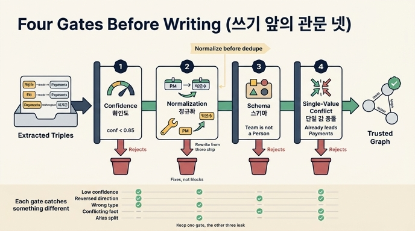

# 쓰기 앞에 세우는 관문 넷

> **Q.** 쓰기 앞에 세우는 관문 넷은 무엇인가?
> **A.** 확신도, 정규화, 스키마, 단일 값 충돌이다. 각각 다른 것을 잡으므로 하나만 두면 나머지가 샌다.

## 왜 관문이 필요한가

읽기 전용 그래프에서는 이 문제가 안 생깁니다. 사람이 넣은 것만 들어 있으니까요. 그런데 에이전트가 그래프에 **쓰기** 시작하면 품질 관리가 곧 시스템의 일부가 됩니다.

28장 예제 1(`ex1_write_loop.py`)은 추출 결과를 검증 없이 그대로 넣는 루프를 10턴 돌립니다. 결과는 이렇습니다.

- 엣지 10개 중 3개가 틀린 사실 (30%)
- 「결제팀을 이끄는 사람」을 물으면 **박민수 · 민수 · PM** 세 명이 나옴 (실제로는 한 명)
- 「정산팀」을 물으면 틀린 엣지 두 개가 통째로 답이 됨

여기서 두 가지를 봐야 합니다.

1. **맞는 사실만 넣어도 그래프는 틀릴 수 있다.** 박민수·민수·PM은 전부 「맞는 사실」이었습니다. 이름이 달랐을 뿐인데 노드가 셋으로 갈라졌어요. 추출 정확도를 올리는 것으로는 안 고쳐집니다(27장의 개체 해상도 문제).
2. **반쯤 맞는 상태가 더 고약하다.** 명백히 틀린 게 아니라서 조회 결과만 보고는 문제가 있는지 알 수가 없습니다.

그리고 조회는 「있는 것을 전부」 줍니다. **넣을 때 안 거른 것은 꺼낼 때도 안 걸러집니다.** 그래서 필터는 쓰기 앞에 있어야 합니다.

## 관문 넷

예제 2(`ex2_write_gate.py`)의 `gate()` 함수가 그대로 관문 넷입니다.

| # | 관문 | 하는 일 | 잡는 것 |
|---|---|---|---|
| 1 | **확신도** | `conf < MIN_CONF` 면 버림 (예제는 0.65) | 추출기가 자신 없어 한 것 |
| 2 | **정규화** | `ALIAS` / `CANON` 으로 이름·관계명을 표준형으로 **고침** | 같은 것의 다른 이름 |
| 3 | **스키마** | `(관계, 주어타입, 목적어타입)` 이 허용 집합에 있나 | 타입이 안 맞는 엣지, 방향 뒤집힘 |
| 4 | **단일 값 충돌** | 「하나만 가질 수 있는」 관계에 이미 다른 값이 있나 | 타입은 맞는데 사실이 충돌하는 것 |

```python
MIN_CONF = 0.65
SINGLE = {"이끔"}                                   # 팀장은 한 명
CANON  = {"관리": "이끔", "리드": "이끔", "소속": "속함"}
ALIAS  = {"민수": "박민수", "PM": "박민수"}
ALLOWED = {("이끔", "Person", "Team"), ("속함", "Person", "Team"),
           ("선호", "Person", "Pref")}
```

### 관문 2는 「막는」 게 아니라 「고치는」 관문이다

넷 중 정규화만 성격이 다릅니다. 나머지 셋은 후보를 **거부**하지만, 정규화는 후보를 **수정해서 통과시킵니다**. `민수`와 `PM`을 `박민수`로 바꿔 넣기 때문에 예제 1에서 셋으로 갈라졌던 노드가 하나가 됩니다.

## 왜 하나만 두면 안 되는가

각 관문이 다른 종류의 오류를 잡습니다. 예제 2의 후보들이 이걸 정확히 보여 줍니다.

**확신도만 두면 — 「확신 있게 틀린 것」을 못 막는다**

```
결제팀 -속함-> 이서연    확신 0.92
```

방향이 뒤집혔는데 확신도가 0.92입니다. 추출기가 문장을 잘못 읽으면 **자신 있게** 잘못 읽습니다. 확신도는 「모델이 얼마나 헷갈렸나」를 재는 것이지 「사실이 맞나」를 재는 게 아닙니다.

**스키마가 그걸 잡는다**

Team이 Person에 속할 수는 없으니까요. `박민수 -선호-> 결제팀`(0.88)도 스키마에서 걸립니다. Team은 Pref가 아닙니다.

**반대로 스키마만 두면 — 타입이 맞는 거짓말을 못 막는다**

```
박민수 -이끔-> 정산팀    확신 0.87
```

Person → Team 이니 타입은 완벽합니다. 확신도도 높습니다. 이건 **단일 값 관문**이 잡습니다. 박민수는 이미 결제팀을 이끌고 있는데 정산팀도 이끈다니 충돌이거든요.

**정규화가 없으면 — 중복이 중복으로 안 보인다**

`민수 -이끔-> 결제팀`, `PM -이끔-> 결제팀`은 그 자체로는 확신도·스키마·단일값을 전부 통과합니다. 정규화 뒤에 `박민수`가 되어야 비로소 「이미 있는 것」이 되어 걸립니다.

정리하면 이렇습니다.

| 오류 유형 | 확신도 | 정규화 | 스키마 | 단일값 |
|---|---|---|---|---|
| 확신 낮은 추출 (`이서연-속함->정산팀` 0.42) | ✅ | | | |
| 방향 뒤집힘 (`결제팀-속함->이서연` 0.92) | ❌ | | ✅ | |
| 타입 불일치 (`박민수-선호->결제팀` 0.88) | ❌ | | ✅ | |
| 사실 충돌 (`박민수-이끔->정산팀` 0.87) | ❌ | | ❌ | ✅ |
| 별칭 분열 (`민수`, `PM`) | ❌ | ✅ | ❌ | ❌ |

빈칸이 없는 열이 하나도 없습니다. 그래서 넷을 다 세워야 합니다.

## 순서가 중요하다 — 정규화는 중복 검사보다 먼저

예제 2의 코드에는 사실 검사가 다섯 개 있습니다. 관문 넷 뒤에 **중복 검사**가 하나 더 붙어 있어요. 그런데 이 중복 검사는 정규화에 얹혀 갑니다.

```
정규화 먼저 → 중복 나중:  민수 → 박민수 → "이미 있음" → 막힘 ✅
중복 먼저 → 정규화 나중:  민수 ≠ 박민수 → "새로운 것" → 통과 ❌
```

거꾸로 하면 「민수」와 「박민수」가 다른 것으로 보여서 중복이 안 걸립니다. 그러면 예제 1처럼 노드가 셋이 되고요. **정규화는 뒤에 오는 모든 비교의 전제 조건**이라 파이프라인 앞쪽에 있어야 합니다.

## 단일 값 충돌은 자동으로 덮어쓰지 마라

관문 4에서 충돌이 나면 「새 값으로 갱신」하고 싶어집니다. 하지 마세요. **오답이 정답을 지웁니다.** 둘 다 살려 두고 사람에게 보내는 게 맞습니다. 삭제는 되돌릴 수 없고, 어느 쪽이 맞는지는 관문이 알 수 있는 게 아니니까요.

## 관문 밖의 이야기 (28장의 나머지)

관문 넷은 「무엇을 쓸까」만 봅니다. 28장은 여기에 세 겹을 더 얹습니다.

- **출처(28.3)** — 모든 엣지에 출처를 달고, 추론할 때 「무엇에 기댔는지」도 같이 적습니다. 출처가 철회되면 거기 기댄 추론도 연쇄로 무너뜨립니다. 나중에는 복원 못 합니다. 추론 결과의 신뢰도는 근거 중 가장 약한 것보다 강할 수 없습니다.
- **드리프트(28.4)** — 관문을 다 통과한 「맞는 사실」만 쌓여도 **분포**가 기웁니다. 100세대를 돌리면 제약이 20%→9%로 반토막 납니다. 지워져서가 아니라 **묽어져서** 사라져요. 사람이 20%를 넣어도 방향은 안 바뀝니다. 개별 사실이 아니라 *비율*에 상한을 두세요.
- **확장 예산(28.5)** — 깊게 넓힐수록 수확은 줄고 오답은 늡니다(4홉 정확도 38%). 평소엔 2홉, 가끔 깊게 가되 결과는 검토 대기로 넣습니다. 자동 확장의 진짜 위험은 「틀린 사실」이 아니라 「멈출 줄 모르는 것」입니다.

## 외워 두기

> **확 · 정 · 스 · 단** — 확신도, 정규화, 스키마, 단일 값 충돌.
> 확신도는 *못 미더운 것*, 정규화는 *같은 것의 다른 이름*, 스키마는 *있을 수 없는 모양*, 단일 값은 *있을 수 없는 사실*을 잡는다.
> 그리고 **정규화는 앞쪽에.**

## 인포그래픽



## 참고

- knowledge graph completion — https://arxiv.org/abs/2002.00388 [실험]
- SHACL validation / schema drift — https://www.w3.org/TR/shacl/ [표준]
- provenance (PROV-O) — https://www.w3.org/TR/prov-o/ [표준]
