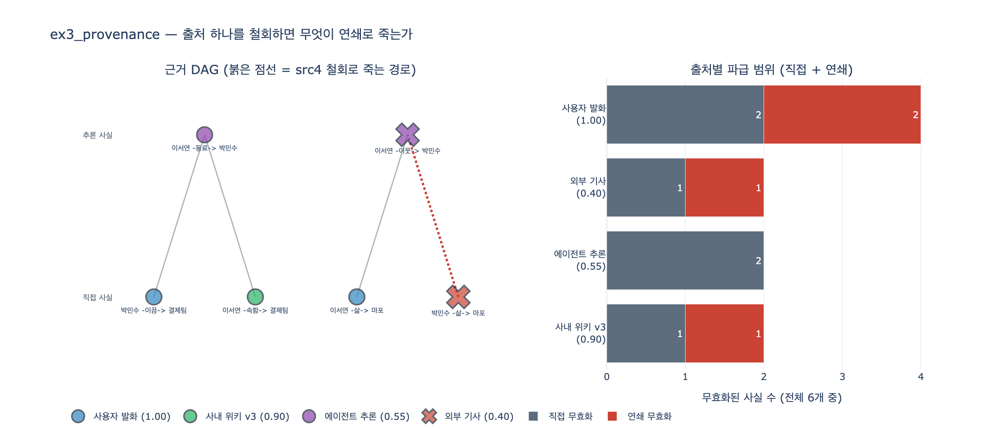

# `ex3_provenance.py`에서 출처 하나를 철회하면 무엇이 일어나는가?

**답:** 그 출처의 엣지가 죽고, 거기 기대던 추론 사실도 연쇄로 죽는다.
오보인 「박민수가 마포에 산다」를 철회하니 「이웃이다」도 무너진다.

---

## 1. 예제가 세워 둔 두 개의 기록

28.3절 「어디서 온 사실인가」의 예제는 그래프에 **두 종류의 기록**을 같이 남긴다.
이 둘이 다르다는 게 이 예제의 전부다.

### (1) 출처 — 이 사실이 어디서 왔나

```python
SOURCES = {
    "src1": ("사용자 발화",   "2026-05-01", 1.00),
    "src2": ("사내 위키 v3",  "2026-04-20", 0.90),
    "src3": ("에이전트 추론", "2026-05-02", 0.55),
    "src4": ("외부 기사",     "2026-03-11", 0.40),
}
```

그리고 모든 엣지가 `src`를 하나씩 달고 저장된다. 릴레이션 테이블 정의를 보면
`alive BOOLEAN`이 같이 들어 있다.

```python
c.execute("CREATE REL TABLE R(FROM N TO N, kind STRING, src STRING, "
          "conf DOUBLE, alive BOOLEAN)")
```

**엣지를 지우지 않고 `alive=false`로 눕힌다**는 점을 눈여겨볼 만하다.
철회는 삭제가 아니다. 「한때 믿었다가 물렸다」는 사실 자체가 감사 기록이 된다
(W3C PROV-O의 [Invalidation](https://www.w3.org/TR/prov-o/#Invalidation)이 이 모양이다).

### (2) 파생 — 이 사실은 무엇에 기댔나

출처만으로는 부족하다. 추론된 사실은 「에이전트가 만들었다」까지만 알려 줄 뿐
*무엇을 보고 만들었는지*는 안 알려 준다. 그래서 따로 적는다.

```python
DERIVED_FROM = {
    ("이서연", "동료", "박민수"): [("이서연", "속함", "결제팀"),
                                   ("박민수", "이끔", "결제팀")],
    ("이서연", "이웃", "박민수"): [("이서연", "삶", "마포"),
                                   ("박민수", "삶", "마포")],
}
```

이게 **정당화(justification)** 다. 진리 유지 시스템(truth maintenance system,
[Doyle 1979](https://dl.acm.org/doi/10.1145/321978.321979))에서 각 믿음에 붙이는
「이것을 믿는 이유」에 해당한다.

초기 그래프 6개 사실은 이렇게 생겼다.

| 사실 | 출처 | 신뢰 | 종류 |
|---|---|---|---|
| 박민수 -이끔-> 결제팀 | 사용자 발화 (src1) | 1.00 | 직접 |
| 이서연 -속함-> 결제팀 | 사내 위키 v3 (src2) | 0.90 | 직접 |
| 이서연 -삶-> 마포 | 사용자 발화 (src1) | 1.00 | 직접 |
| 박민수 -삶-> 마포 | 외부 기사 (src4) | 0.40 | 직접 |
| 이서연 -동료-> 박민수 | 에이전트 추론 (src3) | 0.55 | **추론** |
| 이서연 -이웃-> 박민수 | 에이전트 추론 (src3) | 0.55 | **추론** |

---

## 2. 철회하면 실제로 무슨 일이 일어나나

`retract("src4")`가 하는 일은 두 단계다.

### 단계 1 — 직접 사망

```python
c.execute("MATCH ()-[e:R {src:$s}]->() SET e.alive = false", {"s": src})
killed += [(*t, "직접") for t in direct]
```

`src4`를 단 엣지는 하나뿐이다. 「박민수 -삶-> 마포」가 눕는다.

### 단계 2 — 연쇄 사망 (부동점까지)

```python
changed = True
while changed:
    changed = False
    for derived, bases in DERIVED_FROM.items():
        ...  # derived 가 아직 살아 있는데
        for b in bases:
            ...  # 근거 b 중 하나라도 죽었으면
            c.execute("... SET e.alive = false", ...)
            killed.append((*derived, "연쇄"))
            changed = True
```

「이서연 -이웃-> 박민수」의 근거는 `[이서연-삶->마포, 박민수-삶->마포]` 두 개다.
그중 **둘째가 방금 죽었다.** 그래서 「이웃이다」도 같이 눕는다.

실행 결과가 이렇다.

```
외부 기사(src4)가 오보로 밝혀져 철회한다.
  죽임: 박민수 -삶-> 마포        (직접)
  죽임: 이서연 -이웃-> 박민수    (연쇄)

엣지 하나를 지웠는데 둘이 사라졌다.
```

### 두 가지 설계 포인트

**근거는 AND다.** 근거가 둘인데 하나만 죽어도 결론이 죽는다. `break`로 첫 죽은
근거를 만나자마자 빠져나오는 것이 그 뜻이다. 논리로 쓰면

$$\mathrm{alive}(f) \iff \mathrm{alive}\bigl(\mathrm{src}(f)\bigr) \wedge \bigwedge_{b \in B(f)} \mathrm{alive}(b)$$

「이서연이 마포에 산다」가 아직 살아 있어도 소용이 없다. 「이웃」이라는 결론은
*둘 다* 마포에 살아야 성립하니까.

**`while changed:` 루프가 필요한 이유.** 한 바퀴로 안 끝난다. 추론 사실이 또 다른
추론 사실의 근거일 수 있기 때문이다. 예제의 DAG는 깊이가 2라 한 라운드에 끝나지만,
에이전트가 추론 위에 추론을 쌓기 시작하면 이 루프가 실제로 여러 바퀴 돈다.
용어로는 **부동점(fixed point)** 계산이다. 더 죽는 게 없을 때까지 반복한다.

---

## 3. 안 죽는 것도 있다 — 이게 요점이다

같은 철회에서 「이서연 -동료-> 박민수」는 **살아남는다.**
출처가 똑같이 `src3`(에이전트 추론)인데도 그렇다.

근거가 `[이서연-속함->결제팀(src2), 박민수-이끔->결제팀(src1)]`이라
src4와 아무 상관이 없기 때문이다.

만약 `DERIVED_FROM`이 없고 출처만 있었다면 어떻게 됐을까. 선택지가 둘뿐이다.

- **src3 전체를 죽인다** → 멀쩡한 「동료다」까지 날린다 (과잉 철회)
- **src3를 그냥 둔다** → 오보에 기댄 「이웃이다」가 남는다 (과소 철회)

근거를 적어 뒀기 때문에 **딱 필요한 만큼만** 걷어 낼 수 있다.
28장 요약이 「추론할 때 *무엇에 기댔는지*를 같이 적으세요」라고 말하는 이유가 이것이다.

---

## 4. 출처별 파급 범위 — 어느 출처가 그래프를 지배하나

`expy.py`에서 네 출처를 각각 철회해 보면 파급이 이렇게 갈린다.

| 출처 | 신뢰 | 직접 | 연쇄 | 합계 | 증폭 |
|---|---|---|---|---|---|
| 사용자 발화 (src1) | 1.00 | 2 | 2 | **4** | 2.0x |
| 사내 위키 v3 (src2) | 0.90 | 1 | 1 | 2 | 2.0x |
| 에이전트 추론 (src3) | 0.55 | 2 | 0 | 2 | 1.0x |
| 외부 기사 (src4) | 0.40 | 1 | 1 | 2 | 2.0x |

- **src1은 등뼈다.** 전체 6개 중 4개를 무너뜨린다. 신뢰도가 제일 높으니 다행이지만,
  「사용자가 잘못 말했다」가 밝혀지면 그래프 3분의 2가 흔들린다는 뜻이기도 하다.
- **src3은 증폭 1.0배.** 추론 사실은 지금 잎(leaf)이라 아무도 기대지 않는다.
  다만 이게 오래 유지되지 않는다 — 28장이 경고하듯 에이전트가 쓰기 시작하면
  「추론된 사실」의 비율이 빠르게 오르고, 그러면 추론이 추론의 근거가 된다.
- **src4는 신뢰 0.40인데 증폭 2.0배.** *제일 약한 출처가 자기 몫보다 넓게 퍼져 있다.*
  파급이 큰 저신뢰 출처가 그래프의 취약점이다. 이 표가 그걸 찾는 방법이다.

### 부수 효과 — 철회 전에 이미 보이는 신호

추론 결과의 신뢰도는 근거 중 가장 약한 것을 넘을 수 없다.

$$\mathrm{conf}(f) \le \min_{b \in B(f)} \mathrm{conf}(b)$$

| 추론 사실 | 선언된 신뢰 | 근거 최소 | 판정 |
|---|---|---|---|
| 이서연 -동료-> 박민수 | 0.55 | 0.90 | 보수적 |
| 이서연 -이웃-> 박민수 | 0.55 | **0.40** | **과대평가** |

「이웃이다」는 0.55로 적혀 있는데 근거 중 제일 약한 것이 0.40이다.
**철회되기 전부터 이미 과대평가돼 있었다.** 근거를 적어 두면 오보가 밝혀지기를
기다리지 않고 이 불일치를 미리 잡아낼 수 있다.

---

## 5. 출처가 없으면 어떻게 되나

예제가 직접 말한다.

> 출처가 없으면 어떻게 되나. 오보인 걸 알아도 「이웃이다」는 남는다.
> 그리고 그건 어디서 왔는지 아무도 모르는 사실이 된다.
> 이런 것들이 쌓이면 그래프를 통째로 못 믿게 된다.

여기가 진짜 비용이다. 틀린 사실 하나가 문제가 아니라, **어느 사실이 틀렸는지
판정할 방법 자체가 없어지는 것**이 문제다. 그러면 그래프 전체의 신뢰도가
가장 약한 출처 수준으로 내려앉는다.

읽기 전용 그래프에서는 이 문제가 덜하다. 사람이 넣은 것만 있으니 추론 사실이
적기 때문이다. 에이전트가 쓰기를 시작하는 순간 추론 비율이 오르고,
연쇄 철회가 있느냐 없느냐가 시스템의 생사를 가른다.

---

## 6. 예제가 스스로 다는 경고

```
한 가지 주의. 이 예제는 «기댄 관계»를 손으로 적어 뒀다.
실무에서는 추론할 때 그때그때 기록해야 한다. 나중에는 복원 못 한다.
```

`DERIVED_FROM`은 예제라서 하드코딩돼 있다. 실무에서는 **추론이 일어나는 그 시점에**
어떤 사실들을 읽어서 이 결론을 냈는지 같이 써야 한다.

사후에 복원이 안 되는 이유는 간단하다. 「이서연과 박민수가 이웃이다」를 보고
근거를 역추적하려면 가능한 조합을 전부 뒤져야 하는데, 그래프가 커지면 조합이
폭발하고 애초에 에이전트가 *실제로* 무엇을 봤는지는 알 수 없다.
동일한 결론을 낼 수 있는 경로가 여러 개일 수도 있다.

기록은 쓸 때 공짜고, 나중에는 불가능하다.

---

## 한 줄 정리

| 물음 | 답 |
|---|---|
| 철회하면 뭐가 죽나 | 그 출처의 엣지가 **직접** 죽고, 거기 기대던 추론이 **연쇄**로 죽는다 |
| 어떻게 아나 | `DERIVED_FROM`에 「무엇에 기댔는지」를 추론하는 그 순간 적어 뒀기 때문 |
| 왜 반복하나 | 추론이 추론에 기댈 수 있어서. 더 죽는 게 없을 때까지(부동점) |
| 안 죽는 건 | 근거가 그 출처와 무관한 추론. 「동료다」는 살아남는다 |
| 없으면 | 오보를 알아도 「이웃이다」가 출처 불명 사실로 남고, 그런 게 쌓이면 그래프를 통째로 못 믿는다 |

## 시각화



왼쪽은 근거 DAG다. 아래가 직접 사실, 위가 추론 사실이고 색이 출처를 나타낸다.
붉은 점선이 src4 철회로 끊기는 경로이고, X 표시가 죽는 사실이다.
「동료다」쪽 두 근거는 회색 실선으로 멀쩡히 남아 있다.

오른쪽은 출처별 파급 범위다. 회색이 직접 무효화, 붉은색이 연쇄 무효화다.
사용자 발화가 4개로 제일 넓고, 에이전트 추론만 연쇄가 0이다.
