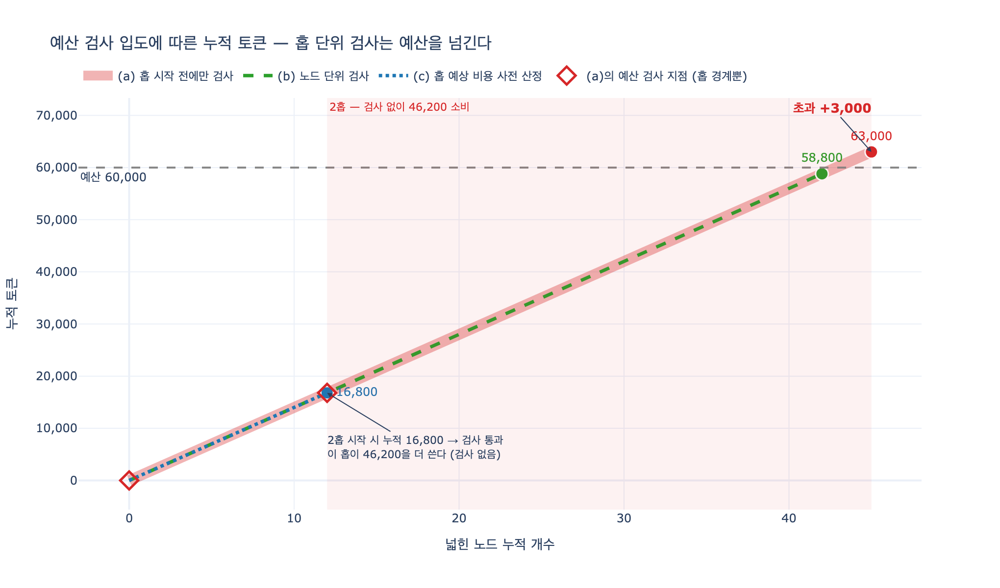

# `ex5`의 «토큰 예산 60,000»이 63,000을 쓴 이유

## 질문과 답

**질문** — `ex5`에서 '토큰 예산 60,000' 정책이 63,000을 쓴 이유는 무엇인가?

**답** — 홉을 시작하기 전에만 예산을 검사하고 중간에는 보지 않았다. 2홉 시작 시 누적 16,800으로 통과했고 그 홉이 46,200을 더 썼다.

---

## 1. 코드가 어떻게 생겼길래

`code/ex5_expansion_budget.py`의 확장 루프는 이렇게 생겼습니다.

```python
def expand(policy, rng):
    frontier = SEED_NODES              # 12
    got = right = wrong = tok = 0
    for hop in range(1, 5):
        if not policy(hop, got, wrong, tok):   # ← 예산 검사는 여기, 홉 하나에 한 번
            break
        y, acc = YIELD_BY_HOP[hop]
        new = frontier * y
        tok += frontier * COST_PER_EXPAND      # ← 홉 전체 비용을 «한 방에» 더한다
        r = new * acc
        got += new
        right += r
        wrong += new - r
        frontier = int(r)              # 맞는 것만 다음 홉의 씨앗
    return got, right, wrong, tok
```

정책은 람다 한 줄입니다.

```python
"토큰 예산 60,000": lambda h, g, w, t: t < 60_000
```

조건 자체는 틀린 데가 없습니다. `t < 60_000`이 아니면 멈춥니다.
문제는 **이 조건이 언제 평가되느냐**입니다. `for hop` 루프의 맨 앞, 즉 홉 경계에서만입니다.
홉 안으로 들어가고 나면 그 홉이 얼마를 쓰든 아무도 안 봅니다.

## 2. 숫자를 따라가 보면

| 시점 | 프런티어 | 검사 | 이 홉이 쓰는 비용 | 검사 후 누적 |
|---|---|---|---|---|
| 1홉 시작 전 | 12 | `0 < 60,000` **통과** | 12 × 1,400 = **16,800** | 16,800 |
| 2홉 시작 전 | 33 | `16,800 < 60,000` **통과** | 33 × 1,400 = **46,200** | **63,000** |
| 3홉 시작 전 | 49 | `63,000 < 60,000` **탈락** | — | 63,000 (중단) |

프런티어는 «맞는 사실»만 다음 씨앗이 되므로 이렇게 커집니다.

- 1홉: 12노드 → 새 사실 12 × 3.2 = 38.4개, 그중 맞는 것 38.4 × 0.86 = 33.024 → `int()` → **33노드**
- 2홉: 33노드 → 새 사실 33 × 2.1 = 69.3개, 맞는 것 69.3 × 0.71 = 49.203 → **49노드**

핵심은 여기입니다. **2홉을 시작할 때 누적은 16,800이었고, 이건 예산의 28%밖에 안 됩니다.**
검사는 아무 문제 없이 통과합니다. 그런데 그 홉의 프런티어는 33노드로 이미 씨앗의 세 배 가까이 불어 있었고,
홉 하나가 46,200 토큰 — **예산의 77%짜리 덩어리**를 통째로 소비합니다.

$$ 16{,}800 + 46{,}200 = 63{,}000 > 60{,}000 $$

예산 검사가 «넘지 않게 막는 장치»가 아니라 «넘고 나서 알아차리는 장치»가 되어 버린 겁니다.

> 표에서 하나 이상한 게 보인다. «토큰 예산 60,000»이 63,000 토큰을 썼다.
> 예산을 넘겼다. 홉을 «시작하기 전»에만 검사하고 중간에는 안 봐서다.
> 2홉을 시작할 때 누적이 16,800이라 통과했고, 그 홉이 46,200을 더 썼다.
> — 본문

## 3. 진짜 원인은 «검사 지점의 입도»다

이 버그는 «부등호 방향을 틀렸다»거나 «≤와 <를 헷갈렸다»는 종류가 아닙니다.
그런 실수라면 초과가 1 토큰이겠죠. 3,000이 나온 건 **검사와 검사 사이에 들어간 작업 덩어리가 컸기** 때문입니다.

일반화하면 이렇습니다.

> **예산을 «단위 작업 앞»에서만 보면, 단위 작업 하나가 남은 예산보다 클 때 못 막는다.**

여기서 단위 작업은 «홉 하나»입니다. 그리고 홉 하나의 비용은 고정이 아니라 프런티어 크기에 비례해서 **자랍니다**.
그래서 루프가 진행될수록 «검사 없이 흘러가는 구간»이 점점 커집니다. 이게 특히 고약한 부분입니다.
확장 루프는 본질적으로 지수적으로 커지는 작업이니, 검사 입도를 홉으로 두면 초과 위험도 같이 지수적으로 커집니다.

## 4. 초과 상한은 어떻게 계산하나

예산을 $B$, 검사 지점 사이에 검사 없이 실행되는 단위 작업의 비용을 $c_h$ 라 두겠습니다.

검사 조건이 «누적 $t$ 가 $B$ 미만이면 진행»일 때, **마지막으로 통과한 시점의 누적은 최대 $B-1$ 토큰**입니다(정수 토큰 기준).
그 직후 검사 없이 $c_h$ 가 통째로 들어가므로

$$ T_{\text{final}} \le (B - 1) + \max_h c_h $$

$$ \boxed{\ \text{초과량} = T_{\text{final}} - B \ \le\ \max_h c_h - 1\ } $$

**초과 상한은 예산 $B$ 와 아무 상관이 없습니다.** 오직 «검사 지점 사이 최대 단위 작업 비용»만이 정합니다.
예산을 6만에서 6백만으로 올려도 초과 가능량은 그대로입니다.
반대로 단위 작업을 잘게 쪼개면 예산을 그대로 둔 채 초과 상한이 줄어듭니다.

`ex5`의 파라미터로 계산해 보면:

| 홉 | 프런티어 $f_h$ | 홉 비용 $c_h = f_h \times 1400$ |
|---|---|---|
| 1 | 12 | 16,800 |
| 2 | 33 | 46,200 |
| 3 | 49 | **68,600** |
| 4 | 35 | 49,000 |

$\max_h c_h = 68{,}600$ 이므로

$$ \text{초과량} \le 68{,}600 - 1 = 68{,}599 \quad (\text{예산의 } 114\%) $$

이번 실행에서 초과가 3,000에 그친 건 순전히 **운**입니다.
씨앗 노드가 조금 더 많았거나 1홉 정확도가 조금 더 높았다면 3홉 시작 시 누적이 예산 미만이면서
68,600짜리 홉이 들어가 **최종 12만 토큰을 넘길 수도** 있었습니다.
«예산 6만»이라 써 놓고 12만을 쓰는 시스템이 되는 거죠.

$$ \frac{\text{홉 단위 초과 상한}}{\text{노드 단위 초과 상한}} = \max_h f_h = 49 $$

입도를 노드로 바꾸는 것만으로 최악 초과가 **49배** 줄어듭니다.

## 5. 고치는 방법

### (b) 노드 단위 검사 — 홉 안으로 들어가 노드마다 본다

```python
for hop in range(1, 5):
    y, acc = YIELD_BY_HOP[hop]
    expanded = 0
    for _ in range(frontier):
        if tok + COST_PER_EXPAND > budget:   # ← 노드 하나마다 검사
            break
        tok += COST_PER_EXPAND
        expanded += 1
    if expanded == 0:
        break
    new = expanded * y                        # 넓힌 만큼만 수확
    ...
```

- 단위 작업이 «홉»에서 «노드»로 바뀌므로 $c = 1{,}400$ 고정. 초과 상한 **1,399 토큰**(예산의 2.3%).
- 실제로 돌리면 2홉의 33노드 중 30노드까지 넓히고 끊깁니다. 최종 **58,800 토큰**, 예산 준수.
- 수확은 «맞는 것» 78개. 원본(82개)의 **94%**를 건집니다. 3,000 토큰 초과를 없애는 대가가 사실 4개입니다.
- 전제 조건: **홉을 중간에서 끊어도 부분 결과가 쓸모 있어야** 합니다. 확장 루프는 이 조건을 만족합니다(노드별로 독립).
  트랜잭션처럼 «전부 아니면 전무»인 작업에는 이 방법을 못 씁니다.

### (c) 홉 예상 비용 사전 산정 — 들어가기 전에 얼마 쓸지 미리 계산한다

```python
for hop in range(1, 5):
    est = frontier * COST_PER_EXPAND          # ← 이 홉의 예상 비용
    if tok + est > budget:                    # 남은 예산으로 감당 못 하면 아예 안 들어간다
        break
    ...
```

- 초과 상한 **0**. 예산을 절대 안 넘습니다.
- 대신 2홉을 통째로 포기해서 최종 16,800 토큰, 남은 43,200(예산의 **72%**)을 못 쓰고 버립니다.
- 수확도 «맞는 것» 33개로 원본의 40%에 그칩니다.
- 그리고 «예상 비용»이 정확히 계산되는 경우에만 안전합니다. LLM 호출처럼 출력 길이를 미리 모르면
  예상이 빗나가고, 빗나가는 순간 (a)와 같은 상황으로 돌아갑니다.

### 세 방식 비교 (실측)

| 검사 방식 | 새 사실 | 맞는 것 | 틀린 것 | 최종 토큰 | 예산 대비 | 남긴 예산 | 초과 상한 |
|---|---:|---:|---:|---:|---:|---:|---:|
| (a) 홉 시작 전에만 (원본) | 108 | 82 | 25 | 63,000 | **+3,000** | 0 | 68,599 |
| (b) 노드 단위 | 101 | 78 | 24 | 58,800 | −1,200 | 1,200 | 1,399 |
| (c) 홉 예상 비용 사전 산정 | 38 | 33 | 5 | 16,800 | −43,200 | 43,200 | 0 |

(c)의 «맞는 것/1만 토큰» 효율이 19.7로 제일 높게 나오지만, 이건 정확도 86%짜리 1홉만 돌았기 때문이지
좋은 정책이라서가 아닙니다. 절대 수확은 (b)의 절반 이하입니다. **효율이 높다고 좋은 게 아니라는 건 본문이 이미 지적한 함정**입니다.

### 실무에서는 (b) + (c)를 같이 쓴다

1. **홉 예상 비용으로 «들어갈지»를 정한다** — 남은 예산으로 홉 전체를 감당 못 하면, 감당 가능한 만큼만 프런티어를 잘라서 진입.
2. **노드 단위 검사를 안전망으로 둔다** — 예상이 빗나가도(LLM 출력이 예상보다 길었다든지) 노드 하나 값 이상 못 넘어간다.

이렇게 하면 예산도 지키고 남은 예산도 다 씁니다.

## 6. 같은 모양의 버그가 나는 곳들

이 패턴은 그래프 확장에만 있는 게 아닙니다. «예산/한도를 단위 작업 앞에서만 검사»하는 모든 곳에서 같은 모양으로 납니다.

| 상황 | 단위 작업 | 초과가 나는 방식 |
|---|---|---|
| 에이전트 토큰 예산 | 도구 호출 1회 | 검색 결과 200KB가 한 번에 들어와 컨텍스트 폭발 (24장) |
| 재시도 루프 타임아웃 | 시도 1회 | 타임아웃 직전에 시작한 시도가 전체 데드라인을 넘김 |
| 배치 잡 메모리 한도 | 배치 1개 | 배치 크기가 가변이면 큰 배치 하나가 OOM |
| 비용 상한 | API 호출 1건 | 스트리밍 응답 길이를 미리 모름 |
| Rate limit | 요청 1건 | 요청 하나가 여러 토큰을 소비하는 가중 방식일 때 |

체크리스트로 정리하면 이렇습니다.

1. 내 예산 검사는 **어느 입도**에서 도는가?
2. 검사와 검사 사이 **최대 단위 작업 비용**은 얼마인가?
3. 그 값이 **예산 자체보다 크지 않은가**? 크다면 검사는 사실상 무의미하다.
4. 단위 작업을 더 잘게 쪼갤 수 있는가? 못 쪼갠다면 **사전 비용 산정**을 붙일 수 있는가?

## 7. 같이 볼 것 — «틀린 것 30개 넘으면 중단»도 같은 병이다

본문이 바로 이어서 지적하는 정책입니다.

> 다만 이것도 30개를 «넘고 나서» 안다. 틀린 사실 30개가 이미 들어간 뒤다.

품질 기준으로 멈추는 좋은 발상이지만(20장의 «진전 없음»과 같은 계열),
**사후 판정**이라는 점에서 예산 버그와 정확히 같은 구조입니다.
그래서 본문의 처방도 같은 계열입니다 — 결과를 **쓰기 전 대기열**에 쌓아 두고, 중단 조건에 걸리면 대기열을 통째로 버립니다.
즉 «되돌릴 수 있게 만들어서» 사후 판정의 손해를 0으로 만드는 겁니다(22장의 보상 트랜잭션과 같은 발상).

정리하면 사후 검사의 손해를 줄이는 길은 둘뿐입니다.

- **검사를 더 자주 한다** (입도를 줄인다) → 예산 문제의 (b)
- **되돌릴 수 있게 만든다** (대기열, 보상) → 품질 문제의 대기열

## 시각화



굵은 연빨강이 (a) 원본입니다. 다이아몬드 표시가 **예산 검사가 실제로 도는 지점**인데,
0노드와 12노드 두 곳뿐입니다. 12노드에서 45노드까지 33개 노드가 넓혀지는 동안 아무 검사도 없습니다(음영 구간).
초록 점선 (b)는 같은 기울기를 따라가다 예산선 바로 아래 58,800에서 멈추고,
파란 점선 (c)는 12노드/16,800에서 홉 전체를 포기해 예산의 72%를 남깁니다.
세 선의 기울기가 같은 게 요점입니다 — **소비 속도는 똑같고, 어디서 멈출 수 있느냐만 다릅니다.**
