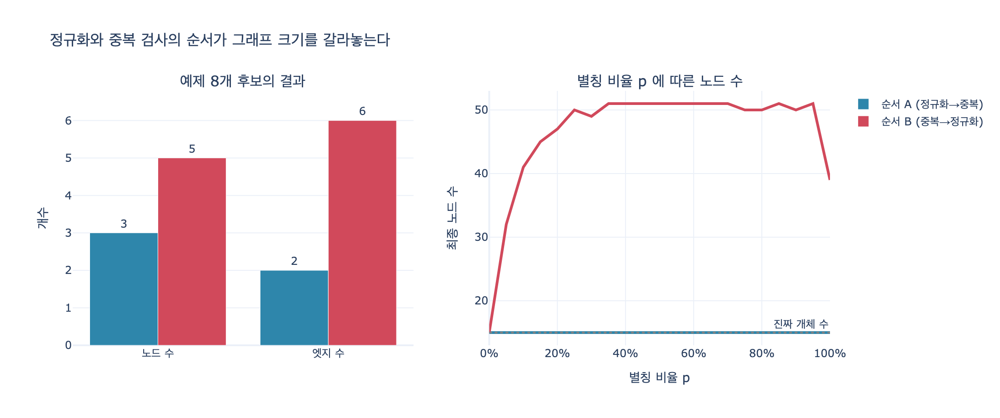

# 정규화와 중복 검사의 순서는 왜 중요한가?

## 한 줄 답

**정규화가 먼저 돌아야 한다.** 거꾸로 하면 「민수」와 「박민수」가 달라 보여서 중복이 걸리지 않는다.

---

## 1. 어디서 나온 이야기인가

28장 「쓰기 앞에 관문 넷」의 마지막 문단이다. 에이전트가 그래프에 *쓰기* 시작하면
추출 결과를 그대로 넣을 수 없으므로 관문을 세우는데, 그 관문이 넷이다.

| 관문 | 무엇을 잡나 | 성격 |
|---|---|---|
| 1. 확신도 | 추출기가 자신 없어 하는 것 | **막는다** |
| 2. 정규화 | 표면형이 다른 같은 것 (별칭, 관계 이름 변형) | **고친다** |
| 3. 스키마 | 타입이 안 맞는 관계 (Team이 Person에 속함 등) | **막는다** |
| 4. 단일 값 충돌 | 하나만 있어야 하는 값이 둘이 된 것 | **막는다** (사람에게 보냄) |
| 5. 중복 | 이미 있는 사실 | **막는다** |

여기서 2번 정규화만 성격이 다르다. 나머지는 후보를 «막는» 관문인데
정규화는 후보를 «고쳐서 통과시키는» 관문이다.
그리고 바로 이 성격 때문에 **정규화의 출력이 뒤 관문의 입력이 된다**.
순서가 취향 문제가 아니라 정확성 문제인 이유가 여기 있다.

책의 예제 코드(`ex2_write_gate.py`)에서도 게이트 함수 본문이 이 순서로 되어 있다.

```python
def gate(c, s, k, o, conf):
    # 1) 확신도
    if conf < MIN_CONF: ...
    # 2) 이름 정규화 — 여기서 «막지는» 않고 «고친다»
    s = ALIAS.get(s, s)
    k = CANON.get(k, k)
    # 3) 스키마
    # 4) 단일 값
    # 5) 중복   ← 정규화된 s, k 로 조회한다
```

---

## 2. 왜 순서가 뒤바뀌면 못 잡나

중복 검사는 결국 **「이 둘이 같은가?」**라는 판정이다.
판정의 전부는 «어떤 동등성 기준으로 비교하는가»에 달려 있다.

- **중복이 먼저** 돌면 비교 대상이 **표면형(surface form)** 이다.
  `"민수" != "박민수"` 이므로 문자열 비교에서 그냥 통과한다.
- **정규화가 먼저** 돌면 비교 대상이 **정규형(canonical form)** 이다.
  둘 다 `"박민수"` 로 바뀐 뒤에 비교하니 중복이 잡힌다.

수식으로 쓰면 이렇다. 정규화 함수를 $\nu$ 라 하자.

$$x \sim_{\text{raw}} y \iff x = y, \qquad x \sim_{\nu} y \iff \nu(x) = \nu(y)$$

$\nu$ 는 여러 표면형을 하나로 뭉개므로 단사(injective)가 아니고, 따라서

$$\sim_{\text{raw}} \subsetneq \sim_{\nu}$$

**표면형 비교가 잡는 중복은 정규형 비교가 잡는 중복의 진부분집합이다.**
순서를 뒤집으면 차집합 $\sim_{\nu} \setminus \sim_{\text{raw}}$ 만큼이 통째로 새어 나간다.
그리고 새어 나가는 쪽이 바로 실무에서 제일 흔한 «같은 사람, 다른 이름» 케이스다.

정규화는 관계 이름에도 걸린다. `관리 → 이끔`, `소속 → 속함`.
그래서 「박민수 -관리-> 결제팀」과 「박민수 -이끔-> 결제팀」도
정규화 뒤에야 같은 사실로 보인다.

---

## 3. 실제로 뭐가 달라지나

`expy.py` 에서 같은 후보 8개를 두 순서로 흘려 본 결과다.

| | 순서 A (정규화 → 중복) | 순서 B (중복 → 정규화) |
|---|---|---|
| 「민수 -이끔-> 결제팀」 | 중복으로 막힘 | 통과 → 새 노드 «민수» 생성 |
| 「PM -이끔-> 결제팀」 | 중복으로 막힘 | 통과 → 새 노드 «PM» 생성 |
| 「박민수 -관리-> 결제팀」 | 중복으로 막힘 | 통과 → 엣지 중복 |
| 「이서연 -소속-> 결제팀」 | 중복으로 막힘 | 통과 → 엣지 중복 |
| **최종 노드** | **3개** | **5개** |
| **최종 엣지** | **2개** | **6개** |
| 「결제팀을 이끄는 사람」 조회 | `['박민수']` | `['PM', '민수', '박민수']` |

이게 28장 예제 1의 첫 문장 — **「그래프를 열어 보니 박민수가 세 명이었습니다」** — 그 상황이다.

무서운 점은 **넣은 사실이 전부 맞는 사실**이라는 것이다.
「민수가 결제팀을 이끈다」도 맞고 「PM이 결제팀을 이끈다」도 맞다.
추출 정확도를 아무리 올려도 이 문제는 안 고쳐진다.
틀린 건 사실이 아니라 **이름의 처리 순서**다.

책의 표현대로 «명백히 틀린 게 아니라 반쯤 맞는» 상태라서,
조회 결과만 보고는 문제가 있는지조차 알 수 없다.

---

## 4. 왜 나중에 고치면 안 되나 — 되돌릴 수 없다

「일단 넣고 나중에 배치로 정규화해서 병합하면 되지 않나」 싶지만 어렵다.

중복 검사는 단순한 필터가 아니라 **개체의 identity를 확정하는 단계**다.
여기서 「민수는 처음 보는 개체」라고 판정되는 순간 노드가 생기고,
그 뒤로 「민수」에 엣지가 붙기 시작한다. 시간이 지나면

- 「민수」 노드에 붙은 엣지들
- 「박민수」 노드에 붙은 엣지들
- 그중 어느 쪽이 맞는지 판단할 근거(출처, 시점)

이 전부 뒤섞인다. 병합하려면 엣지 재연결 + 속성 충돌 해결 + 파생 사실 재계산이 필요하고,
28장 3절의 «어디서 온 사실인가»(출처 기록)를 안 남겨 뒀다면 아예 복원이 안 된다.
22장의 «되돌릴 수 없는 일»과 같은 구조다. **막을 수 있을 때 막아야 한다.**

---

## 5. 정규화 앞에는 무엇이 와야 하나

정규화가 중복보다 앞이라고 해서 맨 앞은 아니다. 확신도가 더 앞이다.

```
확신도 → 정규화 → 스키마 → 단일 값 충돌 → 중복 → 쓰기
```

이유는 각각 이렇다.

- **확신도가 정규화보다 앞**: 어차피 버릴 후보를 정규화하느라 별칭 조회를 돌릴 이유가 없다.
  값싼 필터가 앞이다.
- **정규화가 스키마보다 앞**: 스키마는 `(관계, 주어타입, 목적어타입)` 조합을 본다.
  `관리` 가 `이끔` 으로 정규화되지 않으면 ALLOWED 표에 없는 관계라 멀쩡한 사실이 스키마에서 튕긴다.
- **정규화가 단일 값 충돌보다 앞**: 「팀장은 한 명」 제약을 표면형으로 재면
  「박민수」와 「민수」가 서로 다른 팀장으로 보여 있지도 않은 충돌이 잡힌다(거짓 양성).
- **정규화가 중복보다 앞**: 이 카드의 주제. 진짜 중복을 놓친다(거짓 음성).

정리하면 **정규화는 그 뒤 모든 판정이 쓰는 「비교 기준」을 만드는 단계**다.
기준을 만들기 전에 재면, 그 판정은 전부 잘못된 좌표계 위에서 이뤄진다.

---

## 6. 실무 체크리스트

- [ ] 쓰기 파이프라인에서 정규화 단계가 중복/충돌/스키마 검사보다 **위**에 있는가
- [ ] 정규화 대상이 **개체 이름과 관계 이름 둘 다**인가 (`ALIAS` + `CANON`)
- [ ] 정규화는 «막는» 게 아니라 «고쳐서 통과시키는» 것으로 구현돼 있는가
- [ ] 새 별칭이 발견되면 별칭표에 추가되는 경로가 있는가 (27장 개체 해상도)
- [ ] 그럼에도 갈라진 노드가 생겼을 때 병합할 수 있도록 **출처와 시점을 기록**하는가 (28.3절)
- [ ] 「같은 개체로 보이는 노드 후보」를 주기적으로 재는 지표가 있는가

---

## 7. 관련 개념

| 용어 | 뜻 | 이 장에서 |
|---|---|---|
| 개체 해상도 (entity resolution) | 서로 다른 표면형이 같은 실세계 개체인지 판정 | 27장. 정규화의 상위 개념 |
| 정규화 (canonicalization) | 여러 표면형을 하나의 정규형으로 매핑 | 관문 2 |
| 중복 제거 (deduplication) | 이미 있는 사실을 다시 쓰지 않기 | 관문 5 |
| 스키마 드리프트 | 제약 없이 쓰다 보면 스키마가 흐물흐물해지는 현상 | [SHACL](https://www.w3.org/TR/shacl/) |
| 출처 기록 (provenance) | 사실이 어디서 왔는지 남기기 | 28.3절, [PROV-O](https://www.w3.org/TR/prov-o/) |

---

## 시각화



왼쪽은 예제 8개 후보를 두 순서로 흘렸을 때의 최종 노드/엣지 수다.
정규화를 먼저 돌리면 노드 3개·엣지 2개, 뒤로 미루면 노드 5개·엣지 6개가 된다.

오른쪽은 별칭이 섞이는 비율 $p$ 를 0에서 100%까지 움직이면서 잰 최종 노드 수다.
순서 A(파랑)는 «진짜 개체 수»에 딱 붙어 평평하지만,
순서 B(빨강)는 $p$ 가 조금만 올라가도 곧장 3배 넘게 치솟는다.

$p \to 1$ 근처에서 다시 내려오는 게 눈에 띄는데,
모두가 별칭만 쓰면 별칭끼리는 표면형이 같아져서 그때는 중복이 다시 걸리기 때문이다.
즉 **정규 이름과 별칭이 뒤섞여 들어올 때가 제일 위험하다.** 현실이 정확히 그 구간이다.
