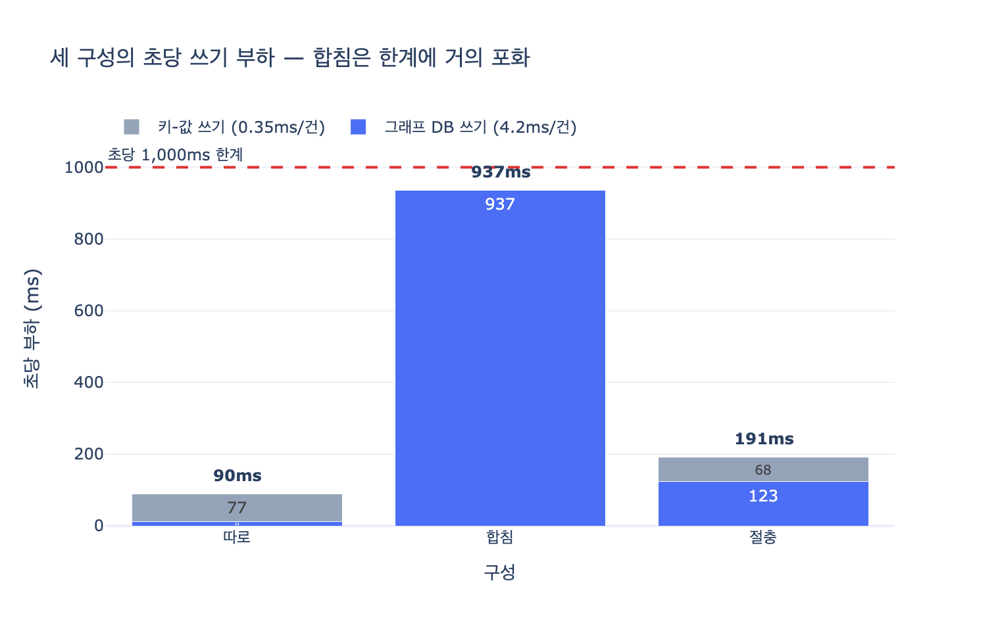

# 세 구성의 초당 부하 — 90ms / 937ms / 191ms

## 질문

세 구성(따로 / 합침 / 절충)의 초당 부하는 각각 얼마인가?

## 답

| 구성 | 초당 부하 | 비고 |
|---|---|---|
| 따로 (그래프 DB + 상태 저장소) | **90ms** | 각자 최적화된 저장소, 교차 질의 불가 |
| 합침 (한 그래프 DB) | **937ms** | 초당 1,000ms 한계에 거의 **포화** |
| 절충 (실행 본문은 별도, 링크만 그래프에) | **191ms** | 교차 질의 가능, 한 트랜잭션은 포기 |

## 어디서 나온 숫자인가 (`ex4_split_cost.py`)

29장 예제 4는 워크로드와 저장소별 쓰기 지연을 상수로 놓고 세 구성의 초당 쓰기 부하를 계산한다.

- 워크로드: 지식 쓰기 **3/s**, 실행 상태 쓰기 **220/s** (슈퍼스텝마다 상태를 쓰는 21장 패턴 — 실행 쓰기가 지식 쓰기의 약 70배)
- 지연: 그래프 DB 쓰기 **4.2ms/건**, 키-값 저장소 쓰기 **0.35ms/건** (21장에서 잰 값을 단순화한 것 — 절대값이 아니라 *비율*이 요점)

초당 부하 = (그래프 쓰기/s × 4.2ms) + (키-값 쓰기/s × 0.35ms)

1. **따로**: 지식 3건만 그래프로, 실행 220건은 키-값으로.
   $3 \times 4.2 + 220 \times 0.35 = 12.6 + 77 = 89.6 \approx 90\,\text{ms}$
2. **합침**: 223건 전부 그래프 DB로.
   $(3 + 220) \times 4.2 = 936.6 \approx 937\,\text{ms}$
3. **절충**: 실행 쓰기의 12%만 링크 엣지로 그래프에, 나머지 88%(본문)는 키-값에.
   $(3 + 26.4) \times 4.2 + 193.6 \times 0.35 = 123.5 + 67.8 \approx 191\,\text{ms}$

## 왜 이 숫자가 중요한가

- **합침 937ms**: 1초 동안 쓰기에만 937ms를 쓴다는 뜻이므로, 초당 1,000ms 예산 대비 **약 94% 포화**다. 트래픽이 조금만 늘어도 무너진다. 그래프 DB는 「관계를 따라가는」 데 최적화돼 있지 「초당 수백 건의 작은 갱신」에 최적화돼 있지 않기 때문이다.
- **따로 90ms**: 가장 싸지만, 실행이 어떤 사실을 읽었는지 이을 엣지가 없어 교차 질의(계보 추적)가 불가능하고, 두 저장소가 에러 없이 갈라진다(예제 1의 사고).
- **절충 191ms**: 「따로」의 약 2배지만 「합침」의 약 1/5. 상태 본문은 SQLite·Postgres 같은 빠른 저장소에 두고, 그래프에는 Run 노드 + Reads/Writes 링크 엣지만 남긴다. 교차 질의는 살리고 부하는 막는다. 대신 「한 트랜잭션」을 포기하므로 30장(이벤트 소싱)·31장(낙관적 잠금)이 필요해진다.

결론: 물을 것은 「무엇을 같은 그래프에 둘까」가 아니라 **「무엇을 엣지로 이어야 하나」**다.

## 시각화

