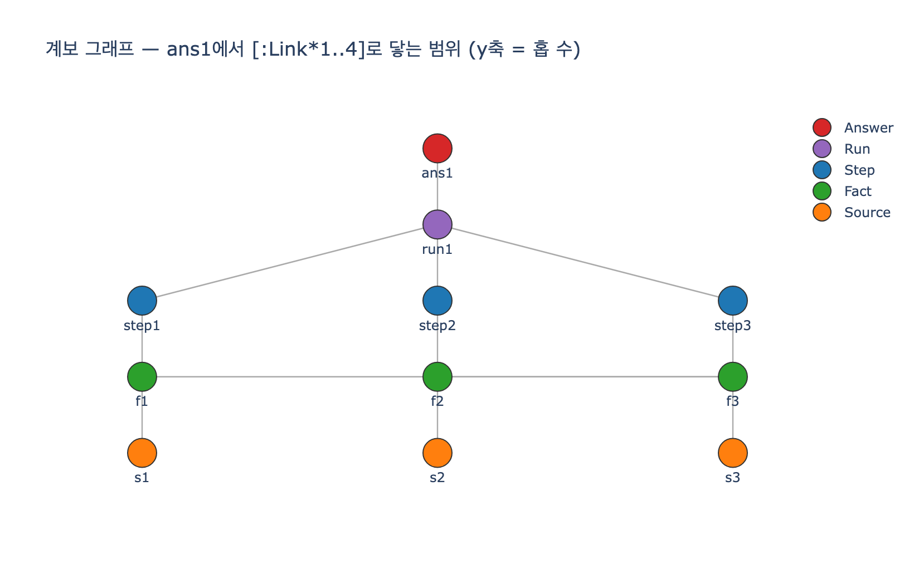

# 계보를 거슬러 올라가는 질의 — 가변 길이 경로

## 질문

계보(lineage)를 거슬러 올라가는 질의는 어떻게 쓰는가?

## 답

```cypher
MATCH (a:Node {id:'ans1'})-[:Link*1..4]->(x:Node)
RETURN DISTINCT x.kind, x.label
```

처럼 **가변 길이 경로**(variable-length path)를 쓴다.

## 왜 가변 길이 경로인가

29장 예제 3(`ex3_lineage.py`)의 상황이다. 에이전트가 답을 하나 내놓았다.

> 답: 「3분기 환불률이 늘어난 이유는 배송 지연」

이 답의 근거는 한 홉이 아니라 여러 홉에 걸쳐 있다.

```
답(ans1) → 실행(run1) → 스텝(step1~3) → 사실(f1~3) → 출처(s1~3)
   1홉         2홉            3홉            4홉
```

근거 노드마다 깊이가 다르므로(실행은 1홉, 출처는 4홉) 고정 길이 패턴
`-[:Link]->`를 네 번 쓰는 대신, 홉 수를 범위로 지정하는 `*1..4`를 쓴다.
그러면 **쿼리 한 줄로 근거 전체**(Run, Step, Fact, Source)가 나온다.

## 문법 뜯어보기

| 부분 | 의미 |
|---|---|
| `(a:Node {id:'ans1'})` | 출발점 — 계보를 추적할 답 노드 |
| `-[:Link*1..4]->` | `Link` 엣지를 **1홉 이상 4홉 이하** 따라간다 |
| `(x:Node)` | 경로 끝에 닿은 모든 노드 |
| `RETURN DISTINCT` | 한 노드에 여러 경로로 닿을 수 있으므로 중복 제거 |

- `*1..4`의 상한은 계보의 최대 깊이(답→실행→스텝→사실→출처 = 4홉)에서 왔다.
  상한 없이 `*`만 쓰면 큰 그래프에서 탐색이 폭발할 수 있다.
- `DISTINCT`가 필요한 실제 사례: `f1`(환불 사유 1위)에는
  `step1→f1`(읽음)과 `step3→f3→f1`(만듦→기댐) **두 경로**로 닿는다.
  이 예제에서 `*1..4` 도달 경로는 12개지만 DISTINCT 노드는 10개다.

## 같은 엣지, 두 방향

이 질의의 진짜 값어치는 **같은 엣지를 반대로도 따라갈 수 있다**는 것이다.

| 방향 | 질문 | 쿼리 형태 |
|---|---|---|
| 정방향 | 왜 이 답이 나왔나? | `(a {id:'ans1'})-[:Link*1..4]->(x)` |
| 역방향 | 이 출처가 틀리면 뭐가 무너지나? | `(a)-[:Link*1..4]->(s {id:'s2'})` |

역방향 예: 「물류 대시보드(s2)가 틀렸다면?」 → 그 사실(f2)과 그것에 기댄
상관 판단(f3), 해당 스텝, 실행, 그리고 최종 답까지 전부 걸린다.
운영에서 제일 자주 나오는 두 질문이 **같은 엣지의 양방향 순회**로 답해진다.

## 전제 조건 두 가지

1. **한 백본**: 지식(사실·출처)과 실행(Run·Step)이 한 그래프에 있어야
   「답에서 출처까지」가 한 쿼리로 이어진다. 따로 두면 실행 로그와 지식
   그래프를 사람이 오가며 손으로 이어야 한다.
2. **엣지는 저절로 생기지 않는다**: 실행할 때마다 `Reads`·`Writes`·`기댐`
   엣지를 만들어 둬야 한다. 그게 계보의 값이고, 실행마다 엣지 서너 개씩
   늘어나는 게 그 비용이다.

참고: 계보 추적의 표준 어휘는 W3C [PROV-O](https://www.w3.org/TR/prov-o/#Derivation)의
Derivation 관계다. 이 예제의 `기댐`·`출처` 엣지가 그에 해당한다.

## 시각화


