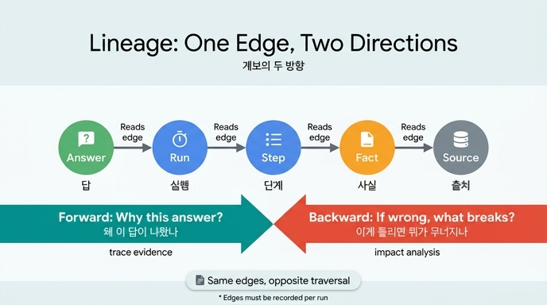

# Reads 엣지 계보의 두 방향

## 질문
Reads 엣지로 만들어지는 계보는 어떤 두 방향으로 쓰이는가?

## 답
**"왜 이 답이 나왔나"(정방향)**와 **"이게 틀리면 뭐가 무너지나"(역방향)**다.

---

## 자세한 설명

### Reads 엣지가 왜 계보를 만드는가

29장의 핵심은 지식(Entity/Knows)과 실행(Run/Reads/Writes)을 **한 그래프(하나의 백본)**에 두는 것이다. 따로 두면 "이 실행이 저 사실을 읽었다"는 관계를 그릴 곳 자체가 없다. 실행 로그는 로그대로, 지식 그래프는 그래프대로 존재해서 사람이 두 시스템을 오가며 손으로 이어야 한다.

한 그래프에 두면 실행이 사실을 읽을 때마다 `Reads` 엣지(읽은 시각 `at`, 기준 시각 `as_of` 포함)를 만들 수 있고, 이 엣지들이 쌓여 **계보(lineage)** — `답 → 실행 → 단계 → 읽은 사실 → 출처`로 이어지는 경로 — 가 된다. 이는 W3C PROV-O의 derivation 개념과 같은 표준적인 data lineage 발상이다.

### 정방향 — "왜 이 답이 나왔나"

답에서 출발해 엣지를 **따라 내려가며** 근거 전체를 뽑는다. 예제 3(ex3_lineage.py)에서는 쿼리 한 줄이다.

```cypher
MATCH (a:Node {id:'ans1'})-[:Link*1..4]->(x:Node)
RETURN DISTINCT x.kind, x.label
```

「3분기 환불률이 늘어난 이유는 배송 지연」이라는 답 하나에서 실행(Run) → 단계(Step) → 사실(Fact) → 출처(Source: 주문 DB 스냅숏, 물류 대시보드, 에이전트 추론 규칙)까지 한 번에 거슬러 올라간다. **감사·설명 책임(explainability)** 용도다.

### 역방향 — "이게 틀리면 뭐가 무너지나"

출처 하나에서 출발해 **같은 엣지를 반대로 따라가며** 영향 범위를 뽑는다.

```cypher
MATCH (a:Node)-[:Link*1..4]->(s:Node {id:'s2'})
RETURN DISTINCT a.kind, a.label
```

「물류 대시보드(s2)가 틀렸다면?」 — 그 대시보드에 기댄 사실, 그 사실을 읽은 단계, 그 단계가 속한 실행, 최종 답까지 전부 나온다. **영향 분석(impact analysis)** 용도다.

### 핵심 통찰

- 두 방향은 별개의 데이터가 아니라 **같은 엣지를 반대로 순회한 것**이다. 엣지를 한 번만 기록하면 두 질문을 다 답할 수 있다.
- 이 두 질문이 운영에서 가장 자주 나온다. 특히 28장처럼 에이전트가 그래프에 쓰기 시작하면 "어디서 온 사실인가"가 품질 관리의 핵심이 되는데, 그때 이 경로가 없으면 손을 못 쓴다.
- 단, 이 경로는 **저절로 생기지 않는다**. 실행할 때마다 Reads·Writes·기댐 엣지를 만들어야 하며, 실행마다 엣지 서너 개씩 늘어나는 것이 그 값이다.
- 그래서 책은 "나중에 넣기 어려운 것만 미리 넣으라"고 하면서 `Reads` 엣지를 그 대표 예로 든다 — 과거 실행이 무엇을 읽었는지는 나중에 소급해서 복원할 수 없기 때문이다.

### 덤 — Reads 엣지의 세 번째 쓰임

Reads 엣지에는 기준 시각(`as_of`)이 적혀 있으므로, 중단됐던 실행을 재개할 때 그 시각 기준으로 다시 조회해서 값이 달라졌으면 멈출 수 있다(예제 2의 질문 3). 계보의 두 방향과 함께, 시각이 붙은 Reads 엣지가 주는 세 번째 실용적 가치다.

## 인포그래픽


