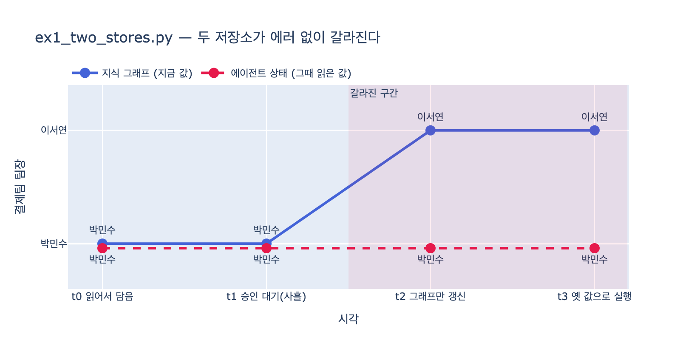

# `ex1_two_stores.py`의 사고는 어떤 순서로 일어나는가?

## 한 줄 답

**t0**에 지식 그래프에서 팀장을 읽어 에이전트 상태에 담고, **t1**에 사람 승인을 사흘간 기다리고, **t2**에 다른 경로로 팀장이 바뀌어 *지식 그래프만* 갱신되고, **t3**에 워크플로가 재개돼 상태에 남아 있던 *옛 값*으로 실행한다.

## 무대 장치: 같은 사실이 두 곳에

`ex1_two_stores.py`는 29장 29.1절 「따로 두면 갈라진다」의 예제다. 두 저장소가 등장한다.

| 저장소 | 역할 | 이 예제에서의 구현 |
|---|---|---|
| 지식 그래프 | 「지금 값」— 세상에 대한 현재 사실 | Kùzu DB (`박민수 -[이끔]-> 결제팀`) |
| 에이전트 상태 | 「그때 읽은 값」— 실행이 들고 다니는 스냅숏 (19장) | `AgentState.facts` 딕셔너리 |

「결제팀 팀장이 누구인가」라는 **같은 사실**이 두 곳에 존재하는 순간, 사고의 조건이 갖춰진다.

## 타임라인 4단계

### [t0] 읽어서 상태에 담는다
워크플로가 시작되면서 지식 그래프에 팀장을 조회하고(`kg_leader`) 결과 `박민수`를 `st.remember("팀장", ...)`으로 상태에 담는다. 이 시점엔 두 저장소가 일치한다: 그래프 = 박민수, 상태 = 박민수.

### [t1] 사흘간 승인 대기
워크플로가 사람 승인을 기다린다(23장의 휴먼 인 더 루프). 상태는 체크포인트에 저장돼 사흘 뒤에도 **그대로 살아 있다**(21장). 이 「오래 멈춰 있는 시간」이 사고의 창이다.

### [t2] 지식 그래프만 갱신된다
그동안 인사 이동으로 팀장이 바뀐다. 그래프에서 `박민수 -[이끔]-> 결제팀` 엣지를 지우고 `이서연 -[이끔]-> 결제팀`을 만든다. 이제 **그래프 = 이서연, 상태 = 박민수**. 갈라졌다. 그리고 아무 에러도 나지 않는다 — 그래프를 갱신한 쪽은 어떤 실행이 옛 값을 들고 잠들어 있는지 모르고, 잠든 상태는 바깥 변화를 알 길이 없다.

### [t3] 옛 값으로 실행한다
승인이 나서 워크플로가 재개되고, 상태에 있던 값으로 실행한다. 결과: **보고서를 «박민수»에게 보냈는데, 지금 팀장은 «이서연»이다.**

## 핵심 교훈

- **둘 다 자기 일을 제대로 했다.** 상태는 스냅숏을 보존하는 게 본분이고, 그래프는 최신을 반영하는 게 본분이다. 각자 옳았는데 결과가 틀렸다 — 그래서 코드를 잘 짜서 없앨 수 있는 버그가 아니다. 같은 사실이 두 곳에 있는 한 언제나 갈라질 수 있다.
- 「매번 최신을 읽기」도 답이 아니다. 느리고, 사흘짜리 워크플로 *중간에* 값이 바뀌면 판단이 앞뒤가 안 맞는다. 상태에 담는 건 게으름이 아니라 의도적인 스냅숏이다.

## 예제가 제시하는 선택지 셋

1. 상태에 담지 말고 매번 조회 → 느리고, 긴 워크플로는 중간에 값이 바뀐다
2. 상태에 담되 **「읽은 시각」을 같이 담고, 쓰기 직전에 다시 확인** → 실무의 절충 (ex2의 `Reads` 엣지 + `as_of`가 이 방식)
3. 아예 한 저장소에 둔다 → 이 장의 주제. 단, 완전히 합치면 쓰기 부하가 열 배(ex4)라서 「상태 본문은 빠른 저장소에, 그래프엔 링크만」으로 절충한다.

이 패턴은 데이터베이스의 **read timestamp**(PostgreSQL 트랜잭션 격리)와 같은 발상이다: 읽은 시점을 기록해 두면, 나중에 「그때 읽은 값이 아직 유효한가」를 기계적으로 판정할 수 있다.

## 시각화

