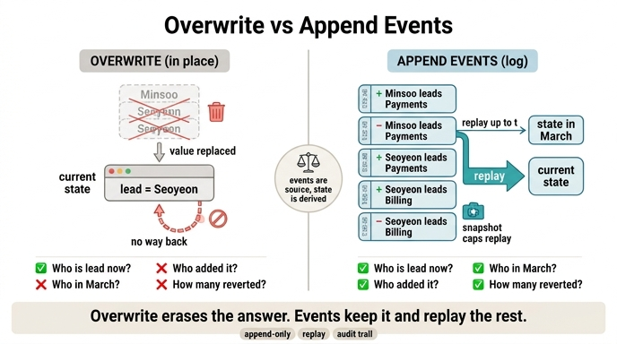

# 덮어쓰기 vs 이벤트 쌓기

**Q. 덮어쓰기와 이벤트 쌓기의 결정적 차이는 무엇인가?**

**A. 덮어쓰기는 답을 지워 복원이 안 되고, 이벤트를 쌓으면 현재 상태는 재생해서 만들 수 있고 과거도 남는다.**

---

## 한 줄로

- **덮어쓰기(update-in-place)**: 새 값이 옛 값을 *지운다*. 정보가 사라지므로 나중에 아무리 애써도 복원이 안 된다. 남는 건 「지금」 하나뿐.
- **이벤트 쌓기(append-only)**: 변경을 *덧붙이기만* 한다. 지우는 일이 없으니 과거가 그대로 남고, **현재 상태는 이벤트를 처음부터 재생(replay)해서 언제든 다시 만들 수 있다.**

핵심은 「덮어쓰기 = 손실, 이벤트 = 무손실 + 현재는 파생」이라는 비대칭입니다. 이벤트에서 현재 상태로 가는 화살표는 있지만, 덮어쓴 현재 상태에서 과거로 가는 화살표는 없습니다.

## 왜 결정적인 차이인가 — 답할 수 있는 질문이 달라진다

30.1절 `ex1_no_history.py`는 똑같은 변경 6건을 두 방식으로 기록해 놓고 네 가지를 묻습니다.

| 질문 | 현재 상태만(덮어쓰기) | 이벤트 로그 |
|---|---|---|
| Q1. 지금 결제팀 팀장은? | 이서연 | 이서연 |
| Q2. 3월 15일에는 팀장이 누구였나? | **답 못 함** | 박민수 (3/15까지 재생) |
| Q3. 「이서연 -이끔-> 정산팀」은 누가 넣고 누가 지웠나? | **답 못 함** | 추가 agent-4821 (4/14) / 삭제 admin:kim (4/15) |
| Q4. 에이전트가 넣은 것 중 사람이 되돌린 게 몇 건인가? | **답 못 함** | 1건 |

덮어쓰기로도 답할 수 있는 건 Q1 「지금 뭐죠?」뿐입니다. 그런데 운영에서 실제로 자주 나오는 건 Q2~Q4예요.

- 「3월에는 어땠나」 → 감사와 분쟁에서 반드시 나옵니다.
- 「누가 넣었나」 → 사고 조사의 첫 질문입니다.
- 「에이전트가 넣은 것 중 되돌려진 비율」 → 28장의 에이전트 품질 지표 그 자체입니다.

즉 차이는 「이력이 있으면 좋다」 수준이 아니라, **답할 수 없는 질문의 집합 자체가 달라진다**는 것입니다.

## 재생(replay)이 만들어 내는 것

이벤트를 쌓아 두면 현재 상태는 저장 대상이 아니라 **계산 결과**입니다.

```python
st = set()
for at, s, k, o, op in events_up_to(t):   # 시점 t 까지만
    if op == "추가":
        st.add((s, k, o))
    else:
        st.discard((s, k, o))
```

`t`를 오늘로 두면 현재 상태, `t`를 3월 15일로 두면 그때의 그래프가 나옵니다. 같은 루프 하나로 「지금」과 「그때」를 모두 만들 수 있다는 것이 덮어쓰기에는 없는 능력입니다.

그래서 방향이 중요합니다. **이벤트가 원본(source of truth)이고 상태(조회용 뷰, 구간 엣지)는 파생**입니다. 거꾸로 상태를 먼저 고치고 이벤트를 나중에 적으면 둘이 갈라집니다(29장의 「두 저장소가 갈라진다」 문제). 그리고 파생이 정말 파생인지는 말로가 아니라 **실제로 지우고 다시 재생해 봐야** 압니다.

## 로그를 남기는 것과는 다르다

「로그를 잘 남기자」로는 안 됩니다. 로그는 빠뜨려도 당장 아무 일이 안 생기니까 결국 빠집니다. 뒤집어야 해요.

> 「기록**도** 남긴다」가 아니라 「기록**이 곧** 쓰기다」

이벤트를 적는 것이 곧 상태를 바꾸는 유일한 경로여야, 기록 누락이 곧 변경 실패가 되어 이력이 신뢰할 수 있게 됩니다.

## 치르는 값과 그 값을 낮추는 장치

이벤트 쌓기는 공짜가 아닙니다. **저장 공간**과 **재생 시간**을 씁니다. 재생 시간은 스냅숏(체크포인트)으로 상한을 겁니다.

- 처음부터 재생: 이벤트 수에 비례. 백만 개면 약 395ms.
- 스냅숏 이후만 재생: 16ms. 이벤트가 천만 개여도 재생할 것은 최대 스냅숏 주기(예: 5만 개)뿐.
- 즉 **재생 시간은 데이터 양이 아니라 스냅숏 주기로 정해집니다.** 주기는 복구 목표 시간에서 거꾸로 계산하세요(「3초 안에 복구」면 3초에 재생 가능한 이벤트 수).
- 이건 DB의 쓰기 전 로그(WAL) + 체크포인트와 같은 구조입니다. 새 발명이 아니라 30년 된 구조를 그대로 쓰는 것.

## 함께 기억할 조건들

1. **이벤트에는 「바뀐 것」을 넣으세요.** 「바뀐 뒤 전체 상태」를 넣으면 무엇이 바뀌었는지 알 수 없고 동시 변경도 합칠 수 없습니다.
2. **쌓는 것만으로는 아무것도 안 정해집니다.** 같은 이벤트 열도 리듀서(마지막이 이긴다 / 확신도가 이긴다 / 사람이 이긴다 / 전부 모은다)에 따라 답이 넷으로 갈립니다. *어떻게 접을 것인가*가 실제 동작을 정하고 그건 도메인 결정입니다. 「마지막이 이긴다」를 기본으로 두면 에이전트가 사람을 덮어씁니다.
3. **감사 로그가 되려면 「안 고쳤다」를 보일 수 있어야 합니다.** 해시 고리를 걸면 고친 곳(해시 불일치)과 지운 곳(앞 고리 불일치)이 드러납니다. 다만 고리는 *막지* 않고 *표가 나게* 할 뿐입니다.
4. **이벤트에 개인정보를 직접 넣지 마세요.** 지울 수 없는 곳에 지워야 하는 것을 넣게 됩니다.

## 정리

| | 덮어쓰기 | 이벤트 쌓기 |
|---|---|---|
| 쓰기 방식 | 제자리 갱신(옛 값 소멸) | 추가 전용(append-only) |
| 원본 | 현재 상태 | 이벤트 로그 |
| 현재 상태 | 저장된 것 | 재생해서 만드는 파생물 |
| 과거 | 없음, 복원 불가 | 남아 있음, 시점 재생 가능 |
| 답할 수 있는 질문 | 「지금 뭐죠?」 | 지금 + 그때 + 누가 + 왜 |
| 값 | 싸다 | 저장 공간 + 재생 시간(스냅숏으로 상한) |

## 인포그래픽


