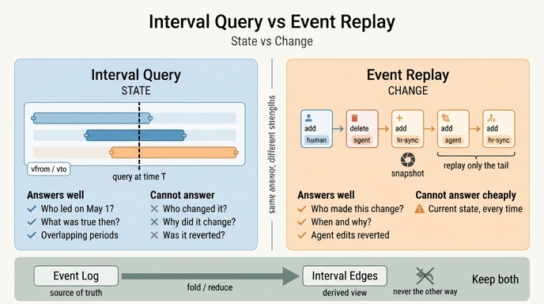

# 구간 쿼리와 이벤트 재생은 각각 어떤 질문에 강한가?

> **답**: 구간 쿼리는 「그 시점에 무엇이 참이었나」(**상태**), 이벤트 재생은 「무엇이 언제 왜 바뀌었나」(**변화**)에 강하다.

---

## 1. 두 방법은 무엇인가

30.3절 「그때 그래프를 되살리는 두 가지 길」에서 나오는 대비입니다. 과거 어느 시점의 그래프를 되살리는 방법은 두 가지가 있어요.

### 방법 A — 이벤트 재생 (replay)

「추가/삭제」 이벤트를 시간순으로 쌓아 두고, 원하는 시점까지 처음부터 접어(fold) 나갑니다.

```python
def by_replay(c, t):
    st = set()
    for at, s, k, o, op in rows(c.execute(
            "MATCH (e:Ev) WHERE e.at <= $t ... ORDER BY e.id", {"t": t})):
        if op == "추가":
            st.add((s, k, o))
        else:
            st.discard((s, k, o))
    return sorted(st)
```

*저장하는 것*: 변화의 열(sequence). `(시각, 주체, 관계, 대상, op, 행위자)`

### 방법 B — 구간 쿼리 (interval query)

엣지에 유효 구간 `vfrom`/`vto`를 박아 두고, 쿼리로 잘라냅니다. 27장의 유효 시간 모델이에요.

```python
def by_interval(c, t):
    return sorted(rows(c.execute(
        "MATCH (a:N)-[e:R]->(b:N) WHERE e.vfrom <= $t AND e.vto > $t "
        "RETURN a.name, e.kind, b.name", {"t": t})))
```

*저장하는 것*: 사실의 유효 구간. `(주체, 관계, 대상, vfrom, vto)`

`ex3_temporal_query.py`를 돌려 보면 **두 방법의 답은 같습니다**. 2025-06-01 기준으로도, 2026-05-01 기준으로도 같은 엣지 집합이 나와요. 답이 같으니 하나만 두면 될 것 같은데, 그렇지 않습니다. 강한 질문이 다르거든요.

---

## 2. 핵심 대비 — 무엇을 답할 수 있고 무엇을 못 하나

| 질문 유형 | 예시 질문 | 구간 쿼리 | 이벤트 재생 |
|---|---|---|---|
| **시점 상태** | 2026-05-01에 결제팀 팀장은 누구였나? | ✅ `WHERE vfrom <= t AND vto > t` 한 줄 | ✅ (단, t까지 전부 재생해야) |
| **현재 상태** | 지금 결제팀 소속은? | ✅ 인덱스 태워 즉시 | ⚠️ 매번 전체 재생 (그래서 스냅숏이 필요) |
| **기간 겹침** | 이 사람과 저 사람이 같이 있던 기간은? | ✅ 구간 교집합 연산 | ❌ 여러 시점을 각각 재생해 비교해야 |
| **행위자(누가)** | 「이서연 -이끔-> 정산팀」은 **누가** 넣었나? | ❌ 엣지에 그 정보가 없다 | ✅ `e.actor` |
| **원인(왜)** | 이 변경은 어떤 명령/발화에서 나왔나? | ❌ | ✅ 이벤트에 출처·근거를 실을 수 있다 |
| **변경 시각/순서** | 이 엣지는 언제, 몇 번째로 바뀌었나? | ⚠️ `vfrom`으로 「생겼다」만. 중간 수정 이력은 없음 | ✅ 이벤트 id 순서가 곧 이력 |
| **되돌림 탐지** | 에이전트가 넣은 것 중 사람이 되돌린 게 몇 건? | ❌ | ✅ 추가 이벤트와 삭제 이벤트를 짝지어 셈 |
| **품질 지표** | 에이전트 변경의 되돌림 비율(28장 지표) | ❌ | ✅ |
| **감사/위변조 증명** | 「나중에 안 고쳤다」를 보일 수 있나? | ❌ 엣지는 덮어써지면 끝 | ✅ 해시 고리를 걸 수 있다(ex5) |
| **충돌 해석** | 사람과 에이전트가 다르게 말했을 때 무엇을 택할까? | ❌ 이미 하나로 접혀 있다 | ✅ 리듀서를 바꿔 다르게 접을 수 있다(ex4) |
| **조회 비용** | 대규모에서 시점 조회 속도 | ✅ 데이터 양과 무관하게 인덱스 | ⚠️ 이벤트 수에 비례 (스냅숏으로 상한을 걺) |

한 줄로 압축하면 이렇습니다.

- **구간 쿼리** = *스냅샷을 잘 잘라 보는 도구*. 「그 시점의 사진」
- **이벤트 재생** = *변화의 필름 자체*. 「그 사이에 무슨 일이 있었나」

---

## 3. 왜 각각 강하고 약한가 (구조적 이유)

### 구간 쿼리가 「누가 바꿨나」를 못 묻는 이유

구간 엣지는 **결과만 담습니다**. `("이서연", "이끔", "결제팀", "2026-04-01", "9999-12-31")` 여기에는 *누가 이 사실을 넣었는지*가 없어요. 넣으려면 엣지에 `actor` 컬럼을 붙이면 될 것 같지만, 그건 사실상 이벤트를 흉내 내는 겁니다. 그리고 여전히 **한 엣지가 여러 번 수정된 이력**은 담지 못해요. 구간 엣지는 「이 사실이 이 기간 동안 참이었다」는 하나의 진술이지, 그 진술이 만들어진 과정이 아닙니다.

### 이벤트 재생이 「지금 상태」에 약한 이유

이벤트는 변화만 담기 때문에 상태를 알려면 **매번 처음부터 접어야** 합니다. `ex2_replay_cost.py`가 보여 주듯 백만 건이면 395ms죠. 그래서 스냅숏을 찍습니다. 스냅숏이 있으면 「마지막 스냅숏 이후」만 재생하면 되니 16ms로 끝나고, 재생 시간이 *데이터 양*이 아니라 *스냅숏 주기*로 정해집니다.

> ⚠️ **함정**: `ex3`에서는 재생이 구간 쿼리보다 *조금 빨랐습니다*. 이벤트가 9개뿐인 장난감 규모라서 그래요. 이벤트가 10만 개면 뒤집힙니다. 이 숫자로 「재생이 빠르다」고 결론 내면 안 됩니다.

---

## 4. 그래서 실무에서는 둘 다 둔다

책의 결론은 「둘 중 하나를 고르라」가 아닙니다.

```
  이벤트 로그  ──(접기/리듀서)──▶  구간 엣지
  진실의 원본                     조회용 뷰
  source of truth                 derived view
```

- **이벤트 로그** — 진실의 원본(source of truth). 변화를 묻는 질문을 담당.
- **구간 엣지** — 이벤트에서 *만들어 낸* 조회용 뷰. 상태를 묻는 질문을 담당.

**중요한 건 방향입니다.** 이벤트가 원본이고 엣지가 파생이에요. 거꾸로 하면 — 엣지를 먼저 고치고 이벤트를 나중에 적으면 — 둘이 갈라집니다. 29장에서 본 「두 저장소가 갈라진다」 문제가 여기서 또 나오는 거죠. 다만 여기서는 해법이 분명합니다. 한쪽을 원본으로 정하고 다른 쪽은 **항상 다시 만들 수 있게** 두면 됩니다. 그리고 되는지는 실제로 뷰를 지우고 재생해 봐야 압니다.

이게 명령-조회 분리(CQRS)의 모양이기도 합니다. 쓰기는 이벤트로, 읽기는 파생 뷰로.

---

## 5. 시험에 나올 만한 포인트

1. **답은 같고 값이 다르다** — 두 방법이 되살리는 「그때 그래프」는 동일. 차이는 비용과 *답할 수 있는 질문의 종류*.
2. **구간 쿼리 = 상태(what was true), 이벤트 재생 = 변화(what/when/why changed)**.
3. 구간 쿼리로 못 묻는 대표 질문: **「누가 바꿨나」**.
4. 이벤트 재생의 대표 약점: **「지금 상태」를 물을 때마다 전부 재생** → 스냅숏으로 상한을 건다.
5. 방향이 핵심: **이벤트가 원본, 구간 엣지는 파생**.

---

## 인포그래픽


