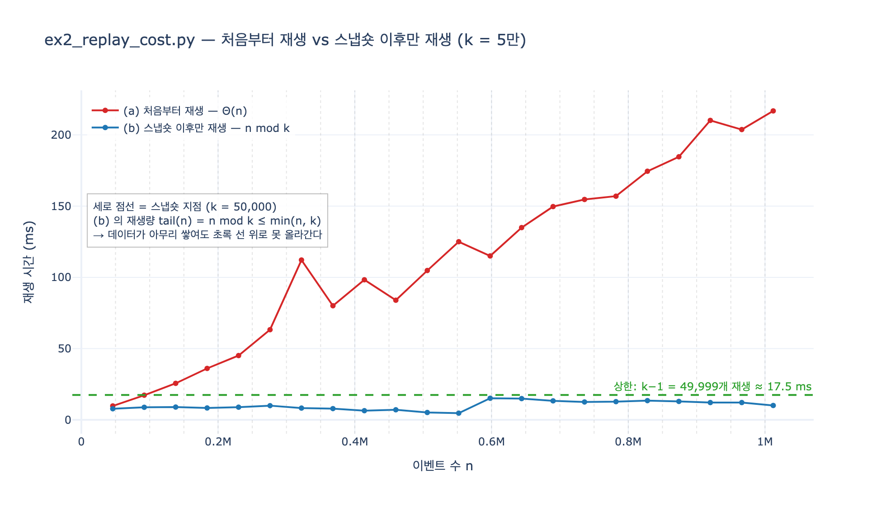

# `ex2_replay_cost.py` — 스냅숏 주기 5만, 그리고 무엇과 무엇을 비교하나

> **질문** — `ex2_replay_cost.py`의 스냅숏 주기 설정은 얼마이며 무엇을 비교하는가?
>
> **답** — 5만 이벤트마다 스냅숏을 찍는다고 두고, 처음부터 재생과 스냅숏 이후만 재생을 비교한다.

---

## 한 줄로 잡는 감

30장은 「이벤트가 원본이고 상태는 파생」이라고 뒤집었습니다.
그러면 곧바로 따라오는 걱정이 있어요. **「그럼 상태를 만들 때마다 이벤트를 다 다시 읽어야 하나?」**

`ex2_replay_cost.py` 는 그 걱정을 숫자로 답하는 예제입니다.
답은 「아니오」이고, 그 「아니오」를 만드는 장치가 **스냅숏**입니다.

그래서 이 예제는 딱 두 개의 상수와 두 개의 비교 대상으로 이루어져 있습니다.

| 항목 | 값 |
|---|---|
| 스냅숏 주기 | `SNAPSHOT_EVERY = 50_000` — **5만 이벤트마다 한 장** |
| 비교 (a) | **처음부터 재생** — 이벤트 0번부터 끝까지 전부 접는다 |
| 비교 (b) | **스냅숏 이후만 재생** — 마지막 스냅숏 상태에서 출발해 그 뒤만 접는다 |

---

## 예제의 머리말이 이미 답을 적어 두었다

```python
"""
예제 2 — 재생은 얼마나 걸리나. 그리고 스냅숏이 왜 필요한가.

    python3 ex2_replay_cost.py

의존성 없음. 이벤트 수를 늘려 가며 «처음부터 재생»과
«스냅숏 + 이후만 재생»을 비교한다.
"""
```

`ex1`, `ex3` 이 `kuzu` 를 쓰는 것과 달리 `ex2` 는 **의존성이 없습니다.**
장의 실행 가이드에도 그렇게 적혀 있어요.

```bash
python3 ex2_replay_cost.py       # 재생 값과 스냅숏 (의존성 없음)
```

재생 비용이라는 성질은 그래프 DB가 아니라 **「이벤트를 순서대로 접는다」는 구조 자체**에서
나오는 것이라, 표준 라이브러리 `set` 하나로도 충분히 보일 수 있기 때문입니다.

---

## 1. 주기는 어디에 적혀 있나 — `SNAPSHOT_EVERY = 50_000`

모듈 상수 한 줄입니다. 함수 안이 아니라 밖에 있어요.

```python
SNAPSHOT_EVERY = 50_000
```

그리고 `main()` 의 첫 줄이 이 값을 그대로 사람에게 읽어 줍니다.

```python
def main():
    print(f"스냅숏을 {SNAPSHOT_EVERY:,} 이벤트마다 찍는다고 하자.\n")
```

여기서 「~찍는다고 **하자**」라는 말투가 중요합니다.
이 예제는 실제로 스냅숏 파일을 디스크에 쓰지 않습니다.
**「5만마다 한 장씩 찍혀 있었다면 지금 재생해야 할 양은 얼마인가」를 가정하고 계산**할 뿐이에요.
그래서 의존성이 없고, 그래서 순수한 비용 비교가 됩니다.

---

## 2. 무엇을 재생하나 — 이벤트와 리듀서

이벤트는 `(순번, 주어, 관계, 목적어, 연산)` 5-튜플입니다.

```python
rng = random.Random(11)


def make_events(n):
    out = []
    for i in range(n):
        s = f"e{rng.randint(0, 400)}"
        o = f"t{rng.randint(0, 40)}"
        op = "추가" if rng.random() < 0.72 else "삭제"
        out.append((i, s, "속함", o, op))
    return out
```

- 주어 401종 × 목적어 41종이라 상태 집합의 크기가 위로 막혀 있습니다. 메모리가 안 터져요.
- 추가 72% / 삭제 28%. 삭제가 섞여 있어야 「그냥 누적」이 아니라 진짜 접기가 됩니다.
- 시드가 `11` 로 고정이라 실행 사이에 이벤트 열은 같습니다. **달라지는 건 시간뿐입니다.**

접는 함수(리듀서)는 이렇게 생겼습니다.

```python
def replay(events, start_state=None):
    st = set(start_state) if start_state else set()
    for _i, s, k, o, op in events:
        if op == "추가":
            st.add((s, k, o))
        else:
            st.discard((s, k, o))
    return st
```

**`start_state` 인자가 이 예제의 전부입니다.**

- `start_state=None` → 빈 집합에서 시작 → **(a) 처음부터 재생**
- `start_state=스냅숏` → 스냅숏에서 시작 → **(b) 스냅숏 이후만 재생**

함수는 하나인데, 시작점을 어디로 주느냐가 두 방법을 가릅니다.
스냅숏이란 결국 **「여기까지 접어 둔 중간 결과」** 이고, 그 이상도 이하도 아닙니다.

시간 재는 도구는 흔한 래퍼입니다.

```python
def timed(fn, *a):
    t0 = time.perf_counter()
    r = fn(*a)
    return (time.perf_counter() - t0) * 1000, r
```

---

## 3. 비교의 본체 — `main()` 의 루프

```python
    for n in (10_000, 63_000, 217_000, 1_034_000):
        ev = make_events(n)
        full_ms, st = timed(replay, ev)

        # 스냅숏 뒤에 남은 것만 재생
        last_snap = (n // SNAPSHOT_EVERY) * SNAPSHOT_EVERY
        snap_state = replay(ev[:last_snap]) if last_snap else set()
        tail = ev[last_snap:]
        tail_ms, st2 = timed(replay, tail, snap_state)

        assert st == st2
        ratio = full_ms / tail_ms if tail_ms else 0
        print(f"{n:>12,}{full_ms:>14.1f}{tail_ms:>16.1f}"
              f"{len(tail):>14,}{ratio:>7.1f}x")
```

한 줄씩 뜯으면 이렇습니다.

| 줄 | 하는 일 |
|---|---|
| `full_ms, st = timed(replay, ev)` | **(a)** 0번부터 끝까지 전부 재생. 시간을 잰다 |
| `last_snap = (n // SNAPSHOT_EVERY) * SNAPSHOT_EVERY` | 마지막 스냅숏 지점. 5만의 배수로 내림 |
| `snap_state = replay(ev[:last_snap])` | 그 지점의 스냅숏을 만들어 둔다 (**시간을 안 잰다**) |
| `tail = ev[last_snap:]` | 스냅숏 이후의 꼬리 |
| `tail_ms, st2 = timed(replay, tail, snap_state)` | **(b)** 꼬리만 재생. 시간을 잰다 |
| `assert st == st2` | **두 방법의 결과가 같은지 확인** |
| `ratio = full_ms / tail_ms` | 배수 |

### 세 가지 눈여겨볼 점

**첫째, `snap_state` 를 만드는 시간은 재지 않습니다.**
스냅숏은 「복구할 때 만드는 것」이 아니라 **평상시에 미리 찍어 둔 것**이니까요.
장애가 났을 때 우리가 지불하는 비용은 꼬리 재생뿐입니다. 이게 비교의 전제입니다.

**둘째, `assert st == st2` 가 있습니다.**
빠른 게 무슨 소용인가요, 답이 다르면. 스냅숏 방식이 **같은 상태에 도달한다는 것**을
매 줄마다 확인하고 나서 시간을 비교합니다.

**셋째, 이벤트 수 4개가 5만의 배수가 아닙니다.** `10_000`, `63_000`, `217_000`, `1_034_000`.
일부러 어긋나게 잡았어요. 배수로 잡으면 꼬리가 0이 되어 비교가 안 되거든요.

---

## 4. 실제 출력 — 이 힌트를 쓰면서 돌린 결과

```
스냅숏을 50,000 이벤트마다 찍는다고 하자.

       이벤트 수      처음부터(ms)      스냅숏 이후(ms)       재생할 이벤트      배수
--------------------------------------------------------------------
      10,000           1.7             1.3        10,000    1.3x
      63,000          14.4             3.5        13,000    4.1x
     217,000          54.8             5.6        17,000    9.8x
   1,034,000         271.2            10.5        34,000   25.7x
```

`재생할 이벤트` 열이 이 표의 핵심입니다.

| 이벤트 수 $n$ | 마지막 스냅숏 지점 | 재생할 꼬리 |
|---:|---:|---:|
| 10,000 | 0 (아직 없음) | **10,000** |
| 63,000 | 50,000 | **13,000** |
| 217,000 | 200,000 | **17,000** |
| 1,034,000 | 1,000,000 | **34,000** |

$n$ 은 100배 늘었는데 꼬리는 1만 → 3만4천, **3.4배**밖에 안 늘었습니다.
그리고 앞으로도 안 늘어요. 5만을 못 넘거든요.

---

## 5. 첫 줄의 함정 — 배수가 1 근처인 이유

장은 이 부분을 두 군데에서 미리 못 박아 둡니다. 실행 가이드에서 한 번,

> `ex2` 는 실행할 때마다 시간이 조금씩 달라집니다. 첫 줄(1만 개)에서 배수가
> 1 근처거나 그보다 작게 나오는 것도 정상입니다. 스냅숏이 아직 안 찍혔거든요.

그리고 프로그램 자체의 맺음말에서 또 한 번.

```
첫 줄은 배수가 0.8 이다. 스냅숏이 아직 한 번도 안 찍혀서
결국 처음부터 재생하는 것과 같고, 측정 잡음만 얹혔다.
스냅숏은 «데이터가 충분히 쌓인 뒤에» 값을 하기 시작한다.
```

$n = 10{,}000 < 50{,}000$ 이므로 `last_snap = 0`, `snap_state = set()`, `tail = ev` 전체입니다.
**(a) 와 (b) 가 똑같은 일을 합니다.** 배수 1.0 근처가 나오는 게 정상이고,
0.8 이나 1.3 처럼 흔들리는 건 순수한 측정 잡음입니다.

여기서 얻는 교훈은 성능 이야기가 아니라 **운영 판단**입니다.
스냅숏은 공짜가 아닌데(공간, 쓰기 비용) 데이터가 적을 땐 아무 이득이 없습니다.
**「데이터가 충분히 쌓인 뒤에」 값을 하기 시작한다**는 것.

---

## 6. 진짜 결론 — 「상한」이라는 단어

프로그램 맺음말의 중심 문장입니다.

```
처음부터 재생하면 이벤트 수에 비례해서 늘어난다. 백만 개면 395ms 다.
스냅숏이 있으면 «마지막 스냅숏 이후»만 재생하니 16ms 로 끝난다.

여기서 중요한 건 «상한»이라는 말이다.
이벤트가 백만 개든 천만 개든 재생할 것은 최대 5만 개다.
그러니 재생 시간이 «데이터 양»이 아니라 «스냅숏 주기»로 정해진다.
```

수식으로 적으면 이렇습니다. 주기를 $k$ 라 할 때,

$$\text{tail}(n) = n - \left\lfloor \frac{n}{k} \right\rfloor \cdot k = n \bmod k
\qquad\Longrightarrow\qquad \text{tail}(n) \le \min(n,\, k)$$

- $n < k$ 이면 스냅숏이 없어서 $\text{tail} = n$ (첫 줄의 상황)
- $n \ge k$ 이면 $\text{tail} = n \bmod k < k$, 최악이라 해도 $k-1$

즉 **(a)는 $\Theta(n)$ 으로 무한정 오르고, (b)는 $k$ 라는 천장에 갇힙니다.**

| | 재생량 | $n \to \infty$ 일 때 |
|---|---|---|
| (a) 처음부터 | $n$ | 무한정 증가 |
| (b) 스냅숏 이후 | $n \bmod k \le \min(n, k)$ | **$k$ 에서 막힘** |

한 장 요약의 문장이 여기서 나옵니다.

> 재생 시간은 데이터 양이 아니라 스냅숏 주기로 정해집니다.

---

## 7. 그래서 주기를 얼마로 잡나

장은 상한을 보인 뒤 곧바로 교환 관계를 적습니다.

```
주기를 어떻게 잡나. 두 값의 교환이다.
  짧게 잡으면 — 재생은 빠른데 스냅숏 저장 공간이 늘어난다
  길게 잡으면 — 공간은 아끼는데 복구가 느려진다

저는 «복구 목표 시간»에서 거꾸로 계산한다.
「장애 났을 때 3초 안에 복구」가 목표면, 3초에 재생할 수 있는
이벤트 수를 재고 그만큼을 주기로 잡는다.
```

정하는 순서가 반대라는 게 요점입니다.
「5만이 적당해 보이니 5만」이 아니라 **「3초 안에 복구」 → 「초당 몇 건 접히나 측정」 → 「곱해서 주기」** 입니다.
$k$ 는 취향이 아니라 **복구 목표 시간(RTO)의 함수**예요.

그리고 마지막 두 줄이 이 장치의 정체를 밝힙니다.

```
그리고 이건 데이터베이스가 하는 일과 같다.
쓰기 전 로그(WAL)와 체크포인트. 30년 된 구조를 그대로 쓰는 것이다.
```

| 이 장의 말 | 데이터베이스의 말 |
|---|---|
| 추가 전용 이벤트 로그 | 쓰기 전 로그 (WAL) |
| 스냅숏 | 체크포인트 |
| 스냅숏 이후만 재생 | 크래시 복구 시 마지막 체크포인트부터 리두 |

30장 키워드 표가 스냅숏의 출처로 [SQLite WAL 문서](https://www.sqlite.org/wal.html)를,
쓰기 전 로그의 출처로 [PostgreSQL WAL 소개](https://www.postgresql.org/docs/current/wal-intro.html)를
가리키는 이유가 이겁니다. 새로 발명한 게 아니라 **30년 된 구조를 그대로 빌려 쓰는 것**입니다.

---

## 8. 헷갈리기 쉬운 지점 정리

**「5만」이 무엇의 단위인가** — 시간(5만 초)이 아니라 **이벤트 개수**입니다.
「5만 건 쌓일 때마다 한 장」이에요.

**스냅숏을 실제로 저장하나** — `ex2` 는 저장하지 않습니다.
`replay(ev[:last_snap])` 로 그 자리에서 만들 뿐이고, 그 시간은 측정에서 뺍니다.
실제 시스템이라면 미리 찍어서 디스크에 두었을 것이라는 가정을 흉내 내는 것입니다.

**비교 대상이 「스냅숏 vs 재생」인가** — 아닙니다. 둘 다 재생입니다.
**어디서 출발하는 재생인가**의 비교예요. 스냅숏은 재생의 대안이 아니라 **재생의 출발점**입니다.

**`ex3` 의 비교와 헷갈리지 말 것** — `ex3_temporal_query.py` 는 「그때 그래프」를 되살리는
**두 가지 길**(이벤트 재생 vs 유효 구간 쿼리)을 비교합니다. 이벤트 9개짜리 장난감 규모이고,
장도 「이 숫자로 「재생이 빠르다」고 결론 내지 마세요」라고 못 박습니다.
`ex2` 는 그것과 별개로 **재생 자체의 비용 곡선**을 봅니다.

---

## 9. 한 문장으로

> `ex2_replay_cost.py` 는 `SNAPSHOT_EVERY = 50_000`, 즉 **5만 이벤트마다 스냅숏을 찍는다고 두고**,
> 이벤트 수를 10,000 → 1,034,000 까지 늘려 가며
> **(a) 처음부터 재생** 과 **(b) 스냅숏 이후만 재생** 의 소요 시간을 재고,
> `assert st == st2` 로 두 결과가 같음을 확인한 뒤 배수를 보인다.
> 결론은 재생량의 상한 $\min(n, k)$ — 재생 시간은 데이터 양이 아니라 스냅숏 주기가 정한다.

---

## 시각화

`expy.py` 는 위 실험을 재현해서 두 곡선을 실제로 재고, 최악의 꼬리($k-1 = 49{,}999$개)를
따로 측정해 (b)의 **천장**을 초록 점선으로 그립니다.

- 빨간 선 **(a) 처음부터 재생** — $n$ 에 비례해 곧게 오릅니다 (약 7 ms → 253 ms).
- 파란 선 **(b) 스냅숏 이후만 재생** — $n \bmod k$ 를 따라 오르내리지만 초록 선을 넘지 못합니다.
- 세로 점선 — 스냅숏 지점(5만의 배수). 이 지점을 지날 때마다 꼬리가 0으로 리셋됩니다.


