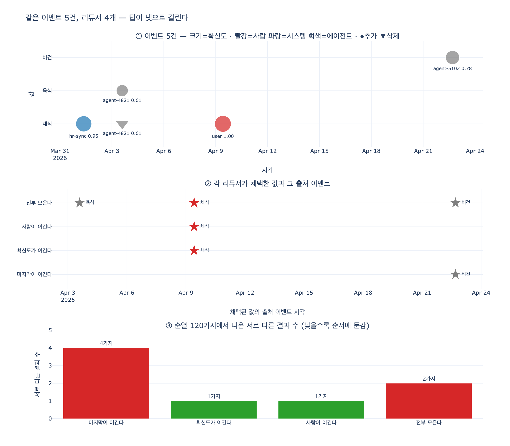

# `ex4_reducer_conflict.py` 의 네 가지 리듀서

> **Q.** `ex4_reducer_conflict.py` 의 네 가지 리듀서는 무엇인가?
> **A.** 마지막이 이긴다, 확신도가 이긴다, 사람이 이긴다, 전부 모은다다.

---

## 0. 이 예제가 있는 자리

30장은 「현재 상태만 저장하면 못 하는 질문들」에서 시작해 **이벤트가 원본이고 상태는 파생**이라는 결론으로 갑니다. `ex1`~`ex3` 이 「이벤트를 쌓으면 과거를 되살릴 수 있다」를 보인 뒤, `ex4` 가 그 위에 찬물을 끼얹습니다.

> **이벤트를 쌓는 것만으로는 아무것도 안 정해진다.**

이벤트 로그는 「무슨 일이 있었나」의 목록일 뿐입니다. 「그래서 지금 값이 뭐냐」는 **접는 방법(리듀서)** 이 정합니다. 30.4 절 제목이 「어떻게 접느냐가 답을 정한다」인 이유죠.

수식으로 보면 이렇습니다. 상태는 저장된 것이 아니라 계산된 것입니다.

```
S = fold(f, s0, [e1, e2, ..., en])
```

이벤트 열 `[e1..en]` 은 추가 전용이라 바뀌지 않습니다. 바꿀 수 있는 건 `f` 뿐입니다. 그래서 **같은 이벤트 + 다른 리듀서 = 다른 답**이 됩니다. `ex4` 는 이걸 리듀서 네 개로 문자 그대로 보여 줍니다.

참고로 이 「리듀서」는 19장(상태 그래프와 리듀서)에서 이미 나온 개념입니다. 19장에서는 「입력을 상태로 접는 함수」였고, 30장에서는 같은 것이 **「이력을 현재로 접는 함수」** 로 돌아옵니다.

---

## 1. 예제의 이벤트 5건

`(시각, 행위자, 키, 값, 연산, 확신도)` 튜플입니다.

| # | 시각 | 행위자 | 값 | 연산 | 확신도 | 성격 |
|---|---|---|---|---|---|---|
| 1 | 2026-04-01 09:00 | `hr-sync` | 채식 | 추가 | 0.95 | 시스템 동기화 |
| 2 | 2026-04-03 14:20 | `agent-4821` | 육식 | 추가 | 0.61 | 에이전트 추론 |
| 3 | 2026-04-03 14:21 | `agent-4821` | 채식 | 삭제 | 0.61 | 에이전트가 앞 값을 지움 |
| 4 | **2026-04-09 10:05** | **`user`** | **채식** | 추가 | **1.00** | **사람이 직접 말함** |
| 5 | **2026-04-22 16:40** | `agent-5102` | **비건** | 추가 | 0.78 | **에이전트가 나중에 덮어씀** |

핵심 충돌은 **4번과 5번**입니다. 4월 9일에 사람이 「채식」이라고 명시했는데, 4월 22일에 에이전트가 「비건」으로 바꿉니다. 이 둘 중 무엇이 답이 되느냐가 리듀서마다 갈립니다.

---

## 2. 네 리듀서 총정리

### 2.1 한눈에 보는 표

| 리듀서 | 규칙 (한 줄) | 우선하는 축 | 예제 결과 | 근거 이벤트 |
|---|---|---|---|---|
| **마지막이 이긴다** (LWW) | 시각이 가장 늦은 「추가」가 이긴다. 「삭제」는 키를 지운다 | 시간 | `선호=비건` | #5 `agent-5102`, 04-22 |
| **확신도가 이긴다** | 「추가」 중 `conf` 최댓값이 이긴다. 「삭제」는 무시 | 자기 신고 확신도 | `선호=채식` | #4 `user`, 04-09 |
| **사람이 이긴다** | 출처 등급이 **높거나 같은** 이벤트만 덮을 수 있다 | 시스템이 부여한 출처 등급 | `선호=채식` | #4 `user`, 04-09 |
| **전부 모은다** | 지우지 않고 집합에 쌓는다. 충돌을 「답이 여럿」으로 남긴다 | 없음 (충돌 보존) | `선호=비건 / 육식 / 채식` | — |

같은 이벤트 5건인데 **답이 셋(값 기준)**, 규칙으로는 넷입니다.

### 2.2 각 리듀서의 코드와 동작

#### ① 마지막이 이긴다 (`last_write_wins`)

```python
def last_write_wins(evs):
    st = {}
    for at, who, k, v, op, conf in evs:
        if op == "추가":
            st[k] = (v, at, who)     # 조건 없이 덮는다
        else:
            st.pop(k, None)
    return st
```

조건문이 없다는 게 전부입니다. 누가 썼는지, 얼마나 확신하는지 보지 않습니다. **가장 흔한 기본값이고 가장 위험한 기본값**입니다.

예제 추적: `채식`(#1) → `육식`(#2) → 삭제(#3) → `채식`(#4) → **`비건`(#5)**.
4월 9일 사람의 명시를 4월 22일 에이전트가 그대로 덮었습니다.

> 위험한 이유가 구조적입니다. 마지막에 쓰는 쪽은 대개 사람이 아닙니다. 사람은 가끔 말하고, 에이전트는 24시간 돕니다. LWW 를 기본으로 두면 **에이전트가 사람을 덮는 것이 시스템의 정상 동작**이 됩니다.

#### ② 확신도가 이긴다 (`highest_confidence`)

```python
def highest_confidence(evs):
    best = {}
    for at, who, k, v, op, conf in evs:
        if op != "추가":
            continue                  # 삭제는 아예 보지 않는다
        if k not in best or conf > best[k][3]:
            best[k] = (v, at, who, conf)
    return {...}
```

예제 추적: 0.95(#1) → 0.61(#2, 탈락) → #3 무시 → **1.00(#4) 채택** → 0.78(#5, 탈락).
결과는 `채식`. 사람 발화가 1.00 이라 살아남았습니다. 그럴듯해 보이죠.

**그런데 `conf` 는 에이전트가 스스로 매기는 값입니다.** 20장의 「모델이 스스로 올릴 수 있는 값은 지표로 못 쓴다」가 여기 그대로 적용됩니다. `expy.py` 4절에서 반례를 돌려 봤습니다.

| 변형 | 마지막이 이긴다 | 확신도가 이긴다 | 사람이 이긴다 |
|---|---|---|---|
| 원본 (사람 1.00, 에이전트 0.78) | 비건 | 채식 | 채식 |
| A. 에이전트가 1.00 을 적음 | 비건 | 채식 (동점이라 강부등호 `>` 로 먼저 온 사람이 지킴) | 채식 |
| **B. 사람 발화가 파서를 거쳐 0.90 으로 기록, 에이전트 0.99** | 비건 | **비건 ← 무너짐** | **채식** |

B 가 현실에서 훨씬 흔한 모양입니다. 사람 발화도 결국 파서를 거쳐 확신도가 붙거든요. 그러면 에이전트가 숫자 하나 올려 적는 것만으로 사람을 덮습니다.

또 하나 조용한 함정이 있습니다. **삭제를 아예 무시**한다는 것. #3(에이전트의 「채식」 삭제)은 이 리듀서에서 존재하지 않는 이벤트입니다. 삭제 의도를 표현할 방법이 없습니다.

#### ③ 사람이 이긴다 (`human_wins`)

```python
rank = {"user": 3, "hr-sync": 2}      # 나머지(에이전트)는 1

def human_wins(evs):
    st = {}
    for at, who, k, v, op, conf in evs:
        r = rank.get(who, 1)
        if op == "삭제":
            if k in st and st[k][3] <= r:   # 자기 등급 이하만 지울 수 있다
                st.pop(k)
            continue
        if k not in st or r >= st[k][3]:    # 자기 등급 이상만 덮을 수 있다
            st[k] = (v, at, who, r)
    return {...}
```

예제 추적:
- #1 `hr-sync`(2) → `채식` 저장 (등급 2)
- #2 `agent-4821`(1) → `1 >= 2` 거짓, **무시**
- #3 삭제, `agent-4821`(1) → 현재 등급 2 가 1 이하가 아님, **무시**
- #4 `user`(3) → `3 >= 2` 참, `채식` 저장 (등급 3)
- #5 `agent-5102`(1) → `1 >= 3` 거짓, **무시**

결과 `채식`. **확신도 리듀서와 답은 같지만 이유가 다릅니다.** 등급은 **시스템이** 부여하는 값이라 에이전트가 자기 손으로 올릴 수 없습니다. 장에서 저자가 기본으로 권하는 것이 이것입니다.

> 확신도 = 모델이 스스로 쓰는 값 → 조작 가능
> 등급 = 시스템이 행위자에게 붙이는 값 → 조작 불가

#### ④ 전부 모은다 (`accumulate`)

```python
def accumulate(evs):
    """지우지 않고 전부 모아 둔다. 충돌은 «답이 여럿»으로 남긴다."""
    st = {}
    for at, who, k, v, op, conf in evs:
        st.setdefault(k, set())
        if op == "추가":
            st[k].add(v)
        else:
            st[k].discard(v)
    return {k: (" / ".join(sorted(v)), "-", "-") for k, v in st.items()}
```

예제 추적: `{채식}` → `{채식, 육식}` → `{육식}` → `{육식, 채식}` → `{육식, 채식, 비건}`.
결과 `비건 / 육식 / 채식`.

상태가 값 하나가 아니라 **집합**입니다. 충돌을 숨기지 않는 대신, 조회하는 쪽이 「그래서 뭘 쓰라는 거냐」로 곤란해집니다. 그래도 **「충돌이 있다」는 사실 자체가 중요한 도메인**(의료 알레르기 기록, 법적 진술, 다자 협상 상태 등)에서는 이게 맞는 답입니다.

---

## 3. 언제 쓰고 언제 위험한가

| 리듀서 | 쓰기 좋은 곳 | 위험한 곳 / 실패 모드 |
|---|---|---|
| **마지막이 이긴다** | 단일 권한 출처만 쓰기, 센서 최신값, 캐시 갱신, 사람이 개입하지 않는 순수 기계 데이터 | **사람과 에이전트가 같은 필드를 쓰는 곳.** 나중에 쓴 쪽이 무조건 이기므로 항상 도는 에이전트가 가끔 말하는 사람을 덮는다. 게다가 도착 순서가 곧 진실이 되는데, 도착 순서는 큐 지연 같은 우연이 정한다 |
| **확신도가 이긴다** | 확신도를 **외부 채점기**가 붙이는 경우(별도 검증 모델, 규칙 엔진, 실측 대조) | **확신도를 쓰는 주체가 확신도를 매기는 곳.** 에이전트가 자가 신고하면 지표로 못 쓴다(20장). 그리고 「삭제」를 표현할 수 없다 |
| **사람이 이긴다** | 사람·시스템·에이전트가 섞여 쓰는 대부분의 실무 상황. 장의 **기본 권장값** | 등급이 같은 두 출처가 충돌하면 결국 「같은 등급 안의 LWW」로 퇴화한다(`r >= st[k][3]`). 사람이 옛날에 말한 값이 최신 사실을 막을 수도 있으니 **만료·재확인 장치**가 따로 필요하다 |
| **전부 모은다** | 충돌 존재 자체가 정보인 도메인, 사람 검토 큐에 올릴 후보 모으기, 감사·분쟁 대비 | 조회하는 쪽이 값을 하나 골라야 하는 상황. 「답이 여럿」을 소비할 UI/API 설계가 없으면 결정을 아래로 떠넘긴 것에 불과하다. 집합이 무한정 커진다 |

---

## 4. 보너스 — 순서 의존성 (`expy.py` 4절)

실제 시스템에서 이벤트는 시각 순으로 도착하지 않습니다. 큐가 밀리고, 재처리하고, 늦게 붙은 소스가 있습니다. 그래서 물어야 합니다. **도착 순서를 바꿔도 같은 답이 나오나?**

이벤트 5개의 순열 120가지를 전부 접어 본 결과입니다.

| 리듀서 | 서로 다른 결과 | 이 데이터에서 순서 무관? | 왜 |
|---|---|---|---|
| 마지막이 이긴다 | **4가지** | ✗ | 비건(24) / 육식(24) / 채식(48) / **빈 결과(24)**. 삭제가 맨 뒤로 밀리면 값이 아예 사라진다 |
| 확신도가 이긴다 | 1가지 | ✓ | `max` 는 가환. 동점은 강부등호 `>` 라 먼저 온 쪽 유지 |
| 사람이 이긴다 | 1가지 | ✓ (이 데이터 한정) | 최고 등급 `user` 의 이벤트가 「추가」이고 그보다 높거나 같은 등급이 없어서 언제 와도 마지막에 남는다. **일반적으로는 무관하지 않다** — 같은 등급끼리는 나중 것이 이기므로 `user` 이벤트가 둘이면 순서가 답을 가른다 |
| 전부 모은다 | 2가지 | ✗ | 「채식」 추가가 둘·삭제가 하나라, 삭제가 두 추가보다 뒤에 오는 1/3(=40가지)에서 「채식」이 사라진다 |

여기서 얻는 교훈이 하나 더 있습니다.

> **순서에 안전한 것과 위조에 안전한 것은 다른 축이다.**

확신도 리듀서는 순서에는 완벽히 둔감하지만 자가 신고 위조에는 무너집니다. 사람이 이긴다는 일반적으로 순서 무관은 아니지만 위조에는 버팁니다. 하나로 두 문제를 다 못 막습니다.

그리고 「전부 모은다」의 순서 의존성이 흥미롭습니다. 합집합만 쓰면(삭제를 버리면) 완전히 순서 무관해집니다. 즉 **가환성을 얻으려면 삭제를 포기해야 한다** — 이게 31장(두 에이전트가 같은 노드를 동시에 고쳤다)의 CRDT 로 이어지는 실마리입니다.

---

## 5. 외우는 법 / 시험 대비

네 이름을 **「무엇을 기준으로 이기느냐」** 로 묶으면 잘 붙습니다.

| 이기는 기준 | 리듀서 이름 | 영어 대응 |
|---|---|---|
| **시간** | 마지막이 이긴다 | last-write-wins (LWW) |
| **숫자** | 확신도가 이긴다 | highest-confidence |
| **출처** | 사람이 이긴다 | source-rank / human-priority |
| **안 이긴다** | 전부 모은다 | accumulate / multi-value |

시간 → 숫자 → 출처 → (포기). 앞의 셋은 하나를 고르고, 마지막 하나는 고르기를 거부합니다.

### 자주 틀리는 것

- 「확신도가 이긴다」와 「사람이 이긴다」의 **결과가 같다**고 해서 같은 리듀서로 묶으면 안 됩니다. 예제에서 우연히 둘 다 `채식` 이 나올 뿐이고, 확신도를 조작하면 갈라집니다.
- 「전부 모은다」를 「아무것도 안 하는 것」으로 오해하기 쉬운데, **삭제는 처리합니다**(`discard`). 지우지 않는 건 「충돌하는 다른 값」이지 「삭제된 값」이 아닙니다.
- 「사람이 이긴다」의 rank 에 `hr-sync` 가 2 로 들어간다는 걸 놓치기 쉽습니다. 사람(3) > 시스템 동기화(2) > 에이전트(1) 의 **3단계**입니다.

---

## 6. 장의 결론

> 같은 이벤트 열인데 답이 넷이다. **리듀서가 답을 정한다.**
> 이벤트를 쌓는 것만으로는 아무것도 안 정해진다.
> 「어떻게 접을 것인가」가 실제 동작을 정하고, **그건 도메인 결정**이다.

기술 선택처럼 보이지만 아닙니다. 「사람이 4월 9일에 말한 채식과 에이전트가 4월 22일에 추론한 비건 중 무엇이 이 서비스의 답인가」는 코드가 아니라 도메인이 답할 질문입니다. 다만 아무것도 정하지 않으면 **기본값인 「마지막이 이긴다」가 자동으로 답을 정해 버린다**는 것, 그게 이 예제의 진짜 경고입니다.

---

## 시각화



- **①** 이벤트 5건의 타임라인. 마커 크기는 확신도, 색은 출처(빨강=사람, 파랑=시스템, 회색=에이전트), 세모는 삭제입니다.
- **②** 각 리듀서가 최종 채택한 값이 **어느 이벤트에서 왔는지**. 「마지막이 이긴다」만 홀로 4월 22일 에이전트 이벤트(회색 별)를 가리킵니다. 「전부 모은다」는 별이 셋이라 답을 하나로 좁히지 않았다는 게 그대로 보입니다.
- **③** 순열 120가지에서 나온 서로 다른 결과 수. 낮을수록 도착 순서에 둔감합니다. 「마지막이 이긴다」가 4가지로 가장 불안정합니다.
