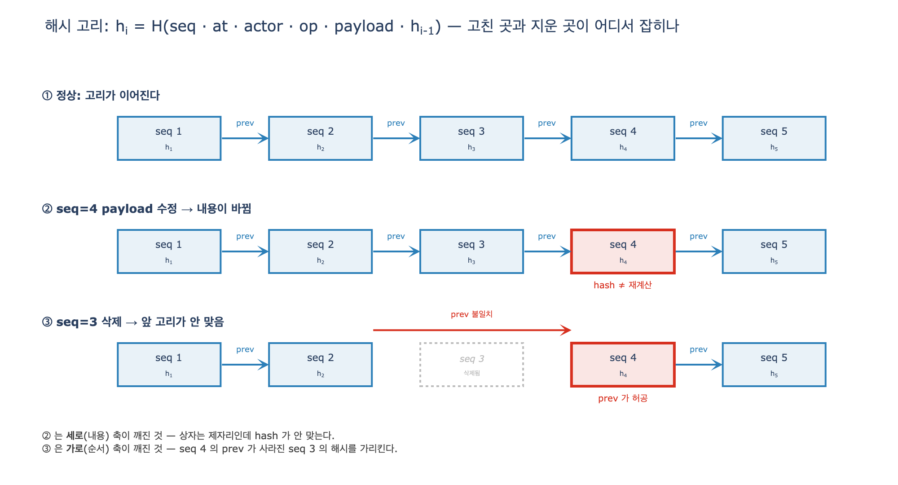

# `ex5_audit_trail.py`의 해시 고리는 어떻게 구성되는가

> **답**: 각 항목의 해시를 `seq`·시각·행위자·`op`·`payload`·**앞 해시**로 계산하고,
> 다음 항목이 그 해시를 `prev`로 저장한다.

---

## 1. 한 줄로 쓴 정의

```
h_i = H( seq_i ‖ at_i ‖ actor_i ‖ op_i ‖ payload_i ‖ h_{i-1} )
```

- `H` = SHA-256, 앞 16자리(hex)만 잘라 씀 → 64비트
- `h_0` = `"-"` (고정 씨앗)
- 계산된 `h_i`는 **다음 행의 `prev` 칼럼에 저장**된다

30장 5절(「로그가 감사 로그가 되려면」)의 예제가 하는 일은 이게 전부다.
그런데 이 짧은 식 안에 감사 로그가 성립하는 조건이 다 들어 있다.

## 2. 코드에서 어디가 고리인가

### 스키마 — 한 행이 두 개의 해시를 든다

```python
DDL = """
CREATE TABLE log (
  seq   INTEGER PRIMARY KEY,
  at    TEXT, actor TEXT, op TEXT, payload TEXT,
  prev  TEXT,        -- 앞 항목의 해시
  hash  TEXT         -- 이 항목의 해시
);
"""
```

`prev`와 `hash`가 나란히 있다는 게 핵심이다.
`n`번 행의 `hash`가 `n+1`번 행의 `prev`와 **같은 값**이어야 한다.
이 「같아야 한다」가 고리(chain)다.

### 해시 계산 — 여섯 필드가 모두 들어간다

```python
def digest(seq, at, actor, op, payload, prev):
    body = json.dumps([seq, at, actor, op, payload, prev],
                      ensure_ascii=False, sort_keys=True)
    return hashlib.sha256(body.encode()).hexdigest()[:16]
```

빠진 필드가 하나라도 있으면 그 필드는 **마음대로 고쳐도 안 걸린다**.
`actor`를 해시 입력에서 빼면 「누가 했나」를 조작할 수 있고,
`at`을 빼면 시각을 조작할 수 있다. 감사 로그에서 둘 다 치명적이다.
그래서 여섯 필드 전부가 들어간다.

`prev`가 입력에 들어간 것도 중요하다. 이것 때문에 항목의 **위치**까지 해시에 묶인다.
같은 내용의 이벤트라도 로그의 다른 자리에 놓이면 해시가 달라진다.

### 추가 — 마지막 행을 읽어서 이어 붙인다

```python
def append(db, at, actor, op, payload):
    row = db.execute("SELECT seq, hash FROM log ORDER BY seq DESC "
                     "LIMIT 1").fetchone()
    seq = (row[0] + 1) if row else 1
    prev = row[1] if row else "-"          # ← 앞 항목의 hash 를 그대로 물려받는다
    h = digest(seq, at, actor, op, payload, prev)
    db.execute("INSERT INTO log VALUES (?,?,?,?,?,?,?)",
               (seq, at, actor, op, json.dumps(payload, ensure_ascii=False),
                prev, h))
    return seq
```

`append`가 **추가만** 한다는 점을 보라. `UPDATE`도 `DELETE`도 없다.
30장 요약이 말한 「기록도 남긴다」가 아니라 「기록이 곧 쓰기다」가 여기서 구조로 굳는다.

### 검증 — 두 가지를 따로 본다

```python
def verify(db):
    bad = []
    prev = "-"
    for seq, at, actor, op, payload, p, h in db.execute(
            "SELECT * FROM log ORDER BY seq"):
        want = digest(seq, at, actor, op, json.loads(payload), prev)
        if p != prev:
            bad.append((seq, "앞 고리가 안 맞음"))   # 가로: 순서/삭제
        elif h != want:
            bad.append((seq, "내용이 바뀜"))         # 세로: 내용
        prev = h
    return bad
```

## 3. 고리가 잡아내는 두 축

| 축 | 무엇으로 묶나 | 어떤 조작이 걸리나 | verify 의 메시지 |
|---|---|---|---|
| **세로(내용)** | 해시 입력에 `seq·at·actor·op·payload` | 한 항목의 어느 필드든 수정 | `내용이 바뀜` |
| **가로(순서)** | 해시 입력의 `h_{i-1}` + `prev` 칼럼 | 항목 삭제, 순서 뒤바꿈, 중간 삽입 | `앞 고리가 안 맞음` |

`expy.py`로 실제 확인한 결과:

```
정상        검증: 이상 없음
seq=4 수정  검증: [(4, '내용이 바뀜')]        저장 hash f8412c5ab022557d ≠ 재계산 bac8471bbfbc2f7d
seq=3 삭제  검증: [(4, '앞 고리가 안 맞음')]  4번의 prev 7624be68113654d2 ≠ 남은 2번의 hash c26f3343819833bd
```

삭제가 걸리는 방식이 특히 재미있다.
지운 3번의 해시가 **4번 행 안에 화석처럼 남아** 있어서, 3번을 지운 순간 그 값이 허공을 가리킨다.
장의 말대로 「지우면 다음 항목의 앞 고리가 안 맞는다」.
추가 전용 로그에서 삭제는 흔적을 지우는 게 아니라 **구멍을 만든다.**

### 왜 위반이 한 줄에서 멈추나

`verify`는 다음 라운드의 기대값으로 재계산한 해시가 아니라 **저장된 `h`**를 쓴다(`prev = h`).
그래서 seq=4가 깨져도 seq=5는 통과한다. 「어디가 **처음** 깨졌나」를 바로 짚어 주므로 조사에 유리하다.
반대로 `prev = want`로 이어 붙이면 위반이 뒤로 전부 번져서 「여기부터 못 믿는다」는 경계가 명확해지지만
최초 지점을 찾기 어려워진다. 취향이 아니라 용도의 문제다.

## 4. 직렬화(정규화)가 왜 중요한가

해시는 **문자열이 아니라 바이트**를 먹는다. 사람 눈에 같아도 바이트가 다르면 해시가 다르다.
감사 로그에서 이건 두 방향으로 사고를 낸다.

- **오탐** — 정직한 로그인데 「위조됐다」고 나온다 → 검증을 아무도 안 믿게 된다
- **미탐** — 의미가 다른 두 기록이 같은 해시를 갖는다 → 조작이 통과한다

`ex5`의 `json.dumps(..., ensure_ascii=False, sort_keys=True)`는 그 두 구멍을 각각 막는다.

### (a) 필드 경계 — JSON 배열로 감싼다 (미탐 방어)

여섯 값을 그냥 이어 붙이면 이렇게 된다 (`expy.py` 실측):

```
actor='admin',     op=':kim'   → b4d9996072774891
actor='admin:kim', op=''       → b4d9996072774891   ← 같다!
```

이건 **길이 확장/경계 모호성** 문제다. 감사 로그에서는 곧 **행위자 세탁**이다.
「사람 관리자가 지웠다」를 「에이전트가 지웠다」로 바꿔도 해시가 그대로면 고리는 아무 말도 못 한다.
JSON 배열로 감싸면 `["admin", ":kim", ...]`와 `["admin:kim", "", ...]`가 다른 바이트가 되므로 막힌다.

### (b) 키 순서 — `sort_keys=True` (오탐 방어)

JSON 명세는 객체의 키 순서를 **의미 없음**으로 규정한다.
그런데 해시는 순서를 본다. `payload`가 ORM·드라이버·다른 언어 구현을 거치며 키 순서가 바뀌면
내용이 똑같아도 해시가 달라진다.

```
sort_keys 없음: c4ebd38491e4cd9d vs 86e7c92f50c13b6b   → 다르다 (오탐)
sort_keys 있음: 7fa669dd071a9ec6 vs 7fa669dd071a9ec6   → 같다
```

### (c) `ex5`의 정규화가 **덮지 못하는** 것들

교재용 예제라 여기까지지만, 실무에 올릴 때 반드시 물리는 지점들이다.
`expy.py`가 각각을 실제로 깨 보인다.

| 구멍 | 증상 | 대책 |
|---|---|---|
| 유니코드 정규화 | `"이서연"`(NFC, 3코드포인트)과 NFD(7코드포인트)가 다른 해시 — macOS 파일 경로·일부 IME가 NFD를 준다 | 해시 **전에** `unicodedata.normalize("NFC", …)` |
| `ensure_ascii` 합의 | 옵션 하나만 달라도 완전히 다른 해시 (`a85c170d…` vs `9e6a716b…`) — Python·Go·JS 구현이 갈린다 | 직렬화 규칙을 **명세로 못 박기**. JCS(RFC 8785) 같은 표준 채택 |
| 부동소수 표현 | `0.1+0.2 ≠ 0.3`, 언어마다 출력 문자열이 다름 | 확신도 등 float를 payload에 넣지 말고 정수·문자열로 |
| 공백/구분자 | `json.dumps` 기본 `", "`, `": "`에 의존 | `separators=(",", ":")`로 고정 |
| 해시 절단 | 16 hex = 64비트, 생일 한계 ≈ 2³² 항목 | 자르지 말고 64 hex(256비트) 전체 |

요점은 「JSON으로 덤프한다」가 아니라 **「어떤 바이트가 나오는지를 한 가지로 못 박는다」**이다.
그게 정규화(canonicalization)다. 검증하는 쪽이 나중에·다른 언어로 짜여도 같은 값이 나와야 하기 때문이다.

## 5. RFC 6962 계열과의 차이

장의 키워드 표는 「해시 고리 — [표준] — RFC 6962」로 적고 있다.
하지만 RFC 6962(Certificate Transparency)가 정의하는 것은 **선형 해시 고리가 아니라 머클 해시 트리**다.
목적(추가 전용 로그의 위변조를 드러낸다)은 같고, 성질이 다르다.

| | `ex5`의 선형 해시 고리 | RFC 6962 머클 트리 |
|---|---|---|
| 구조 | `h_i = H(record_i ‖ h_{i-1})` — 1차원 사슬 | 리프를 둘씩 묶어 올린 이진 트리, 꼭대기 = MTH |
| 포함 증명 | 없음. 전체를 다시 훑어야 확인 → O(n) | audit path O(log n) 노드만으로 증명 |
| 일관성 증명 | 없음. 「예전 로그가 지금 로그의 접두사다」를 짧게 못 보임 | consistency proof O(log n) |
| 도메인 분리 | 없음 | 리프 앞 `0x00`, 내부 노드 앞 `0x01` — 리프/노드 혼동 공격 차단 |
| 서명 | 없음 | STH(Signed Tree Head)를 로그 운영자 키로 서명 |
| 외부 고정 | 없음 (본문: 「해시를 밖에 내보내야 한다」) | monitor·auditor가 STH를 교차 검증 |
| 해시 폭 | SHA-256을 64비트로 절단 | SHA-256 전체 |

**한 줄 차이**: 선형 고리는 「로그 전체를 내가 갖고 있을 때 훼손을 알아챌 수 있다」는 성질이고,
머클 트리는 「로그 전체를 갖지 않은 **제3자에게** 짧은 증명으로 납득시킬 수 있다」는 성질이다.

`ex5`가 트리를 안 쓰는 건 게으름이 아니다.
사내 감사 로그의 검증자는 대개 로그를 통째로 읽을 수 있는 내부 감사팀이라,
O(log n) 증명이 필요 없다. 「값이 확 뛴다」는 장의 경고가 여기에 해당한다.

## 6. 고리의 한계 — 막지 않고 표만 낸다

장 본문이 못 박은 대로다.

> 고리는 «막지» 않는다. «표가 나게» 할 뿐이다.
> 전부 다시 계산하면 일관된 위조본을 만들 수 있다.

`expy.py`가 이걸 실제로 만든다. seq=4의 `actor`를 `agent-4821` → `hr-sync`로 바꾸고
전체 고리를 재계산하면:

```
위조 후 재계산 검증: 이상 없음        ← 내부 검증은 통과한다
  어제 외부에 적어 둔 tip : c8a4143730b9f6ed
  오늘 로그의 tip         : 6e021559225c6c51
  일치? False                          ← 밖에 적어 둔 값 하나가 위조를 잡는다
```

DB 쓰기 권한만 있으면 내부 검증은 무력하다.
방어는 **마지막 해시(tip)를 로그 바깥에 고정(anchoring)**하는 것 하나뿐이다 —
다른 시스템에 적어 두거나, 매일 한 번 어딘가에 공개하거나.
RFC 6962는 그 「밖」을 서명 + 여러 감시자로 제도화한 것이다.

어디까지 막을지는 무엇을 지키는지에 달렸다. 대부분의 사내 시스템에서는 「표가 나는 것」만으로 충분하다.

## 7. 정리

1. **구성** — `h_i = H(seq_i ‖ at_i ‖ actor_i ‖ op_i ‖ payload_i ‖ h_{i-1})`, `h_0 = "-"`.
   계산된 `h_i`를 다음 행이 `prev` 칼럼에 저장한다.
2. **`‖`는 정규 직렬화** — JSON 배열 + `sort_keys=True` + `ensure_ascii=False`.
   경계가 없으면 다른 기록이 같은 해시가 되고(미탐), 키 순서를 안 맞추면 정상 기록이 걸린다(오탐).
3. **잡는 방식** — 고치면 그 항목의 `hash`가 안 맞고(세로), 지우면 다음 항목의 `prev`가 안 맞는다(가로).
4. **한계** — 막지 못하고 표만 낸다. tip 해시를 외부에 고정해야 재계산 위조가 걸린다.
5. **RFC 6962와의 차이** — 그쪽은 머클 트리라서 제3자에게 O(log n) 증명까지 준다. 선형 고리에는 증명이 없다.

## 시각화


