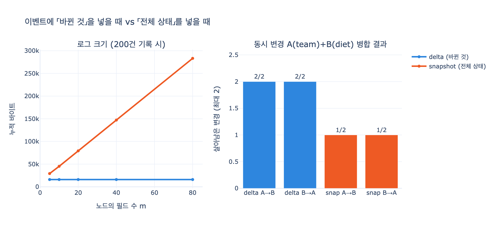

# 이벤트에는 무엇을 넣어야 하는가

> **답**: 「바뀐 것」을 넣는다. 「바뀐 뒤 전체 상태」를 넣으면 무엇이 바뀌었는지 모르고 동시 변경도 합칠 수 없다.

## 한 줄 정리

이벤트는 **변화(delta)** 를 담는 그릇이지 **상태(state)** 를 담는 그릇이 아니다.
전체 상태를 통째로 넣는 순간, 이벤트 소싱을 하면서도 사실상 「덮어쓰기」로 되돌아간다.

---

## 왜 이게 문제가 되는가 — 30장의 맥락

30장의 출발점은 「현재 상태만 두면 못 하는 질문들」이다. `ex1_no_history.py` 가
그 네 가지 질문을 보여 준다.

| | 질문 | 현재 상태만 | 이벤트 로그 |
|---|---|---|---|
| Q1 | 지금 결제팀 팀장은? | 이서연 | 이서연 |
| Q2 | 3월 15일에는 팀장이 누구였나? | 답 못 함 | 박민수 |
| Q3 | 「이서연 -이끔-> 정산팀」은 누가 넣고 누가 지웠나? | 답 못 함 | 추가 agent-4821 / 삭제 admin:kim |
| Q4 | 에이전트가 넣은 것 중 사람이 되돌린 게 몇 건인가? | 답 못 함 | 1건 |

그런데 여기서 함정이 하나 있다. **이벤트를 쌓기만 하면 Q2~Q4 가 자동으로 풀린다고 착각하기 쉽다.**
이벤트 안에 「바뀐 뒤 전체 상태」를 넣으면 Q2 는 풀리지만 **Q3, Q4 는 여전히 못 푼다.**
과거 상태는 복원되는데 *무엇이 왜 바뀌었는지* 는 여전히 없기 때문이다.

즉 이 카드는 「이벤트 소싱을 하기로 했다」 다음에 오는, **페이로드 설계**의 문제다.

---

## 두 가지 이벤트 모양

같은 변경 하나를 두 방식으로 적어 보자. 「이서연이 정산팀으로 옮겼다」.

**delta 이벤트 (권장)**

```json
{ "seq": 7, "at": "2026-04-01T09:00", "actor": "hr-sync",
  "set": { "team": "정산팀" } }
```

**snapshot 이벤트 (안티패턴)**

```json
{ "seq": 7, "at": "2026-04-01T09:00", "actor": "hr-sync",
  "state": { "name": "이서연", "team": "정산팀", "role": "팀원",
             "diet": "채식", "phone": "010-0000-0000" } }
```

접기 함수(리듀서) $f$ 로 쓰면 차이가 선명해진다.

$$
S_n = f(S_{n-1},\, e_n)
$$

- **delta**: $e_n = \Delta_n$, 그리고 $f$ 는 **적용**이다. → $S_n = S_{n-1} \oplus \Delta_n$
- **snapshot**: $e_n = S_n$, 그리고 $f$ 는 **덮어쓰기**다. → $S_n = e_n$

핵심은 이것이다. **snapshot 방식의 $f$ 는 $S_{n-1}$ 을 인자로 받고도 쓰지 않는다.**
$f$ 가 앞 상태를 버리는 함수라는 것은, 로그가 앞 상태와의 관계를 안 담고 있다는 뜻이다.
정보는 거기서 사라진다.

---

## 문제 1 — 「무엇이 바뀌었는지 모른다」

### 이벤트 하나만으로는 못 답한다

delta 이벤트는 `set` 필드가 곧 답이다. 이벤트 한 건이 스스로 자기가 무엇을 했는지 말한다.
snapshot 이벤트는 그 자체로는 아무 말도 안 한다. 반드시 **앞 이벤트와 diff** 를 떠야 한다.

이건 그냥 불편한 정도가 아니다. 세 가지가 실제로 무너진다.

### (1) 앞 상태가 없으면 영영 못 안다

로그 보존 정책으로 오래된 이벤트가 잘렸거나, 로그의 첫 이벤트이거나,
파티션이 다른 샤드에 있으면 diff 를 뜰 대상이 없다. delta 는 이런 의존이 아예 없다.

```
[snapshot] 앞 상태가 없을 때(로그가 잘렸다)
  (1, 'hr-sync', '?? 앞 상태 없음')
```

### (2) 되돌아온 값이 통째로 사라진다

`비건 → 육식 → 비건`. 에이전트가 바꿨다가 사람이 되돌린 흔적이다.
그런데 처음 상태와 끝 상태의 diff 는 **빈 집합**이다.

이게 왜 치명적이냐면, 30장(과 28장)이 말하는 품질 지표
**「에이전트가 넣은 것 중 되돌려진 비율」이 정확히 이 패턴을 센다.**
snapshot 이벤트로는 이 지표를 만들 수 없다.

```
[delta]    각 이벤트가 스스로 무엇을 했는지 말한다
  seq1 agent-4821   set={'diet': '육식'}
  seq2 user         set={'diet': '비건'}      ← 되돌림이 명시적으로 남는다

[snapshot] 처음과 끝만 diff 하면
  바뀐 필드: 없음                              ← 사건 자체가 증발
```

### (3) 「덮어썼다」와 「안 건드렸다」를 구별 못 한다

HR 싱크가 매일 돌면서 `team=정산팀` 을 같은 값으로 재기록한다고 하자.
delta 이벤트에는 `set: {"team": "정산팀"}` 이 남아 「hr-sync 가 이 필드의 주인이다」가 보인다.
snapshot 은 앞뒤가 같으니 diff 가 비고, 손도 안 댄 것과 구별할 방법이 없다.

이건 소유권/권한 분쟁에서 바로 문제가 된다. 「누가 이 필드를 관리하고 있었나」를 못 답한다.

---

## 문제 2 — 「동시 변경을 합칠 수 없다」

같은 기준 상태 $S_0$ 에서 두 행위자가 **동시에** 갈라져 나온다.

- A(hr-sync): `team` 을 정산팀으로
- B(agent-4821): `diet` 를 비건으로

서로 **다른 필드**다. 도메인적으로는 충돌이 아니다. 둘 다 살아야 정상이다.

$$
\text{delta: } S = S_0 \oplus \Delta_A \oplus \Delta_B
\qquad
\text{snapshot: } S = S_B \;\text{(또는)}\; S_A
$$

실행 결과:

```
delta  A→B: team=정산팀  diet=비건   OK 둘 다 반영
delta  B→A: team=정산팀  diet=비건   OK 둘 다 반영     ← 순서 무관
snap   A→B: team=결제팀  diet=비건   유실: team
snap   B→A: team=정산팀  diet=채식   유실: diet        ← 순서가 답을 바꾼다
```

### 왜 delta 는 되는가

$\oplus$ 가 **필드 단위**로 동작한다. 겹치지 않는 필드에 대해서는
$\Delta_A \oplus \Delta_B = \Delta_B \oplus \Delta_A$ — **교환 법칙이 성립한다.**
그래서 순서를 몰라도, 순서가 뒤바뀌어도 같은 답이 나온다.
(이게 CRDT 계열이 서 있는 자리이고, 31장이 이어받는 주제다.)

snapshot 의 `f = 덮어쓰기` 는 교환 법칙이 없다. 마지막 것이 무조건 이긴다.

### 더 나쁜 것 — 유실이 보이지 않는다

snapshot 로그에는 「잃었다」는 흔적이 안 남는다.
`{"state": {...}}` 는 언제나 **정상적이고 완전한 상태**처럼 보인다.
하필 그 안에서 남의 변경이 지워졌다는 사실만 안 보인다.
카드 문장의 「합칠 수 없다」에는 이 조용한 실패까지 포함된다.

### 그리고 진짜 충돌을 구별 못 한다

delta 라면 「실제로 겹치는 필드」만 충돌이라고 말할 수 있다.

```
A(team) vs B(diet)  충돌 필드: 없음 → 자동 병합 가능
B(diet) vs C(diet)  충돌 필드: {'diet': [('agent-4821','비건'), ('user','채식')]}
```

snapshot 은 두 경우 모두 「전체 상태가 다르다」로만 보인다.
자동으로 합칠 수 있었을 것까지 전부 충돌로 만들어서, 사람이 개입할 일을 불필요하게 늘린다.
그리고 정작 진짜 충돌(같은 필드)은 조용히 last-write-wins 로 뭉개진다.

---

## 문제 3 (덤) — 로그 크기

노드가 $m$ 개 필드를 갖고 이벤트가 $n$ 건, 한 번에 $k$ 개 필드를 바꾼다면

$$
\text{delta} \sim O(n \cdot k), \qquad \text{snapshot} \sim O(n \cdot m), \qquad k \ll m
$$

200건 기록 시 실측:

| 필드 수 $m$ | delta | snapshot | 배수 |
|---|---|---|---|
| 5 | 15,980 B | 29,180 B | 1.8x |
| 10 | 15,980 B | 45,180 B | 2.8x |
| 20 | 15,980 B | 79,180 B | 5.0x |
| 40 | 15,980 B | 147,180 B | 9.2x |
| 80 | 15,980 B | 283,180 B | 17.7x |

delta 는 **평평하다**. 노드가 아무리 뚱뚱해져도 이벤트 크기는 바꾼 필드 수에만 달렸다.
snapshot 은 노드 크기에 비례해서 선형으로 부푼다.

이건 부차적인 문제 같지만, 이벤트 로그는 **추가 전용(append-only)** 이라
한 번 잘못 잡은 페이로드 크기가 영원히 누적된다.

---

## 그럼 전체 상태를 저장하는 건 언제나 나쁜가 — 아니다

여기서 반드시 구별해야 할 개념이 하나 있다.

| | 이벤트 (event) | 스냅숏 (snapshot) |
|---|---|---|
| 담는 것 | 바뀐 것 (delta) | 그 시점의 전체 상태 |
| 빈도 | 변경마다 | 주기적으로 (예: 5만 건마다) |
| 역할 | **진실의 원본** | **재생 시간을 상한으로 묶는 최적화** |
| 지워도 되나 | 안 된다 | 된다 (이벤트에서 다시 만들 수 있으니) |

30장의 `ex2_replay_cost.py` 가 재는 것이 바로 이 스냅숏이다.

> 이벤트가 백만 개든 천만 개든 재생할 것은 최대 5만 개다.
> 그러니 재생 시간이 「데이터 양」이 아니라 「스냅숏 주기」로 정해진다.

**전체 상태를 저장하는 행위 자체가 금지가 아니라, 그걸 「이벤트」라고 부르는 것이 금지다.**
스냅숏은 이벤트를 **대체하지 않고 곁들인다.** 대체하는 순간 위의 세 문제가 전부 돌아온다.
데이터베이스의 WAL + 체크포인트가 정확히 같은 구조다. WAL 은 delta 고, 체크포인트가 스냅숏이다.

---

## 이벤트에 함께 넣어야 하는 것

「바뀐 것」만으로는 아직 부족하다. 30장이 요구하는 질문들을 다 답하려면 이 정도는 있어야 한다.

| 필드 | 왜 | 못 넣으면 |
|---|---|---|
| `at` | 시점 | Q2「그때는?」을 못 답함 |
| `actor` | 누가 (사람/에이전트/싱크) | Q3「누가 넣었나?」, Q4 품질 지표를 못 만듦 |
| `op` | 추가/삭제 | 삭제가 「없음」과 구별 안 됨 |
| `set` / 대상 | **바뀐 것** | 이 카드의 주제 |
| `prev`, `hash` | 해시 고리 | 「안 고쳤다」를 증명 못 함 (`ex5`) |
| (출처 등급) | 리듀서 입력 | 「사람이 이긴다」를 구현 못 함 (`ex4`) |

특히 `actor` 는 delta 와 짝을 이룰 때만 값을 한다.
「누가」 + 「무엇을」이 한 이벤트 안에 같이 있어야 Q3, Q4 가 성립한다.
snapshot 이벤트는 `actor` 를 넣어도 「누가 이 전체 상태를 썼다」밖에 안 되어서
**「누가 무엇을 바꿨다」로 좁혀지지 않는다.**

그리고 30장의 마지막 경고 하나. **이벤트에 개인정보를 직접 넣지 말 것.**
추가 전용 로그는 지울 수 없는 곳인데, 개인정보는 지워야 하는 것이다.
delta 로 잘 쪼개 놨더라도 그 값이 주민번호나 전화번호면 문제는 그대로다.
(참조 키만 넣고 실제 값은 지울 수 있는 저장소에 둔다.)

---

## 흔한 반론과 답

**「그래도 diff 뜨면 되잖아요」**
→ 앞 상태가 있을 때만 된다. 그리고 diff 는 *결과* 만 복원하지 *의도* 는 복원 못 한다.
되돌아온 값과 같은 값 재기록이 전부 사라진다.

**「우리는 동시 쓰기가 없어요」**
→ 에이전트를 붙이는 순간 생긴다. 30장이 31장으로 넘어가는 이유가 이것이다.
그리고 페이로드 모양은 나중에 못 바꾼다. 이미 쌓인 로그가 전부 snapshot 이니까.

**「전체 상태가 있으면 재생이 빠르잖아요」**
→ 그건 맞는데, 그러면 그것을 **스냅숏**으로 따로 두면 된다.
이벤트를 snapshot 으로 만들 이유가 아니다.

---

## 시각화



왼쪽은 노드 필드 수가 늘어날 때 로그 크기가 어떻게 벌어지는지, 오른쪽은 서로 다른
필드를 건드린 동시 변경 두 건 중 몇 건이 살아남는지를 보여 준다.
delta 는 순서와 무관하게 2/2, snapshot 은 어느 순서든 1/2 다.
