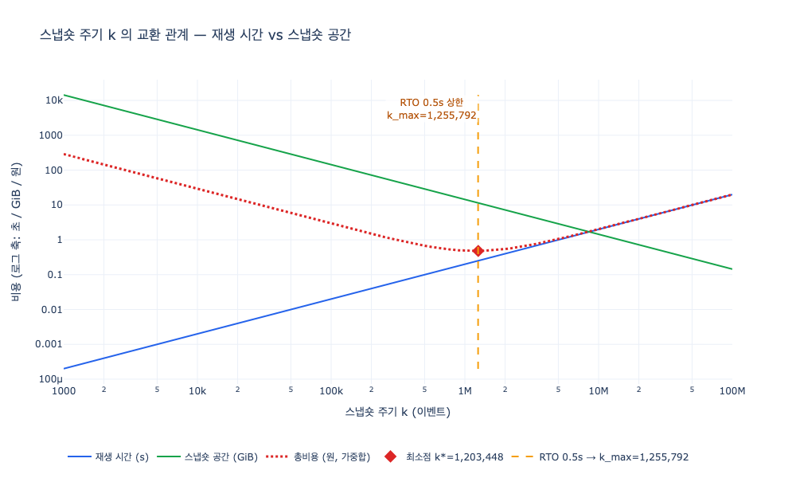

# 스냅숏 주기의 교환 관계

> **Q.** 스냅숏 주기의 교환 관계는 무엇인가?
>
> **A.** 짧게 잡으면 재생은 빠르지만 스냅숏 저장 공간이 늘고, 길게 잡으면 공간은 아끼지만 복구가 느려진다.

---

## 1. 왜 이런 교환이 생기는가

이벤트 소싱에서 **이벤트가 원본이고 상태는 파생**이다. 현재 상태를 얻으려면 이벤트를 처음부터 접어야(fold) 한다. 이벤트가 $n$ 개면 재생 시간은 $n$ 에 비례한다.

$$T_{full} = n \cdot t_{event}$$

이건 시간이 갈수록 나빠지기만 한다. 이벤트는 추가 전용 로그라 지워지지 않으니까. 30장 `ex2_replay_cost.py` 가 그걸 보여 준다 — 이벤트 백만 개면 처음부터 재생에 395ms, 천만 개면 그 열 배다.

스냅숏은 이 선형 증가를 끊는다. $k$ 이벤트마다 「그 시점의 상태 전체」를 저장해 두면, 복구할 때는 **마지막 스냅숏을 읽고 그 뒤 꼬리만 재생**하면 된다.

$$T_{replay}(k) \;\le\; k \cdot t_{event}$$

여기서 중요한 단어가 **상한**이다. 이벤트가 백만 개든 천만 개든 재생할 것은 최대 $k$ 개다. 즉 **재생 시간이 「데이터 양」이 아니라 「스냅숏 주기」로 정해진다.**

그런데 공짜가 아니다. 스냅숏 하나는 그 시점 상태 전체의 복사본이고, $n$ 개 이벤트 구간에는 스냅숏이 $n/k$ 개 생긴다.

$$S_{snap}(k) = \frac{n}{k} \cdot s_{snap}$$

| | 재생 시간 $k \cdot t_{event}$ | 스냅숏 공간 $(n/k) \cdot s_{snap}$ |
|---|---|---|
| $k$ 를 **짧게** (예: 1만) | 빠르다 (좋음) | 스냅숏이 많아진다 (나쁨) |
| $k$ 를 **길게** (예: 1000만) | 느리다 (나쁨) | 스냅숏이 적어진다 (좋음) |

하나는 $k$ 에 **비례**하고 하나는 $k$ 에 **반비례**한다. 그래서 한쪽을 좋게 하면 반드시 다른 쪽이 나빠진다 — 이게 교환 관계다. 「둘 다 좋게」는 없고, 어디에 설 것인지만 고를 수 있다.

## 2. 그럼 주기를 어떻게 정하나 — RTO에서 거꾸로 계산한다

30장의 답은 **최적화하지 말고 제약에서 역산하라**는 것이다. 「장애 났을 때 몇 초 안에 복구할 것인가」(복구 목표 시간, RTO)를 먼저 정하고, 그 시간에 재생할 수 있는 이벤트 수를 재서 그만큼을 주기로 잡는다.

$$k_{max} = \frac{\text{RTO} \cdot \alpha}{t_{event}}$$

$\alpha$ 는 안전 여유다. RTO 예산 전부를 순수 재생에 쓸 수는 없다 — 스냅숏을 디스크에서 읽어 역직렬화하는 시간, 콜드 캐시, 프로세스 기동이 다 들어간다. 보수적으로 $\alpha = 0.5$ (예산의 절반만 재생에 배정) 정도로 잡는다.

### 절차 (구체적 숫자로)

**0단계 — 재는 것부터.** 추정하지 말고 실제로 재생을 돌려서 이벤트당 시간을 측정한다. `expy.py` 의 마이크로벤치마크 결과:

```
이벤트 400,000 개 재생: 93.9 ms
t_event = 0.235 us/이벤트   (초당 약 426만 이벤트)
```

**1단계 — RTO를 정한다.** 「장애 시 0.5초 안에 조회용 뷰 복구」라고 하자.

**2단계 — $k_{max}$ 를 역산한다.**

$$k_{max} = \frac{0.5\,\text{s} \times 0.5}{0.235\,\mu\text{s}} = \frac{0.25\,\text{s}}{2.35 \times 10^{-7}\,\text{s}} \approx 1{,}065{,}000$$

→ **스냅숏은 약 100만 이벤트마다.** 이보다 길게 잡으면 최악의 경우 RTO를 못 지킨다.

**3단계 — 공간 청구서를 확인한다.** 상태가 삼중항 2천만 개고 직렬화하면 삼중항당 15.5 bytes, 즉 $s_{snap} \approx 0.29$ GiB. 누적 이벤트 $n = 5000$ 만이면

$$\frac{5 \times 10^7}{1.065 \times 10^6} \approx 47\ \text{개} \times 0.29\,\text{GiB} \approx 13.5\ \text{GiB}$$

이 숫자를 감당할 수 있으면 확정, 못 하면 RTO 협상으로 돌아간다. (또는 오래된 스냅숏은 지우고 최근 몇 개만 남기는 보관 정책을 건다.)

### RTO를 바꾸면 어떻게 움직이는가

`expy.py` 4번 셀의 실측 표. 같은 $t_{event}$, 같은 $n$ 에서 RTO만 바꾼 것이다.

| RTO | $k_{max}$ | 채택 $k$ | 최악 재생 | 스냅숏 수 | 스냅숏 공간 | 무엇이 정했나 |
|---:|---:|---:|---:|---:|---:|:--|
| 0.1 s | 213,066 | 213,066 | 0.05 s | 235 | 67.7 GiB | RTO |
| 0.2 s | 426,131 | 426,131 | 0.10 s | 117 | 33.8 GiB | RTO |
| 0.5 s | 1,065,328 | 1,065,328 | 0.25 s | 47 | 13.5 GiB | RTO |
| 1.0 s | 2,130,655 | 1,108,435 | 0.26 s | 45 | 13.0 GiB | 비용 |
| 3.0 s | 6,391,966 | 1,108,435 | 0.26 s | 45 | 13.0 GiB | 비용 |

RTO를 0.5초에서 0.1초로 **5배 조이면 저장 공간이 5배로 늘어난다**(13.5 → 67.7 GiB). 반비례가 그대로 보인다. 반대로 RTO가 1초 이상으로 헐거워지면 제약이 풀려서 이제는 RTO가 아니라 **비용 최소점**이 주기를 정한다.

## 3. 비용 최소점 $k^{*}$ — 제약이 헐거울 때

RTO 제약이 널널하면 그 안에서 총비용이 가장 싼 지점을 고른다. 단위가 다른 두 값(초와 바이트)을 섞어야 하니 가중합을 쓴다.

$$C(k) = w_t \cdot k\,t_{event} \;+\; w_s \cdot \frac{n}{k}\,s_{snap}$$

$\frac{dC}{dk} = 0$ 으로 풀면

$$k^{*} = \sqrt{\frac{w_s\, n\, s_{snap}}{w_t\, t_{event}}}$$

$w_t = 1$ 원/초, $w_s = 0.02$ 원/GiB 로 놓으면 $k^{*} \approx 1{,}108{,}000$. 이 지점에서 두 비용의 기여분이 **정확히 같아진다** (재생 0.26원 vs 저장 0.26원). 교환 관계의 최소점은 늘 「두 힘이 균형을 이루는 곳」이다.

최종 규칙은 이렇게 정리된다.

$$k = \min(k_{max},\ k^{*})$$

**RTO가 상한을 긋고, 그 안에서 비용이 위치를 고른다.** 순서가 반대면 안 된다 — 비용 최소점이 RTO를 넘어가 있으면 그건 「싸지만 못 지키는 약속」이다.

## 4. 놓치기 쉬운 것들

- **스냅숏은 데이터가 충분히 쌓인 뒤에야 값을 한다.** 30장 예제에서 이벤트 1만 개 줄의 배수가 0.8배로 나오는 건 버그가 아니다. 아직 스냅숏이 한 번도 안 찍혀서 결국 처음부터 재생하는 것과 같고, 측정 잡음만 얹힌 결과다.
- **$k$ 는 시간이 아니라 이벤트 수로 잡는 게 안전하다.** 「매 1시간」으로 잡으면 트래픽이 몰릴 때 꼬리가 폭발한다. RTO는 시간 단위 약속이지만, 그 약속을 지키는 손잡이는 이벤트 수다.
- **$t_{event}$ 는 리듀서가 무거워지면 커진다.** 리듀서를 바꿨으면 다시 재고 $k$ 를 다시 계산해야 한다. 한 번 정하고 끝나는 값이 아니다.
- **$s_{snap}$ 은 상태 크기와 함께 자란다.** 그래프가 커지면 같은 $k$ 라도 공간 청구서가 늘어난다.
- **새로 발명한 구조가 아니다.** 데이터베이스의 쓰기 전 로그(WAL) + 체크포인트가 정확히 같은 계산을 한다. 체크포인트 간격을 짧게 하면 크래시 복구는 빠르지만 I/O와 공간을 더 쓴다. 30년 된 구조를 그대로 쓰는 것이다.

## 5. 한 줄 요약

**주기는 재생 시간(↑$k$)과 저장 공간(↓$k$)을 맞바꾸는 손잡이다. 손잡이 위치는 취향이 아니라 복구 목표 시간에서 $k_{max} = \text{RTO} \cdot \alpha / t_{event}$ 로 역산해서 정한다.**

## 시각화



로그 x축에서 재생 시간(파랑)은 오른쪽 위로, 스냅숏 공간(초록)은 오른쪽 아래로 향하는 직선이다. 둘의 가중합(빨강 점선)이 V자를 그리고, 그 바닥이 $k^{*}$ 다. 주황 세로선은 RTO에서 역산한 $k_{max}$ — 그 오른쪽은 아무리 싸도 고를 수 없는 영역이다.
