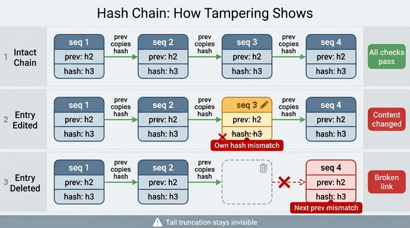

# 해시 고리는 고침과 지움을 각각 어떻게 잡아내는가?

**답:** 고치면 그 항목의 해시가 안 맞고, 지우면 다음 항목의 앞 고리(prev)가 안 맞는다.

---

## 1. 고리가 걸린 로그의 생김새

30.5절의 `ex5_audit_trail.py`는 이벤트 한 줄마다 두 개의 해시 칸을 더 답니다.

| 칸 | 뜻 |
|---|---|
| `prev` | **앞 항목의 해시**를 그대로 복사해 둔 값 |
| `hash` | `prev`를 **포함해서** 계산한 **이 항목의 해시** |

```python
def digest(seq, at, actor, op, payload, prev):
    body = json.dumps([seq, at, actor, op, payload, prev],
                      ensure_ascii=False, sort_keys=True)
    return hashlib.sha256(body.encode()).hexdigest()[:16]
```

핵심은 `digest()`의 인자에 `prev`가 들어간다는 점입니다. 그래서

- 내 `hash`는 내 내용에 의존하고,
- 동시에 앞 항목의 `hash`에도 의존합니다.

한 항목을 건드리면 그 뒤의 모든 해시가 연쇄적으로 어긋나야 정상인 구조죠. 그림으로 보면 이렇습니다.

```
seq1 [prev="-" , hash=h1]
        └─ h1 ─┐
seq2         [prev=h1, hash=h2]
                └─ h2 ─┐
seq3                [prev=h2, hash=h3]
                        └─ h3 ─┐
seq4                        [prev=h3, hash=h4]
```

즉 **고리 하나는 두 개의 약속**입니다.
「내 hash는 내 내용과 맞는다」와 「내 prev는 진짜 앞사람의 hash다」.
고침은 앞의 약속을, 지움은 뒤의 약속을 깹니다.

## 2. 검증 알고리즘을 단계로 펴 보기

```python
def verify(db):
    bad = []
    prev = "-"                                   # (a) 기대하는 앞 해시
    for seq, at, actor, op, payload, p, h in db.execute(
            "SELECT * FROM log ORDER BY seq"):
        want = digest(seq, at, actor, op, json.loads(payload), prev)  # (b)
        if p != prev:                            # (c) 연결 검사
            bad.append((seq, "앞 고리가 안 맞음"))
        elif h != want:                          # (d) 내용 검사
            bad.append((seq, "내용이 바뀜"))
        prev = h                                 # (e) 다음 칸으로 고리를 넘긴다
    return bad
```

단계로 정리하면:

1. **(a) 기대값 초기화** — 첫 항목의 앞 고리는 `"-"`(시작 표식)여야 한다고 둡니다.
2. **(b) 재계산** — 저장된 `hash`는 쳐다보지 않고, 행에 남아 있는 내용 + *내가 기억하는* `prev`로 해시를 다시 만듭니다. 이게 `want`입니다.
3. **(c) 연결 검사** — 행이 들고 있는 `p`(prev 칸)가 내가 기억하는 `prev`와 같은가? **다르면 「앞 고리가 안 맞음」**.
4. **(d) 내용 검사** — 연결이 맞을 때만, 저장된 `h`와 재계산한 `want`를 비교합니다. **다르면 「내용이 바뀜」**.
5. **(e) 이월** — `prev = h`로 저장된 해시를 다음 바퀴에 넘깁니다. (`want`가 아니라 `h`를 넘긴다는 점이 뒤에서 중요합니다.)

`elif`라는 점에 주의하세요. 연결이 이미 깨진 행은 내용 검사를 건너뜁니다. 어차피 `prev`가 틀린 상태로 계산한 `want`는 무조건 안 맞으니, **원인 하나에 진단 하나**만 나오게 한 것입니다.

## 3. 경로 1 — 고침(update)은 「내용이 바뀜」으로 잡힌다

예제가 4번 항목의 payload를 `이서연` → `김도현`으로 몰래 바꿉니다.

```python
db.execute("UPDATE log SET payload=? WHERE seq=4", ...)
```

이때 공격자는 `payload` 칸만 손댔고 `prev`/`hash` 칸은 그대로입니다. 검증이 seq 4에 도착하면:

| 검사 | 결과 |
|---|---|
| (c) `p`(=h3) vs 기대 `prev`(=h3) | **통과** — 연결은 멀쩡하다 |
| (d) 저장된 `h`(=h4, 옛 payload로 만든 값) vs `want`(새 payload로 다시 만든 값) | **불일치** |

→ `(4, '내용이 바뀜')`.

포인트는 **해시가 내용의 지문**이라는 것입니다. 내용을 바꾸면 지문이 바뀌어야 하는데 옛 지문이 그대로 남아 있으니, 재계산 한 번으로 들통납니다. 지문까지 같이 고치려면 그 뒤 모든 항목의 해시를 다시 계산해야 하고(→ 5절), 그게 고리의 값어치입니다.

또 5번 항목은 왜 조용할까요? 4번의 `hash` 칸은 안 건드려졌기 때문에 `prev = h`로 넘어가는 값이 그대로고, 5번의 `p`와 맞아떨어집니다. 그래서 **딱 고친 그 줄 하나만** 빨갛게 뜹니다. 위치까지 짚어 준다는 뜻이죠.

## 4. 경로 2 — 지움(delete)은 다음 항목의 「앞 고리가 안 맞음」으로 잡힌다

예제가 3번 항목을 통째로 지웁니다(4번은 원상복구한 뒤).

```python
db.execute("DELETE FROM log WHERE seq=3")
```

이제 남은 행은 1, 2, 4, 5입니다. 검증이 seq 2까지 무사히 지나가면 기대값은 `prev = h2`. 다음으로 읽히는 행이 seq 4인데:

| 검사 | 결과 |
|---|---|
| (c) `p`(=**h3**, 사라진 항목의 해시) vs 기대 `prev`(=**h2**) | **불일치** |

→ `(4, '앞 고리가 안 맞음')`.

지워진 항목 자신은 이미 없어서 아무 말을 못 합니다. 대신 **그 항목의 해시를 베껴 들고 있던 다음 항목이 증인**이 됩니다. h3은 이제 어떤 행에도 존재하지 않는 해시인데 4번이 그걸 가리키고 있으니, 「여기 뭔가가 있었다」가 드러나는 겁니다.

여기서도 이후 항목은 조용합니다. 4번의 `hash`(h4)는 멀쩡하고 5번의 `p`도 h4니까요. `prev = h`(재계산 `want`가 아니라 **저장된** `h`)를 이월하는 설계 덕분에 **오류가 하나로 국소화**됩니다. 만약 `prev = want`로 이월했다면 한 번 깨진 뒤 뒤쪽 전부가 빨갛게 물들어서 어디가 진짜 사고 지점인지 알기 어려웠을 겁니다.

### 두 경로 대조표

| | 고침(update) | 지움(delete) |
|---|---|---|
| 깨지는 약속 | 내용 ↔ 자기 해시 | prev 복사본 ↔ 앞 항목의 실제 해시 |
| 걸리는 검사 | (d) `h != want` | (c) `p != prev` |
| 신고하는 행 | **고쳐진 그 행** | **지워진 것의 다음 행** |
| 메시지 | 「내용이 바뀜」 | 「앞 고리가 안 맞음」 |

참고로 **첫 항목을 지워도** 잡힙니다. seq 2의 `p`가 h1인데 기대값은 시작 표식 `"-"`니까요. 그러니 중간·앞머리는 전부 커버됩니다. 문제는 꼬리입니다.

## 5. 왜 꼬리 잘라내기(truncation)는 안 잡히나

seq 4, 5를 **뒤에서부터** 지운다고 해 봅시다. 남는 것은 1, 2, 3.

- 1, 2, 3의 내용은 하나도 안 바뀌었으니 (d) 통과.
- 1↔2, 2↔3의 고리도 그대로니 (c) 통과.
- 검증 루프는 「테이블에 있는 행」만 훑고 끝납니다. 3번 뒤에 뭐가 있어야 했는지는 **로그 안 어디에도 안 적혀 있습니다.**

결과는 `이상 없음`. 잘린 로그가 **완벽하게 유효한 짧은 로그**와 구별되지 않습니다.

원리적으로 이렇습니다. 해시 고리는 각 항목이 **자기 앞쪽**만 가리키는 단방향 사슬입니다. 그래서 「내 앞에 무엇이 있었나」는 증명하지만 「내 뒤에 무엇이 더 있었나」는 증명하지 못합니다. 사슬의 마지막 고리는 자기가 마지막인지, 잘린 자리인지 스스로 말할 방법이 없습니다. 4장이 사라진 책에서 3장까지의 페이지 번호가 아무 문제 없어 보이는 것과 같죠.

게다가 「전부 다시 계산한 위조본」도 같은 빈틈입니다. 3번 이후를 지우고 입맛대로 다시 써서 해시를 처음부터 다시 계산하면 내부적으로 완전히 일관됩니다. 예제도 못을 박습니다.

> 고리는 «막지» 않는다. «표가 나게» 할 뿐이다. 전부 다시 계산하면 일관된 위조본을 만들 수 있다.

### 메꾸는 법 — 바깥에 기준점을 박는다

꼬리와 통째 재계산을 다 잡으려면 **로그 밖에 있는 기준점**이 필요합니다.

- **머리 해시 외부화(anchoring)** — 마지막 `hash`를 다른 시스템에 적어 두거나, 매일 한 번 공개합니다. 「어제 공개한 h1000이 지금 로그 어디에도 없다」 = 잘렸다는 증거. 예제 본문에서 권하는 방법이 이것입니다.
- **길이/시퀀스 감시** — 최대 `seq`(또는 항목 수)를 별도 저장소에 기록해 두고 줄어들었는지 봅니다.
- **하트비트 항목** — 변경이 없어도 주기적으로 「이상 없음」 항목을 추가하면, 뚝 끊긴 꼬리가 시간 축에서 눈에 띕니다.
- **서명된 체크포인트 / 추가 전용 매체** — 권한 분리(로그 쓰는 계정과 지우는 계정이 다르게), WORM 스토리지, 서명 등으로 「지우기」 자체를 비싸게 만듭니다.

그리고 예제의 마무리처럼, 어디까지 갈지는 비용 문제입니다. 사내 시스템 대부분은 「표가 나는 것」만으로 충분하고, 작정한 내부자까지 막으려면 값이 확 뜁니다. **무엇을 지키는지가 정한다**는 게 결론입니다.

## 6. 한 줄로 기억하기

> 고리 하나가 두 가지를 약속한다. 내용을 고치면 **자기 해시**가 깨지고, 항목을 지우면 **다음 항목의 prev**가 깨진다. 단, **꼬리를 자르면 아무것도 안 깨지므로** 마지막 해시는 로그 밖에 남겨 둬야 한다.

## 인포그래픽


