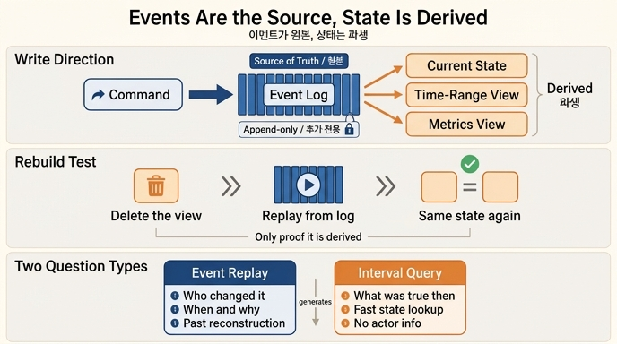

# 이벤트 소싱에서 원본과 파생

**Q.** 이벤트 소싱에서 원본과 파생은 각각 무엇인가?

**A.** 이벤트가 원본이고 상태는 파생이다. 조회용 뷰는 언제든 다시 만들 수 있어야 하고, 되는지는 실제로 지우고 재생해 봐야 안다.

---

## 1. 방향이 핵심이다

이벤트 소싱을 「이벤트도 같이 쌓는 것」으로 이해하면 절반만 맞다. 핵심은 **방향**이다.

| 역할 | 무엇 | 성질 |
|---|---|---|
| **원본 (source of truth)** | 이벤트 로그 | 추가 전용(append-only), 절대 고치지 않음 |
| **파생 (derived view)** | 현재 상태 / 조회용 뷰 / 구간 엣지 | 언제든 지우고 다시 만들 수 있음 |

30장 본문의 표현 그대로다.

> 이벤트 로그 — 진실의 원본(source of truth)
> 구간 엣지  — 이벤트에서 «만들어 낸» 조회용 뷰
>
> 중요한 건 방향이다. 이벤트가 원본이고 엣지가 파생이다.
> 거꾸로 하면(엣지를 고치고 이벤트를 나중에 적으면) 둘이 갈라진다.

즉 쓰기 경로가 이렇게 되어야 한다.

```
명령 ──> [이벤트 로그에 추가]  ← 여기가 유일한 쓰기 지점
              │
              ├──> 현재 상태 그래프   (파생)
              ├──> 구간 엣지 뷰       (파생, 27장)
              └──> 지표/대시보드      (파생)
```

거꾸로 된 시스템은 이렇게 생겼다. 상태를 먼저 고치고 로그를 「나중에 남긴다」. 이러면 로그를 빠뜨려도 아무 일이 안 생기므로, 시간이 지나면 반드시 갈라진다. 그래서 30장은 *「기록도 남긴다」가 아니라 「기록이 곧 쓰기다」로 뒤집어야 한다*고 말한다.

## 2. 왜 상태만으로는 부족한가 (ex1)

같은 변경 6건을 「덮어쓰기」와 「이벤트 쌓기」로 각각 기록하고 네 가지를 물으면 이렇게 갈린다.

| 질문 | 현재 상태만 | 이벤트 로그 |
|---|---|---|
| Q1 지금 결제팀 팀장은? | 이서연 | 이서연 |
| Q2 3월 15일에는 팀장이 누구였나? | 답 못 함 | 박민수 (그 시점까지 재생) |
| Q3 「이서연 -이끔-> 정산팀」은 누가 넣고 누가 지웠나? | 답 못 함 | agent-4821 추가 / admin:kim 삭제 |
| Q4 에이전트가 넣은 것 중 사람이 되돌린 게 몇 건? | 답 못 함 | 1건 |

덮어쓰기는 답을 **지운다**. 그래서 나중에 복원이 안 된다. 반면 이벤트가 원본이면 Q1(현재 상태)은 재생해서 만들 수 있고, Q2~Q4(과거·행위자·품질 지표)도 그대로 남는다. 감사, 사고 조사, 28장의 에이전트 품질 지표는 전부 Q2~Q4 계열이다.

## 3. 「다시 만들 수 있어야 한다」의 진짜 의미

파생이라는 말은 곧 **버려도 되는 것**이라는 뜻이다. 그런데 실무에서 「다시 만들 수 있다」는 대부분 *믿음*이지 *사실*이 아니다. 재구축 코드에 손이 안 간 채 몇 달이 지나면, 스키마가 어긋나거나 특정 이벤트 타입 처리가 빠져 있어서 실제로 돌려 보면 안 된다.

그래서 카드의 뒷 문장이 붙는다.

> 되는지는 **실제로 지우고 재생해 봐야** 안다.

- 뷰를 통째로 drop 하고 이벤트 0번부터 재생해서 원래 상태와 일치하는지 정기적으로 확인한다.
- 이 재구축 절차가 곧 장애 복구 절차이기도 하다. 백업 복원을 훈련하지 않으면 복원이 안 되는 것과 같은 이야기다.
- 확인해 본 적이 없다면 그 뷰는 파생이 아니라 사실상 **또 하나의 원본**이다. 즉 29장의 「두 저장소가 갈라진다」 문제로 되돌아간다.

## 4. 파생을 다시 만드는 비용: 스냅숏 (ex2)

「전부 재생」이 무섭다는 반론은 스냅숏으로 해결된다. ex2의 측정 요지는 이렇다.

| 이벤트 수 | 처음부터 재생 | 스냅숏 이후만 재생 |
|---|---|---|
| 10,000 | 짧음 | 스냅숏 아직 없음(효과 없음) |
| 1,034,000 | 약 395ms | 약 16ms (최대 5만 개만 재생) |

- 재생 시간은 **데이터 양이 아니라 스냅숏 주기**로 정해진다. 이벤트가 백만 개든 천만 개든 재생할 것은 최대 「주기」만큼이다.
- 주기는 짧으면 재생이 빠르지만 저장 공간이 늘고, 길면 공간을 아끼지만 복구가 느려진다. **복구 목표 시간에서 거꾸로 계산**한다. "3초 안에 복구"가 목표면 3초에 재생 가능한 이벤트 수를 재서 그만큼을 주기로 잡는다.
- 이건 새로운 발명이 아니라 데이터베이스의 **쓰기 전 로그(WAL) + 체크포인트** 구조 그대로다.

## 5. 두 가지 조회 길은 경쟁이 아니다 (ex3)

「그때 그래프」를 되살리는 길은 둘이다.

| 방법 | 잘 하는 것 | 못 하는 것 |
|---|---|---|
| A. 이벤트 재생 | **변화**를 묻기 — 무엇이 언제 왜 누구에 의해 바뀌었나 | 현재 상태를 물을 때마다 전부 재생해야 함 |
| B. 구간 엣지 쿼리 (valid time, 27장) | **상태**를 묻기 — 그 시점에 무엇이 참이었나 | 「누가 바꿨나」를 못 물음(엣지에 정보가 없음) |

ex3에서 둘은 **같은 답**을 낸다. 이벤트 9개짜리 장난감 규모에서는 재생이 오히려 조금 빨랐지만, 이 숫자로 「재생이 빠르다」고 결론 내면 안 된다. 이벤트가 10만 개면 뒤집힌다.

실무에서는 둘 다 둔다. 그리고 관계는 대등하지 않다. **A가 원본, B는 A에서 만들어 낸 파생**이다. 이게 29장의 이중 저장소 문제를 푸는 방식이다. 한쪽을 원본으로 정하고 다른 쪽은 항상 다시 만들 수 있게 두면 된다.

## 6. 곁들여 알아 둘 것

- **이벤트에는 「바뀐 것」을 넣는다.** 「바뀐 뒤 전체 상태」를 넣으면 무엇이 바뀌었는지 알 수 없고 동시 변경도 합칠 수 없다.
- **접는 방법(리듀서)이 답을 정한다 (ex4).** 이벤트를 쌓는 것만으로는 아무것도 정해지지 않는다. 같은 이벤트 5건에 「마지막이 이긴다 / 확신도가 이긴다 / 사람이 이긴다 / 전부 모은다」를 적용하면 답이 넷으로 갈린다. 기본값으로 「마지막이 이긴다」를 쓰면 에이전트가 사람이 명시한 값을 덮는다. 확신도는 에이전트가 스스로 매기는 값이라 지표로 못 쓴다(20장). 출처 등급은 시스템이 정하므로 「사람이 이긴다」가 무난한 기본이다.
- **감사 로그가 되려면 해시 고리가 필요하다 (ex5).** 각 항목이 앞 항목의 해시를 품으면 고치면 그 항목 해시가 안 맞고, 지우면 다음 항목의 앞 고리가 안 맞는다. 다만 고리는 **막지 않고 표가 나게 할 뿐**이다. 전부 다시 계산하면 일관된 위조본을 만들 수 있으므로, 그것까지 막으려면 해시를 외부에 공개해야 한다.
- **이벤트에 개인정보를 직접 넣지 않는다.** 추가 전용 로그는 지울 수 없는 곳인데, 개인정보는 지워야 하는 것이다. 참조(키)만 넣고 실제 값은 지울 수 있는 저장소에 둔다.

## 7. 한 줄 정리

이벤트 소싱은 「이벤트를 같이 저장하는 것」이 아니라 **쓰기의 방향을 뒤집는 것**이다. 이벤트가 원본, 상태와 뷰는 파생. 파생이라는 주장은 정기적으로 지우고 재생해 봐야 유지된다.

## 출처

- [Event Sourcing — Martin Fowler](https://martinfowler.com/eaaDev/EventSourcing.html)
- [CQRS — Martin Fowler](https://martinfowler.com/bliki/CQRS.html)
- [Kafka — append-only log design](https://kafka.apache.org/documentation/#design)
- [PostgreSQL — Write-Ahead Logging](https://www.postgresql.org/docs/current/wal-intro.html)
- [RFC 6962 — Certificate Transparency (hash chain)](https://datatracker.ietf.org/doc/html/rfc6962)

## 인포그래픽


