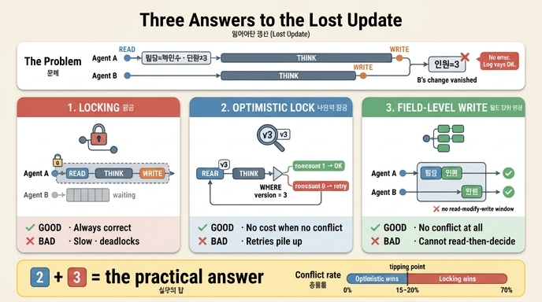

# 잃어버린 갱신에 대한 세 가지 대응

## 질문

잃어버린 갱신에 대한 세 가지 대응은 무엇인가?

## 답

**잠금**(느리고 데드락), **낙관적 잠금**(쓰기 직전 확인), **필드 단위 변경**(바뀐 것만 쓰기)이다.
뒤 두 개를 함께 쓰는 것이 실무의 답이다.

---

## 먼저, 무엇이 사라지는가

잃어버린 갱신(lost update)은 두 작업이 **「읽고 → 판단하고 → 통째로 쓰기」** 를 할 때 생깁니다.

```
시각   에이전트 A (팀장 수정)          에이전트 B (인원 수정)
 t0    읽음: 팀장=박민수;인원=3
 t1                                   읽음: 팀장=박민수;인원=3   ← 같은 옛 상태
 t2    (판단 0.20초)                   (판단 0.05초)
 t3                                   씀: 팀장=박민수;인원=5
 t4    씀: 팀장=이서연;인원=3          ← B 의 변경을 덮는다
       최종: 팀장=이서연;인원=3        ← 인원 변경이 사라짐
```

무서운 지점은 **둘이 서로 다른 필드를 고쳤는데도 하나가 사라진다**는 것입니다. 통째로 쓰면 겹치지
않는 변경끼리도 서로를 덮으니까요. 30장이 「전체 상태를 이벤트에 넣지 마라」고 했던 이유가 이것입니다.

그리고 **에러가 안 납니다.** 두 UPDATE 모두 성공했고 로그에는 「성공」만 두 줄 찍힙니다. 예외도 없고
경고도 없습니다. 나중에 사용자가 「분명히 고쳤는데요」라고 말할 때에야 드러납니다.

> 에이전트 시스템에서 이게 특히 자주 나는 이유는 셋입니다. ① 모델 호출 때문에 **판단 시간이 길고**
> (읽고 쓰기 사이의 창이 넓다), ② **동시 실행이 기본**이고, ③ LLM 이 **전체 객체를 다시 쓰는 코드를
> 만들기 쉽습니다**.
>
> 트랜잭션으로는 안 풀립니다. 트랜잭션 안에 모델 호출이 들어가 버리고, 워크플로는 프로세스 경계를
> 넘어 살아 있으니까요.

---

## 대응 1 — 잠금 (비관적 잠금, pessimistic locking)

> 한 번에 하나만 고치게 한다.

```sql
SELECT props FROM node WHERE id=? FOR UPDATE;   -- 여기서 잠근다
-- 판단
UPDATE node SET props=? WHERE id=?;
COMMIT;                                          -- 여기서 푼다
```

「대개 충돌이 난다」고 보고 **미리 막는** 방식입니다. 확실하지만 값이 큽니다.

- **매번 비용을 낸다.** 충돌이 없어도 잠금을 잡고 푸는 값(예제 기준 2.2ms)이 항상 듭니다.
- **대기가 급격히 는다.** 이용률이 오를수록 대기 시간이 M/M/1 곡선처럼 치솟습니다.
- **데드락이 난다.** 두 작업이 서로 다른 순서로 두 노드를 잠그면 서로를 영원히 기다립니다.
- **에이전트에서 특히 나쁘다.** 모델 호출이 잠금 안에 들어가면 12ms 짜리 판단 동안 남들이 전부 멈춥니다.

## 대응 2 — 낙관적 잠금 (optimistic locking)

> 쓰기 직전에 「안 바뀌었나」를 확인한다.

버전 컬럼을 하나 두고, **쓸 때 그 버전이 그대로인지** 조건으로 겁니다.

```sql
UPDATE node
   SET props=?, version=version+1
 WHERE id=? AND version=?      -- ← 이 조건이 전부다
```

핵심은 **충돌이 에러로 오지 않는다**는 점입니다. 버전이 바뀌었으면 UPDATE 가 **0행**을 고치고 조용히
성공합니다. 그래서 반드시 `rowcount` 를 봐야 합니다.

```python
cur = db.execute(
    "UPDATE node SET props=?, version=version+1 WHERE id='t1' AND version=?",
    (dump(d), ver))
db.commit()
if cur.rowcount == 1:
    return True          # 성공
# rowcount == 0 이면 충돌 → 다시 읽고 다시 시도 (백오프 + 지터, 22장)
```

이름이 「낙관적」인 이유는 **「대개 충돌 안 난다」고 보고 미리 안 막기** 때문입니다. 값은 충돌이 났을
때만 냅니다. 대신 충돌이 잦으면 재시도가 쌓여서 오히려 손해가 납니다.

- 비교 후 교체(compare-and-swap)와 같은 원리입니다.
- 「읽은 값을 보고 판단해야」 하는 경우 — 「인원이 5 미만이면 한 명 추가」 같은 조건 — 에도 쓸 수 있습니다.

## 대응 3 — 필드 단위 변경 (field-level update)

> 통째로 안 쓰고 바뀐 것만 쓴다.

```sql
-- 통째로 (X)                    -- 필드만 (O)
UPDATE node SET props=?          UPDATE node SET 인원=?
 WHERE id=?                       WHERE id=?
```

읽고-고치고-쓰기의 **창 자체를 없애는** 방식입니다. 읽기와 쓰기 사이에 판단을 두지 않으므로 애초에
덮어쓸 대상이 없습니다. 다른 필드를 고치는 두 작업은 서로 부딪히지 않습니다.

- 가능하면 이게 제일 낫습니다. 버전도 재시도도 필요 없습니다.
- 다만 **읽은 값을 보고 판단해야 하는 경우엔 못 씁니다.** 「인원이 5 미만이면 한 명 추가」 같은 조건이
  있으면 읽어야 하니까요.

---

## 셋을 나란히

| | 잠금(비관적) | 낙관적 잠금 | 필드 단위 변경 |
|---|---|---|---|
| 전제 | 「대개 충돌 난다」 | 「대개 충돌 안 난다」 | 「겹치는 필드가 없다」 |
| 언제 막나 | 읽기 전에 미리 | 쓰기 직전에 확인 | 안 막음 (창이 없음) |
| 충돌 신호 | (없음, 기다림) | `rowcount == 0` | (해당 없음) |
| 충돌 없을 때 비용 | 잠금 획득 비용 매번 | 0 | 0 |
| 충돌 잦을 때 비용 | 대기가 급증 | 재시도 × 판단 시간 | 해당 없음 |
| 약점 | 느림, 데드락 | 재시도 폭주 | 읽고 판단 불가 |

**뒤집히는 지점.** 예제 3의 계산식으로 갈림길을 구할 수 있습니다.

```
낙관적 = N × (1/(1-p)) × (판단 + 쓰기)
비관적 = N × (판단 + 쓰기 + 잠금획득) + N × p × 대기
```

책의 값(판단 12ms, 쓰기 1.5ms, 잠금 획득 2.2ms)에서는 **충돌률 15~30% 사이**에서 뒤집힙니다. 낙관적은
왼쪽 구간에서 이기고(막는 값을 안 내니까), 비관적은 오른쪽 구간에서 이깁니다(재시도가 안 쌓이니까).

**요령 하나.** 판단을 잠금 밖으로 빼면 갈림길이 오른쪽으로 밀립니다.

```
1. 읽는다                     (잠금 없이)
2. 모델을 부른다              (잠금 없이 — 여기가 제일 길다)
3. 짧게 잠그고 버전 확인 + 쓰기만 한다
```

잠금을 붙드는 시간이 12ms 에서 1.5ms 로 줄고, 창이 좁아지니 충돌률도 같이 떨어집니다.

---

## 왜 「2번과 3번을 같이」가 실무의 답인가

둘은 서로의 약점을 정확히 메웁니다.

- 필드 단위 변경은 **읽고 판단하는 경우를 못 다룹니다.** 거기를 낙관적 잠금이 받습니다.
- 낙관적 잠금은 **충돌이 잦으면 재시도가 폭주합니다.** 필드 단위로 쪼개면 애초에 충돌 자체가 줄어듭니다.
  (「팀장」과 「인원」은 더 이상 부딪히지 않습니다.)

그래서 실무의 분기는 이렇게 됩니다.

```
단순 설정 (읽을 필요 없음)   → 필드 단위 변경
읽고 판단해야 함              → 낙관적 잠금 (필드 단위 + 버전)
충돌이 잦고 비용이 큼          → 비관적 잠금
```

잠금은 「버리는 선택지」가 아니라 **마지막 구간의 답**입니다. 다만 에이전트 시스템에서는 모델 호출이
길어 그 구간에 잘 안 들어갑니다.

---

## 그래프에서 한 겹 더 — 충돌 단위가 애매하다

관계형 DB 에서는 **행 하나**가 충돌 단위입니다. 명확하죠. 그래프에서는 그 단위부터 정해야 합니다.
엣지는 두 노드에 걸쳐 있으니까요. 버전을 어디에 두느냐로 판정이 갈립니다.

| 경우 | 노드 버전 | 엣지 버전 | 논리 단위 | 원하는 것 |
|---|---|---|---|---|
| 같은 엣지의 속성 | 막음 | 막음 | 막음 | 막음 |
| 한 노드의 다른 엣지 | 막음* | 통과 | 통과 | 통과 |
| 단일 값 관계 (팀장은 한 명) | 막음 | 통과* | 막음 | 막음 |
| 노드 삭제 vs 엣지 추가 | 막음 | 통과* | 막음 | 막음 |
| 양쪽에서 같은 엣지 추가 | 막음* | 막음* | 막음* | 통과 |
| 서로 다른 방향 | 막음* | 통과 | 통과 | 통과 |
| **맞은 개수** | **1/6** | **3/6** | **5/6** | |

(* 는 틀린 판정)

- **노드 버전**은 가짜 충돌을 만듭니다. 이서연 노드에 두 사람이 각각 *다른* 엣지를 다는데 버전이 부딪힙니다.
- **엣지 버전**은 단일 값 관계를 못 잡습니다. `이서연-이끔->결제팀` 과 `김도현-이끔->결제팀` 은 다른
  엣지라 둘 다 통과하고, 팀장이 둘이 됩니다.
- **논리 단위**(「주어 + 관계 종류」)가 5/6 으로 제일 낫습니다. 남은 하나(멱등한 중복 추가)는 버전 비교
  **앞**에 「쓰려는 것이 이미 있는 것과 같으면 그냥 성공」이라는 **멱등 검사**를 두면 6/6 이 됩니다. (21장)

실무 규칙:

```
단일 값 관계 → 「주어 + 관계 종류」를 한 단위로
다중 값 관계 → 엣지 하나가 한 단위
노드 삭제    → 그 노드에 걸린 모든 엣지와 충돌
```

28장의 `SINGLE_VALUED` 목록이 여기서 다시 쓰입니다. 같은 목록이 두 문제를 풉니다.

---

## 감지 다음이 진짜 문제다

세 가지 대응은 전부 **감지**에 관한 이야기입니다. 감지한 다음 무엇을 할지는 별개 문제고, 이쪽이 더
어렵습니다.

> **충돌 감지는 기술 문제라 일반 해법이 있고, 충돌 해결은 도메인 문제라 일반 해법이 없습니다.**

병합 전략 넷을 충돌 5건에 적용해 보면:

| 전략 | 자동 해결 | 문제 |
|---|---|---|
| 마지막이 이긴다 | 5/5 | 전부 틀릴 수 있다. 에이전트가 사용자를 덮는다 |
| 출처 등급 (user > hr-sync > batch) | 4/5 | 등급이 같으면(user vs user) 못 정한다 |
| 종류를 보고 (집합은 합집합, 수치는 변화량 합산) | 4/5 | 제일 낫지만 전제가 필요하다 |
| 전부 사람에게 | 0/5 | 사람이 병목 |

「종류를 보고」의 함정 하나. 인원 `3 → 5`(+2)와 `3 → 4`(+1)를 변화량 합산하면 **6**이 됩니다. 양쪽 누구도
6을 쓰려고 하지 않았죠. 「두 명 늘고 한 명 늘었다」면 맞고, 「같은 사실을 보고 다르게 셌다」면 틀립니다.
**변화량 합산은 독립적인 증분일 때만 맞습니다** (장바구니 담기, 재고 차감, 좋아요 수). 「현재 값을 다시
센 결과」에는 쓰면 안 됩니다.

그리고 자유문(설명 필드)은 애초에 자동으로 못 합칩니다. 필드마다 「이건 어떻게 합칠까」를 정해 두고,
못 정하면 사람에게 보내야 합니다. **자동 병합의 오류율을 재세요.** 안 재면 「사람 일이 줄었다」만 보이고
「조용히 틀린 것」은 안 보입니다.

---

## 외울 것

| | |
|---|---|
| 문제 | 「읽고 → 판단하고 → 통째로 쓰기」 = 잃어버린 갱신. 에러 없이 사라진다 |
| 대응 1 | **잠금** — 미리 막는다. 느리고 데드락 |
| 대응 2 | **낙관적 잠금** — 쓰기 직전 버전 확인. 충돌은 `rowcount == 0` |
| 대응 3 | **필드 단위 변경** — 통째로 안 쓰고 바뀐 것만 |
| 실무의 답 | **2 + 3** (충돌 잦으면 1) |
| 갈림길 | 충돌률 15~30%. 판단을 잠금 밖으로 빼면 오른쪽으로 밀린다 |

---

## 참고

- [Lost update / transaction isolation — PostgreSQL](https://www.postgresql.org/docs/current/transaction-iso.html)
- [Optimistic Offline Lock — Martin Fowler](https://martinfowler.com/eaaCatalog/optimisticOfflineLock.html)
- [Pessimistic Offline Lock — Martin Fowler](https://martinfowler.com/eaaCatalog/pessimisticOfflineLock.html)
- [compare-and-swap (`atomic_compare_exchange`)](https://en.cppreference.com/w/cpp/atomic/atomic/compare_exchange)
- [Deadlocks — PostgreSQL explicit locking](https://www.postgresql.org/docs/current/explicit-locking.html#LOCKING-DEADLOCKS)
- [CRDT — Conflict-free Replicated Data Types](https://inria.hal.science/inria-00555588)

## 인포그래픽


