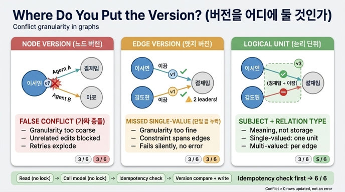

# 그래프에서 노드 버전과 엣지 버전은 각각 어떤 문제를 만드는가?

**답: 노드 버전은 가짜 충돌을, 엣지 버전은 단일 값 누락을 만든다.**

---

## 1. 왜 이 질문이 나오나 — 그래프에는 「행 하나」가 없다

낙관적 잠금(optimistic locking)은 단순합니다. 버전 컬럼을 하나 두고, 쓰기 직전에 그 버전이 그대로인지 확인합니다.

```sql
UPDATE node SET props=?, version=version+1
 WHERE id=? AND version=?          -- 이 조건이 전부다
```

버전이 바뀌었으면 UPDATE가 **0행**을 고칩니다. 그게 충돌 신호입니다. 에러가 아니라 `rowcount == 0`으로 오기 때문에 반드시 확인해야 합니다.

문제는 **「버전을 어디에 둘 것인가」**입니다. 관계형 DB에서는 고민할 게 없습니다. **행 하나가 충돌 단위**니까요. 그런데 그래프에서는

- 엣지는 **두 노드에 걸쳐** 있습니다.
- 하나의 노드에는 **수십 개의 엣지**가 매달립니다.
- 「팀장은 한 명」 같은 제약은 **엣지 하나가 아니라 엣지들 사이**에 있습니다.

그래서 충돌 단위가 무엇인지부터 정해야 합니다. 이 장의 ex4가 그 실험입니다.

---

## 2. 여섯 가지 동시 수정 상황

두 에이전트가 그래프를 동시에 고치는 대표 경우들입니다.

| 경우 | A가 하는 일 | B가 하는 일 | 원하는 판정 | 이유 |
|---|---|---|---|---|
| 같은 엣지의 속성 | 이서연-이끔->결제팀 시작일 수정 | 같은 엣지의 시작일 수정 | **막음** | 둘 다 같은 것을 고친다 |
| 한 노드의 다른 엣지 | 이서연-이끔->결제팀 추가 | 이서연-삶->마포 추가 | **통과** | 겹치는 것이 없다 |
| 단일 값 관계 | 이서연-이끔->결제팀 추가 | 김도현-이끔->결제팀 추가 | **막음** | 팀장은 한 명 (28장) |
| 노드 삭제 대 엣지 추가 | 결제팀 노드 삭제 | 이서연-속함->결제팀 추가 | **막음** | 없는 노드에 엣지를 못 단다 |
| 양쪽에서 같은 엣지 추가 | 이서연-속함->결제팀 추가 | 이서연-속함->결제팀 추가 | **통과** | 결과가 같다 (멱등, 21장) |
| 서로 다른 방향 | 이서연-멘토->김도현 추가 | 김도현-멘토->이서연 추가 | 도메인이 정함 | 대칭 관계면 충돌 |

---

## 3. 버전을 어디에 두느냐에 따른 판정표

`*`는 원하는 것과 다른 **틀린 판정**입니다.

| 경우 | 노드 버전 | 엣지 버전 | 논리 단위 | 원하는 것 |
|---|---|---|---|---|
| 같은 엣지의 속성 | 막음 | 막음 | 막음 | 막음 |
| 한 노드의 다른 엣지 | 막음 `*` | 통과 | 통과 | 통과 |
| 단일 값 관계 | 막음 | 통과 `*` | 막음 | 막음 |
| 노드 삭제 대 엣지 추가 | 막음 | 통과 `*` | 막음 | 막음 |
| 양쪽에서 같은 엣지 추가 | 막음 `*` | 막음 `*` | 막음 `*` | 통과 |
| 서로 다른 방향 | 막음 `*` | 통과 | 통과 | 통과 |
| **맞은 개수** | **3 / 6** | **3 / 6** | **5 / 6** | |

**어느 것도 6/6이 아닙니다. 그게 이 표의 요점입니다.**

---

## 4. 노드 버전 → 가짜 충돌 (false conflict)

노드에 버전 하나를 두면, **그 노드에 닿는 모든 변경이 같은 버전을 두고 다툽니다.**

```
이서연 (ver=7)
  ├── A: 이서연 -이끔-> 결제팀  추가   (ver 7을 읽고 8로 쓰려 함)
  └── B: 이서연 -삶->   마포    추가   (ver 7을 읽고 8로 쓰려 함)
```

A가 먼저 쓰면 ver=8이 됩니다. B의 `WHERE ver=7`은 0행을 고칩니다. → **충돌.**

그런데 **실제로 겹치는 것이 하나도 없습니다.** 한 명은 소속을, 한 명은 거주지를 달았을 뿐입니다. 순서를 어떻게 바꿔도 결과는 같습니다. 이렇게 **의미상 독립인 변경을 버전 입자가 굵어서 막아 버리는 것**을 가짜 충돌이라고 합니다.

증상은 이렇습니다.

- **재시도 폭증**: 충돌이 났으니 다시 읽고 다시 판단합니다. 에이전트 시스템에서 「다시 판단」은 곧 **모델 호출 한 번을 통째로 다시 내는 것**입니다(ex3). 판단이 12ms가 아니라 2초라면 재시도 비용은 치명적입니다.
- **인기 노드에서 최악**: 「결제팀」처럼 많은 엣지가 매달리는 허브 노드는 사실상 직렬화됩니다. 노드 하나가 전역 잠금처럼 굴어요.
- **충돌률이 올라가면 낙관적 잠금 자체가 손해**: ex3의 계산에서 낙관적/비관적이 뒤집히는 지점은 충돌률 15~30% 근처입니다. 가짜 충돌은 이 충돌률을 인위적으로 밀어 올립니다.

표에서도 노드 버전은 「한 노드의 다른 엣지」와 「서로 다른 방향」을 헛되게 막습니다. **노드 버전은 안전하지만 너무 조입니다.**

---

## 5. 엣지 버전 → 단일 값 누락 (missed single-valued violation)

엣지마다 버전을 따로 두면 가짜 충돌은 사라집니다. 입자가 잘게 쪼개지니까요. 대신 **잡아야 할 충돌을 못 잡습니다.**

```
A: 이서연 -이끔-> 결제팀   (엣지 X, 새로 생김 — 다툴 상대가 없음)
B: 김도현 -이끔-> 결제팀   (엣지 Y, 새로 생김 — 다툴 상대가 없음)
```

X와 Y는 **서로 다른 엣지**입니다. 각자 버전이 따로라 둘 다 통과합니다. 그 결과 **결제팀의 팀장이 두 명**이 됩니다.

28장에서 다룬 **단일 값 관계(single-valued relationship)** 제약 — 「한 팀에 팀장은 한 명」, 「한 사람의 현재 소속은 하나」 — 은 **엣지 하나 안에 있지 않고 엣지들 사이에 있습니다.** 그래서 엣지 단위 버전으로는 원리적으로 표현할 수 없습니다.

같은 이유로 「노드 삭제 대 엣지 추가」도 놓칩니다. 결제팀 노드를 지우는 동안 그 노드로 향하는 엣지가 추가됩니다. 엣지 버전만 보면 그 엣지는 아무하고도 안 부딪혔으니 통과합니다. 결과는 **없는 노드를 가리키는 엣지**, 즉 참조 무결성 깨짐입니다.

그리고 이 실패의 성질이 고약합니다. **에러가 안 납니다.** 양쪽 모두 「성공」 로그를 남기고, 그래프만 조용히 틀려집니다. 잃어버린 갱신과 같은 성질이에요.

---

## 6. 그래서 답은 「논리적 충돌 단위」

두 실패는 **정확히 반대 방향**입니다.

| | 입자 | 실패 방향 | 결과 |
|---|---|---|---|
| 노드 버전 | 너무 굵다 | **과다 감지**(false positive) | 안 겹치는 변경도 막힘 → 재시도·처리량 손해 |
| 엣지 버전 | 너무 잘다 | **과소 감지**(false negative) | 제약 위반이 통과 → 데이터가 조용히 틀림 |

실무의 답은 **저장 구조(노드/엣지)가 아니라 도메인 의미로 충돌 단위를 정하는 것**입니다.

- **단일 값 관계 → 「주어 + 관계 종류」를 한 단위로 본다**
  - `(결제팀, 이끔)` 이 한 단위. 여기에 버전을 답니다.
  - 그러면 이서연 케이스와 김도현 케이스가 같은 단위에서 부딪혀 충돌로 잡힙니다.
- **다중 값 관계 → 엣지 하나가 한 단위**
  - `(이서연, 태그)`처럼 여러 개가 정상인 관계는 엣지별로 둬야 가짜 충돌이 안 납니다.
- **노드 삭제 → 그 노드에 걸린 모든 엣지와 충돌**
  - 삭제는 예외적으로 굵은 단위를 씁니다.

이렇게 하면 표에서 **5/6**이 됩니다.

---

## 7. 남은 하나: 멱등 검사를 버전 비교 앞에 둔다

논리 단위도 「양쪽에서 같은 엣지 추가」는 못 풉니다. 세 방식 모두 막습니다. 그런데 이건 **결과가 같으니 통과시켜도 되는 경우**입니다.

고치는 방법은 **버전 비교 「전에」 멱등 검사를 먼저 하는 것**입니다.

> 「쓰려는 것이 이미 있는 것과 같으면 그냥 성공으로 친다」

한 줄이면 됩니다. 그러면 논리 단위가 **6/6**이 됩니다. 21장의 멱등성(idempotency)이 여기서 또 쓰입니다.

순서를 정리하면 이렇습니다.

```
1. 잠금 없이 읽는다
2. 잠금 없이 모델을 부른다 (여기가 제일 길다)
3. 멱등 검사   — 쓰려는 것이 이미 그대로면 성공 처리하고 끝
4. 논리 단위 버전 비교 + 쓰기 (짧게)
5. rowcount == 0 이면 충돌 → 재시도 또는 병합/사람
```

3번을 4번 앞에 두는 것이 핵심입니다. 그리고 2번을 잠금 밖으로 빼면 잠금을 붙드는 시간이 12ms에서 1.5ms로 줄고, 충돌률도 같이 떨어집니다. 창이 좁아지니까요.

---

## 8. 함께 기억할 것

- **28장의 `SINGLE_VALUED` 목록이 여기서 다시 쓰입니다.** 「어떤 관계가 단일 값인가」를 코드로 갖고 있으면, 그 목록 하나가 스키마 제약과 충돌 단위 결정이라는 **두 문제를 동시에 풉니다.**
- **감지와 해결은 다른 문제입니다.** 여기까지가 「감지」이고, 이건 기술 문제라 일반 해법이 있습니다. 감지한 다음 「무엇을 남길까」는 도메인 문제라 일반 해법이 없습니다(ex5: 집합은 합집합, 수치는 변화량 합산, 자유문은 사람).

---

## 한 줄 정리

**노드 버전은 입자가 굵어 안 겹치는 변경까지 막는 가짜 충돌을 만들고, 엣지 버전은 입자가 잘아 엣지들 사이에 걸친 단일 값 제약을 놓칩니다. 그래서 「주어 + 관계 종류」라는 논리 단위에 버전을 두고, 그 앞에 멱등 검사를 붙입니다.**

## 인포그래픽


