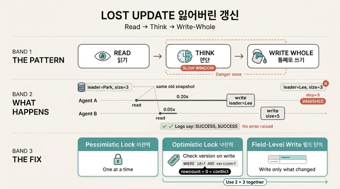

# 잃어버린 갱신(lost update)은 어떤 패턴에서 발생하는가?

> **답:** 두 작업이 **「읽고, 판단하고, 통째로 쓰기」**를 할 때다. 에러 없이 사라지고 로그에는 성공만 찍힌다.

---

## 1. 세 박자가 만드는 창(window)

잃어버린 갱신은 특정 API의 버그가 아니라 **패턴의 문제**다. 아래 세 단계를 밟는 순간, 두 번째와 세 번째 단계 사이에 남이 끼어들 수 있는 **틈**이 생긴다.

| 단계 | 하는 일 | 위험 |
|---|---|---|
| ① 읽기 (read) | 현재 상태를 통째로 가져온다 | 이 시점의 스냅샷이 곧 「내가 믿는 세계」가 된다 |
| ② 판단 (modify) | 읽은 값을 보고 무엇을 쓸지 정한다 | **여기가 길다.** 이 사이에 세계가 바뀐다 |
| ③ 통째로 쓰기 (write) | 내가 만든 전체 상태로 덮어쓴다 | 남이 그 사이에 바꾼 것까지 같이 덮는다 |

핵심은 ③이 **부분 갱신이 아니라 전체 덮어쓰기**라는 점이다. 그래서 **겹치지 않는 필드를 고쳐도** 하나가 사라진다.

```
초기 상태: 팀장=박민수; 인원=3

시간 →
A: [읽음 팀장=박민수;인원=3] ---- 판단 0.20초 ---- [씀 팀장=이서연;인원=3]
B:      [읽음 팀장=박민수;인원=3] -- 판단 0.05초 -- [씀 팀장=박민수;인원=5]

최종: 팀장=이서연; 인원=3     ← B의 「인원=5」가 사라짐
```

둘 다 **같은 옛 상태**를 읽었고, 각자 자기 필드만 고쳐서 **통째로** 썼다. 나중에 쓴 쪽이 앞사람의 변경을 덮는다. (`ex1_lost_update.py`)

---

## 2. 왜 무서운가 — 에러가 안 난다

이 문제의 성질은 **소리 없음**이다.

- `UPDATE`는 성공한다. 예외도 없다.
- 로그에는 `[팀장] 씀: 성공`, `[인원] 씀: 성공` 두 줄이 모두 찍힌다.
- 알림도, 리트라이도, 대시보드 빨간불도 없다.
- 발견은 한참 뒤 사람이 「분명히 고쳤는데요」라고 말할 때 일어난다.

그래서 **모니터링으로 못 잡는다.** 실패한 적이 없으니까. 잡으려면 애초에 쓰기 경로에 검사를 심어야 한다.

---

## 3. 에이전트 시스템에서 유독 잦은 이유 셋

1. **판단 시간이 길다.** 모델 호출이 ② 자리에 들어간다. 수백 ms~수 초. 창이 넓어지면 충돌 확률이 올라간다.
2. **동시 실행이 기본이다.** 에이전트를 병렬로 돌리는 게 설계 전제다. 순서 보장이 없다.
3. **전체를 다시 쓰는 코드를 만들기 쉽다.** 모델에게 「상태를 갱신해줘」라고 하면 델타가 아니라 **완성된 전체 상태**를 뱉는다. 그걸 그대로 저장하면 ③이 완성된다.

> 30장에서 「전체 상태를 이벤트에 넣지 마라」고 한 이유가 이것이다. 전체를 쓰면 겹치지 않는 변경도 서로를 덮는다.

### 트랜잭션으로 안 풀리는 이유
- 트랜잭션 안에 **모델 호출**이 들어가면 커넥션을 수 초씩 붙들게 된다.
- 에이전트 워크플로는 **프로세스 경계를 넘어** 살아 있다. 하나의 DB 트랜잭션으로 감쌀 수 있는 범위를 벗어난다.

---

## 4. 대응 세 가지

| 방식 | 아이디어 | 대가 |
|---|---|---|
| **비관적 잠금** | 한 번에 하나만 고치게 막는다 | 매번 잠금 획득 비용, 데드락, 처리량 저하 |
| **낙관적 잠금** | 쓰기 직전에 「안 바뀌었나」 확인 | 충돌 시 재시도 (판단도 다시) |
| **필드 단위 변경** | 통째로 안 쓰고 바뀐 것만 쓴다 | 「읽은 값을 보고 판단」이 필요하면 못 씀 |

실무의 답은 **2번과 3번을 같이 쓰는 것**이다.

### 낙관적 잠금의 전부는 이 한 줄

```sql
UPDATE node SET props=?, version=version+1
 WHERE id=? AND version=?        -- ← 이 조건이 전부다
```

**중요:** 충돌은 예외로 오지 않는다. **0행 갱신**으로 온다. 그래서 반드시 `rowcount`를 봐야 한다.

```python
cur = db.execute("UPDATE node SET props=?, version=version+1 "
                 "WHERE id='t1' AND version=?", (dump(d), ver))
if cur.rowcount == 1:
    return True          # 성공
# rowcount == 0 → 충돌. 다시 읽고 다시 시도 (+ 흔들기/jitter)
```

### 창을 좁히는 요령
판단을 잠금 **밖**으로 빼면 낙관적/비관적 둘 다 좋아진다.

1. 읽는다 (잠금 없이)
2. 모델을 부른다 (잠금 없이 — 여기가 제일 길다)
3. **짧게 잠그고** 「버전 확인 + 쓰기」만 한다

잠금 보유 시간이 12ms → 1.5ms로 줄고, 창이 좁아지니 충돌률도 같이 떨어진다.

### 갈림길은 충돌률 15~30%
- 낙관적 = `N × 1/(1-p) × (판단+쓰기)` — 충돌이 잦아지면 재시도가 곱해진다
- 비관적 = `N × (판단+쓰기+잠금획득) + N × p × 대기` — 충돌이 없어도 잠금 비용을 매번 낸다

판단을 잠금 밖으로 빼면 이 갈림길이 **오른쪽으로 밀린다**(낙관적이 더 넓은 구간에서 유리해진다).

---

## 5. 그래프에서는 「충돌 단위」부터 애매하다

관계형 DB에서는 **행 하나**가 충돌 단위다. 명확하다. 그래프는 엣지가 **두 노드에 걸쳐** 있어서 단위를 먼저 정해야 한다.

| 버전을 어디에 두나 | 문제 |
|---|---|
| **노드 버전** | 「한 노드의 다른 엣지」가 **가짜 충돌**을 낸다 (겹치지 않는데 막힌다) |
| **엣지 버전** | 「단일 값 관계」를 못 잡는다 (팀장이 둘이 된다) |
| **논리 단위 (주어+관계 종류)** | 6개 시나리오 중 5개 정답. 남은 하나는 **멱등 검사**를 앞에 두면 해결 |

실무 규칙:
- 단일 값 관계 → 「주어 + 관계 종류」를 한 단위로
- 다중 값 관계 → 엣지 하나가 한 단위
- 노드 삭제 → 그 노드에 걸린 모든 엣지와 충돌

---

## 6. 감지한 다음이 진짜 문제

> **충돌 감지는 기술 문제(일반 해법 있음), 충돌 해결은 도메인 문제(일반 해법 없음).**

병합 전략별 성적 (충돌 5건):

| 전략 | 자동 해결 | 평가 |
|---|---|---|
| 마지막이 이긴다 | 5/5 | 전부 처리하고 **전부 틀릴 수 있다** |
| 출처 등급 | 4/5 | 자유문(둘 다 user)은 사람에게 |
| 종류를 보고 | 최선 | 집합은 합집합, 수치는 **변화량 합산** |
| 전부 사람에게 | 0/5 | 안전하지만 사람이 죽는다 |

변화량 합산의 함정: 인원 `3→5(+2)`와 `3→4(+1)`을 합치면 **6**. 아무도 쓰려 하지 않은 값이다. **독립적인 증분**(장바구니 담기, 재고 차감, 좋아요)일 때만 맞고, **현재 값을 다시 센 결과**에는 쓰면 안 된다.

그리고 자동 병합의 **오류율을 재라.** 안 재면 「사람 일이 줄었다」만 보이고 「조용히 틀린 것」은 안 보인다.

---

## 한 줄 정리

**읽고 → (긴) 판단 → 통째로 쓰기.** 이 세 박자가 잃어버린 갱신을 만든다. 막는 법은 쓰기 직전 「안 바뀌었나」 확인이고, 충돌 신호는 예외가 아니라 **rowcount 0**이다.

## 인포그래픽


