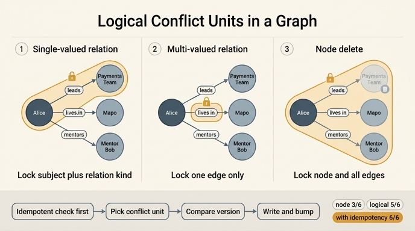

# 그래프의 논리적 충돌 단위

**질문** — 그래프의 논리적 충돌 단위는 관계 종류별로 어떻게 정하는가?

**답** — 단일 값 관계는 「주어 + 관계 종류」, 다중 값 관계는 엣지 하나, 노드 삭제는 그 노드에 걸린 모든 엣지와 충돌로 본다.

---

## 왜 이 질문이 나오는가

관계형 DB에서는 충돌 단위가 명확합니다. **행 하나**입니다. `UPDATE ... WHERE id=? AND version=?`를 쓰면 끝이고, 버전을 어디에 붙일지 고민할 필요가 없습니다.

그래프는 다릅니다. 엣지가 **두 노드에 걸쳐** 있기 때문에 「무엇이 한 덩어리인가」부터 애매합니다. 낙관적 잠금 자체는 30~31장에서 이미 정리된 기술입니다(쓰기 직전에 버전 확인, 충돌은 에러가 아니라 `rowcount == 0`으로 온다). 문제는 그 **버전을 어디에 둘 것인가**입니다. 이 선택 하나가 「가짜 충돌」과 「놓친 충돌」을 각각 만듭니다.

## 여섯 경우와 세 가지 배치

`ex4_conflict_shape.py`는 두 에이전트가 그래프를 동시에 고치는 여섯 경우를 놓고, 버전을 (1) 노드에, (2) 엣지에, (3) 논리 단위에 두었을 때 각각 어떻게 판정되는지를 비교합니다.

| 경우 | 노드 버전 | 엣지 버전 | 논리 단위 | 원하는 것 |
|---|---|---|---|---|
| 같은 엣지의 속성 | 막음 | 막음 | 막음 | 막음 |
| 한 노드의 다른 엣지 | 막음 ✗ | 통과 | 통과 | 통과 |
| 단일 값 관계 | 막음 | 통과 ✗ | 막음 | 막음 |
| 노드 삭제 대 엣지 추가 | 막음 | 통과 ✗ | 막음 | 막음 |
| 양쪽에서 같은 엣지 추가 | 막음 ✗ | 막음 ✗ | 막음 ✗ | 통과 |
| 서로 다른 방향 | 막음 ✗ | 통과 | 통과 | 통과 |
| **맞은 개수** | **3/6** | **3/6** | **5/6** | |

(✗ 는 원하는 것과 어긋난 판정)

**어느 것도 6/6이 아닙니다.** 그게 이 표의 요점입니다.

### 노드 버전 — 가짜 충돌을 만든다 (3/6)

노드에 `ver`를 하나 두면 그 노드에 손대는 모든 변경이 같은 버전을 놓고 다툽니다. 「이서연-이끔->결제팀」을 추가하는 A와 「이서연-삶->마포」를 추가하는 B는 **겹치는 게 하나도 없는데도** 이서연 노드의 버전에서 부딪힙니다. 실제로는 안 겹치는데 막히는 것 — 이걸 **가짜 충돌(false conflict)** 이라고 합니다. 에이전트 시스템에서는 한 노드에 여러 종류의 사실이 동시에 붙기 때문에 이 손해가 큽니다.

### 엣지 버전 — 단일 값 관계를 못 잡는다 (3/6)

반대로 엣지마다 버전을 두면 입도가 너무 잘게 쪼개집니다. 「이서연-이끔->결제팀」과 「김도현-이끔->결제팀」은 **서로 다른 엣지**입니다. 각자 버전이 따로라 둘 다 통과합니다. 그러면 결제팀 팀장이 둘이 됩니다. 28장의 카디널리티 제약(팀장은 한 명)이 조용히 깨지는 것이고, 에러도 안 납니다.

노드 삭제도 마찬가지입니다. A가 결제팀 노드를 지우고 B가 「이서연-속함->결제팀」을 추가하면, 엣지 버전 관점에서는 서로 다른 대상이라 충돌이 안 잡힙니다. 없는 노드에 엣지가 달리거나 방금 단 엣지가 함께 지워집니다.

### 논리 단위 — 관계 종류별로 범위를 다르게 잡는다 (5/6)

그래서 실무에서는 **논리적 충돌 단위**를 따로 정의합니다. 물리 구조(노드/엣지)가 아니라 **의미**를 기준으로 잠금 범위를 잡는 것입니다.

| 관계 종류 | 충돌 단위 | 왜 |
|---|---|---|
| 단일 값 관계 (`이끔`, `팀장`) | **주어 + 관계 종류** | 그 조합에 값이 하나뿐이므로, 대상이 달라도 같은 슬롯을 두고 다투는 것 |
| 다중 값 관계 (`삶`, `태그`) | **엣지 하나** | 여러 개가 공존해도 되므로 엣지끼리는 서로 독립 |
| 노드 삭제 | **그 노드에 걸린 모든 엣지** | 노드가 사라지면 거기 걸린 모든 엣지의 전제가 무너짐 |

「주어 + 관계 종류」란 예를 들어 `(결제팀, 이끔)` 혹은 방향에 따라 `(이서연, 이끔)` 같은 **키**를 하나 만들어 그 키에 버전을 붙이는 것입니다. 그러면 「누가 결제팀을 이끄는가」에 대한 모든 쓰기가 한 줄로 직렬화되고, 팀장이 둘이 되는 일이 생기지 않습니다. 동시에 「한 노드의 다른 엣지」는 관계 종류가 다르므로 키가 달라서 통과합니다 — 가짜 충돌도 없습니다.

「서로 다른 방향」(`이서연-멘토->김도현` vs `김도현-멘토->이서연`)은 도메인이 정합니다. 대칭 관계로 모델링했다면 두 방향을 같은 키로 정규화해서 충돌로 잡아야 하고, 비대칭이면 별개입니다.

## 남은 1/6과 멱등 검사

논리 단위도 못 잡는 한 경우가 있습니다. **양쪽에서 같은 엣지를 추가**하는 경우입니다. A와 B가 똑같이 「이서연-속함->결제팀」을 추가하려 한다면 결과는 어차피 같으니 통과시켜도 됩니다. 그런데 세 방식 모두 버전이 바뀌었다는 이유로 막습니다.

고치는 방법은 간단합니다. **버전 비교 「전에」 멱등 검사를 먼저 두는 것**입니다.

> 「쓰려는 것이 이미 있는 것과 같으면 그냥 성공으로 친다」

이 한 줄이면 논리 단위가 **6/6**이 됩니다. 21장의 멱등성이 여기서 다시 쓰이는 셈입니다. 재시도 폭풍이 흔한 에이전트 시스템에서는 같은 사실을 두 번 쓰려는 시도가 정말 자주 나므로, 이 검사가 실전 충돌률 자체를 크게 떨어뜨립니다.

## 판정 순서로 정리하면

```
쓰기 요청
  ↓
1) 멱등 검사: 쓰려는 것 == 이미 있는 것?  → 예: 그냥 성공 (버전 비교 안 함)
  ↓ 아니오
2) 논리 단위 키 계산
     단일 값 관계 → key = (주어, 관계종류)
     다중 값 관계 → key = (주어, 관계종류, 목적어)   # 엣지 하나
     노드 삭제    → key = 그 노드에 걸린 모든 엣지의 키 집합
  ↓
3) 그 키의 버전이 읽은 시점과 같은가?  → 아니오: 충돌 (rowcount == 0)
  ↓ 예
4) 쓰고 버전 +1
```

## 실무 포인트

- **이 표를 코드로 갖고 있어야 합니다.** 관계 종류별 충돌 단위는 문서가 아니라 자료구조여야 합니다. 28장에서 카디널리티 검증에 쓰던 `SINGLE_VALUED` 목록이 여기서 잠금 범위 결정에 그대로 재사용됩니다. **같은 목록이 두 문제를 풉니다.**
- 잠금 범위를 넓히면 가짜 충돌이 늘고, 좁히면 진짜 충돌을 놓칩니다. 논리 단위는 그 사이에서 **의미 기준으로** 선을 긋는 방법입니다.
- 판단(모델 호출)은 잠금 밖으로 빼세요. 읽기 → 모델 호출(잠금 없이) → 짧게 잠그고 버전 확인 + 쓰기. 잠금 보유 시간이 12ms에서 1.5ms로 줄고 충돌률도 함께 떨어집니다.
- 충돌 **감지**는 여기까지의 기술 문제고, 충돌 **해결**(어느 값을 살릴 것인가)은 도메인 문제라 일반 해법이 없습니다(예제 5).

## 한 줄 암기

> 물리 구조가 아니라 의미로 잠근다 — 단일 값은 「주어+관계 종류」, 다중 값은 엣지 하나, 노드 삭제는 걸린 엣지 전부. 그 앞에 멱등 검사 한 줄.

## 인포그래픽


