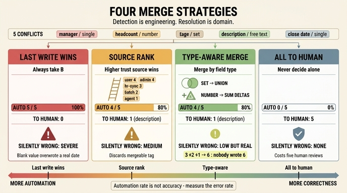

# `ex5_merge_strategy.py`의 네 가지 병합 전략

**Q.** `ex5_merge_strategy.py`의 네 가지 병합 전략은 무엇인가?

**A.** 마지막이 이긴다, 출처 등급, 종류를 보고, 전부 사람에게다.

---

## 이 예제가 있는 자리

31장의 앞 예제들(`ex1`~`ex4`)은 전부 **감지**에 관한 것이다. 잃어버린 갱신을 만들어 보고(`ex1`), 낙관적 잠금으로 잡고(`ex2`), 낙관적/비관적이 뒤집히는 지점을 재고(`ex3`), 그래프에서 충돌 단위를 어디에 둘지 따진다(`ex4`).

`ex5`는 그 **다음**을 다룬다. 파일 docstring이 그대로 말한다.

> 예제 5 — 충돌을 감지한 «다음»에 무엇을 할 것인가.
> 의존성 없음. 충돌 다섯 건에 병합 전략 넷을 적용한다.
> **감지는 기술이고 해결은 도메인이다.**

## 입력: 충돌 5건

`CONFLICTS`는 `(필드, 원래 값, A가 쓰려는 것, A 출처, B가 쓰려는 것, B 출처, 종류)` 튜플 5개다.

| 필드 | 종류 | 원래 | A (출처) | B (출처) |
|---|---|---|---|---|
| 팀장 | 단일값 | 박민수 | 이서연 (hr-sync) | 김도현 (agent-4821) |
| 인원 | 수치 | 3 | 5 (batch) | 4 (agent-5102) |
| 태그 | 집합 | 결제 | 결제,정산 (user) | 결제,신규 (agent-4821) |
| 설명 | 자유문 | 이전 설명 | 새 설명 A (user) | 새 설명 B (user) |
| 폐쇄일 | 단일값 | (빈 값) | 2026-06-30 (admin) | (빈 값) (agent-5102) |

출처 등급표는 이렇다. 목록에 없는 출처(= 에이전트들)는 `RANK.get(src, 1)`로 전부 **1등급**이 된다.

```python
RANK = {"user": 4, "admin": 4, "hr-sync": 3, "batch": 2}
```

## 네 전략

### 1. 마지막이 이긴다 (`last_wins`)

```python
def last_wins(f, base, a, sa, b, sb, kind):
    return b, "나중 것"
```

무조건 B를 고른다. 판단이라고 할 것이 없다.

**결과: 자동 해결 5/5, 사람에게 0건.**

| 필드 | 결과 | 사유 |
|---|---|---|
| 팀장 | 김도현 | 나중 것 |
| 인원 | 4 | 나중 것 |
| 태그 | 결제,신규 | 나중 것 |
| 설명 | 새 설명 B | 나중 것 |
| 폐쇄일 | *(빈 값)* | 나중 것 |

자동화율 100%. 그리고 **전부 틀릴 수 있다.** 팀장을 등급 1짜리 에이전트가 정하고, 사용자가 쓴 설명을 다른 사용자가 덮는다. 태그는 A가 붙인 "정산"이 통째로 사라진다.

특히 눈여겨볼 것은 **폐쇄일**이다. B의 값은 빈 문자열인데, `auto += v is not None`이라 빈 문자열도 "자동 해결"로 집계된다. 즉 admin이 넣은 `2026-06-30`이 조용히 지워지고도 통계상으로는 성공 한 건으로 잡힌다. 자동화율 지표가 정확도를 전혀 담지 못한다는 것을 보여 주는 대목이다.

### 2. 출처 등급 (`source_rank`)

```python
def source_rank(f, base, a, sa, b, sb, kind):
    if rank(sa) > rank(sb):
        return a, f"{sa} 우선"
    if rank(sb) > rank(sa):
        return b, f"{sb} 우선"
    return None, "등급 같음 → 사람"
```

등급이 높은 쪽을 채택하고, 같으면 `None`(보류)을 돌려준다.

**결과: 자동 해결 4/5, 사람에게 1건.**

| 필드 | 결과 | 사유 |
|---|---|---|
| 팀장 | 이서연 | hr-sync 우선 (3 > 1) |
| 인원 | 5 | batch 우선 (2 > 1) |
| 태그 | 결제,정산 | user 우선 (4 > 1) |
| 설명 | **보류** | 등급 같음 → 사람 (4 = 4) |
| 폐쇄일 | 2026-06-30 | admin 우선 (4 > 1) |

남는 한 건은 **설명**이다. 양쪽 다 `user`라 등급이 같다. 이건 사람이 봐야 맞는 게 맞다. 자유문은 애초에 자동으로 합칠 수단이 없다.

다만 이 전략에도 손해가 있다. **태그**를 `결제,정산`으로 확정해 버려서 B가 붙인 "신규"를 버린다. 등급만 보면 합칠 수 있는 것도 못 합친다.

### 3. 종류를 보고 (`type_aware`)

```python
def type_aware(f, base, a, sa, b, sb, kind):
    if kind == "집합":
        merged = sorted(set(a.split(",")) | set(b.split(",")))
        return ",".join(merged), "합집합"
    if kind == "수치" and base.isdigit():
        d = (int(a) - int(base)) + (int(b) - int(base))   # 변화량을 더한다
        return str(int(base) + d), "변화량 합산"
    return source_rank(f, base, a, sa, b, sb, kind)       # 나머지는 등급으로
```

필드 **종류**에 맞는 병합 규칙을 먼저 적용하고, 규칙이 없는 종류(단일값·자유문)는 `source_rank`로 넘긴다.

**결과: 자동 해결 4/5, 사람에게 1건.**

| 필드 | 결과 | 사유 |
|---|---|---|
| 팀장 | 이서연 | hr-sync 우선 (등급으로 위임) |
| 인원 | **6** | 변화량 합산 |
| 태그 | 결제,신규,정산 | 합집합 |
| 설명 | **보류** | 등급 같음 → 사람 |
| 폐쇄일 | 2026-06-30 | admin 우선 (등급으로 위임) |

건수는 「출처 등급」과 4/5로 같다. 하지만 **질이 다르다.** 태그는 양쪽 변경을 모두 살렸고(`결제,정산` ∪ `결제,신규` = `결제,신규,정산`), 인원은 두 증분을 합쳤다. 자동으로 처리한 4건 중 버려진 정보가 없다는 점이 「출처 등급」과의 차이다.

### 4. 전부 사람에게 (`always_human`)

```python
def always_human(f, base, a, sa, b, sb, kind):
    return None, "사람 확인"
```

**결과: 자동 해결 0/5, 사람에게 5건.**

조용히 틀리는 일은 없다. 대신 사람 손이 5건 든다. 자동화율과 정확도가 정확히 반대편 끝에 있는 전략이다.

## 한눈에 보는 대조

| 전략 | 자동 해결 | 사람에게 | 조용히 틀릴 위험 |
|---|---|---|---|
| 마지막이 이긴다 | **5/5** | 0건 | 매우 높음 (전부 틀릴 수 있음) |
| 출처 등급 | 4/5 | 1건 | 중간 (합칠 수 있는 걸 버림) |
| 종류를 보고 | 4/5 | 1건 | 낮지만 존재 (아래 함정) |
| 전부 사람에게 | 0/5 | 5건 | 없음 |

**자동화율이 높을수록 정확도가 떨어진다.** 「마지막이 이긴다」는 100% 자동이지만 100% 틀릴 수 있고, 「전부 사람에게」는 절대 안 틀리지만 아무것도 자동화하지 못한다. 「종류를 보고」가 그 사이에서 가장 나은 지점이다.

## 함정: 「인원 = 6」

이 예제의 핵심 함정이다.

- 원래 값: 3
- A: 3 → 5 (변화량 +2)
- B: 3 → 4 (변화량 +1)
- 변화량 합산: 3 + (2 + 1) = **6**

**양쪽 누구도 6을 쓰려고 하지 않았다.** 그런데 6이 나왔다.

이게 맞을 수도 있다. 「두 명 늘었고 한 명 늘었다」면 실제로 세 명이 는 것이니 6이 옳다.

틀릴 수도 있다. 둘 다 **같은 사실을 보고 다르게 센 것**이라면(A는 5명으로, B는 4명으로 카운트) 6은 완전히 틀린 값이다. 실제 인원은 4나 5여야 한다.

그래서 책의 결론은 이렇다. 변화량 합산(delta merge)은 **독립적인 증분**일 때만 맞다.

- 써도 되는 것: 장바구니 담기, 재고 차감, 좋아요 수 — 각 변경이 서로 독립적인 「더하기」다
- 쓰면 안 되는 것: **현재 값을 다시 센 결과** — 같은 대상을 두 번 관측한 것이라 더하면 이중 계산이 된다

똑같이 `int` 타입이고 똑같이 「수치」라고 이름 붙였는데, 그 숫자가 *증분*이냐 *관측치*냐에 따라 정답이 갈린다. 코드 한 줄로는 구분되지 않는다. 도메인 지식이 있어야 구분된다.

## 이 예제가 말하려는 것

> 충돌 **감지**는 기술 문제라 일반 해법이 있다. (버전 비교, CAS, `rowcount` 확인)
> 충돌 **해결**은 도메인 문제라 일반 해법이 없다.

필드마다 「이건 어떻게 합칠까」를 미리 정해 두어야 하고, 못 정하는 것은 사람에게 보낸다. 그리고 31장 요약이 덧붙이는 마지막 경고 — **자동 병합의 오류율을 재라.** 안 재면 「사람 일이 줄었다」(= 자동화율)만 보이고 「조용히 틀린 것」은 안 보인다. 「마지막이 이긴다」의 5/5가 딱 그 함정이다.

## 관련 개념 연결

- 30장: 「전체 상태를 이벤트에 넣지 마라」 — 통째로 쓰면 겹치지 않는 변경도 서로를 덮는다
- 28장: `SINGLE_VALUED` 목록 — 논리적 충돌 단위를 정하는 데 재사용된다
- 21장: 멱등성 — 버전 비교 **전에** 멱등 검사를 두면 가짜 충돌이 줄어든다
- CRDT: 「집합은 합집합」 같은 규칙을 자료형 수준에서 보장하려는 시도 (31장 키워드 표에서 [실험] 등급)

## 인포그래픽


