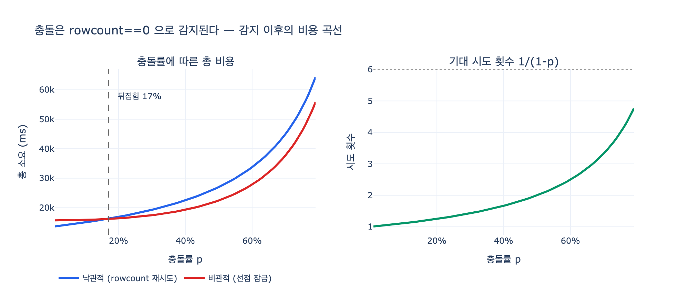

# 낙관적 잠금에서 충돌은 어떻게 감지되는가

> **답: 에러가 아니라 `0행 갱신`으로 온다. `rowcount`를 봐야 한다.**

## 한 줄 요약

낙관적 잠금의 충돌은 예외(exception)를 던지지 않는다. `UPDATE ... WHERE id=? AND version=?` 이 조건에 맞는 행을 못 찾아 **0행을 갱신하고 조용히 성공**할 뿐이다. 그래서 코드가 직접 `cursor.rowcount`(영향받은 행 수)를 읽어서 `0`인지 `1`인지 봐야 한다. 이 한 줄을 빼먹으면 감지 장치를 달아 놓고 눈금을 안 읽는 셈이 되고, 증상은 잃어버린 갱신(lost update)과 완전히 같아진다.

## 1. 왜 이 질문이 나오는가 — 잃어버린 갱신

두 에이전트가 같은 노드를 「읽고 → 판단하고 → 통째로 쓴다」를 하면 변경이 사라진다.

```
시각  에이전트 A                  에이전트 B
 t0   SELECT props → 팀장=박민수;인원=3
 t1                              SELECT props → 팀장=박민수;인원=3
 t2   (모델 호출 0.2초)           (모델 호출 0.05초)
 t3                              UPDATE props='팀장=박민수;인원=5'
 t4   UPDATE props='팀장=이서연;인원=3'   ← B 의 인원=5 를 덮는다
```

최종 상태는 `팀장=이서연;인원=3`. **B 의 변경이 사라졌는데 에러는 없다.** 두 UPDATE 모두 `rowcount=1`을 돌려주고 로그에는 「성공」만 찍힌다. 이게 이 문제가 오래 안 잡히는 이유다.

에이전트 시스템에서 이게 특히 잦은 이유는 셋이다.

1. 판단 시간이 길다 (모델 호출은 초 단위, 읽기-쓰기 창이 그만큼 넓게 벌어진다)
2. 동시 실행이 기본이다 (여러 에이전트가 병렬로 같은 그래프를 만진다)
3. 전체를 다시 쓰는 코드를 만들기 쉽다 (부분 갱신보다 통째 덮어쓰기가 짜기 편하다)

트랜잭션으로도 안 풀린다. 트랜잭션 안에 모델 호출을 넣을 수 없고, 워크플로는 프로세스 경계를 넘어 살아 있기 때문이다.

## 2. 낙관적 잠금의 동작 원리

노드에 `version` 칼럼을 하나 둔다. 읽을 때 버전을 같이 읽어 두고, 쓸 때 **그 버전이 그대로인지를 WHERE 조건에 넣는다.**

```sql
UPDATE node
   SET props = ?, version = version + 1
 WHERE id = ? AND version = ?      -- ← 이 조건이 전부다
```

이건 데이터베이스판 **비교 후 교체(compare-and-swap)** 다. 「내가 읽은 값이 아직 그대로면 바꾼다」.

- 아무도 안 건드렸으면: `version=1` 인 행을 찾아 갱신 → **1행 갱신**
- 누가 먼저 썼으면: 저장된 버전은 이미 `2` → `WHERE version=1` 이 **아무 행도 못 찾음** → **0행 갱신**

## 3. 핵심 — 왜 예외가 아니라 0행인가

DB 입장에서는 **에러 낼 이유가 하나도 없다.**

- SQL 문법은 완벽하다
- 테이블도 칼럼도 존재한다
- 제약조건 위반도 없다
- 트랜잭션도 정상적으로 커밋된다

「WHERE 조건에 맞는 행이 0개였다」는 것은 SQL 세계에서 **완전히 정상적인 결과**다. `DELETE FROM t WHERE id=999` 가 없는 행을 지우려 해도 에러가 아니듯이. 낙관적 잠금은 이 **정상 결과**에 「충돌」이라는 의미를 우리가 얹어 쓰는 기법이다. 그래서 의미를 읽어내는 일은 DB가 아니라 애플리케이션 코드의 몫이다.

즉,

```python
try:
    db.execute("UPDATE node SET props=?, version=version+1 "
               "WHERE id=? AND version=?", (props, node_id, ver))
    db.commit()
    log.info("저장 완료")     # ← 충돌해도 여기로 온다. 거짓말이다.
except Exception:
    ...                       # ← 여기는 절대 안 온다
```

`try/except` 로는 낙관적 잠금의 충돌을 **절대 못 잡는다.**

## 4. 그래서 rowcount 를 본다

```python
cur = db.execute(
    "UPDATE node SET props=?, version=version+1 "
    "WHERE id=? AND version=?", (props, node_id, ver))
db.commit()

if cur.rowcount == 1:
    return True            # 성공
elif cur.rowcount == 0:
    # ★ 충돌. 다시 읽고 다시 판단해서 재시도한다
    ...
```

「영향받은 행 수」를 돌려주는 창구는 스택마다 이름이 다르다.

| 스택 | 확인 방법 |
|---|---|
| Python DB-API (sqlite3, psycopg2 …) | `cursor.rowcount` |
| JDBC | `PreparedStatement.executeUpdate()` 반환값 |
| Go `database/sql` | `sql.Result.RowsAffected()` |
| Node `pg` | `result.rowCount` |
| SQLAlchemy Core | `result.rowcount` |
| SQLAlchemy ORM / Hibernate / JPA | `@Version` 필드 → 0행이면 `StaleDataError` / `OptimisticLockException` 으로 **바꿔서** 던져 줌 |
| PostgreSQL 직접 | `UPDATE ... RETURNING id` 후 결과가 비었는지 확인 |
| DynamoDB | 조건부 쓰기 실패 시 `ConditionalCheckFailedException` |
| etcd / Redis WATCH | CAS 실패 반환값 |
| HTTP ETag / If-Match | `412 Precondition Failed` |

여기서 헷갈리기 쉬운 지점: **ORM이나 HTTP 계층을 쓰면 예외/에러코드로 보이기도 한다.** 하지만 그건 프레임워크가 0행을 감지해서 예외로 **번역해 준 것**이지, DB 엔진이 에러를 낸 게 아니다. 원시 SQL 레벨에서는 언제나 0행이다.

## 5. rowcount 를 쓸 때의 함정

| 상황 | `rowcount` | 주의 |
|---|---|---|
| `SELECT` | `-1` | 조회에는 의미 없는 값. 「행 개수」로 오해하지 말 것 |
| 조건 맞는 `UPDATE` | `1` | 성공 |
| 버전 불일치 | `0` | **충돌** |
| 행 자체가 없음(삭제됨) | `0` | **충돌과 구별이 안 된다** |
| `executemany` | 누적 합 | 배치에서는 개별 실패가 가려진다 |
| MySQL `CLIENT_FOUND_ROWS` 플래그 | matched vs changed | 드라이버 설정에 따라 「값이 안 바뀌어도 1」이 될 수 있다 |

특히 세 번째와 네 번째. `rowcount == 0` 만으로는 「그 사이 누가 버전을 올렸다」와 「그 노드가 아예 삭제됐다」를 구별할 수 없다. 앞은 재시도하면 되지만 뒤는 재시도해도 영원히 실패한다. 그래서 실무에서는 0을 만나면 한 번 재조회해서 원인을 가른다.

```python
if cur.rowcount == 0:
    row = db.execute("SELECT version FROM node WHERE id=?", (node_id,)).fetchone()
    if row is None:
        raise NodeDeleted(node_id)          # 재시도해도 소용없다
    # 버전 충돌 → 다시 읽고 재시도
```

MySQL 의 `CLIENT_FOUND_ROWS` 는 반대 방향의 함정이다. 이 플래그가 켜져 있으면 `rowcount` 가 「실제로 값이 바뀐 행」이 아니라 「WHERE 에 매칭된 행」을 센다. 낙관적 잠금에서는 오히려 이쪽이 안전하다 — `version+1` 을 항상 쓰므로 값은 언제나 바뀌지만, props 가 우연히 같은 값일 때 matched/changed 차이로 0이 나오는 사고를 막아 준다.

## 6. 감지 다음 — 재시도와 그 비용

충돌을 감지하면 「다시 읽고, 다시 판단하고, 다시 쓴다」. 충돌 확률을 $p$ 라 하면 성공까지의 기대 시도 횟수는

$$E[\text{시도}] = \sum_{k=1}^{\infty} k\,(1-p)\,p^{\,k-1} = \frac{1}{1-p}$$

이다. $p$ 가 커지면 급격히 발산한다. 그래서 낙관적 잠금은 「대개 충돌 안 난다」는 가정이 맞을 때만 이긴다.

- $p = 5\%$ → 1.05회
- $p = 30\%$ → 1.43회
- $p = 70\%$ → 3.33회

책의 측정값(판단 12ms, 쓰기 1.5ms, 잠금 획득 2.2ms) 기준으로는 **15~30% 근처에서 비관적 잠금과 뒤집힌다.** 비관적은 충돌이 없어도 잠금 획득 비용을 매번 내므로 왼쪽 구간에서 손해고, 낙관적은 충돌이 잦아지면 재시도가 곱해져 오른쪽 구간에서 손해다.

재시도할 때는 반드시 **흔들기(jitter)를 넣은 백오프**를 둔다. 안 그러면 두 에이전트가 같은 주기로 부딪히며 라이브락에 빠진다.

### 실무 요령 — 판단을 잠금 밖으로 뺀다

```
1. 읽는다 (잠금 없이)
2. 모델을 부른다 (잠금 없이 — 여기가 제일 길다)
3. 짧게 잠그고 «버전 확인 + 쓰기»만 한다
```

이러면 잠금을 붙드는 시간이 12ms → 1.5ms 로 줄고, 창이 좁아져서 충돌률 자체도 같이 떨어진다. **갈림길이 오른쪽으로 밀린다.**

## 7. 그래프에서의 추가 문제 — 버전을 어디에 둘 것인가

관계형 DB에서는 「행 하나」가 충돌 단위라 명확하다. 그래프에서는 그 단위부터 정해야 한다.

- **노드에 버전을 두면**: 이서연 노드에 두 사람이 각각 다른 엣지를 다는데 버전이 부딪힌다. 실제로는 안 겹치는데 막힌다 → **가짜 충돌**
- **엣지에 버전을 두면**: `이서연-이끔->결제팀` 과 `김도현-이끔->결제팀` 은 다른 엣지라 각자 버전이 따로다. 둘 다 통과해서 **팀장이 둘이 된다** → 단일 값 관계 누락

그래서 실무에서는 논리적 충돌 단위를 따로 정한다.

| 종류 | 충돌 단위 |
|---|---|
| 단일 값 관계 | 「주어 + 관계 종류」를 한 단위로 |
| 다중 값 관계 | 엣지 하나가 한 단위 |
| 노드 삭제 | 그 노드에 걸린 모든 엣지와 충돌 |

그리고 버전 비교 **앞에** 멱등 검사를 둔다 — 「쓰려는 것이 이미 있는 것과 같으면 그냥 성공으로 친다」. 양쪽이 같은 엣지를 추가하는 경우는 결과가 같으니 굳이 충돌로 만들 필요가 없다.

## 8. 대안 — 필드 단위 수정

읽기와 쓰기 사이에 판단을 안 두면 창 자체가 없어진다.

```sql
UPDATE node SET 인원 = 5 WHERE id = 't1'     -- 통째로 안 쓴다
```

가능하면 이게 제일 낫다. 다만 「인원이 5 미만이면 한 명 추가」처럼 **읽은 값을 보고 판단해야** 하는 경우엔 못 쓴다.

정리하면,

- 단순 설정 → 필드 단위 수정
- 읽고 판단해야 함 → **낙관적 잠금 + `rowcount` 확인**
- 충돌이 잦고 비용이 큼 → 비관적 잠금

## 자주 나오는 오해

**「UPDATE 가 실패하면 예외가 나겠지」** — 안 난다. WHERE 에 매칭되는 행이 0개인 것은 SQL 상 정상 결과다.

**「트랜잭션을 쓰면 되잖아」** — 기본 격리 수준에서는 lost update 를 못 막는다. SERIALIZABLE 이면 막히지만, 판단(모델 호출)을 트랜잭션 안에 넣을 수 없다는 게 근본 문제다.

**「commit 이 성공했으니 저장됐겠지」** — 커밋은 성공한다. 0행을 갱신한 트랜잭션도 정상 커밋된다.

**「ORM 이 예외를 던지던데?」** — ORM 이 내부에서 rowcount 를 보고 예외로 번역한 것이다. 원리는 같다.

## 관련 개념

| 키워드 | 상태 | 출처 |
|---|---|---|
| 잃어버린 갱신 | 표준 | [lost update](https://www.postgresql.org/docs/current/transaction-iso.html) |
| 낙관적 잠금 | 사실상 표준 | [optimistic offline lock](https://martinfowler.com/eaaCatalog/optimisticOfflineLock.html) |
| 비관적 잠금 | 사실상 표준 | [pessimistic offline lock](https://martinfowler.com/eaaCatalog/pessimisticOfflineLock.html) |
| 비교 후 교체 | 표준 | [compare-and-swap](https://en.cppreference.com/w/cpp/atomic/atomic/compare_exchange) |
| 직렬화 가능 | 표준 | [serializable](https://www.postgresql.org/docs/current/transaction-iso.html#XACT-SERIALIZABLE) |
| 충돌 없는 자료형 | 실험 | [CRDT](https://inria.hal.science/inria-00555588) |

## 시각화


