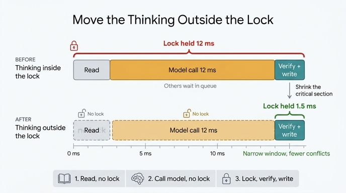

# 판단을 잠금 밖으로 빼는 3단계 패턴

## 질문

판단을 잠금 밖으로 빼는 3단계 패턴은 무엇인가?

## 답

1. **읽는다** — 잠금 없이
2. **모델을 부른다** — 잠금 없이 (여기가 제일 길다)
3. **짧게 잠그고 「버전 확인 + 쓰기」만 한다**

그러면 잠금을 붙드는 시간이 **12ms → 1.5ms** 로 준다. 창(window)이 좁아지니 충돌률도 같이 떨어진다.

---

## 왜 이 패턴이 필요한가

### 문제의 출발점: 「읽고, 판단하고, 통째로 쓰기」

두 작업이 같은 노드를 상대로 읽기 → 판단 → 쓰기를 하면, 나중에 쓴 쪽이 앞의 변경을 덮어씁니다. 에러는 나지 않습니다. 로그에는 성공만 찍힙니다. 이게 **잃어버린 갱신(lost update)** 입니다.

에이전트 시스템에서 이 문제가 유독 잦은 이유는 셋입니다.

- **판단 시간이 길다** — 모델 호출은 수백 ms ~ 수 초다
- **동시 실행이 기본이다** — 에이전트를 여러 개 굴린다
- **전체를 다시 쓰는 코드를 만들기 쉽다** — 「이 노드의 속성을 이렇게 바꿔줘」가 통째 UPDATE 로 나온다

### 그래서 잠금을 걸면?

31장의 `ex3_lock_contention.py` 는 낙관적 잠금과 비관적 잠금의 손익분기점을 계산합니다.

```
HOLD_MS         = 12.0   # 판단하는 시간 (읽고 나서 쓰기까지)
WRITE_MS        = 1.5
LOCK_ACQUIRE_MS = 2.2    # 잠금을 잡고 푸는 값. 충돌이 없어도 매번 든다
```

```
낙관적 = N × (1/(1-p)) × (판단 + 쓰기)
비관적 = N × (판단 + 쓰기 + 잠금획득) + N × p × 대기
```

- 비관적은 충돌이 **없어도** 잠금 획득 값을 매번 낸다 → 왼쪽(저충돌) 구간의 손해
- 낙관적은 충돌이 **잦아지면** 재시도 값이 곱해진다 → 오른쪽(고충돌) 구간의 손해
- 이 값으로는 **충돌률 15% ~ 30%** 사이에서 뒤집힙니다

핵심은 여기입니다. **판단 시간이 길수록 낙관적이 불리합니다.** 재시도할 때 판단을 처음부터 다시 하니까요. 「에이전트가 모델을 부르는」 구간이 잠금 안에 있으면 최악입니다 — 재시도 한 번에 모델 호출 한 번이 통째로 다시 듭니다.

---

## 3단계 패턴의 동작

### Before: 판단이 잠금 안에 있다

```
 ┌──────────────── 잠금 유지 13.5ms ────────────────┐
 │  read  │  ███ 모델 호출 12ms ███  │  write 1.5ms  │
 └──────────────────────────────────────────────────┘
```

잠금을 잡은 채로 네트워크 왕복을 기다립니다. 그동안 다른 에이전트는 전부 대기열에 쌓입니다. M/M/1 근사로 보면 이용률이 오를수록 대기 시간이 급격히 늘어납니다.

```python
queue = (p_conflict / (1 - p_conflict)) * (HOLD_MS + WRITE_MS)
```

### After: 판단을 밖으로 뺀다

```
  read (no lock)  │  ███ 모델 호출 12ms (no lock) ███  │ ┌ 잠금 1.5ms ┐
                                                         │ verify+write │
                                                         └──────────────┘
```

1. **읽는다 (잠금 없이)** — 현재 노드 상태와 **버전 번호**를 같이 읽는다
2. **모델을 부른다 (잠금 없이)** — 제일 긴 구간이지만 아무도 막지 않는다
3. **짧게 잠그고 버전 확인 + 쓰기** — 읽었던 버전이 그대로면 쓰고, 아니면 충돌

3단계의 「버전 확인 + 쓰기」는 곧 낙관적 잠금의 조건부 UPDATE 한 줄입니다.

```sql
UPDATE node SET props=?, version=version+1
 WHERE id=? AND version=?          -- 이 조건이 전부다
```

버전이 바뀌었으면 이 UPDATE 가 **0행**을 고칩니다. 그게 충돌 신호예요. 예외가 아니라 `rowcount == 0` 으로 오니 반드시 확인해야 합니다.

```python
cur = db.execute(
    "UPDATE node SET props=?, version=version+1 WHERE id=? AND version=?",
    (new_props, node_id, seen_version),
)
if cur.rowcount == 0:
    # 충돌 — 다시 읽고 다시 시도
    ...
```

---

## 이 패턴이 주는 두 가지 이득

### 1. 잠금 유지 시간이 짧아진다 (12ms → 1.5ms)

판단(12ms)이 임계 구역 밖으로 나가면, 잠금 안에는 쓰기(1.5ms)만 남습니다. 대략 **한 자릿수배** 짧아집니다.

### 2. 충돌률 자체가 떨어진다 — 창이 좁아지니까

「읽기와 쓰기 사이의 시간」이 곧 다른 작업이 끼어들 수 있는 **창(window)** 입니다. 창이 13.5ms 에서 1.5ms 로 줄면, 그 사이에 남이 들어올 확률도 그만큼 줄어듭니다. 충돌이 줄면 재시도도 줄고, 재시도가 줄면 모델 호출 비용도 줄어요.

### 그래서 갈림길이 오른쪽으로 밀린다

한 장 요약이 말하는 그대로입니다.

> 낙관적과 비관적은 충돌률에서 갈립니다. 15~30% 근처가 갈림길이고, **판단을 잠금 밖으로 빼면 갈림길이 오른쪽으로 밀립니다**.

식에서 `판단`(HOLD_MS)이 작아지면 낙관적 쪽의 재시도 비용 `(1/(1-p)) × (판단+쓰기)` 가 통째로 작아집니다. 그래서 더 높은 충돌률까지 낙관적이 버팁니다. 비관적으로 갈아탈 필요 자체가 줄어드는 거예요.

---

## 왜 트랜잭션으로는 안 풀리나

「그냥 다 트랜잭션으로 감싸면 되는 것 아닌가」 싶지만, 에이전트 시스템에서는 안 됩니다.

- **트랜잭션 안에 모델 호출이 들어간다** — DB 커넥션을 수 초간 붙들게 된다
- **워크플로가 프로세스 경계를 넘어 살아 있다** — 읽기와 쓰기가 다른 프로세스, 다른 시각에 일어난다

3단계 패턴은 정확히 이 지점을 피해 갑니다. 오래 걸리는 부분을 트랜잭션 밖으로 밀어내고, 트랜잭션은 「버전 확인 + 쓰기」라는 **짧고 원자적인 한 조각**만 담당하게 만듭니다. Martin Fowler 의 [Optimistic Offline Lock](https://martinfowler.com/eaaCatalog/optimisticOfflineLock.html) 패턴이 말하는 것과 같은 구조입니다.

---

## 언제 이걸 쓰고, 언제 다른 걸 쓰나

`ex2_optimistic.py` 가 정리한 갈래입니다.

| 상황 | 쓸 것 |
|---|---|
| 단순 설정 (읽은 값을 안 봐도 됨) | **필드 단위 수정** — 읽기·쓰기 사이에 판단을 아예 안 둔다 |
| 읽고 판단해야 함 | **낙관적 잠금 + 3단계 패턴** |
| 충돌이 잦고 비용이 큼 | **비관적 잠금** (그래도 판단은 밖으로) |

필드 단위 수정(`UPDATE node SET 팀장=? WHERE id=?`)이 가능하면 그게 제일 낫습니다. 창을 아예 없애니까요. 다만 「인원이 5 미만이면 한 명 추가」처럼 **읽은 값을 보고 판단해야** 하는 경우엔 못 씁니다. 그때가 3단계 패턴의 자리입니다.

---

## 한 줄 정리

**긴 것(모델 호출)은 잠금 밖에, 짧은 것(버전 확인 + 쓰기)만 잠금 안에.** 임계 구역을 12ms 에서 1.5ms 로 줄이면 잠금 유지 시간도, 충돌률도, 재시도 비용도 함께 줄어든다.

## 인포그래픽


