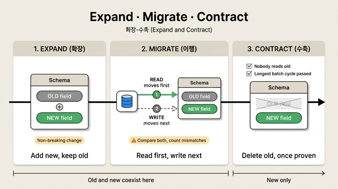

# 확장-수축(expand-contract)의 세 국면

## 카드

**Q.** 확장-수축의 세 국면은 각각 무엇을 하는가?

**A.** 확장은 새것을 더하고 옛것을 그대로 두고, 이행은 읽기 다음 쓰기를 옮기고, 수축은 아무도 안 쓰는 것이 확인되면 옛것을 지운다.

## 왜 이런 게 필요한가

돌아가는 시스템의 스키마를 한 번에 바꾸면 **배포 순간에 둘 중 하나가 죽는다**.

- DB를 먼저 바꾸면 → 옛 코드가 죽는다 (없어진 이름을 찾는다)
- 코드를 먼저 바꾸면 → 새 코드가 죽는다 (아직 없는 이름을 찾는다)

확장-수축(expand and contract, 다른 이름으로 parallel change)은 이 사이에 **옛것과 새것이 «둘 다 되는» 구간**을 끼워 넣는 방법이다. 그 구간이 있어야 무중단 배포가 가능하다.

## 세 국면

| 국면 | 하는 일 | 이 시점의 상태 |
|---|---|---|
| **확장 (expand)** | 새것을 **더한다**. 옛것은 **그대로 둔다** | 옛것 O / 새것 O — 공존 시작 |
| **이행 (migrate)** | **읽기를 먼저** 옮기고, **그다음 쓰기**를 옮긴다 | 옛것 O / 새것 O — 둘 다 동작 |
| **수축 (contract)** | **아무도 안 쓰는 게 확인되면** 옛것을 지운다 | 옛것 X / 새것 O — 새것만 |

핵심은 확장이 「더하기만 하는 변경」이라는 것이다. 32.1절의 표에서 보듯 *속성 추가*, *새 노드 종류 추가*는 안 깨지는 변경이다(옛 코드는 그냥 무시한다). 반대로 *이름 바꾸기*, *속성 제거*, *타입 변경*은 깨진다. 확장-수축은 **깨지는 변경 하나를 안 깨지는 변경 여러 개로 분해**하는 기법이다.

## 순서가 왜 「읽기 먼저, 쓰기 나중」인가

이행 단계에서 순서를 거꾸로 하면 — 쓰기를 먼저 새 이름으로 옮기면 — **새 이름으로 쓴 데이터를 아직 살아 있는 옛 코드가 못 읽는다**. 즉 데이터는 새것에 들어가 있는데 읽는 쪽은 옛것만 보고 있으니 조용히 유실된 것처럼 보인다.

읽기를 먼저 옮기면 그런 일이 없다. 읽는 쪽이 이미 새것(또는 새것 없으면 옛것)을 볼 준비가 된 뒤에 쓰기가 새것으로 넘어가기 때문이다.

## 실제로는 여섯 단계

`ex2_expand_contract.py`는 「이끔 → 리드」라는 관계 이름 변경을 여섯 단계로 쪼개 각 단계에서 옛 코드/새 코드가 동작하는지 표로 찍는다.

```
0. 시작
1. 확장 — 새 이름을 «같이» 쓴다        (copy)
2. 새 코드 배포 (읽기만)
3. 쓰기를 새 이름으로                  (newwrite)
4. 옛 코드 제거
5. 수축 — 옛 이름 삭제                 (drop)
```

2단계와 3단계에서 **옛 코드와 새 코드가 둘 다 「동작」으로 찍히는 것**이 이 예제의 요점이다.

`ex5_migration_plan.py`는 이걸 더 세분해 게이트가 달린 상태 기계로 만든다.

```
expand      → 새 스키마가 있나
dual-write  → 양쪽 쓰기가 100%인가
backfill    → 백필이 끝났나
dual-read   → 불일치가 0인가
cutover     → 옛것 읽기가 0인가 / 롤백이 가능한가
contract    → 가장 긴 주기보다 오래 조용한가
```

즉 세 국면은 개념 축이고, 실무에서는 확장 = `expand`, 이행 = `dual-write`~`cutover`, 수축 = `contract`로 대응된다.

## 어려운 쪽은 수축이다

32장이 강조하는 바: 이 장의 절반은 「어떻게 바꾸나」가 아니라 **「언제 옛것을 지워도 되나」**다.

- **기준은 「최근 30일」이 아니라 「가장 긴 배치 주기」**다. 분기 배치면 92일, 연말 정산이면 365일. 52일째 조용해도 92일 주기 잡이면 40일 뒤에 깨어나서 없어진 이름을 찾는다.
- 크론 표현식을 파싱해 주기를 계산하고, 크론에 없는 것(사람이 손으로 도는 것)을 잡기 위해 **옛 이름을 읽으면 경고 로그 → 마지막 한 달은 알림까지** 켠다.
- 지울 때도 되돌릴 수 있게 지운다. 바로 DROP하지 말고 이름만 바꿔 두고(`이끔` → `_deprecated_이끔`) 한 주기 더 기다린 다음 진짜로 지운다.
- 드물게 도는 잡일수록 실패 알림을 세게 건다. 매일 도는 건 내일 알지만, 2년에 한 번 도는 건 2년 뒤에 안다.

## 이행 중에는 데이터가 어긋난다

`ex4_dual_read.py`의 읽기 전략 넷 중 「둘 다 읽고 비교」만 불일치를 신고한다. 안 어긋나는 이행은 없으므로, 어긋나는 것을 **막으려 하지 말고 세라**. 그리고 **불일치가 0이 될 때까지 수축하지 않는다**. 값은 읽기가 두 배가 되는 것이고, 이행 구간에만 내는 값이라 괜찮다.

## 바꾸기 전에 「누가 읽나」를 센다

`ex1_breaking_change.py`는 29장의 `Reads` 엣지로 필드별 독자 수를 센다. `속함`을 바꾸면 실행 6개가 깨지고 `nickname`은 1개다. 같은 「깨지는 변경」인데 값이 여섯 배 다르다. 독자가 1~2면 그냥 바꾸고, 여섯이면 확장-수축으로 간다. 코드 검색으로는 동적으로 만든 쿼리를 못 찾지만 실제 읽은 기록은 그것까지 잡는다.

## 한 줄 정리

> 확장은 **더하고**, 이행은 **읽기 → 쓰기 순으로 옮기고**, 수축은 **아무도 안 쓴다는 확인이 선 뒤에 지운다**. 그리고 그 「확인」의 기준은 시간이 아니라 가장 긴 배치 주기다.

## 참고

- [Parallel Change (expand and contract) — Martin Fowler](https://martinfowler.com/bliki/ParallelChange.html)
- [Blue-Green Deployment — Martin Fowler](https://martinfowler.com/bliki/BlueGreenDeployment.html)
- [Protobuf: Updating a message type (하위 호환)](https://protobuf.dev/programming-guides/proto3/#updating)

## 인포그래픽


